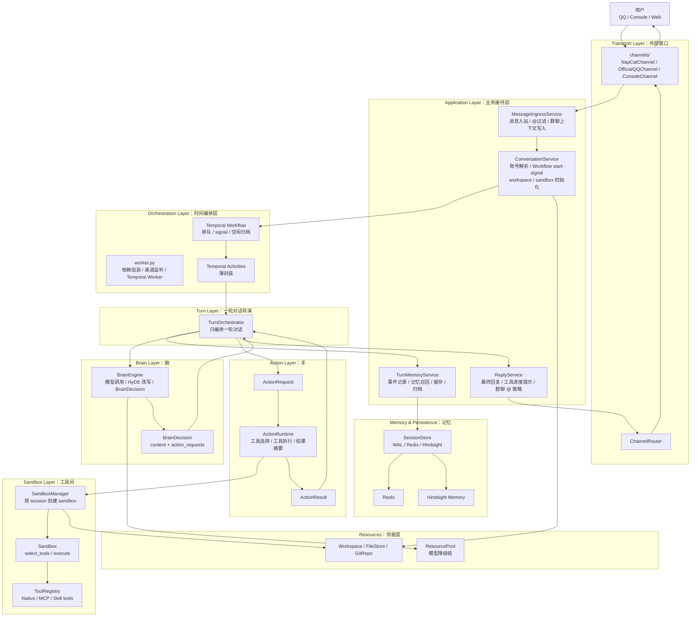
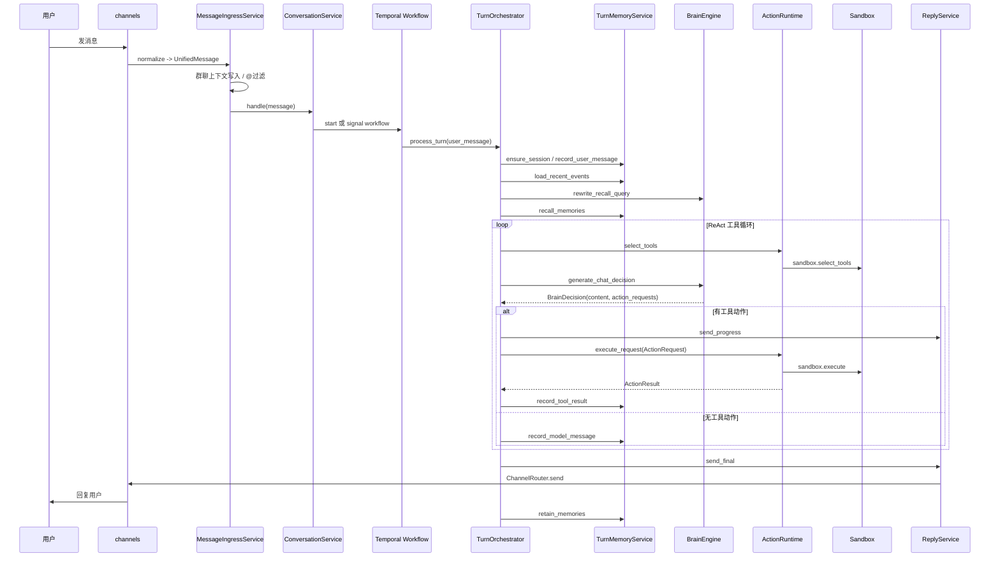

# HpAgent —— 智能对话代理框架

基于 "手脑分离" (hand-brain separation) 架构的智能对话代理系统，Temporal Workflow 编排，nsjail OS 级沙箱隔离，Hindsight 长期记忆。

## 理念

在 QQ 端，它轻如问候，柔似提醒，是每日陪伴的挚友。

在 Web 端，它化身沉稳的管家，以更正式的对话承接你的重托：
- **委托** —— 跟进整个过程进展，而非仅仅交付答案
- **透明** —— 过往行为凝练为可回溯的总结，信任建立在可审计的事实之上
- **专属** —— 对你的理解具象为可预览、可掌控的 Skill 清单

## 架构：手脑分离组件架构

HpAgent 当前架构已经从早期的「ReAct 大协调器 + 工具沙箱」演进为更清晰的手脑分离组件体系：

```text
外部用户
  -> channels                # 外部窗口：QQ / Console / Web 协议适配
  -> MessageIngressService   # 门房：消息入站、群聊上下文、@过滤
  -> ConversationService     # 调度台：账号解析、workflow start/signal、workspace/sandbox 准备
  -> Temporal Workflow       # 时间编排：排队、signal、空闲归档
  -> TurnOrchestrator        # 回合导演：编排一轮对话
      -> TurnMemoryService   # 档案员：事件、记忆、归档、反思、指标
      -> BrainEngine         # 脑：HyDE 改写、模型调用、BrainDecision
      -> ActionRuntime       # 手：工具选择、ActionRequest 执行、ActionResult
      -> ReplyService        # 发言人：最终回复、工具进度、群聊 @
  -> ChannelRouter
  -> channels
  -> 外部用户
```

核心原则：

```text
TurnOrchestrator 不做专业活，只负责调度专业组件。
BrainEngine 想，ActionRuntime 做，TurnMemoryService 记，ReplyService 说，channels 听和传。
```

### 组件总览



### 一轮对话流程



## 项目结构

```text
HpAgent/
├── docker-compose.yaml              # 完整服务栈编排
├── .env                             # 敏感配置（不会被 git 跟踪）
├── README.md
├── config/
│   ├── config.yaml                  # 应用配置（Temporal / Redis / Sandbox / Hindsight）
│   ├── models.yaml                  # 模型提供商 + 降级链
│   ├── agents.yaml                  # 多 Agent 配置
│   ├── mcp/                         # MCP 服务配置
│   └── prompts/                     # LLM 提示词模板
├── docs/
│   ├── draw_docs/                   # 系统上下文、源码架构、新架构说明
│   │   ├── 01_system_context_qq_robot.md
│   │   ├── 02_src_architecture.md
│   │   └── new_architecture.md
│   ├── architecture_progress/       # P0-P10 架构改进施工日志
│   └── draw/                        # Excalidraw / 图片等架构图资源
├── tools/                           # 工具定义、Skill、MCP 相关资源
├── src/
│   ├── main.py                      # 入口：加载配置 → 启动 worker
│   ├── Dockerfile                   # 镜像构建（Python + nsjail）
│   ├── requirements.txt             # Python 依赖
│   │
│   ├── channels/                    # Transport Layer：外部消息渠道
│   │   ├── base.py                  #   BaseChannel 抽象
│   │   ├── napcat.py                #   NapCat / OneBot v11 WebSocket
│   │   ├── official_qq.py           #   QQ 官方 Bot API v2
│   │   ├── console.py               #   Console 开发渠道
│   │   └── router.py                #   ChannelRouter：统一发送路由
│   │
│   ├── application/                 # Application Layer：业务接待服务
│   │   ├── ingress.py               #   MessageIngressService：入站过滤、群上下文
│   │   ├── conversation.py          #   ConversationService：账号、workflow、workspace、sandbox 准备
│   │   ├── memory.py                #   TurnMemoryService：事件/记忆/归档/反思端口
│   │   └── reply.py                 #   ReplyService：最终回复、工具进度、群聊 @
│   │
│   ├── orchestration/               # Orchestration Layer：时间和运行时编排
│   │   ├── config.py                #   AppConfig 强类型配置
│   │   ├── workflow.py              #   Temporal Workflow：排队、signal、空闲归档
│   │   ├── worker.py                #   依赖组装 + Temporal Worker + 渠道监听
│   │   └── scheduler.py             #   定时提醒调度器
│   │
│   ├── harness/                     # Turn Layer：一轮对话编排
│   │   ├── runner.py                #   TurnOrchestrator：单轮对话流程导演
│   │   ├── activities.py            #   Temporal Activity 薄封装
│   │   ├── context_builder.py       #   事件流 + 记忆 → LLM messages
│   │   └── prompts.py               #   PromptLoader
│   │
│   ├── brain/                       # Brain Layer：模型推理边界
│   │   └── engine.py                #   BrainEngine：HyDE、模型调用、BrainDecision
│   │
│   ├── actions/                     # Action Layer：工具行动运行时
│   │   └── runtime.py               #   ActionRuntime：select_tools / execute_request / ActionResult
│   │
│   ├── agent/                       # Agent 协议和多 Agent 协作
│   │   ├── protocol.py              #   BrainDecision / ActionRequest / ActionResult
│   │   ├── runner.py                #   MultiAgentExecutor
│   │   ├── orchestrator.py          #   AgentOrchestrator
│   │   ├── llm_agent.py             #   RealLLMPlanner
│   │   └── types.py                 #   Agent 相关类型
│   │
│   ├── sandbox/                     # Sandbox Layer：工具间和隔离层
│   │   ├── sandbox.py               #   Sandbox：工具选择 + 执行接口
│   │   ├── sandbox_manager.py       #   每 session sandbox 生命周期管理
│   │   ├── nsjail.py                #   OS 级隔离执行
│   │   ├── git_repo.py              #   会话工作区 Git 管理
│   │   ├── tools/                   #   Native / MCP / Skill 工具体系
│   │   └── channels/                #   旧兼容层，转发到 src/channels/
│   │
│   ├── session/                     # 会话与事件存储
│   │   ├── store.py                 #   SessionStore：WAL / Redis / Hindsight 集成
│   │   ├── workspace.py             #   history.jsonl / meta.yaml 归档工具
│   │   ├── db.py                    #   WorkspaceDB
│   │   └── models.py                #   Session / EventRecord 领域模型
│   │
│   ├── memory/                      # 长期记忆辅助组件
│   │   ├── hindsight_client.py      #   Hindsight HTTP 客户端
│   │   └── group_context.py         #   群聊短期上下文窗口
│   │
│   ├── resources/                   # 模型和资源层
│   │   ├── resource_pool.py         #   多模型注册 + 降级链调度
│   │   ├── model_client.py          #   模型 HTTP 客户端
│   │   ├── embedding.py             #   Embedding 客户端
│   │   ├── reranker.py              #   Reranker 客户端
│   │   └── credentials.py           #   凭据管理
│   │
│   ├── account/                     # 跨渠道账号
│   │   └── account_service.py       #   channel_type + sender_id → account_id
│   ├── storage/                     # 存储抽象
│   └── common/                      # 公共类型、接口、日志、错误
└── test/
```

## 数据流：一条 QQ 消息的生命周期

```text
QQ 用户
  -> QQ 服务器
  -> NapCat
  -> channels.NapCatChannel.normalize_message()
  -> MessageIngressService
       - 写入群聊短期上下文
       - 群聊中未 @bot 的消息只沉淀上下文，不触发回复
  -> ConversationService
       - AccountService.resolve() -> account_id
       - 准备 session workspace / git repo / sandbox
       - start 或 signal Temporal workflow
  -> Temporal Workflow / Activities
  -> TurnOrchestrator.process_turn()
       1. TurnMemoryService.ensure_session / record_user_message
       2. TurnMemoryService.load_recent_events
       3. BrainEngine.rewrite_recall_query() 做 HyDE 改写
       4. TurnMemoryService.recall_memories() 召回长期记忆
       5. ContextBuilder.build() 构造 LLM messages
       6. ActionRuntime.select_tools() 动态选择工具
       7. BrainEngine.generate_chat_decision() 输出 BrainDecision
       8. 若有 ActionRequest：ActionRuntime.execute_request() -> Sandbox.execute()
       9. TurnMemoryService.record_model_message / record_tool_result
      10. ReplyService.send_final() -> ChannelRouter -> NapCat
      11. TurnMemoryService.retain_memories() 留存长期记忆
```

## 关键设计决策

| 决策 | 说明 |
|------|------|
| **手脑分离** | `BrainEngine` 只负责模型推理和 `BrainDecision`；`ActionRuntime` 只负责工具选择、执行和 `ActionResult`；`TurnOrchestrator` 只编排一轮对话 |
| **Transport 与 Sandbox 分离** | `channels/` 是 QQ/Console/Web 外部窗口；`sandbox/` 是工具执行和隔离层。旧 `sandbox/channels/` 仅保留兼容转发 |
| **应用服务拆分** | `MessageIngressService`、`ConversationService`、`ReplyService`、`TurnMemoryService` 分别承接入站、会话、回复、记忆职责 |
| **Temporal Workflow** | Workflow 负责时间、排队、signal、空闲归档；Activity 是薄封装，业务执行委托给 `TurnOrchestrator` |
| **工具安全隔离** | `SandboxManager` 按 session 创建 workspace 绑定的 `Sandbox`，工具执行可通过 nsjail 隔离 |
| **Brain/Action 协议化** | `BrainDecision -> ActionRequest -> ActionRuntime -> ActionResult`，避免回合导演直接拆模型原始 tool_calls |
| **长期记忆端口化** | `TurnMemoryService` 封装事件记录、记忆召回、留存、归档、反思、指标，降低 Turn 层对 `SessionStore` 细节的了解 |
| **多模型降级链** | `ResourcePool` 管理 fast/chat/embedding/reranker 等模型链路，故障时自动切换备用模型 |
| **跨渠道统一账号** | `AccountService` 将 QQ/Web/Console 等多渠道身份统一到 `account_id` |
| **敏感信息保护** | API key 通过 `${ENV_VAR}` 占位符 + `.env` 文件注入，不进入 git 历史 |

## 架构文档

当前 README 只保留项目入口级说明，更详细的设计事实来源见：

- [`docs/draw_docs/01_system_context_qq_robot.md`](docs/draw_docs/01_system_context_qq_robot.md) — QQ 机器人系统上下文图
- [`docs/draw_docs/02_src_architecture.md`](docs/draw_docs/02_src_architecture.md) — 源码架构设计书
- [`docs/draw_docs/new_architecture.md`](docs/draw_docs/new_architecture.md) — 最新组件架构图
- [`docs/architecture_progress/`](docs/architecture_progress/) — P0-P10 架构改进施工日志

## 记忆模块设计

当前记忆链路由两层组成：

```text
TurnMemoryService
  -> SessionStore
      -> Redis WAL / 会话热数据
      -> Hindsight retain / recall / reflect
      -> history.jsonl / meta.yaml 归档
```

入站消息会携带渠道上下文（群聊/私聊、sender、group、detail_type 等），在 `retain_memories()` 时进入 Hindsight；新消息到来时，`BrainEngine` 先做 HyDE 查询改写，再由 `TurnMemoryService.recall_memories()` 带渠道标签召回相关长期记忆。

## Docker 服务栈

| 服务 | 镜像 | 端口 | 用途 |
|------|------|------|------|
| **hpagent** | 本地构建 (`./src`) | 8082 | 主服务：WebSocket 服务 + Temporal Worker |
| **redis** | `redis:7-alpine` | 6379 | 会话热数据缓存 + PubSub |
| **temporal** | `temporalio/auto-setup:1.26.2` | 7233 | 工作流编排引擎 |
| **temporal-postgres** | `postgres:16-alpine` | — | Temporal 持久化数据库 |
| **temporal-web** | `temporalio/ui:2.34.0` | 8088 | Temporal Web 控制台 |
| **hindsight** | `ghcr.io/vectorize-io/hindsight:latest` | 8001 | 长期记忆：向量嵌入 + 语义检索 + 摘要 |
| **napcat** | `mlikiowa/napcat-docker:latest` | 6099 | QQ 机器人客户端（OneBot v11） |

## 快速开始

### 1. 配置密钥

编辑 `.env` 文件，填入真实的 API key：

```bash
MINIMAX_API_KEY=sk-cp-你的key
HINDSIGHT_LLM_API_KEY=sk-xxx    # 如只用本地 BGE-M3 embedding，可为占位符
```

### 2. 启动

```bash
docker compose up -d --build
```

### 3. 检查

```bash
# 各服务状态
docker compose ps

# Web 面板
# Temporal UI:  http://localhost:8088
# Hindsight:    http://localhost:8001/health
# HpAgent:      ws://localhost:8082
# NapCat WebUI: http://localhost:6099
```

### 4. NapCat QQ 登录

查看 NapCat 日志获取登录二维码，用手机 QQ 扫码。凭证自动持久化到 `channel/napcat/data/`，重启不丢失。

### 本地开发

```bash
cd src
pip install -r requirements.txt

# 需要先启动 Redis + Temporal（可复用 docker compose）
docker compose up -d redis temporal temporal-postgres temporal-web hindsight

# 本地启动 HpAgent
python main.py
```

## 技术栈

- **Python 3.11+** — asyncio 异步
- **Temporal** — 工作流编排，持久化执行，自动重试
- **nsjail** — OS 级沙箱隔离（PID/NET/FS namespace + rlimit）
- **Redis** — 会话热数据缓存 + PubSub 事件总线
- **Hindsight** — 长期记忆（BGE-M3 本地 embedding + LLM 摘要）
- **httpx** — 异步 HTTP 客户端
- **websockets** — NapCat WebSocket 通信
- **PostgreSQL** — Temporal 持久化存储
- **Docker Compose** — 一键部署全栈
