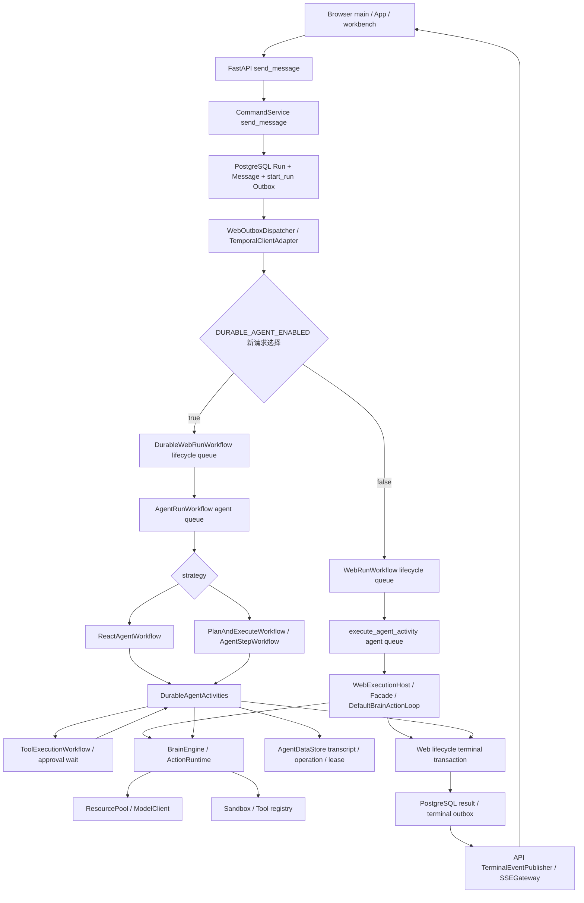
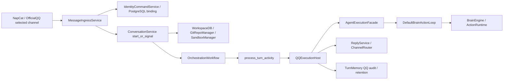
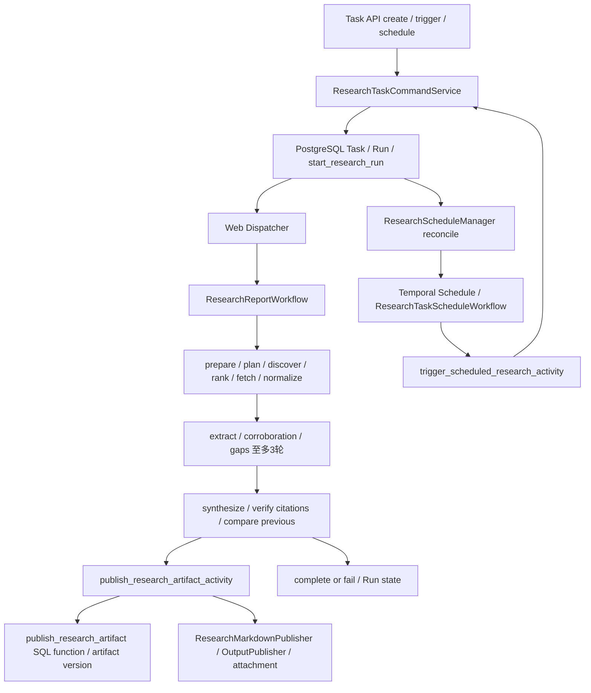
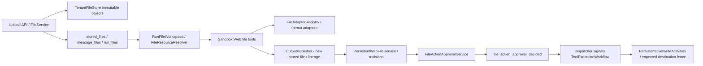
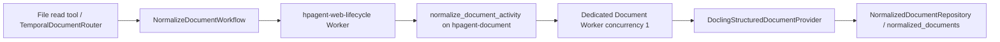
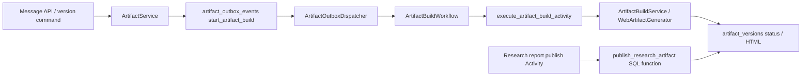
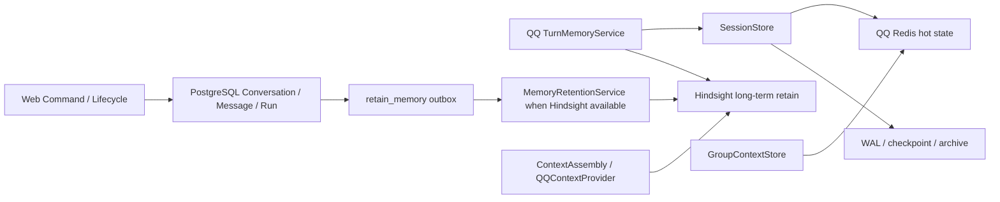

# 运行可达性与主链

以下图来自当前代码组合/注册/调用。箭头表示能力进入某个代码边界，不表示这些步骤都在一个进程，也不保证当前部署开启对应 gate。路径证据可在 runtime_edges.csv、reviewed_runtime_edges.csv 和 reachability_proofs.csv 交叉查询。

## Web Chat Run

证据：web_api/app.py:930；web_domain/services.py:206；web_dispatcher.py:197、220；web_workers.py:163；durable_web_workflow.py:132；agent_run.py:29；worker.py:318、343。两套 definition 始终注册；关闭 durable 开关后，已有 durable History 仍需要 Agent Worker 和注册的 Activities。新请求选择与历史 replay/rollback 是两件事。

线上 progress/delta 经 RedisWebRunEventSink，终态由 PostgreSQL 快照负责。SSE sequence gap / Redis 不可用 / upstream EOF 会触发前端 degraded，workbench 转为查询 Run 的轮询恢复；不会把本地拼接的 delta 当最终真相。Trace 由 PostgresTraceRepository + event sink 提供，不只是 common.logging。

## QQ Run

证据：worker.py:945、971、985、1065；application/ingress.py:42；application/conversation.py:71；harness/activities.py:41；bootstrap/qq.py:60；qq_host.py:294。身份指令可以在 ingress 直接处理并返回，不会每条消息都进入 Agent。会话资源分支准备由 ConversationService 执行；QQ 与 Web 共享账户身份，但保留各自短期状态。Reflection/Metrics 是主 Worker 注册的独立 Workflow/Schedule，不是 QQ 对话 loop 内的步骤。

## Research：Fixed Workflow, NOT Agent

证据：research_domain/services.py:184；research_workflow.py:81、106；worker.py:260；research_domain/persistence.py:526；research_activities/runtime.py 的 publish/complete Activities。发现 provider=CompositeSourceDiscoveryProvider(SearXNG, GitHub, RSS)。抓取 provider=StaticWebContentProvider，内容不足时允许 PlaywrightBrowserFetchProvider 回退。综合用 ResourcePoolResearchSynthesizer，但整个控制流仍是固定 Workflow。当前前端没有 /tasks 调用与 Research 管理界面；已有 API 不等于专用 UI 已交付。

## 普通 File 与持久版本

证据：web_api/app.py:760；web_domain/file_services.py:1；worker.py:719；sandbox_manager.py:179；file_read.py:67；file_write.py:119；file_domain/approvals.py:72；agent_workflows/tool_execution.py:32。图中 approval 是需要批准的操作分支，不表示所有 file write 必须审批。普通 outputs 是新对象；persistent overwrite 通过版本/目的地检查和审批执行，不能等同直接覆写输入 attachment。

## 重型 Document

Workflow 被 lifecycle worker 轮询执行，然后跨队列调用 Activity；图中 queue 节点说明注册边界。证据：file_runtime/routing.py:48；web_workers.py:173；document_workflow.py:18；document_worker.py:22。独立容器只有 tenant store 的只读挂载，document-runs 是独立 scratch 卷。该进程不由 main.py 调用，并不影响其生产入口身份。

## Artifact：聊天 build 与 Research publish 分开

证据：web_artifacts/services.py:211；artifact_dispatcher.py:29；artifact_activities.py:19；web_artifacts/build.py:19；research_domain/persistence.py:526。Research 使用确定性 artifact/version UUID，且以 report Markdown 为真相源生成报告 HTML；不需要再次调用聊天 Artifact 的生成模型。

## Memory / state

证据：bootstrap/qq.py:65；session/store.py:63；worker.py:373；application/memory_retention.py:1；application/context_assembly.py:1。Hindsight 的 bank/retained document、Web PG Conversation 与 QQ SessionStore 属于不同层的状态；Redis 不可用时 Web SSE 会降级，而不会变成业务数据丢失的证明。

## 证明边界

PROD_CONDITIONAL 表示入口成立、配置/请求分支满足时可到达，并不证明当前机器打开了开关。NONE/UNKNOWN 的协议文件也可能是生产依赖；不能因无调用记录移除。COMPATIBILITY_REGISTERED 没有单独文件行，不代表没有兼容注册：两套 Web Workflow 都还有配置可选的新启动路径，因此文件级主分类为 PROD_CONDITIONAL，兼容事实另记 HISTORY_COMPATIBILITY 和注册边。UNREACHABLE_PROVEN 为零，本轮没有对任何文件出具完整12项负证据。

## 补证索引

继续审计增加具体 DI receiver、工具 tuple coroutine、ASGI middleware、线程回调、context manager 与 dataclass 生命周期边，见 `refined_runtime_edges.csv`。角色字段 `entity_role` 区分数据合同、协议、包重导出与普通方法；结构性声明保持 UNKNOWN 时，不意味着业务功能缺失。运行根证明已根据新图重新生成。
