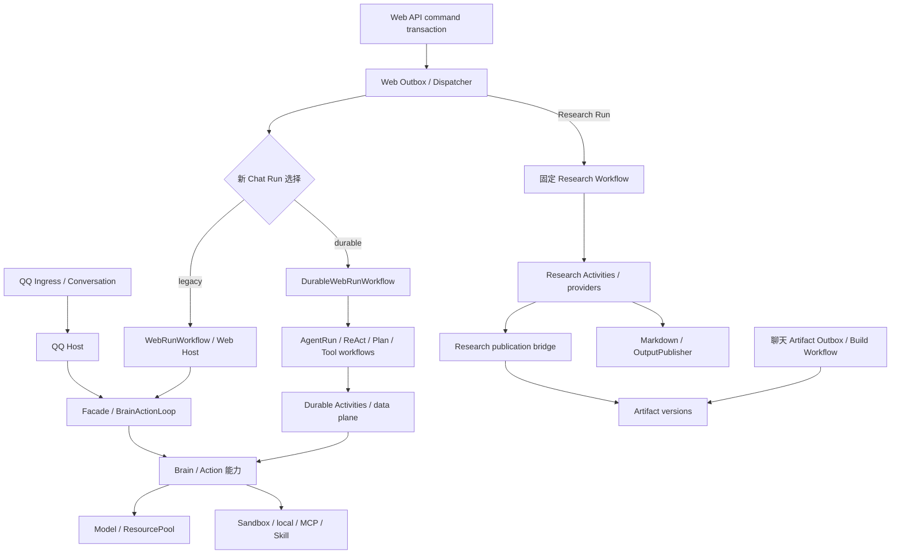

# 目标架构与模块边界

本文件描述**ACD 建议采纳后的逻辑边界**。保留边界来源于当前实现；拟议迁移点明确标出。逻辑 owner 是规则/状态的责任域，不是人员、服务数量或数据库隔离承诺。

## 执行结构

图是职责图，不能当成逐方法调用或完整时序：取消、审批信号、归档、终态事务和调度细节以代码与 2.1 主链为准。Research 仍通过自己的 API/命令建 Run；聊天 Artifact 使用独立 Artifact Outbox。两者都不经过“新 Chat Run 选择”。

具体保留：QQ/legacy 的控制流在 Facade loop；durable 的恢复控制流在 Temporal，数据载荷在 PostgreSQL；Research 是有上限的固定阶段工作流。建议共享能力合同，禁止为了形式统一再套一个万能执行器。未来 QQ 是否迁移 durable 另作设计。

## 进程和队列合同

| 单元 | 保留责任 | 收敛约束 |
| --- | --- | --- |
| 主 hpagent 进程 | QQ Worker、条件 Web lifecycle/agent Workers、消费者、共享工具/模型/workspace | bootstrap 拆文件不改变进程拓扑；QQ/Web 共用一个 AccountLockRegistry |
| Web API 进程 | 认证、命令事务、查询、SSE | 不构造 Agent 执行环境；命令借 Outbox 发起执行 |
| Web lifecycle queue | legacy/durable Web lifecycle、Research、Artifact、Document Workflow | 与 agent queue 区分；队列分离不是容器分离 |
| Web agent queue | legacy execute_agent 与 durable 能力 Activities / child workflows | durable 开关关闭后仍服务已有 durable 执行 |
| Document 进程/queue | normalize_document Activity，当前并发 1 | Workflow 留在 lifecycle；保留 tenant reader 与独立 scratch |
| Migration 进程 | SQL schema 迁移 | 根 SQL 资产与 Python runner 分工保留 |
| Frontend/gateway | 产品交互、HTTP/SSE 展示 | 不成为 Run 权威终态来源 |
| Standalone Web | 当前不列为支持部署 | 先完成 G07；不能以 enum/validator 可通过宣称可用 |

Research Activity 与 lifecycle 共享 queue 可能有隔离/容量方面的取舍，但没有排队延迟或资源竞争数据时，本次不新增 Research Worker。后续若观察到实际相互影响，再决定队列/并发/进程隔离。

## 状态 owner 与跨域桥

| 对象 | 权威来源 / 逻辑 owner | 合法协作边界 |
| --- | --- | --- |
| account / binding / credential | PostgreSQL / Identity | QQ 和 Web 共用 account_id；旧 JSON 只作为待核验历史资产 |
| Web Conversation / Message / Run / terminal | PostgreSQL / Web domain lifecycle | Command、Worker finalize、reconcile 使用受控事务；SSE 查询已提交快照 |
| durable transcript / operation / lease | PostgreSQL / AgentDataStore | Activity CAS、fencing、幂等；Temporal 保存步骤历史与紧凑引用 |
| run budget / usage ledger / trace | PostgreSQL / Budget 与 Observability | 预算参与执行约束，Trace 是投影；不能从 Trace 反写 Run 终态 |
| QQ 短期对话 | SessionStore / Redis + WAL/checkpoint + archive | TurnMemory、Archive 应用服务编排；不混成 Web Session |
| workspace metadata / branch | SQLite WorkspaceDB / Git workspace | Conversation 资源准备，WorkspaceIsolationRuntime 保护并发访问 |
| 文件元数据 / 不可变版本 / 审批 | PostgreSQL / File domain | OutputPublisher 与持久文件服务按 operation/lineage 协作；审批与 Outbox 同事务 |
| tenant 对象 / Run output / document scratch | TenantFileStore / RunFileWorkspace / Document runtime | 保留不可变对象与临时执行范围的不同生命周期；无跨 PG/FS 原子性承诺 |
| Research task / stages / evidence / report | PostgreSQL / Research | PG task 配置投影成 Temporal Schedule；固定 Workflow 消费执行 |
| Artifact / version | PostgreSQL / Artifact | 聊天 build 与 Research 发布桥共享版本合同；Research SQL 同事务关联 report |
| online delta / progress | Redis / 传输 | 可降级、可丢弃，按 Run 快照恢复 |
| 长期记忆 | Hindsight / Memory adapters | retain/recall 外部能力，不能替代 PG Run 或 QQ WAL |
| user_reminder | scheduler JSON / QQ reminder scheduler | 与 Temporal Research Schedule 分开登记 |

ACD-04 接受多种存储，不接受不清楚谁最终负责同一对象。ACD-07 的 Research SQL 是明确的跨域事务桥；无需为了“单一 owner”强行打断它的原子性。

## 当前包到目标责任的映射

覆盖 2.1 的全部 30 个后端一级包；保持现状也是审计结论。这里不授权全目录搬迁。

| 当前包 | 建议归属 / 处理 | 决策 |
| --- | --- | --- |
| account | 生产身份；旧 JSON 类与数据分开评审 | ACD-04、10 |
| actions | 工具选择/执行能力，保持独立 | ACD-01、03 |
| agent | 暂保实验实现；生产协议迁出，旧协议路径兼容 | ACD-03 |
| agent_activities | durable 能力及 data plane；按责任择机拆实现，保留注册面 | ACD-01、12 |
| agent_execution | QQ/Web hosts、legacy loop、预算/Trace；不随 Web 退役整包删除 | ACD-01、04、09 |
| agent_workflows | durable 确定性控制流及合同 | ACD-01、09 |
| application | QQ/use case/context/memory/archive；保持应用服务 | ACD-01、04 |
| bootstrap | 组合 owner；拟新增 web.py/infrastructure.py，复用 qq.py | ACD-02 |
| brain | 模型决策能力 | ACD-01、03 |
| channels | 已实现渠道适配；默认/工厂对齐，Console 单独保留候选 | ACD-08 |
| common | 共享基础合同，拟新增 agent_protocol.py；不承载业务执行 | ACD-03 |
| document_activities | 独立重型文档执行 | ACD-05、16 |
| file_adapters | 具体格式/转换 provider | ACD-05 |
| file_domain | 模型、规则、领域 Repository；拆开执行依赖 | ACD-04、05 |
| file_runtime | Run 文件路由/发布/持久操作编排 | ACD-05、07 |
| harness | QQ Temporal Activity 与 Prompt/context 适配，保持生产职责 | ACD-01、09 |
| memory | Hindsight 与群上下文适配 | ACD-04 |
| orchestration | 进程生命周期、Workflow、dispatcher/reconciler；剥离大块装配 | ACD-02、09、16 |
| persistence | PG 基础 Repository/UoW/runner；不强制聚合所有领域 SQL | ACD-04、13 |
| research_activities | 固定阶段执行及发布 | ACD-06、07 |
| research_adapters | 发现/抓取/综合 provider | ACD-06 |
| research_domain | Research 命令、规则、数据 Repository | ACD-06 |
| resources | 模型链/凭证/检索/预算上下文 | ACD-01、04 |
| sandbox | 工具 runtime；MCP 按传输与投影切分；保留 routing 既有边界 | ACD-01、11 |
| session | QQ 短期状态与 workspace metadata，声明差异，暂不物理拆包 | ACD-04 |
| storage | Redis/本地文件/tenant 对象 adapter | ACD-04、05 |
| web_api | HTTP 边界及 app composition；后续按路由族抽取 | ACD-12、15 |
| web_artifacts | Artifact 合同/build；登记 Research bridge | ACD-07 |
| web_domain | Web 命令/生命周期/会话/文件上传服务；保持事务 | ACD-04、12 |
| workspace | 进程/账户隔离、Run scope；拒绝未实现拓扑承诺 | ACD-04、05、16 |

前端 `web/src` 保留当前工作台及观测/文件/成果功能（ACD-15）；`config` 的功能合同由 ACD-08/16 处理；Compose/Docker/requirements 由 ACD-13/16 处理；根 `persistence` SQL 属于 schema 资产（ACD-04/13）；`scripts/tools` 保留明确运维用途，旧账号操作由 ACD-10 单列；`test` 与 `artifacts/benchmarks` 是验证资产，不能因体积/行数列为生产拆分目标。

## 拟议依赖约束

1. 生产 Brain/Action 调用方只依赖稳定协议，协议不反向 import 实验 agent、Temporal 或运行时资源。
2. bootstrap 负责构造，应用服务不反向查找主 worker 全局对象；启动/关闭入口保留资源拥有权。
3. 文件值对象不引用 OutputPublisher；文件运行服务可依赖领域规则/Repository，Repository 保持必要事务。
4. Workflow 通过 Activity 和已有合同使用外部能力；不因文件抽取把数据库/网络调用移入 Workflow。
5. 包内可以拥有领域 Repository，跨域 SQL 桥须具名、记录双方责任和事务效果。无需追求所有目录名都符合纯领域层教科书。

这些是针对已观察耦合提出的约束，尚未增加架构测试或新的依赖检查框架。
