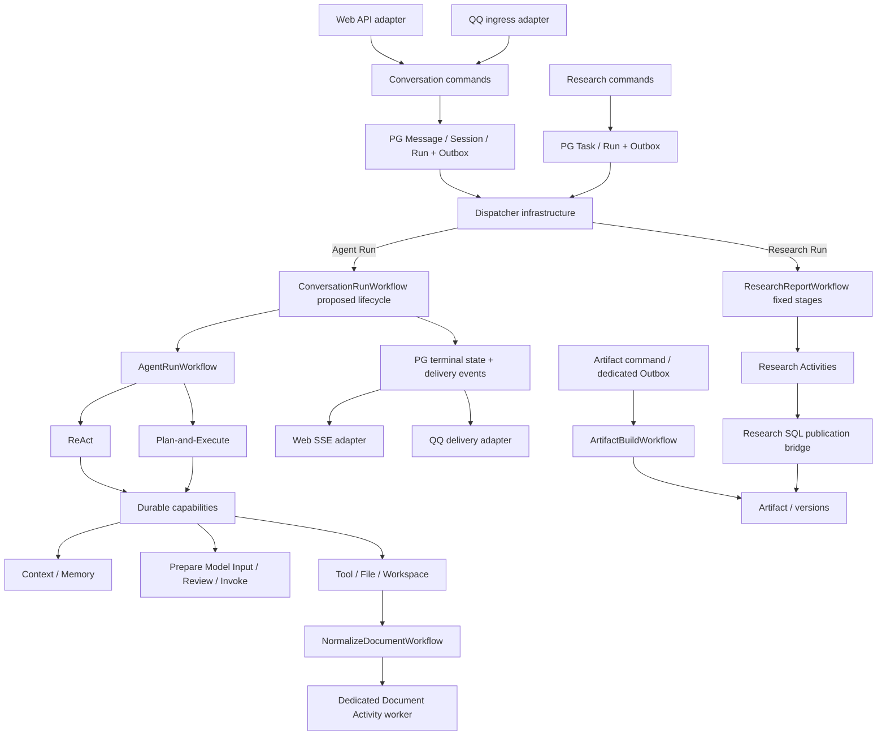

# Canonical Architecture · 目标边界 R2

> Historical architecture evidence. Not current architecture documentation.
> 以下 TARGET DECISION 尚未实施；CURRENT FACT 见 E01–E43。逻辑 owner 不等于新增独立服务/数据库。

**Current：** QQ 直接 start/signal account 级会话 Workflow；Web 在 PG 建 Run/Outbox 后分 legacy/durable；QQ Redis/WAL 与 Web PG 保存短期交互状态。现有 durable 的 profile、trace、loader、workspace session_context 仍含 Web 假设。

**Target：** 所有正式 Agent 交互进入统一 Conversation 数据域和 Durable Runtime；只有 surface 协议/授权/投递保留渠道差异。Research、Artifact Build、Document 独立执行，共享设施而不合并内部控制流。

**Required migration/refactor：** 统一领域与生命周期合同 → 中立 capabilities → QQ 接入 → 删除旧 loop/状态权威/分流 → 清理组合和协议。目录重命名本身不满足这些步骤。

ConversationRunWorkflow 是现有 durable 生命周期的拟议中立名称，不额外保留 DurableWebRunWorkflow 作为另一条正式实现。Dispatcher 可按 run_kind 选择入口；业务 Workflow 内不能变成 agent/research/artifact/document 分支大全。

## 核心领域与 Surface 合同

| 对象 | TARGET DECISION | CURRENT 差异 / 必须处理 |
| --- | --- | --- |
| Account / identity binding | PG 身份；surface 解析外部主体后带内部 account_id 调命令 | QQ 已使用 PG；无绑定拒绝与 DB 不可用分开，不自动建号绕过授权 |
| Conversation | 用户连续交互容器，可被显式授权的 surface 绑定 | QQ 当前 account 级 mailbox；建议按 account + provider + 私聊/群聊目标 + 可选 thread 映射，不能自动合并同账户所有聊天 |
| Message | 源消息标识、Conversation、角色/顺序、回复关联均入 PG | QQ provider/bot/room/message 标识映射成稳定领域幂等键；不能随机 key 或假设上游消息天然是 Web UUID |
| Session | Conversation 内上下文/执行资源生命周期，统一 PG 轮换 | 替换 QQ 字符串 Session 生成与恢复；SQLite 不再决定产品 active Session |
| Run | 一次被接受的执行，统一终态/operation 合同 | 按 run_kind 保留合法 shape，Research 不强造 Conversation/Session |
| Outbox | 事务命令与执行/投递副作用可靠衔接 | QQ 不直接 start/signal Agent；Research/Artifact 可有专属事件、表和消费者 |
| Delivery | 从已提交结果派生的投递，支持重试/回执 | SSE 与 QQ 分段/引用/@/附件适配分离；投递失败不重新执行已完成 Agent |

**建议的最小忙时规则：** 沿用一 Conversation 一个 active Run，包括 queued/running/cancelling；两个 surface 同样返回领域 busy，QQ 映射为明确提示。当前 QQ 会 signal 后续消息，这个行为改变需产品验收。如果需要排队，应显式改持久化 admission/唯一索引，不藏一套 QQ 内存或长 Workflow mailbox。群聊非触发消息可做有限临时上下文；一旦选入模型，内容与来源纳入 snapshot。

统一身份不意味着 QQ 群聊与 Web 私人历史自动互通。跨 surface 打开同一 Conversation 必须显式绑定并验 ownership。PG `completed` 后 QQ 发送失败，只重试同一结果的 delivery；渠道无可靠幂等支持时记录投递不确定性，不承诺端到端 exactly-once。

## 权威状态与能力 owner

| 状态 / 能力 | TARGET owner / 持久化 | 边界 |
| --- | --- | --- |
| Conversation / Message / Session / Run | surface-neutral domain / PG | 交互核心，不吸收所有模型/文件/Git/业务流程 |
| transcript / operation / lease | durable data plane / PG | Run 执行状态、CAS、fencing 与重试结果；不同于用户 Message |
| ModelInputSnapshot / ModelInputReview | Agent 模型输入能力 / PG | 不可变输入、独立审阅决定；History 只引用，Trace 只投影 |
| 长期记忆 | Hindsight | 保留 retain/recall；统一 Message 来源后退出 QQ WAL 权威 |
| 缓存 / 在线事件 / 临时群上下文 | Redis | 可丢弃可降级，不保存不可替代正式会话状态 |
| Budget / Trace | 各自 capability / PG | 预算约束执行，Trace 观察执行；Trace 不给模型审批授权 |
| Persistent Workspace | Workspace owner / Git + PG 逻辑绑定 | workspace_id 解析 repo/ref；SQLite 若保留，仅是可替换本地元数据 |
| Run Files | File runtime / PG + tenant objects + run dirs | inputs/scratch/outputs 独立；scratch 非默认用户文件视图 |
| Persistent file revisions | File owner / PG + immutable objects | 用户逻辑文件版本，不自动等同 Git workspace 文件 |
| Research Task / evidence / report | Research / PG | 独立固定阶段与 schedule desired state，消费共享 Run 设施 |
| Artifact / version | Artifact / PG | 结果合同统一；Research SQL 桥保留原子关联 |
| Heavy Document | Document capability / dedicated Activity worker | 独立并发/资源边界，Workflow 仍在 lifecycle |

需要消除的是同类交互实体的双重权威。Redis、Hindsight、Git、tenant store 对不同对象的分工继续保留。Reminder scheduler 若保留为目标工具，仍是有名业务能力，不因旧 QQ turn 退役而盲删或并入 Research。

## 新扩展边界

模型输入按“冻结请求 → 权限投影 → 版本授权 → 执行原快照”衔接。准备覆盖 System/History/Memory/File/Plan/Tool、模型选择和有效参数；Invoke 不再组 prompt/选工具。等待期间输入或 provider fallback 改变实际请求，创建新 snapshot 并重审。见 06。

Workspace 按“Conversation ownership → logical workspace binding → versioned query”衔接。shared checkout 只能显示正确 Session 的实时树；其他 Session 返回指定 ref 的 committed 视图或 unavailable，不因查询 checkout。worktree 将来改变物理隔离，不改变 UI query 合同。见 07。

## 30 个当前包到目标责任的映射

| 当前 src 包 | TARGET / Required refactor | ACD |
| --- | --- | --- |
| account | 保留 PG 身份；删除旧 JSON 类/旧运维路径候选 | 04、10 |
| actions | 正式工具能力；移除 QQ SessionStore 依赖，接受 Run 上下文 | 01、03、17 |
| agent | 救出正式协议后删除实验/Multi-Agent/非目标实现 | 03、10 |
| agent_activities | 唯一 durable 能力，拆准备与调用 | 01、12、17 |
| agent_execution | 保留预算/Trace/中立适配；迁出合同后删 legacy hosts/loop | 01、03、09 |
| agent_workflows | 唯一 Agent 编排、两 strategy、确定性 review wait | 01、17 |
| application | ingress/delivery 为 surface；交互命令统一，重接记忆/归档 | 01、04 |
| bootstrap | shared runtime + surfaces；QQ 不再组装私有 loop | 02 |
| brain | 决策解析与模型能力；调用后 snapshot 不再用于授权 | 03、12、17 |
| channels | 协议/路由/发送，不控制 Agent 内循环 | 01、08 |
| common | 轻量正式合同候选，不建万能服务包 | 03 |
| document_activities | 保留独立重型文档 Activity | 05 |
| file_adapters | 格式读取/转换 provider | 05 |
| file_domain | 规则/审批/版本/Repository，执行依赖外移 | 05 |
| file_runtime | Run 文件解析/路由/发布，区别于 Workspace Query | 05、18 |
| harness | 旧 QQ turn 删除；Prompt/context、reflection/metrics 等必要职责迁出保全 | 03、09 |
| memory | Hindsight/group adapter，输入来自统一领域 | 04、17 |
| orchestration | 中立 lifecycle/业务 Workflow/dispatcher/关闭，删除双注册 | 01、02、09 |
| persistence | PG 原语/UoW/必要 schema runner，非全部领域总库 | 04、10、13 |
| research_activities | 固定阶段/发布，不变 Agent strategy | 06、07 |
| research_adapters | 发现/抓取/综合 provider | 06 |
| research_domain | Task/evidence/report，消费共享 Run 设施 | 06 |
| resources | 准备时固定 provider payload，fallback 新快照 | 17 |
| sandbox | 唯一工具 runtime，版本化 MCP projection，消除渠道假设 | 01、11、17 |
| session | QQ SessionStore/WAL 权威退役；WorkspaceDB 单独审视 | 04、09、18 |
| storage | 通用 adapters 保留；QQ 专用无调用残留删除 | 04、05、10 |
| web_api | HTTP/SSE/query surface，核心命令不归 Web 独占 | 04、15、18 |
| web_artifacts | Artifact owner/build，支持双 surface 引用 | 07 |
| web_domain | 交互核心提升中立领域；其他 capability 保持 owner | 04 |
| workspace | PG 逻辑绑定/隔离/查询；worktree 未来选项，Run scope 独立 | 16、18 |

前端消费查询/投递合同，Research 专用 UI 另定范围。config/Compose 删除迁移开关但保留真实能力与已实现拓扑。根 persistence SQL 必须支持全新安装，不能按 migration 名字全删。
