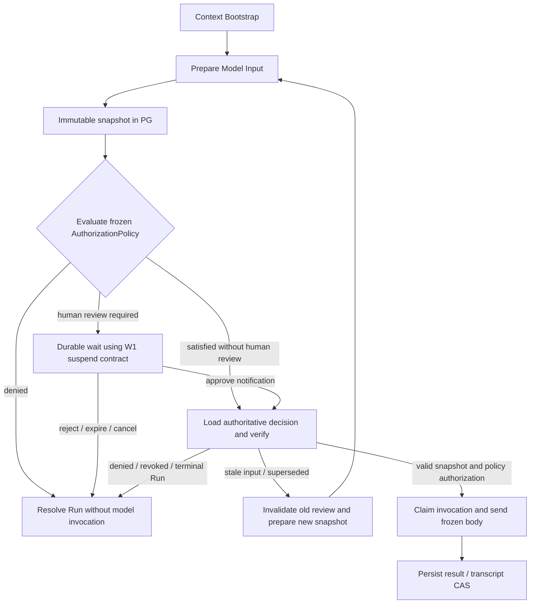

# ModelInputSnapshot / Model Review · 架构对象草案 · R2.1

> Historical architecture evidence. Not current architecture documentation.
> ACD-17，TARGET DECISION / NOT IMPLEMENTED；字段与状态为建议合同，无对应已实现表/API。

> **W5 implementation reconciliation (2026-09-18):** that sentence is preserved as a fact
> about the R2.1 baseline. Current HEAD implements the narrower non-human-review subset:
> prepared effective provider bodies, immutable snapshots/hashes, Account/Entitlement and
> endpoint eligibility, Account/day + Run accounting, fallback-attempt snapshots, conservative
> uncertain settlement, compact Trace refs, and owned `none` / `summary` / `full_safe`
> projections. It does **not** implement the proposed `AuthorizationPolicy`, review records or
> commands, approval binding, durable review wait, or human-review UI because those elements were
> superseded and removed from final W5 scope, not deferred. This document preserves the R2.1
> historical proposal; final ACD-17 covers snapshot/governed invocation/entitlement/account quota/
> prompt visibility/observability.

## Current / Target / Required migration/refactor

**Current：** E29 的 model_decision_activity 读取 transcript、加 objective、选 tools、调用 Brain；E30 的 input_context 是调用后诊断投影。E31 在 provider 发送前仍转换 messages/tools 和合并 max_tokens/extra_body，E32 还可能换 fallback endpoint。E41 的 planning/evaluate 独立调用模型。E33 有文件审批 wait，但不存在模型输入审批。E37 context bootstrap 可先调用 fast 模型重写记忆检索词。

**Target：** 同一条主模型调用链完成 prepare → freeze → authorize → invoke。这里审阅范围为主 Agent 的 decision、plan、replan、plan evaluation、step、forced final、synthesis；不变量是每个 ModelInputSnapshot 在 InvokeModel 前满足被冻结的 AuthorizationPolicy；人工频率是可替换 policy。首版推荐 off / every_call，允许未来 first_call_only / phase_based / policy-based，不能绕过后续 snapshot 的策略校验。辅助记忆检索改写可能发生在审阅前，须在产品说明/Trace 中可辨；不宣称“审批前没有任何模型调用”。Research 模型审阅是 FUTURE OPTION。

**Required migration/refactor：** 拆所有主调用点，冻结真正的 provider 请求体；让权限视图、审批命令、执行适配器引用同一对象。现有错误、Transcript CAS、预算、模型结果解析能力可以复用，现有 snapshot_context 本身不能升级为授权对象。

## 对象与唯一权威

| 字段组 | 建议内容 | 意义 |
| --- | --- | --- |
| 身份 | snapshot_id、account_id、run_id、operation_id、turn、phase、schema_version | 绑定一次逻辑模型调用，不只绑定 Conversation 或一轮可变字符串 |
| 授权策略绑定 | authorization_policy_id/version/mode/scope、决策依据引用、authorization_decision_ref | 冻结适用策略与授权范围；每个 snapshot 均有绑定 snapshot_id/hash 与策略版本的决定，off 也不例外 |
| 来源版本 | transcript_id/version、prompt version、file revision/hash、memory selection、plan/step version、tool catalog fingerprint | 说明准备时读了什么；用于等待后判定失效 |
| 选择与有效请求 | model_selector、resolved endpoint/model/API format、messages、tools、effective model_parameters、provider_request_body、serializer_version | selector=chat 不足以确定真正模型；必须冻结 effective 默认值和消息/tool 转换结果 |
| 上下文分段 | system_prompt、short_term_context、long_term_memory、file_context、plan_context、tool_context | 作为 canonical messages/tools 的来源标注或确定性投影，不能变成可独立编辑的第二份 Prompt |
| 完整性 | content_hash、created_at、supersedes_snapshot_id | payload 不可变；hash 覆盖有效模型请求和关键来源版本，created_at/展示标签不参与语义 hash |

完整对象保存在 PG/Agent durable data plane，建议独立 snapshot 表及 review 表；在实施时确定 DDL。Authorization header/API key 等凭证不进入快照或任何权限视图。模型所需业务内容属于 canonical payload，必须按 account ownership 授权读取，不假设 Admin/Debug 可以跨账户任意查看。

canonical model input 以准备完成后的实际应用请求为准：推荐 `provider_request_body` 是最终 sends 的结构化 body，messages/tools/context 段是其来源与投影。对同一版本使用规范 JSON 编码和 hash（算法/规范化版本固定）；数字默认值、tool schema、模型、extra_body 任一实际输入变化都生成新快照。provider 自身内部 system prompt 或执行环境不在应用可证明范围；本合同证明 HpAgent 提交的输入一致。

History 中仅保留 snapshot_ref/content_hash、review_id、operation/phase 等紧凑字段和确定性等待/信号控制；不放全文、工具参数大对象或文件内容。策略授权及人工 review 的权威记录在 PG，Workflow 控制推进在 Temporal；signal 是唤醒通知，不能凭其携带的 approved=true 直接授权调用。

## 能力边界

| 能力 | 允许职责 | 退出条件 |
| --- | --- | --- |
| ContextBootstrap | 从 source/context owner 的引用、Hindsight、File/Plan 准备上下文；Chat 来源是统一 PG Conversation；辅助检索调用独立计量 | 可恢复 transcript/context refs，不产生主模型回复 |
| PrepareModelInput | 固定 context/version、选工具、冻结模型/参数并完成 provider 转换，幂等写 snapshot | 相同 prepare 操作与来源版本返回同一快照，不调用主模型 |
| ModelInputQuery / View projector | 根据权限对同一个快照投影，保留 snapshot_id/hash；隐藏字段明确标示 | 不重新生成 messages/tools，不发模型请求 |
| AuthorizationPolicy evaluator | 按冻结 policy/version/scope 为当前 snapshot 评估授权；需人工则进入 ModelInputReview | 每次 Invoke 前都有当前 snapshot 的有效决定，不把 off 当旁路 |
| ModelInputReview command | 核验 account/actor/snapshot/hash/Run 状态；事务写决定 + Outbox | 批准仅对该版本有效；重复同决定幂等，冲突决定拒绝 |
| InvokeModel | 读取快照、核验状态/hash/冻结 AuthorizationPolicy 及当前授权/依赖/新 fencing token，原样发送冻结请求并持久化结果 | 不重载历史、不补 system prompt、不重选工具、不改 effective 参数或偷偷 fallback |

共享“模型调用子步骤”可作为窄 Workflow helper 或专门子 Workflow，取舍在实施时确定；不把业务生命周期、Research 或所有审批动作塞进 UniversalWorkflow。

## 正确的等待与拒绝流程

没有“reject 也汇入 Invoke”的分支。off 只免人工，仍执行 Prepare/Freeze/Authorize/Invoke 并记录当前 snapshot 的策略授权决定；Invoke 不接受仅凭布尔 review_enabled 的放行。every_call 要求每次人工批准。未来 first_call_only 可依据首批授权的明确 scope 自动评估后续快照，phase_based/policy-based 按冻结规则评估；第一份人工批准不能直接充当后续快照的批准。策略版本与 scope 在 Run 创建时冻结；变更必须显式版本化并重新评估受影响快照，不在 Invoke 暗读动态配置改规则。

Conversation 首版 single active + busy reject 可让等待 Run 继续占 admission slot，这是可替换策略，非 Chat Run 不必有该 slot。用运行 phase/wait reason 投影等待状态；review 记录状态独立，最终 Run 状态如何映射 reject/expire 由生命周期合同选定，且必须终止等待、释放资源。

审阅记录至少区分 pending、approved、rejected、expired、cancelled、superseded；invocation 另记录 claimed/in_flight/completed/uncertain。输入变化不原地改 snapshot，生成 successor 并让旧 approval 失效。批准后调用前仍须原子核验最新有效快照与 Run；开始调用后的取消可能中断网络并禁止结果发布，但不能声称撤回 provider 已收到的请求。

等待不占 Activity worker 槽、workspace 账户锁、数据库事务或网络连接。W1 必须冻结 Run lifetime ≠ Execution lease lifetime：running → waiting_review / waiting_approval / external_wait → running → completed。任何 durable wait 前必须释放 execution lease，恢复重新 acquire，传播新 fencing token 给后续 Agent/Tool/生命周期 release；重验 transcript 与所有相关输入依赖。E44/E45 表明当前 DurableWebRunWorkflow 在启动 AgentRunWorkflow 前一次性 acquire，AgentRunInput 固定携带 lease_token 与 Conversation/Session 字段；这项基础输入和资源生命周期改造在 W1 完成，W5 只接入 Model Review，不等到 W5 重开合同。Run/operation ID 跨等待稳定，token 随执行区间更新，旧 token 的迟到写入必须被拒绝。无需物理 workspace 的模型执行使用冻结文件内容，真正 Tool 执行仍取得当前资源锁并另验风险审批。

预算在实际 Invoke 前 reserve、按 provider attempt settle；等待期不长占模型调用 reservation。等待超时使用 Workflow timer，相关 TTL/Run deadline 一致；重启、重复 signal、通知丢失可由 PG 状态与 Outbox 重发恢复，不能靠前端轮询来推进业务。

## 权限投影、hash 和 fallback

User View 显示用户有权看的任务/上下文摘要及隐藏内容提示；Developer View 可多展示工具/结构；Admin/Debug 仅在明确授权内显示更完整 payload。三者返回同一 snapshot_id/content_hash，不能 hash 各自删减后的字符串再授权不同输入。用户批准的是被授权视图所代表的 canonical 请求，UI 不声称用户已逐字看到所有隐藏字段。

审阅期间不允许根据当前权限重新组一份模型输入。若权限撤销导致该输入已不能继续使用，应撤销授权并终止或生成合法新快照，不暗自删字段后继续用旧 hash。

ResourcePool 当前会 fallback；目标中换 endpoint/model/API format/有效参数必须新 snapshot，重新满足冻结 AuthorizationPolicy；需人工时重新审批，其他模式仍需对新 snapshot 生成有效策略决定。同模型同语义请求的传输重试只能在原授权范围内进行；重新检索记忆、读取变更文件、工具 schema 刷新、plan/transcript 版本更新亦需旧批准失效。动态配置不允许在 Invoke 时覆盖准备阶段快照。

## 不夸大幂等保证

同 operation 的结果提交、approval claim、transcript CAS 可幂等；模型服务已收请求但响应丢失时，PG 不能证明 provider 没执行。支持 provider idempotency 时传稳定 key，否则记录 uncertain/明确重试策略并按 attempt 计费，不能宣称 exactly-once。重试永远只能重发获授权快照，不自动换输入。

G12 必须用捕获实际请求 body 的模型假服务验证 hash 对应 payload，并覆盖所有主模型 phase 与 off/every_call 授权分支，验证扩展策略仍必须逐快照校验的合同；仅验证 UI 文本相同或给 snapshot 字段写单元测试不足以闭合合同。
