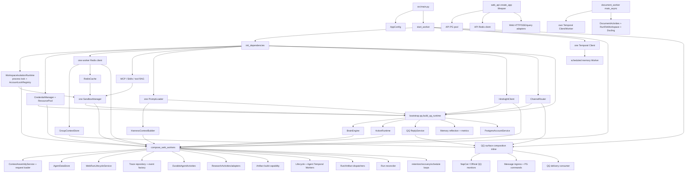

# W4-A — Composition / Ownership Audit

## 1. Judgment

**W4-A PASS. W4/G02 is not yet closed.**

The audit found a single canonical runtime and no return of a retired Agent path, but its
composition ownership is not explicit enough to pass W4. Shared Agent capabilities are still
constructed by a QQ-named builder, durable Activity implementations still depend on process-global
injection, the Action protocol still admits the retired session-only call shape, context assembly
still interprets concrete transports, and startup/shutdown does not unwind every acquired worker or
API resource. These are bounded W4 structural defects with a minimal W4-B implementation path.

No characterization test was needed for W4-A because the existing callers and tests establish the
current behavior. This deliverable changes only this report. It does not implement W4-B.

## 2. Audited state and sources

- Branch: `feat/hpagent-web`
- HEAD: `2bcf4c0da707bd3bb98c9bd94b86a59f1311873c`
- Entry worktree: `artifacts/architecture-audit/phase2_1/03_architecture_truth_table.md`
  was already modified. It was not read as W4 authority and was not changed.
- W4-A adds only this file. Ignored local configuration and data were not inspected.
- Audit date: 2026-09-17 (Asia/Shanghai).

Source of truth read:

1. `artifacts/architecture-audit/phase2_2/02_target_boundaries.md`, especially the target
   composition graph, capability owners, W1 frozen execution boundary, and package responsibility
   map.
2. `artifacts/architecture-audit/phase2_2/03_delivery_sequence_and_gates.md`, especially W4 and
   G02. W4 requires one runtime composition, surface-only adapters, explicit ownership/close, and
   removal of temporary wrappers. G02 requires correct callers, one pool/lock/Sandbox, and release
   on shutdown, cancellation, and startup failure.
3. `artifacts/architecture-audit/phase3/W3_E_implementation_report.md`, including all three
   `DEFER_TO_W4` findings. Its HEAD was older; all claims below were independently checked against
   the audited HEAD.

Production entry/composition paths inspected:

- `src/main.py` -> `orchestration.worker.start_worker`
- `src/orchestration/worker.py` (`init_dependencies`, `compose_web_workers`, task startup and
  `_shutdown_worker_resources`)
- `src/web_api/app.py:create_app` lifespan
- `src/orchestration/document_worker.py:main_async`
- the constructors and direct callers of Brain, Actions, Context, Memory, files, workspace, trace,
  research, artifact, Temporal workers, dispatchers, reconcilers, channels, and account services

## 3. Current production composition graph

The name `compose_web_workers` is historical: it builds the canonical Web/QQ Agent workers plus
Research, Artifact and Document workflow registrations. The same `BrainEngine`, `ActionRuntime`,
`SandboxManager`, `ResourcePool`, workspace lock registry and context capability serve durable Runs
created by both Web and QQ.



Current facts:

- There is one canonical Agent workflow chain. The defect is ownership and wiring, not duplicate
  business execution.
- The worker has one instance each of `ResourcePool`, Redis client, `SandboxManager`,
  `WorkspaceIsolationRuntime`/`AccountLockRegistry`, `PromptLoader`, Brain and Actions.
- Separate API and Document processes correctly have their own process-local PG/Redis/Temporal
  clients. Those are not accidental duplicates.
- Worker PG consumers mostly receive a DSN and `UnitOfWork` opens a short connection per
  transaction. The API alone owns a long-lived `ConnectionPool` (and a second development-only pool
  when the fake executor is enabled).
- Research and Artifact reuse the worker `ResourcePool`; Document remains on its dedicated queue and
  process. Their internal control flow is not merged with the Agent strategy.

## 4. Component ownership census

`Current lifetime` distinguishes object/process lifetime from a transaction or Activity lease.
Target owner is logical; it does not require a package or service per row.

| Component | Current constructor | Current consumers | Current lifetime | Target logical owner | W4 action |
| --- | --- | --- | --- | --- | --- |
| Worker configuration (`AppConfig`) | `main.main_async` via `AppConfig.from_yaml` | worker composition, all worker capabilities | Worker process | Worker composition root | KEEP |
| Web configuration (`WebApiSettings`) | `web_api.create_app` / `from_env` | HTTP/SSE/auth/file adapters | API process | Web surface composition | KEEP |
| Document configuration | `document_worker.main_async` from env | Document worker only | Document process | Document composition root | KEEP |
| API PostgreSQL pool | Web lifespan | Web auth, commands, queries, files, traces | API lifespan | Web surface composition; lifespan closes it | KEEP |
| Worker PostgreSQL access | DSN passed by `init_dependencies`/`compose_web_workers`; `UnitOfWork` opens connections | account, Conversation, lifecycle, Agent store, Research, Artifact, files, outboxes | Short transaction connections; DSN process-long | Persistence infrastructure; capability services own transaction scope | KEEP |
| Worker Redis client | `init_dependencies` | `RedisCache`, group context, run-event sink, Sandbox | Worker process | Shared infrastructure composition | MOVE_OWNERSHIP |
| API Redis client | Web lifespan | SSE gateway and terminal publisher | API lifespan | Web surface composition | KEEP |
| Hindsight client | `init_dependencies` | context recall, retention, reflection, metrics | Worker process object; per-call HTTP clients | Memory capability, created by shared composition | MOVE_OWNERSHIP |
| Temporal client (main worker) | `start_worker` | three workers, dispatchers, document router, research schedule | Worker process | Durable orchestration composition | KEEP |
| Temporal client (Document) | `document_worker.main_async` | dedicated Document worker | Document process | Document composition root | KEEP |
| `ResourcePool` | `init_dependencies` | Brain, Action summaries, Research synthesis, Artifact generation | Worker process; model HTTP clients are per call | Shared model infrastructure | EXTRACT_COMPOSITION |
| `PromptLoader` | `init_dependencies` | Context identity/guidance, Brain recall rewrite, Action summaries, QQ replies | Worker process, immutable | Shared prompt infrastructure | EXTRACT_COMPOSITION |
| MCP manager / Skills / retriever | `setup_tools` | `SandboxManager`, each session tool registry | Worker process | Tool/Sandbox infrastructure | KEEP |
| `WorkspaceIsolationRuntime` / account locks | `init_dependencies`, started before other dependencies | `SessionResourceRecoveryService`; process topology gate | Worker process | Workspace infrastructure, owned and closed by root | MOVE_OWNERSHIP |
| `GitRepoManager` | `init_dependencies` | session resource recovery | Worker process, stateless | Workspace capability | KEEP |
| `RunFileWorkspace` / tenant store / output publisher | `init_dependencies` | resource recovery, Sandbox file tools, cleanup, Research publishing | Worker process; per-Run scopes | File capability composition | KEEP |
| `SandboxManager` | `init_dependencies` | Action runtime and session resource recovery | Worker process with session-scoped sandboxes | Shared Action/Workspace infrastructure; root closes all sandboxes | MOVE_OWNERSHIP |
| `BrainEngine` | **`bootstrap.qq.build_qq_runtime`** | canonical durable model Activities for Web and QQ | Worker process | Shared Agent capability composition | MOVE_OWNERSHIP |
| `ActionRuntime` | **`bootstrap.qq.build_qq_runtime`** | canonical durable model/tool Activities for Web and QQ | Worker process; cache per execution | Shared Agent capability composition | MOVE_OWNERSHIP |
| `HarnessContextBuilder` | `init_dependencies` | `ContextAssemblyService` | Worker process, immutable | Context capability | RENAME_IF_NEEDED |
| `ContextAssemblyService` and request loader | `compose_web_workers` | durable context bootstrap/model Activities | Worker process + per-Run provider | Context capability, wired by durable composition | TIGHTEN_PROTOCOL |
| account/identity services | `build_qq_runtime`, inline `start_worker`, Web lifespan | QQ schedules/ingress; Web self-service | Process, stateless except API pool dependency | Account capability; surface adapters choose the appropriate port | EXTRACT_COMPOSITION |
| QQ router/channels/reply/ingress | Router in `init_dependencies`; remaining construction split between `build_qq_runtime` and `start_worker` | QQ ingress, control replies, committed delivery, reminders | Worker process / monitor tasks | QQ surface composition only | EXTRACT_COMPOSITION |
| `DurableAgentActivities` | `compose_web_workers` | Agent Temporal worker | Worker process; calls are Activity-scoped | Agent capability composition under durable orchestration | KEEP |
| `AgentDataStore` / segment Activities | `compose_web_workers` | Run input loader, durable Activities, segment workflow calls | Worker process; short PG transactions | Durable Agent data plane | KEEP |
| Run lifecycle service + Activities | service built in `compose_web_workers`; functions use module-global injection | Lifecycle Temporal worker / dispatcher / reconciler | Worker process | Durable orchestration, instance-owned | REMOVE_WRAPPER |
| Trace repository/event factory | `compose_web_workers` | lifecycle observer, durable Activities, root trace finalizers | Worker process / per-Run sinks | Trace capability | KEEP |
| Research capability | `compose_web_workers` | Research workflow Activities; shared model/file publication | Worker process | Research capability, registered by durable orchestration | KEEP |
| Artifact capability | `compose_web_workers`; function uses module-global injection | Artifact workflow and outbox dispatcher | Worker process | Artifact capability, instance-owned | REMOVE_WRAPPER |
| File approval/persistent file capability | `compose_web_workers`; Web commands in API | durable tool Activities and Web APIs | Process | File capability | KEEP |
| Document capability | main worker registers Workflow; dedicated worker constructs Activity/provider | lifecycle orchestration + Document queue | Per respective process | Document capability with dedicated Activity process | KEEP |
| Temporal Worker objects | `start_worker`, `build_web_temporal_workers`, `build_document_worker` | Temporal runtime | Async context / process | Durable orchestration | KEEP |
| Run Outbox dispatcher / recovery | `compose_web_workers`, tasks in `_build_web_background_tasks` | `start_run`, `cancel_run`, approval delivery | Worker process tasks | Durable orchestration | KEEP |
| Artifact dispatcher / recovery | `compose_web_workers`, task builder | Artifact outbox | Worker process tasks | Artifact orchestration | KEEP |
| Run reconciler | `compose_web_workers`, task builder | terminal repair | Worker process task | Durable orchestration | KEEP |
| Memory retention consumer | `compose_web_workers`, task builder | `retain_memory` events / Hindsight | Worker process tasks | Memory capability + durable dispatcher composition | KEEP |
| Research schedule reconciler | `start_worker` | Research schedules | Worker process task | Research orchestration | KEEP |
| legacy reminder scheduler | `init_dependencies`, then module-global injection | reminder tools and QQ channel delivery | Worker process task | Named scheduler capability; injected into tool construction | REMOVE_WRAPPER |
| scheduled reflection/metrics Activities | shared services built by `build_qq_runtime`; module-global injection in `start_worker` | scheduled Temporal worker | Worker process | Memory capability, instance-owned Activities | MOVE_OWNERSHIP |
| QQ committed-result delivery | constructed inline in `start_worker` | `qq_deliveries` rows and router | Worker process task | QQ surface composition | KEEP |
| background-task cancellation | task locals + `_shutdown_worker_resources` | all worker loops | Worker process | Worker composition root | MOVE_OWNERSHIP |

## 5. Dependency-direction findings

### MUST_FIX_W4

| Finding | Evidence | Why W4 owns it | Target |
| --- | --- | --- | --- |
| QQ-named module owns shared Agent capabilities | `bootstrap/qq.py:27-67` creates Brain, Actions, memory maintenance and account schedule support; `orchestration/worker.py:199-284` consumes Brain/Actions in canonical durable Activities | Surface module owns shared runtime state, directly contradicting the W4 exit condition | Shared builder owns Brain/Actions/Memory; QQ builder owns router/reply/ingress/channels/delivery only |
| Broad bags hide required wiring | `build_qq_runtime` takes ten broad arguments, most typed `Any`; `WorkerDependencies` mixes infrastructure, shared capabilities and QQ adapters | Construction can be wired incorrectly without a protocol/type failure | Separate typed `SharedAgentServices`, `SharedInfrastructure`, `QQSurfaceServices`, and durable composition result; do not create new services |
| Action protocol accepts a retired caller shape | `actions/runtime.py:49-76,118-168` makes execution identity optional and comments about a legacy QQ path; `clear_session` remains at 250-255 | Canonical callers at `agent_activities/runtime.py:497-509,593,788-905,1089` always have a Run ID; permissive session-only caching can merge executions | Require resource key + execution ID; cache by tuple; remove legacy fallback and unused session-wide API; define the consumer port in `actions.contracts` |
| Context capability interprets transports | `context_builder.py:7-17,71-75,185-245,298-335` imports `ChannelType`, detects NapCat/Web from events and maps profile back to a channel; `context_assembly.py:123-129` recognizes `napcat`/`official_qq` | Agent context knows transport names even though only semantic personality/profile should survive | Surface/source adapter supplies a semantic interaction profile; Context composes from profile and source-neutral memory scope, never NapCat vs HTTP |
| Activity dependencies are process globals | `run_lifecycle_activities.py:31-55`, `artifact_activities.py:10-22`, and `memory/activities.py:10-40` use `inject_*` globals | Multiple compositions/tests overwrite ownership; constructors and shutdown cannot account for dependencies | Instance-owned decorated Activity collections registered as bound methods; preserve Activity names |
| Reminder tool dependency is a process global | `sandbox/tools/local/reminder.py:23-27`; injected after Sandbox construction at `worker.py:846-851` | Hidden late binding makes startup order part of behavior and is not represented in composition | Pass a scheduler port into reminder tool factories/Sandbox composition; delete `inject_scheduler` |
| Worker acquisition is not failure-atomic | workspace process lock is acquired at `worker.py:574-582`; `init_dependencies` has no unwind; `start_worker` calls it before its `try` at 801; MCP and Redis can also be acquired before a later exception | G02 explicitly requires startup-failure release | Build dependencies under an `AsyncExitStack`; register cleanup immediately after each successful acquisition |
| Worker normal shutdown is incomplete | `_shutdown_worker_resources` cancels tasks, disconnects MCP and closes workspace isolation (`worker.py:1075-1157`) but never closes the Redis client or destroys all Sandbox instances | Long-lived resource owner and closer differ; Redis connections and in-memory/session resources outlive graceful shutdown | Shared resource owner closes channels/tasks, all sandboxes, MCP, Redis, then workspace lock in reverse acquisition order |
| Web API startup is not failure-atomic | `web_api/app.py:262-339` acquires API pool, Redis, publisher and optional worker pool before the `try/finally` beginning at 340 | A settings/file-root/fake-executor startup exception bypasses cleanup | Use lifespan `AsyncExitStack` from the first pool acquisition and register each close/stop immediately |
| Background task ownership is a tuple of nullable locals | `_build_web_background_tasks` creates tasks one by one at `worker.py:377-425`; `start_worker` maintains twelve nullable task locals and shutdown repeats cancellation | Partial task construction and future additions are easy to omit from cleanup | A small root-owned task set/stack starts, cancels and awaits tasks as one composition resource |

### ACCEPTABLE

| Finding | Reason |
| --- | --- |
| `orchestration.worker` imports `bootstrap.qq` | Composition roots may import surface composition. The violation is that the imported QQ builder constructs shared capabilities, not the import direction itself. |
| `application.reply` imports `channels.router` | `ReplyService` is in fact QQ presentation behavior (mentions, CQ delivery and group density). Keep the dependency but make it explicitly QQ surface-owned; a package move is optional. |
| Separate API and worker Redis clients / PG access | They live in separate production processes and serve distinct adapters; “one” in G02 is per composition/process, not a cross-process singleton. |
| `SandboxManager` receives surface metadata when creating tools | Tool factories legitimately need normalized capabilities/routing facts. The shared Action API must not branch on NapCat/Web. A future tool-capability DTO may improve this but is not necessary for W4. |
| Research infrastructure imports orchestration contracts | Research is registered in the lifecycle worker but retains its own Workflow/Activity logic. Current imports do not make Agent strategy own Research. |
| `UnitOfWork` creates connections from a DSN | Each transaction owns and closes its connection. Replacing it with a worker pool is performance work, not necessary for ownership correctness. |
| Hindsight, model, embedding, reranker, Research HTTP and browser clients | They create scoped clients per call and close them in the same call. There is no long-lived client to close in W4. |
| Temporal `Client` has no repository-defined close protocol | Worker async contexts own poller shutdown. Do not invent a wrapper solely to simulate client closure. |

### DEFER_FUTURE

| Finding | Reason for deferral |
| --- | --- |
| `application`, `web_domain`, and `orchestration` package names retain historical “Web” names | Logical ownership is clear enough after W4 wiring; broad package/name migration has high churn and no G02 value. Rename only touched symbols whose current name lies about ownership. |
| Many `DurableAgentActivities` dependencies are typed `Any` | W4-B should type Brain/Action and composition results that it touches. Defining ports for every store, trace, lifecycle and file collaborator is wider capability restructuring (W7 territory). |
| Context class is named `HarnessContextBuilder` and base/request classes say `Web` | Rename to `ContextBuilder` / neutral aliases only if the touched call sites make this mechanical. Do not create compatibility wrappers merely to preserve old names. |
| Sandbox tool selection context still carries a `surface` string | It is a routing fact used by the tool capability. Replacing it with a full capability projection belongs to later capability/MCP work unless W4-B can change it mechanically without behavior changes. |
| Worker uses short-lived PG connections instead of a pool | No ownership ambiguity or leak exists; connection pooling is an infrastructure optimization. |
| Scheduler JSON persistence and reminder business design | It is an intentional surviving named capability. W4 removes hidden injection only; it does not redesign scheduling semantics. |

No canonical capability imports `bootstrap`, no shared Agent package imports `web_api`, and no
shared Agent capability imports a QQ channel implementation. The concrete reverse edge found is
instead at construction time: `bootstrap.qq` imports and owns shared capabilities.

## 6. Resource ownership and shutdown audit

| Resource | Creator / shared? | Lifetime | Current closer | Duplicate instances | Startup unwind | Judgment / W4 action |
| --- | --- | --- | --- | --- | --- | --- |
| API PG pool | Web lifespan; shared by API services | API lifespan | lifespan `finally` | One; second worker pool only in fake mode | **Unsafe before line 340 `try`** | MUST_FIX: register close immediately in exit stack |
| API fake worker PG pool | Web lifespan, development only | API lifespan | closed only when `fake` is truthy | Intentional second authority connection in fake mode | **Unsafe if construction/start fails** | MUST_FIX with same stack; production behavior unchanged |
| Worker PG connections | `UnitOfWork` from DSN | Transaction | `UnitOfWork.__exit__` | Many sequential/concurrent short connections by design | Safe locally | ACCEPTABLE |
| Worker Redis | `init_dependencies`; shared by cache, group context, events, Sandbox | Worker process | **None** | One in worker; API has its own process client | **Unsafe** | MUST_FIX: `await aclose()` in root cleanup and init rollback |
| API Redis | Web lifespan; shared SSE/publisher | API lifespan | `aclose()` | One per API process | **Unsafe before yield** | MUST_FIX startup rollback; normal shutdown is correct |
| Hindsight | `init_dependencies`; shared by Memory/Context | Worker process object | None needed: each request owns an `httpx.AsyncClient` | One | No persistent socket; ready-bank cache only | KEEP |
| `ResourcePool` / model clients | `init_dependencies`; shared Brain/Actions/Research/Artifact | Worker process | None needed: each model call owns its HTTP client | One | No persistent socket | KEEP; make ownership explicit |
| embedding/reranker clients | `setup_tools` | Worker process objects; HTTP per call | Per-call context | One each when enabled | No persistent socket | KEEP |
| MCP manager/sessions/keepalive tasks | `setup_tools`; shared by Sandbox registries | Worker process | `disconnect()` | One | **Unsafe if later init fails**; safe after `init_dependencies` returns | MUST_FIX: immediate cleanup callback |
| Workspace process lock | first step of `init_dependencies`; shared account lock registry | Worker process | `_shutdown_worker_resources` | One | **Unsafe for every later init failure** | MUST_FIX: root owns acquisition and reverse release |
| SandboxManager / sandboxes | `init_dependencies`; one manager, per-Session Sandbox | Worker / idle Session | idle cleanup; no close-all at process shutdown | One manager, multiple intentional session objects | Partially constructed manager has no unwind | MUST_FIX: `close()`/`destroy_all()` and root callback |
| Git/workspace repos | `GitRepoManager`; filesystem state | Durable data, not process resource | Not deleted on shutdown | One logical repo/account | N/A; destructive cleanup would be wrong | KEEP |
| Run file scopes | `SessionResourceRecoveryService.lease_for_run` | Active resource lease | `finally` unbinds scope; scope context closes | One active scope/session enforced | Safe for Activity failure/cancel | KEEP |
| Temporal workers | constructors in worker/document composition | Worker context | `AsyncExitStack` or `Worker.run` | Main has scheduled + lifecycle + Agent workers on distinct queues | Entered worker contexts unwind correctly | KEEP |
| Temporal client | each worker process | Process | SDK/process; no explicit repo close | One main + one document process | No repo close API used | ACCEPTABLE |
| QQ channel HTTP/WS/tasks | surface channel constructors/start | Worker process | `stop_monitor`; Official QQ closes session and tasks | One/channel type | `active_channels` permits cleanup after start failure | KEEP |
| QQ delivery task | `start_worker` | Worker process | explicit cancel/await | One | Safe after assignment | KEEP |
| Dispatcher/reconciler/recovery/retention/artifact/research tasks | `_build_web_background_tasks` and `start_worker` | Worker process | repeated explicit cancel/await | One per role | **Partial-construction gap** | MUST_FIX: managed task set |
| Scheduler poll task | `start_worker` | Worker process | cancel/await | One | Safe after `deps` exists | KEEP; remove hidden tool injection |
| Research HTTP clients and Playwright browser | provider methods | Request | method `finally` / async context | Per request | Safe | KEEP |
| Document provider/workspace | Document worker root | Document process / Activity | no persistent external handle | One | Worker construction is simple; scoped file operations | KEEP |

Failure ordering target for W4-B:

1. The owner registers cleanup immediately after each successful acquisition.
2. Background producers/monitors stop first so no new work is admitted.
3. Dispatcher and maintenance tasks are cancelled and awaited.
4. Temporal worker contexts exit.
5. Existing sandboxes are destroyed; MCP sessions disconnect; Redis closes.
6. The workspace process lock releases last.

This order changes no durable state semantics. It only makes already-owned process resources
failure-atomic.

## 7. W3-E deferred findings

### Finding 1 — shared runtime ownership: confirmed

`bootstrap/qq.py:27-67` constructs `BrainEngine`, `ActionRuntime`, Hindsight maintenance,
reflection/metrics, account service and `ReplyService` in one `QQRuntimeServices`. Yet
`compose_web_workers` injects `deps.brain_engine` and `deps.action_runtime` into
`DurableAgentActivities`, whose Workflows execute Runs admitted from both Web and QQ. There is no QQ
execution Host left, so the constructor name is not merely cosmetic: it assigns shared ownership to
a surface that no longer consumes the capabilities directly.

Target:

- Shared composition owns `PromptLoader`, `ResourcePool`, `SandboxManager`, Brain, Actions, Context,
  Hindsight-backed memory services and account schedule support.
- QQ surface composition owns `ChannelRouter`, channel instances, `ReplyService`, ingress identity
  commands, group-context adaptation and `QQDeliveryService`.
- Durable orchestration consumes shared services and constructs Activities, Workers, dispatchers,
  reconcilers and background loops.
- Web API remains a separate surface root and does not construct Agent runtime capabilities.

The minimal extraction is a shared builder plus a QQ builder; no new service, database or runtime
path is justified.

### Finding 2 — ActionRuntime protocol residue: confirmed

The runtime accepts empty `session_id` and optional `execution_id`, uses a string fallback cache key,
logs `legacy`, and exposes unused `clear_session`. Current production calls derive a resource key
through `ExecutionContextBindings.session_key(request)` and always pass `request.run_id` to reset,
selection, execution and clearing. The only session-only shape is tests/old commentary, not a
canonical caller.

Minimal target protocol:

```python
class ActionCapability(Protocol):
    def reset_execution(self, resource_key: str, execution_id: str) -> None: ...
    async def select_tools(
        self, *, resource_key: str, execution_id: str,
        user_content: str, group_context_text: str = "",
    ) -> list[dict[str, Any]]: ...
    def side_effect_class(self, resource_key: str, tool_name: str) -> str: ...
    def budget_reservation(self, resource_key: str, tool_name: str) -> dict[str, int]: ...
    async def execute_request(
        self, request: ActionRequest, *, resource_key: str, execution_id: str,
        user_query: str = "", idempotency_key: str = "",
    ) -> ActionResult: ...
    def clear_execution(self, resource_key: str, execution_id: str) -> None: ...
```

- `execution_id` and `resource_key` are non-empty and required; validate at the boundary.
- Use `(resource_key, execution_id)` as the cache key rather than a colon-joined string.
- Make raw dict-producing `execute` private; `execute_request` is the durable consumer operation.
- Remove `clear_session`; no production caller exists.
- Keep `ExecutionContextBindings.session_key` for now if renaming it would fan out into source
  contract work; pass its result as `resource_key`. A mechanical rename to `resource_key` is allowed
  but a generic context object is not justified.
- Preserve tool summary, idempotency, side-effect classification, budget reservation and all result
  semantics unchanged.

This is a protocol tightening, not a new generic execution-context abstraction.

### Finding 3 — context/profile boundary: confirmed

There are three different facts currently collapsed into “channel”:

| Information | Proper owner | Examples |
| --- | --- | --- |
| Raw transport/protocol identity and reply routing | Surface Adapter | NapCat vs Official QQ, HTTP, bot/room/thread/message IDs, CQ reply/mention syntax |
| Interaction/personality selection | Source adapter / profile selector | `qq_group`, `qq_private`, `web_chat`, `web_plan`; stable semantic profile key |
| Context content assembly | Context capability | ordered messages, recalled memory, Run files, group-context text, summaries, token budget |

The current `HarnessContextBuilder` imports `ChannelType`, detects a channel from event payloads,
maps semantic profiles back to channels, selects identity by channel, and emits cross-channel hints.
`ContextAssemblyService.load_base` separately checks concrete `napcat`/`official_qq` values to choose
a profile. Thus the Agent context capability can distinguish transport implementations.

W4-B should have the surface/source boundary provide a semantic `interaction_profile`; Context then
selects prompt text directly by that profile. For already persisted Runs whose origin lacks the new
field, one narrow adapter-level legacy-origin selector may derive the same profile so existing Runs
keep their personality. That compatibility mapping must be outside the core builder and should be
deleted when no retained Run needs it; do not keep `ChannelType` in the Context API.

Memory recall may still receive normalized scope/group facts because they affect memory isolation and
relevance. It must not require a transport implementation name. Operational trace metadata may record
the source surface, but it must not drive Agent behavior.

## 8. Exact W4-B implementation plan

The following is the smallest coherent implementation. Steps are ordered so each intermediate state
has one composition owner.

### 8.1 Extract shared versus QQ composition

1. Add `src/bootstrap/shared_runtime.py`:
   - define typed `SharedAgentServices` containing Brain, Actions, context builder, Hindsight-backed
     reflection/metrics, prompt loader and the account listing service actually needed by schedules;
   - implement `build_shared_agent_services(...)` using already-built infrastructure;
   - move Brain, Action and memory service construction out of `bootstrap.qq` unchanged.
2. Change `src/bootstrap/qq.py`:
   - replace `QQRuntimeServices`/`build_qq_runtime` with `QQSurfaceServices`/
     `build_qq_surface_services`;
   - construct only router-facing `ReplyService` and the QQ ingress/delivery collaborators that are
     currently inline in `start_worker`;
   - remove unused parameters (`redis_cache`, `context_builder`, Sandbox, ResourcePool) and broad
     `Any` annotations.
3. Change `src/orchestration/worker.py`:
   - replace flat mixed `WorkerDependencies` fields with typed/nested infrastructure, shared-Agent and
     QQ-surface results;
   - call the shared builder before durable composition and the QQ builder only for the enabled QQ
     surface;
   - retain one instance of ResourcePool, Sandbox, account locks, Brain and Actions;
   - rename `compose_web_workers` to `compose_durable_runtime` because it registers the canonical
     Web/QQ Agent plus independent Research/Artifact/Document Workflows. Update direct imports/tests;
     do not add a compatibility wrapper.

Files/callers to update: `src/bootstrap/__init__.py`, `src/bootstrap/qq.py`, new
`src/bootstrap/shared_runtime.py`, `src/orchestration/worker.py`,
`test/test_qq_canonical_protocol.py`, `test/test_w3c_state_authority.py`,
`test/test_w1c_cutover_contract.py`, and composition fixtures that construct `WorkerDependencies`.

### 8.2 Tighten Action and Brain consumer ports

1. Add `ActionCapability` to `src/actions/contracts.py` with the exact required operations shown in
   section 7.
2. Update `src/actions/runtime.py`:
   - require non-empty `resource_key` and `execution_id`;
   - rename `reset_turn` to `reset_execution`;
   - replace string fallback cache keys with tuple keys;
   - make `execute` private and remove `clear_session` and all legacy Host commentary.
3. Add the minimal `BrainCapability` Protocol to `src/brain/contracts.py` for the three methods
   actually consumed by `DurableAgentActivities` (recall rewrite, chat decision, final decision).
4. Type `brain` and `actions` in `src/agent_activities/runtime.py`; update keyword names and
   `reset_execution` call. Do not change Activity inputs, operation IDs, lease/fencing, retries or
   result payloads.

Tests to update/add: action cache and invocation-key cases in
`test/test_web_temporal_contract.py`, doubles in `test/test_durable_agent_hardening.py`,
`test/test_observability_preflight.py`, `test/web_persistence/test_w1_source_data_plane.py`, and
worker/integration support. Add a focused assertion that empty resource/execution IDs are rejected
and two executions sharing one resource key never share cache state.

### 8.3 Separate profile selection from Context

1. Add `src/application/interaction_profiles.py` with:
   - stable profile constants/validated value type for the four existing profiles;
   - a narrow source adapter function that selects the existing profile from normalized origin and
     strategy, including a clearly named legacy-origin fallback for already persisted Runs.
2. Update `src/application/conversation.py` so QQ-normalized origin records the semantic profile
   (`qq_group` or `qq_private`) at ingress; do not change route/identity/dedup fields.
3. Update the Web command call in `src/web_api/app.py` and the relevant
   `conversation_domain.commands.CommandService.send_message` path to record `web_chat` or
   `web_plan` as source metadata without changing request hashes, admission or Run semantics. If
   persisting it through the current origin column would alter idempotency, select it in the Web
   source adapter at load time instead; no schema migration is required for W4.
4. Update `src/application/context_assembly.py` to obtain a semantic profile through that selector
   and pass normalized memory scope facts separately.
5. Update `src/application/context_builder.py`:
   - remove `ChannelType`, `channel_type`, `_detect_channel`, `_channel_for_profile`, and
     channel-derived `_pick_identity`;
   - select identity prompt directly by `interaction_profile`;
   - keep token budgeting, event conversion, memory, file, summary and group context behavior
     byte-for-byte equivalent where practical;
   - either keep cross-source hint generation from source-neutral profile metadata or delete it only
     if tests prove it is unreachable. Do not inspect transport names.
6. Update prompt configuration mapping only if necessary to expose the same text under profile keys;
   do not rewrite personalities.

Tests to update/add: `test/test_context_assembly.py`,
`test/web_persistence/test_phase_c_context.py`,
`test/web_persistence/test_qq_canonical_ingress.py`, and
`test/web_persistence/test_w2_cross_surface.py`. Assert identical current profiles for Web React,
Web Plan, QQ private and QQ group, plus a Context-builder test that has no `ChannelType`/NapCat
input.

### 8.4 Replace module-global Activity/tool injection

1. Refactor `src/orchestration/run_lifecycle_activities.py` into
   `RunLifecycleActivities(lifecycle, run_input_loader, event_factory)` with bound decorated methods;
   preserve Activity registration names exactly.
2. Refactor `src/orchestration/artifact_activities.py` into
   `ArtifactActivities(build_service)` and preserve `execute_artifact_build_activity` as the
   Temporal name.
3. Refactor `src/memory/activities.py` into
   `ScheduledMemoryActivities(memory_reflection, metrics)` and preserve the three Activity names.
4. Update `src/orchestration/worker.py` and `build_web_temporal_workers` activity lists to register
   bound methods. Remove every corresponding `inject_*` function and module global.
5. Update `src/sandbox/tools/local/reminder.py` and `src/sandbox/sandbox_manager.py` so reminder tool
   factories receive a scheduler port during tool construction. Remove `inject_scheduler`.

Tests to update: direct lifecycle Activity tests in `test/test_web_temporal_contract.py` and
`test/test_w1c_cutover_contract.py`, scheduled memory/Artifact tests, and reminder tool tests. Add a
composition isolation test creating two Activity collections and proving one cannot overwrite the
other's dependencies.

### 8.5 Make resource ownership failure-atomic

1. In `src/orchestration/worker.py`, introduce a small `WorkerResources` async context owner (in the
   same file unless extraction materially improves readability):
   - acquire workspace isolation, Redis and MCP under an `AsyncExitStack`;
   - register cleanup immediately;
   - add `SandboxManager.close()`/`destroy_all()` in `src/sandbox/sandbox_manager.py`;
   - close all sandboxes, disconnect MCP, `await redis_client.aclose()`, then release the workspace
     lock;
   - own a set/list of background tasks with one cancel-and-await implementation;
   - remove `_shutdown_worker_resources`' nullable-argument list.
2. Construct the Temporal client before attaching `TemporalDocumentRouter` and pass the router into
   Sandbox construction; remove the late `configure_file_document_router` mutation if this remains a
   mechanical change.
3. In `src/web_api/app.py`, wrap lifespan acquisition in `AsyncExitStack` from the first API pool
   creation. Register API pool, optional Redis, terminal publisher, optional fake executors and fake
   worker pool as they start.
4. Keep `src/orchestration/document_worker.py` behavior unchanged; add only a focused ownership test
   if the shared helper touches it.

Tests to update/add:

- extend `test/test_w1_gate_resources.py` with failures after workspace lock, Redis, MCP, shared
  capability composition, Temporal connection, durable composition and partial background startup;
- assert Redis closes, all sandboxes destroy, MCP disconnects and workspace lock releases exactly
  once on both normal and failed startup;
- add Web lifespan failure tests for invalid file root and fake executor construction after Redis/
  pool acquisition;
- retain `test/test_web_outbox_recovery.py` cancellation and
  `test/test_workspace_isolation.py` lock/isolation coverage.

### 8.6 Validation and closure evidence

Run at minimum:

1. focused composition/protocol/context/resource tests named above;
2. canonical registry and W3 survivor/retirement tests to prove no alternate runtime returned;
3. QQ ingress -> PG -> Outbox -> durable -> delivery integration;
4. Web ReAct and Plan-and-Execute durable integration, approval/wait resume and worker-kill tests;
5. Research, Artifact, file and Document focused tests because their Activity registration moved;
6. full test collection, relevant static checks, and the W3-E production-entrypoint registry probe;
7. a startup-failure probe confirming the workspace process lock can be reacquired and Redis/MCP
   resources are closed after each injected failure.

W4-B should finish with an implementation report and G02 evidence. It must not claim W4 closed from
unit mocks alone.

## 9. Explicit non-goals

- No W5 Model Input Review, snapshot, authorization policy or Prepare/Invoke split.
- No W6 Workspace Query or worktree redesign.
- No W7 file/MCP/capability package restructuring.
- No change to Conversation, Message, Session or Run semantics; PG remains authoritative.
- No change to Outbox event types, claim/lease/retry/dead-letter semantics or QQ delivery behavior.
- No change to Temporal Workflow types, task queues, histories, activity names, timeouts, durable
  waits, leases or fencing tokens.
- No change to ReAct or Plan-and-Execute decisions, prompt text/personality, Research stages,
  Artifact generation, Document normalization, file approval/versioning or workspace Git behavior.
- No new generic execution-context object, dependency-injection framework, service split, schema
  migration or broad package rename.
- No replacement of short-lived worker PG connections with a pool.

## 10. Risks and regression gates

| Risk | Required gate |
| --- | --- |
| Activity method refactor changes Temporal Activity names | Capture registry before/after and replay existing target histories; names and queues must be identical |
| Profile cleanup changes personality or prompt order | Golden assertions for all four current profiles and legacy persisted origin; compare composed system/messages |
| Action signature change alters durable idempotency or side-effect handling | Existing invocation-key, side-effect classification/reconciliation, budget and approval suites; only parameter names/cache key may change |
| Cleanup runs too early while an Activity/task still uses a resource | Stop admission/producers, cancel/await tasks and worker contexts, then close Sandbox/MCP/Redis/lock; add ordered cleanup assertions |
| Failed startup leaves the workspace lock held | Failure injection after every acquisition and immediate second startup/reacquire test |
| Shared builder accidentally creates one instance per surface | Identity assertions in composition tests for ResourcePool, Sandbox, lock registry, Brain and Actions |
| QQ extraction changes control replies or committed delivery | Existing QQ protocol/delivery and end-to-end canonical ingress tests |
| Research/Artifact/Document registrations are dropped while removing globals | Registry capture plus focused capability integration tests |
| W3 retired symbols return as compatibility wrappers | W3 ownership/retirement scans remain green; rename callers atomically and add no forwarding wrapper |

W4-B passes only when G02 demonstrates correct canonical caller binding, exactly one shared
pool/lock/Sandbox per worker composition, and deterministic cleanup on normal stop, cancellation and
every tested startup-failure boundary.

## 11. Final W4-A status

**PASS:** the current constructors, consumers, lifetimes, logical owners, dependency directions and
shutdown paths have been audited; all three W3-E deferrals are confirmed; every W4 structural defect
has a bounded W4-B action and regression gate.

**Not yet passed:** W4 implementation and G02. W4-B must perform the plan above before W5/W6 begin.
