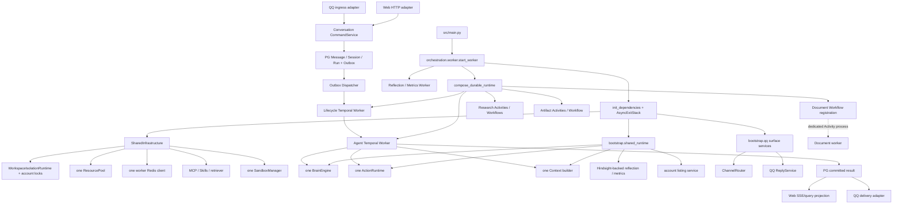

# W4-C — Architecture Consolidation Closure Report

## 1. Audited HEAD and worktree

- Branch: `feat/hpagent-web`
- Git HEAD: `2bcf4c0da707bd3bb98c9bd94b86a59f1311873c`
- Closure judgment applies to that HEAD plus the uncommitted W4-A/W4-B/W4-C implementation
  worktree audited on 2026-09-17 (Asia/Shanghai).
- The pre-existing user modification to
  `artifacts/architecture-audit/phase2_1/03_architecture_truth_table.md` was preserved and was not
  used as current architecture authority.
- Historical Phase 2.2 and earlier Phase 3 reports were not rewritten.
- W5, W6 and W7 were not entered.

## 2. Evidence reviewed

The following were read as required:

1. `W4_A_composition_ownership_audit.md` — the authoritative W4 defects, target ownership model,
   implementation plan, risks and G02 closure requirements.
2. `W4_B_implementation_report.md` — the implementation claims to verify independently.
3. `W3_E_implementation_report.md` — W3/G05 closure, retained capability registry, fresh-install
   evidence and the three items deferred into W4.
4. Phase 2.2 `02_target_boundaries.md` and `03_delivery_sequence_and_gates.md` — historical target
   decisions and W4/G02 exit conditions.

Current source, direct constructors/callers, AST/import searches, live registry capture, focused
tests, isolated integration, and fresh production entrypoint startup were used rather than accepting
the W4-B report as proof.

## 3. Final composition and ownership graph

Construction/caller inspection found exactly one worker-process constructor for each of
`ResourcePool`, `WorkspaceIsolationRuntime`, `SandboxManager`, `BrainEngine`, and `ActionRuntime`.
`BrainEngine` and `ActionRuntime` are constructed only in `bootstrap/shared_runtime.py`.
`bootstrap/qq.py` constructs only router/reply presentation services and has no model, Action,
memory, Session, Workflow or Agent-loop constructor.

Research, Artifact and Document remain independently owned capabilities registered by durable
orchestration; they share intended infrastructure but were not folded into Agent strategy logic.
The dedicated Document Activity process remains a deliberate process boundary.

## 4. Dependency-direction validation

### PASS evidence

- AST/import scans found no capability-to-bootstrap edge in Actions, Brain, Agent Activities or
  Memory.
- Application, Conversation Domain and Web Domain do not import bootstrap.
- Shared Agent packages do not import NapCat, Official QQ, Web API, SSE or HTTP presentation.
- Only the composition root imports both shared and QQ bootstrap modules.
- Web API constructs `CommandService` and projections only; it does not construct Brain, Actions,
  Sandbox, execution leases, Agent Workflows or Temporal Agent Workers.
- QQ normalization/ingress constructs protocol identity and routes commands through
  `SurfaceConversationCommands`/`CommandService`; committed delivery is separate from execution.
- Repository-wide searches across `src`, `test`, `scripts`, configuration and Compose found no
  removed `build_qq_runtime`, `compose_web_workers`, global Activity/scheduler injection API,
  `reset_turn`, or `clear_session` caller.
- The W3 authority scan reports no retired import, definition, registry type, state owner or
  canonical reachability.

### Accepted narrow edges

- `application.reply` consumes `channels.router` because it is explicitly QQ presentation behavior,
  as classified by W4-A.
- Reminder factories live under the local-tool adapter and consume the named application scheduler
  capability supplied at construction. Core ActionRuntime and Sandbox ownership do not construct or
  globally locate that scheduler.
- `orchestration.worker` imports surface bootstrap modules because it is the process composition
  root; neither surface owns the shared runtime.

No circular composition owner or duplicate Agent runtime was found.

## 5. Protocol validation

### ActionRuntime — PASS

- `ActionCapability` lives in `actions.contracts`; `DurableAgentActivities` imports that canonical
  owner and uses `reset_execution`, `select_tools`, `execute_request` and `clear_execution`.
- Every production call supplies the source binding's resource key plus `request.run_id`.
- Empty resource/execution identities are rejected before Sandbox access.
- Cache keys are `(resource_key, execution_id)` tuples; two executions sharing one resource do not
  share mutable tool-selection state.
- Integration and focused tests preserve stable invocation/idempotency keys, provider idempotency
  argument injection, side-effect classification, reconciliation, budget reservation/settlement,
  tool failure shaping and result summarization.
- No canonical or auxiliary caller requires the removed session-only behavior.

### Brain and Activities — PASS

- `BrainCapability` lives in `brain.contracts` and expresses only the model operations consumed by
  durable Activities.
- Lifecycle, Artifact and scheduled-memory Activity dependencies are instance-owned bound methods.
- Activity names remain exactly `prepare_run_activity`, `load_agent_run_input_activity`,
  `finalize_failed_activity`, `finalize_cancelled_activity`,
  `execute_artifact_build_activity`, `reflect_activity`, `reflect_batch_activity`, and
  `metrics_report_activity`.
- Two simultaneously constructed scheduled Activity collections retain independent collaborators;
  there is no process-global overwrite path.

### Context/profile boundary — PASS

- QQ ingress records `qq_private` or `qq_group` as semantic origin metadata.
- Web source selection yields `web_chat` or `web_plan` from the existing strategy without changing
  admission or idempotency.
- `HarnessContextBuilder` accepts `interaction_profile`; it has no `ChannelType`, NapCat/Official QQ
  inspection, channel override, transport detector, or profile-to-transport conversion.
- Context events keep source display facts in metadata and do not expose transport fields in the
  message content consumed by the model.
- Normalized private/group scope and group identity remain separate memory-isolation facts.
- Regression coverage now explicitly verifies all four profiles and the bounded legacy persisted
  origin mapping. That legacy selector is outside the core builder and exists only to preserve
  already-stored Run personality.

## 6. Resource ownership and shutdown validation

| Resource | Intended construction / owner | Closure evidence | Result |
| --- | --- | --- | --- |
| API PostgreSQL pool | One API lifespan pool; second pool only for explicitly enabled development fake executor | Lifespan `AsyncExitStack`; startup-failure pool-close test; fresh API readiness | PASS |
| Worker PostgreSQL | DSN with transaction-scoped `UnitOfWork` connections | Real disposable PG integration; no long-lived worker pool duplication | PASS |
| Worker/API Redis | One per process/composition | Immediate async cleanup registration; publisher stops before API Redis; worker stack closes Redis | PASS |
| Hindsight | One shared capability reference; scoped HTTP clients per call | No process-long socket owner; recall/retention integration and degradation tests | PASS |
| ResourcePool/models | One worker `ResourcePool`; model clients scoped by provider calls | Constructor scan and shared use by Brain, Actions, Research, Artifact | PASS |
| Temporal | One main client feeding three worker contexts; one dedicated Document-process client | Worker async contexts own poller shutdown; fresh poller capture on all queues | PASS |
| Workspace lock | One `WorkspaceIsolationRuntime` per worker process | Cleanup registered immediately after acquisition; startup rollback tests | PASS |
| Sandbox | One `SandboxManager`, per-resource Sandboxes | `close()` destroys all Sandboxes/bindings; direct close test | PASS |
| MCP | One optional manager | Partial startup disconnect plus dependency-stack disconnect | PASS |
| Background loops | One `BackgroundTasks` owner | Partial construction, cancellation and await tests | PASS |

Normal worker shutdown order is now explicit and tested:

1. stop channel ingress and cancel/await scheduler, delivery, dispatcher, recovery, cleanup,
   retention, Artifact and Research background producers;
2. exit Agent, lifecycle and scheduled-memory Temporal Worker contexts;
3. close shared dependencies in reverse acquisition order: Sandboxes, MCP, Redis, workspace lock.

Startup before Worker entry and failures during connection/composition take the shorter safe path:
owned tasks are stopped and the dependency stack is closed. Web API cleanup preserves
fake-Artifact → fake-Run → worker pool and publisher → Redis → API pool ordering.

## 7. Surface-boundary validation

The canonical Chat execution path is confirmed as:

`Web / QQ adapter → CommandService → PG transaction + Outbox → Temporal dispatcher →`
`AgentLifecycleWorkflow → AgentRunWorkflow → ReAct / Plan-and-Execute → shared capabilities →`
`PG committed result → Web projection or QQ delivery`.

- Web owns HTTP, auth, SSE, queries and file presentation; it does not own Agent strategy runtime,
  execution fencing or Temporal Agent orchestration.
- QQ owns provider identity, room/bot/thread routing, mentions/replies, channels and delivery; it
  does not own Conversation/Run authority or a private Agent loop.
- Both surfaces use the same PG admission and Run authority.
- QQ delivery retry reads committed rows and does not re-execute Agent work.
- Execution lease/fencing, strategy and durable wait behavior remain in the canonical data plane and
  Workflows.

## 8. Tests and checks actually executed

| Validation | Result |
| --- | --- |
| Focused W4 composition/protocol/resource/Web/QQ regression | **152 passed**, one existing Starlette/httpx deprecation warning |
| Post-fix profile, Activity isolation and shutdown-order regression | **24 passed** |
| Disposable PostgreSQL + Redis + isolated Temporal integration | **61 passed**, **0 skipped**, 413.32 seconds |
| Full repository collection after final test additions | **700 tests collected**, no import/collection error |
| Current W3 authority + production registry scan | **PASS** |
| Ruff on all W4-changed production/tests and updated audit callers | **PASS** |
| `compileall` for source/tests/updated audit scripts | **PASS** |
| `git diff --check` | **PASS** |
| Phase 2.2 unchanged check | **PASS** |
| `docker compose config --quiet` | **PASS** |

The real integration set covered QQ canonical ingress/dedup/context, Web and QQ canonical durable
execution, Outbox → Temporal, lifecycle completion/failure/cancellation, ReAct and
Plan-and-Execute, wait/reacquire/fencing, worker kill/redelivery, tool approval, QQ committed
delivery, memory retention, Artifact workflow and non-Chat source execution.

Current registry capture passed with:

| Queue | Workflows | Activities |
| --- | ---: | ---: |
| `hpagent-web-lifecycle` | 5 | 22 |
| `hpagent-web-agent` | 5 | 11 |
| `hpagent-task-queue` | 2 | 3 |
| `hpagent-document` | 0 | 1 |

Because W4 changed production bootstrap/lifespan code, the affected images were rebuilt rather than
relying only on W3-E:

- API image: `sha256:85af10dd5cd8fc38f334c740b53db82639c9b14d8a8f53252f8e4d1f0619f2a0`
- Worker image: `sha256:d73c186d41a1566eedc46d8de36a03bcf50489b5c6b60be9d01e896e7ea92a7a`

Migration and Document images were unchanged and reused from W3-E. An isolated fresh-start probe
then ran dependency checks for all four images, applied all 36 repository migrations to a fresh
database, reached API `/health/ready`, and observed one live poller for each required Workflow and
Activity queue (seven poller checks total). Existing application services and data were not used or
modified. No unrelated benchmark suite was run.

## 9. W4-C fixes

Two closure blockers were found and fixed with bounded changes:

1. **Shutdown ordering:** W4-B originally let Temporal Worker contexts exit before channel and
   background producers. `start_worker` now stops and awaits producers inside the Worker context,
   then drains Workers, then closes shared dependencies. An ordered cancellation test proves the
   sequence.
2. **Stale audit callers:** `audit_w3b_runtime.py` and `audit_w3c_authority.py` still referenced
   removed W4 symbols and the flat dependency bag. They now call `compose_durable_runtime`, use the
   nested dependency shape and inspect `build_qq_surface_services`. The current authority/registry
   scan passes.

Additional closure assertions cover all interaction profiles, legacy origin behavior, independent
Activity collections, Sandbox close-all, API startup rollback and worker initialization rollback.

## 10. DEFER_POST_PHASE3

The following are future work and are not W4 blockers:

- W5 Model Input Snapshot/Review and its authorization/UI work.
- W6 Workspace Query APIs/projections and optional later worktree evolution.
- W7 broader File/MCP/capability restructuring and dependency-maintenance work.
- Historical package/class names such as `HarnessContextBuilder` where ownership is already clear.
- Replacing unrelated collaborator `Any` annotations with a comprehensive protocol hierarchy.
- Retiring the bounded legacy-origin profile selector after no retained pre-W4 Run needs it.
- Replacing transaction-scoped worker PostgreSQL connections with a pool; this is an optimization,
  not an ownership correction.
- Moving application-facing local tools into a new package solely for directory aesthetics.

## 11. W4 judgment

**W4 PASS / G02 PASS.**

The audited worktree has one canonical runtime composition, surface-only adapters, canonical
protocol owners, no migration wrapper path, correct shared caller binding, one intended worker copy
of pool/locks/Sandbox/Brain/Actions, failure-atomic startup, and deterministic normal/cancellation
shutdown. Product behavior is preserved by focused and real integration validation.

## 12. Phase 3 Architecture Consolidation judgment

**Phase 3 Architecture Consolidation CLOSED.**

W1 and W2 supplied the durable source-neutral execution and shared Web/QQ domain path; W3/G05
retired the non-target implementations; W4/G02 now closes composition, protocols and ownership.
The deferred W5/W6/W7 packages are future feature/capability work and do not prevent Phase 3
closure under the frozen W4 contract.

No W4 or Phase 3 closure blocker remains.
