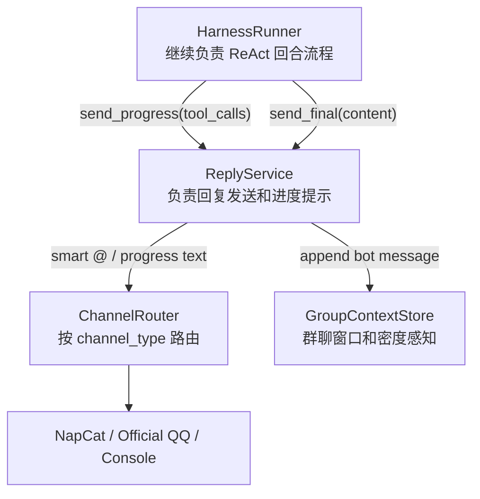

# 架构改进进度 01：ReplyService / ProgressNotifier

> 日期：2026-07-07  
> 阶段：P1  
> 状态：已完成代码改造，待运行完整回归  
> 上一阶段：`00_overview_and_stage_plan.md`

---

## 本阶段目标

本阶段把“怎么说出去”从 `HarnessRunner` 中拆出来，交给新的应用服务 `ReplyService`。

改造前，`HarnessRunner` 像一个既会思考、又会调工具、还会拿喇叭喊话的万能导演。它不仅决定模型下一步要不要调用工具，还亲自处理：

- 最终回复发送。
- 群聊智能 @。
- 工具调用期间的进度提示。
- bot 自己发出的群消息写回群聊上下文。
- 工具 hint 配置加载。

改造后，`HarnessRunner` 不再亲自说话，只把内容交给 `ReplyService`。

---

## 修改前样貌

```text
HarnessRunner
  ├─ process_turn()
  │   ├─ 召回记忆
  │   ├─ 构建上下文
  │   ├─ 调模型
  │   ├─ 选择工具
  │   ├─ 执行工具
  │   ├─ 发送工具进度提示
  │   ├─ 发送最终回复
  │   └─ 留存记忆
  │
  ├─ _maybe_send_tool_hints()
  ├─ _load_tool_hints()
  ├─ _get_tool_hint()
  └─ _send_response()
      ├─ 群聊智能 @
      ├─ ChannelRouter.send()
      └─ bot 消息写回 group context
```

形象一点：大脑一边推理，一边跑去前台广播，还要记得群里什么时候该 @ 人。

---

## 修改后样貌



现在角色更清楚：

- `HarnessRunner`：导演，安排一轮对话怎么走。
- `ReplyService`：发言人，负责把话说出去。
- `ChannelRouter`：扩音器选择器，决定从哪个渠道发。
- `GroupContextStore`：群聊气氛记录员，判断群里是否热闹、是否要少插话。

---

## 迁移职责

| 职责 | 修改前 | 修改后 |
|---|---|---|
| 最终回复发送 | `HarnessRunner._send_response()` | `ReplyService.send_final()` |
| 工具进度提示 | `HarnessRunner._maybe_send_tool_hints()` | `ReplyService.send_progress()` |
| 工具 hint 加载 | `HarnessRunner._load_tool_hints()` | `ReplyService._load_tool_hints()` |
| 群聊智能 @ | `HarnessRunner._send_response()` | `ReplyService._format_group_mention()` |
| bot 消息写回群窗口 | `HarnessRunner._send_response()` | `ReplyService._append_bot_group_context()` |
| 渠道路由调用 | `HarnessRunner -> ChannelRouter` | `ReplyService -> ChannelRouter` |

---

## 代码改动

新增：

```text
src/application/__init__.py
src/application/reply.py
```

修改：

```text
src/harness/runner.py
src/orchestration/worker.py
```

关键变化：

- `HarnessRunner` 新增可选构造参数 `reply_service`。
- `worker.py` 在组装依赖时创建 `ReplyService`，并注入 `HarnessRunner`。
- `HarnessRunner.process_turn()` 中：
  - 工具进度提示改为 `self._reply.send_progress(...)`。
  - 最终回复改为 `self._reply.send_final(...)`。
- `HarnessRunner` 删除原有 `_send_response()`、`_maybe_send_tool_hints()`、`_load_tool_hints()`、`_get_tool_hint()`。

---

## 行为保持清单

本阶段应该保持以下行为不变：

- 私聊仍然直接发送最终回复。
- 群聊只有在已有多个活跃 session 订阅同一 group 时，才智能 @ 原用户。
- 群聊低密度时，工具调用仍可发送进度提示。
- 群聊高密度时，不发送工具进度提示，避免刷屏。
- bot 自己发出的群消息仍写回 group context。
- ChannelRouter 仍然是最终发送入口。
- `HarnessRunner` 构造仍保留 `channel_router` 参数，降低调用方迁移风险。

---

## 当前组件样貌

```text
Temporal Activity
  ↓
HarnessRunner
  ├─ 继续管理一轮 ReAct Loop
  ├─ 调用 ResourcePool
  ├─ 调用 SandboxManager / Sandbox
  ├─ 调用 SessionStore
  └─ 调用 ReplyService
       ├─ 处理群聊 @ 和进度提示
       ├─ 调用 ChannelRouter
       └─ 写回 bot 群消息上下文
```

这一步之后，`HarnessRunner` 还没有变成纯 Brain，但它已经少了一只“拿喇叭的手”。

---

## 验证结果

本阶段已做静态检查：

```text
python3 -m py_compile
```

需要在后续环境中继续做完整行为回归：

- 私聊普通问答。
- 群聊 @bot 回复。
- 群聊非 @ 消息不触发回复。
- 工具调用期间进度提示。
- 多人同时问 bot 时智能 @。

---

## 下一阶段接力点

下一阶段建议进入 P2：`MessageIngressService / ConversationService`。

也就是把 `worker.handle_message()` 中的入站业务逻辑拆出去，让 `worker.py` 从“门口总管”退回“运行时宿主”：

```text
worker.py
  只负责启动、注册、监听、关闭

MessageIngressService
  负责群聊上下文和 @ 过滤

ConversationService
  负责 account、workflow、session、workspace、sandbox 准备
```

形象一点：P1 让大脑不用亲自喊话；P2 要让门口总管不用亲自搭舞台。
