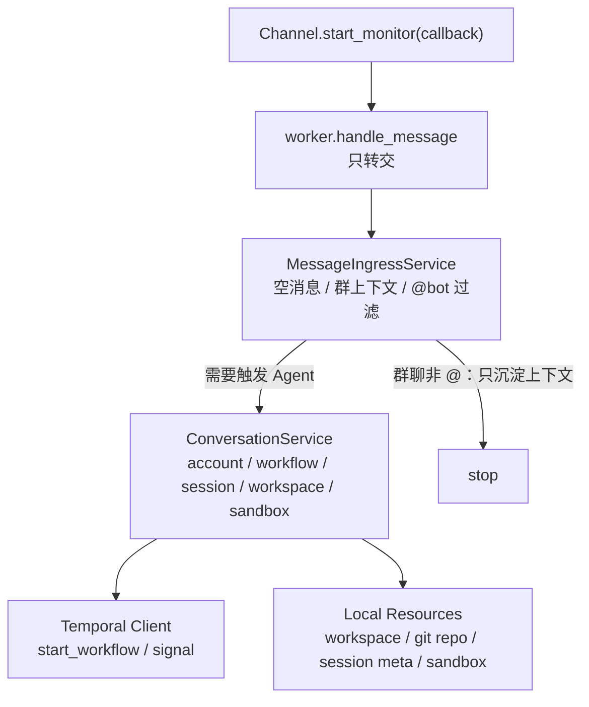

# 架构改进进度 02：MessageIngressService / ConversationService

> 日期：2026-07-07  
> 阶段：P2  
> 状态：已完成代码改造，待运行完整回归  
> 上一阶段：`01_reply_service.md`

---

## 本阶段目标

本阶段把 `worker.handle_message()` 中的大段入站业务逻辑拆出，交给两个应用服务：

- `MessageIngressService`：负责“门口接待”，判断消息要不要触发 Agent。
- `ConversationService`：负责“会话管家”，处理账号、workflow、session、workspace、sandbox。

改造目标不是改变行为，而是让 `worker.py` 回到它该有的位置：启动 Temporal Worker、注册渠道、维护运行时生命周期。

---

## 修改前样貌

```text
worker.py
  ├─ 组装所有依赖
  ├─ 注册 Temporal workflow/activity
  ├─ 注册渠道
  ├─ handle_message()
  │   ├─ 空消息过滤
  │   ├─ 群聊上下文写入
  │   ├─ 非 @bot 消息过滤
  │   ├─ account_id 解析
  │   ├─ workflow_id / session_id 生成
  │   ├─ Temporal start_workflow
  │   ├─ WorkflowAlreadyStarted 后 signal
  │   ├─ workspace / git repo / session 初始化
  │   ├─ sandbox 创建或重建
  │   └─ replacement session 兜底
  └─ shutdown cleanup
```

形象一点：`worker.py` 原来像一个门口总管。用户刚进门，它既要判断是不是该接待，又要查会员卡、开房间、搭舞台、分配工具间，甚至还要处理旧会话没结束的特殊情况。

---

## 修改后样貌



现在角色更清楚：

- `worker.py`：舞台电源和调度台，负责启动与关闭。
- `MessageIngressService`：门口接待，决定这条消息是不是要进入剧场。
- `ConversationService`：会话管家，负责开场、续场、补场。
- Temporal：时间和状态编排。
- workspace/sandbox：为本场会话准备的工作间。

---

## 迁移职责

| 职责 | 修改前 | 修改后 |
|---|---|---|
| 空消息过滤 | `worker.handle_message()` | `MessageIngressService.handle()` |
| 群聊上下文写入 | `worker.handle_message()` | `MessageIngressService._capture_group_context()` |
| 非 @bot 群消息过滤 | `worker.handle_message()` | `MessageIngressService._capture_group_context()` |
| account_id 解析 | `worker.handle_message()` | `ConversationService.start_or_signal()` |
| session_id 生成 | `worker.handle_message()` | `ConversationService.start_or_signal()` / `_start_replacement_session()` |
| Temporal start_workflow | `worker.handle_message()` | `ConversationService.start_or_signal()` |
| 已有 workflow signal | `worker.handle_message()` | `ConversationService._signal_existing_or_replace()` |
| sandbox 重建 | `worker.handle_message()` | `ConversationService._signal_existing_or_replace()` |
| workspace/git/session 初始化 | `worker.handle_message()` | `ConversationService._prepare_session_resources()` |
| replacement session | `worker.handle_message()` | `ConversationService._start_replacement_session()` |

---

## 代码改动

新增：

```text
src/application/ingress.py
src/application/conversation.py
```

修改：

```text
src/orchestration/worker.py
```

关键变化：

- `worker.py` 导入并组装 `ConversationService` 和 `MessageIngressService`。
- `worker.handle_message()` 现在只剩：

```python
async def handle_message(message: UnifiedMessage) -> None:
    await ingress_service.handle(message)
```

- `MessageIngressService` 保留原来的群聊上下文写入和非 @bot 过滤行为。
- `ConversationService` 保留原来的 Temporal start/signal/replacement session 逻辑。

---

## 行为保持清单

本阶段应该保持以下行为不变：

- 空消息直接忽略。
- 群聊消息无论是否 @bot，都先写入群短期上下文。
- 群聊非 @bot 消息只沉淀上下文，不触发 Agent。
- 私聊消息直接进入会话处理。
- 新用户消息先尝试 `start_workflow`，成功后才初始化本地资源，避免幽灵 session。
- 已运行 workflow 通过 query 获取 session_id，再 signal `new_message`。
- Worker 重启导致 sandbox 内存丢失时，signal 前尝试重建 sandbox。
- signal 失败时，创建 replacement session 并使用 `ALLOW_DUPLICATE` 启动新 workflow。

---

## 当前组件样貌

```text
Channel
  ↓
worker.handle_message()
  ↓
MessageIngressService
  ├─ 空消息：丢弃
  ├─ 群聊非 @：写上下文后停止
  └─ 需要回复：交给 ConversationService
        ↓
        ConversationService
          ├─ 解析 account_id
          ├─ start_workflow / signal
          ├─ 准备 workspace 和 git repo
          ├─ 初始化 session meta
          └─ 创建或重建 sandbox
```

这一步之后，`worker.py` 从“门口总管”退回了“运行时宿主”。它还负责启动和生命周期，但不再亲自处理每条消息背后的业务细节。

---

## 验证结果

本阶段已做静态检查：

```text
PYTHONPATH=/home/hp/workspace/HpAgent/src python3 -m py_compile \
  src/application/ingress.py \
  src/application/conversation.py \
  src/orchestration/worker.py
```

需要在后续环境中继续做完整行为回归：

- 群聊非 @ 消息只写上下文。
- 群聊 @bot 启动新 workflow。
- 私聊启动新 workflow。
- 已有 workflow 被 signal。
- workflow 结束竞态时 replacement session 正常启动。
- Worker 重启后已有 session 可重建 sandbox。

---

## 下一阶段接力点

下一阶段建议进入 P3：`ActionRuntime facade`。

P1 让 `HarnessRunner` 不再亲自说话。  
P2 让 `worker.py` 不再亲自搭舞台。  
P3 要让 `HarnessRunner` 不再直接摸 `SandboxManager`，而是通过一个更干净的行动入口：

```text
HarnessRunner / TurnOrchestrator
  -> ActionRuntime.select_tools()
  -> ActionRuntime.execute()

ActionRuntime
  -> SandboxManager
  -> Sandbox
  -> ToolResultSummarizer
```

形象一点：下一步要给工具间加一个柜台。大脑只需要说“我要用工具”，不用自己去找哪把钥匙开哪扇门。
