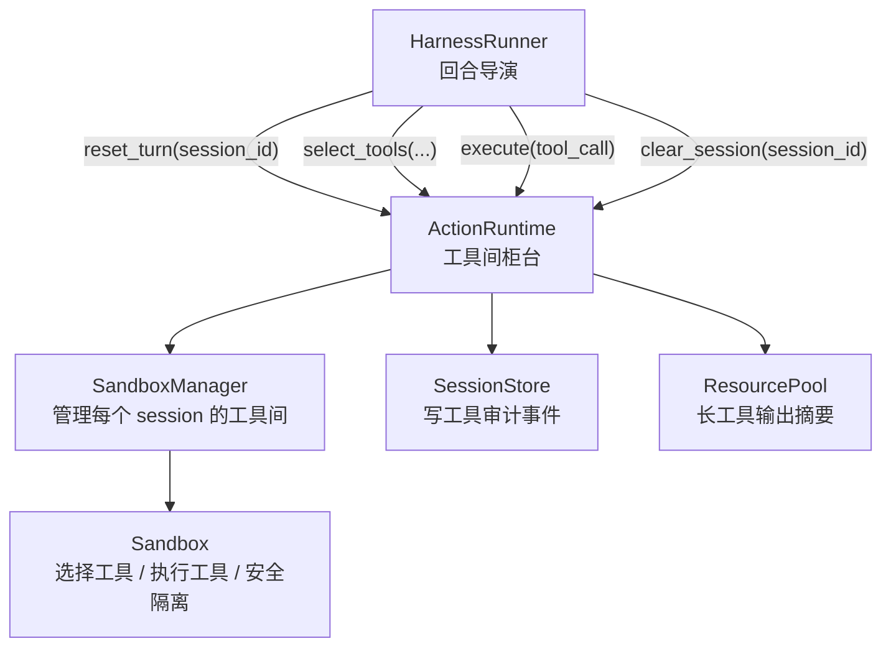

# 架构改进进度 03：ActionRuntime facade

> 日期：2026-07-07  
> 阶段：P3  
> 状态：已完成代码改造，待运行完整回归  
> 上一阶段：`02_ingress_and_conversation_service.md`

---

## 本阶段目标

本阶段给工具间加一个“柜台”：`ActionRuntime`。

改造前，`HarnessRunner` 虽然已经把真正执行交给 `Sandbox`，但它仍然亲自处理很多工具周边细节：

- 拼接工具 RAG 查询。
- 做 session 级工具列表缓存。
- 直接找 `SandboxManager.get_sandbox_for_session()`。
- 调 `Sandbox.select_tools()`。
- 调 `Sandbox.execute()`。
- 写 `TOOL_RETRIEVAL` 审计事件。
- 对长工具输出做 fast 模型摘要。
- 写 `TOOL_SUMMARY` 审计事件。
- 会话归档时清理工具缓存。

这些都更像“行动运行时”的职责，不应该继续堆在回合导演 `HarnessRunner` 里。

---

## 修改前样貌

```text
HarnessRunner
  ├─ 组织 ReAct Loop
  ├─ 拼接 RAG query
  ├─ 维护 tools cache
  ├─ SandboxManager.get_sandbox_for_session()
  ├─ Sandbox.select_tools()
  ├─ 写 TOOL_RETRIEVAL 事件
  ├─ Sandbox.execute()
  ├─ 对工具结果做摘要
  ├─ 写 TOOL_SUMMARY 事件
  └─ 归档时清理 tools cache
```

形象一点：导演不只安排剧情，还亲自跑进工具间找钥匙、开柜子、拿工具、记账、写摘要。

---

## 修改后样貌



现在角色更清楚：

- `HarnessRunner`：只知道“这一轮需要工具列表”和“这个工具调用要执行”。
- `ActionRuntime`：负责工具选择、执行、审计、摘要、缓存。
- `SandboxManager`：负责找到 session 对应的 sandbox。
- `Sandbox`：负责真正的工具选择和安全执行。

---

## 迁移职责

| 职责 | 修改前 | 修改后 |
|---|---|---|
| 清理上一轮 tool hints | `HarnessRunner` 直接拿 sandbox reset | `ActionRuntime.reset_turn()` |
| 拼接群聊上下文到工具 RAG query | `HarnessRunner._get_tools()` | `ActionRuntime._build_rag_query()` |
| 工具列表缓存 | `HarnessRunner._tools_cache` | `ActionRuntime._tools_cache` |
| 工具选择 | `HarnessRunner._get_tools()` | `ActionRuntime.select_tools()` |
| 工具检索审计事件 | `HarnessRunner._get_tools()` | `ActionRuntime.select_tools()` |
| 工具执行 | `HarnessRunner._execute_tool()` | `ActionRuntime.execute()` |
| 长工具输出摘要 | `HarnessRunner._summarize_if_needed()` | `ActionRuntime._summarize_if_needed()` |
| 工具摘要审计事件 | `HarnessRunner._summarize_if_needed()` | `ActionRuntime._summarize_if_needed()` |
| 归档时清理工具缓存 | `HarnessRunner._tools_cache.pop()` | `ActionRuntime.clear_session()` |

---

## 代码改动

新增：

```text
src/actions/__init__.py
src/actions/runtime.py
```

修改：

```text
src/harness/runner.py
src/orchestration/worker.py
```

关键变化：

- `worker.py` 组装 `ActionRuntime`，并注入 `HarnessRunner`。
- `HarnessRunner` 新增可选构造参数 `action_runtime`。
- `HarnessRunner.process_turn()` 中：
  - `self._actions.reset_turn(session_id)`
  - `self._actions.select_tools(...)`
  - `self._actions.execute(...)`
- `HarnessRunner.archive_session()` 中：
  - `self._actions.clear_session(session_id)`
- `HarnessRunner` 删除原有 `_get_tools()`、`_execute_tool()`、`_summarize_if_needed()` 和 `_tools_cache`。

---

## 行为保持清单

本阶段应该保持以下行为不变：

- 工具 RAG 查询仍以用户问题为主。
- 群聊时仍拼接最近 3 条群消息参与工具检索。
- 同 session 同 user_content 仍复用工具列表缓存。
- 工具检索仍写入 `TOOL_RETRIEVAL` 审计事件。
- 工具执行仍通过 `Sandbox.execute()`，Bash 安全隔离不变。
- 长工具输出仍按配置走 fast 模型摘要。
- 工具摘要仍写入 `TOOL_SUMMARY` 审计事件。
- 会话归档时仍清理工具缓存。

---

## 当前组件样貌

```text
Temporal Activity
  ↓
HarnessRunner
  ├─ 组织 ReAct Loop
  ├─ 调 ResourcePool 生成模型回复
  ├─ 调 ActionRuntime 处理工具
  ├─ 调 ReplyService 发送回复
  └─ 调 SessionStore 做记忆和归档

ActionRuntime
  ├─ reset_turn()
  ├─ select_tools()
  ├─ execute()
  ├─ summarize_if_needed()
  └─ clear_session()

Sandbox
  ├─ select_tools()
  └─ execute()
```

这一步之后，`HarnessRunner` 不再亲自摸 `SandboxManager`。它还不是纯 Brain，但已经更像“回合导演”：知道什么时候需要工具，但不再亲自进工具间找钥匙。

---

## 验证结果

本阶段已做静态检查：

```text
PYTHONPATH=/home/hp/workspace/HpAgent/src python3 -m py_compile \
  src/actions/runtime.py \
  src/harness/runner.py \
  src/orchestration/worker.py
```

已做项目虚拟环境导入检查：

```text
imports ok
```

需要在后续环境中继续做完整行为回归：

- 无工具普通问答。
- 单工具调用。
- 多轮工具调用。
- 工具 RAG 缓存命中。
- 群聊上下文参与工具检索。
- 长工具输出摘要。
- Bash 工具仍经过 nsjail。

---

## 下一阶段接力点

下一阶段建议进入 P4：`BrainEngine + TurnOrchestrator`。

P1 让 `HarnessRunner` 不再亲自说话。  
P2 让 `worker.py` 不再亲自搭舞台。  
P3 让 `HarnessRunner` 不再亲自找工具间。  

P4 要开始拆最核心的一层：把“流程导演”和“脑内思考”分开。

目标形态：

```text
TurnOrchestrator
  ├─ MemoryService.recall()
  ├─ BrainEngine.next_step()
  ├─ ActionRuntime.execute()
  ├─ BrainEngine.finalize()
  ├─ MemoryService.retain()
  └─ ReplyService.send()

BrainEngine
  ├─ HyDE 查询改写
  ├─ 调用 ResourcePool
  └─ 产出 ModelResponse / ToolCall / FinalAnswer
```

形象一点：P4 要让导演和参谋分开坐。导演管流程，参谋管思考。
