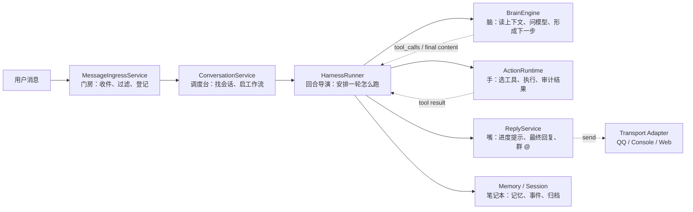

# P4：BrainEngine 与回合调度员

> 本阶段目标：把“脑内推理”从 `HarnessRunner` 中显式分离出来，让 Runner 逐步退回到回合调度员的位置。

## 这一阶段要解决什么

P1 到 P3 已经把三块外围职责拆出去了：

- `ReplyService` 负责把话说出去，不再让大脑亲自发 QQ/Console/Web 消息。
- `MessageIngressService` / `ConversationService` 负责消息入站和会话工作流，不再让 worker 像总控脚本一样越长越宽。
- `ActionRuntime` 负责选工具、执行工具、审计工具结果，成为真正的“手”。

但 `HarnessRunner` 里还剩一块很核心的职责：它仍然直接调用模型，做 HyDE 召回改写、主对话生成、无最终回答时的兜底生成、模型输入快照。

这部分更像“脑”的内在活动，应该被一个更窄的组件承接。

## 新增组件

```text
src/brain/
  ├── __init__.py
  └── engine.py
```

`BrainEngine` 的边界很克制：

```text
BrainEngine
  ├─ rewrite_recall_query()   # 把用户输入改写成更适合记忆召回的问题
  ├─ generate_chat()          # 根据上下文和工具说明请求聊天模型
  ├─ generate_final()         # 没有自然 final 时生成兜底回复
  └─ snapshot_context()       # 记录模型输入快照，方便事后回放和审计
```

它明确不做这些事：

- 不发消息。
- 不创建 sandbox。
- 不执行工具。
- 不启动 workflow。
- 不管理 workspace。
- 不决定 QQ 群消息是否应该响应。

换句话说，它只负责“想”，不负责“动手”，也不负责“把话递出去”。

## 改进后的样貌



可以把一轮对话想成一次小型剧场：

- `MessageIngressService` 是门房：先判断这张票是不是该进场。
- `ConversationService` 是调度台：找到对应剧场和场次。
- `HarnessRunner` 是导演：这一轮先让谁上场、什么时候切换、什么时候收尾。
- `BrainEngine` 是演员的脑内独白：看剧本、思考、决定下一句台词或下一步动作。
- `ActionRuntime` 是舞台机械和道具组：真正拉幕、搬道具、查资料、跑命令。
- `ReplyService` 是扩音和字幕：把最终话术用正确渠道送出去。

## 接线策略

为了降低风险，本阶段不急着把 `HarnessRunner` 物理重命名为 `TurnOrchestrator`。

原因很简单：Temporal Activity、worker 依赖注入、已有文档和测试可能都认识 `HarnessRunner` 这个名字。直接重命名会产生大量机械改动，容易把“架构边界变清楚”这件事淹没在导入路径调整里。

所以 P4 的策略是：

```text
类名先保留 HarnessRunner
职责先变成 TurnOrchestrator
```

后续等边界稳定，再做一次低风险的命名迁移。

## 当前落地状态

- 已新增 `src/brain/engine.py`，定义 `BrainEngine`。
- 已新增 `src/brain/__init__.py`，暴露 brain 包入口。
- `HarnessRunner.__init__()` 已支持注入 `brain_engine: Optional[BrainEngine]`。
- HyDE 召回改写已迁移到 `self._brain.rewrite_recall_query(...)`。
- 主循环中的聊天模型调用已迁移到 `self._brain.generate_chat(...)`。
- 工具轮次耗尽后的兜底 final 生成已迁移到 `self._brain.generate_final(...)`。
- 模型输入快照已迁移到 `self._brain.snapshot_context(...)`。
- `worker.py` 已在依赖组装阶段创建并注入 `BrainEngine`。

## 完成后的收益

完成本阶段后，组件边界更像真正的手脑分离：

```text
BrainEngine 只问模型
ActionRuntime 只动工具
ReplyService 只发回复
ConversationService 只管会话入站
HarnessRunner 只编排一轮
```

这时如果未来要做多 Agent、Web 渠道、不同模型策略、或者工具执行审计，改动会更容易落在对应组件里，而不是继续堆进一个越来越宽的 Runner。


## 验证结果

- `py_compile` 已通过：`src/brain/engine.py`、`src/harness/runner.py`、`src/orchestration/worker.py`。
- 导入检查已通过：`brain.engine`、`actions.runtime`、`application.ingress`、`application.conversation`、`application.reply`、`harness.runner`、`orchestration.worker`。
- 未运行完整端到端流程；该流程依赖 Temporal、Redis、实际渠道连接和模型配置。

## 下一阶段接力点

P5 建议处理 `sandbox/channels/` 的概念迁移。代码可以先做兼容层：新增 `src/channels/` 作为正式 transport 包，再让旧 `sandbox.channels.*` 逐步转发，避免一次性打断现有 import。
