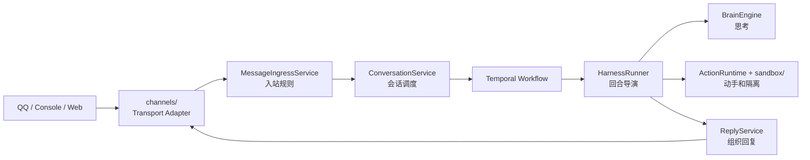

# P5：Channels Transport Layer

> 本阶段目标：把消息渠道从 `sandbox/` 概念里拿出来，建立正式的 `channels/` transport 包。

## 本阶段目标

P1 到 P4 已经让 `HarnessRunner` 逐步瘦身：回复、入站、工具执行、模型推理都被拆到了更合适的位置。

P5 处理的是一个更“命名即架构”的问题：

```text
工具执行属于 sandbox。
QQ / Console / Web 这些消息渠道不属于 sandbox。
```

渠道层做的是协议转换和消息传递：

- 把 QQ / Console / Web 的原始消息转成 `UnifiedMessage`。
- 把系统回复送回对应渠道。
- 隐藏 OneBot、QQ Bot API、stdin/stdout 等协议差异。

它不执行工具，不做安全隔离，也不属于“手”的动作运行时。

## 修改前样貌

```text
src/sandbox/
  ├── sandbox.py
  ├── sandbox_manager.py
  ├── nsjail.py
  ├── tools/
  └── channels/
      ├── base.py
      ├── console.py
      ├── napcat.py
      ├── official_qq.py
      └── router.py
```

这看起来像是：

```text
工具间里放着扳手、隔离笼、执行器，旁边还摆着前台电话和广播喇叭。
```

能用，但认知上会混：后来的人很容易以为“渠道也是 sandbox 的一部分”。

## 修改后样貌

```text
src/
  channels/
    ├── __init__.py
    ├── base.py
    ├── console.py
    ├── napcat.py
    ├── official_qq.py
    └── router.py

  sandbox/
    ├── sandbox.py
    ├── sandbox_manager.py
    ├── nsjail.py
    ├── tools/
    └── channels/        # 兼容层，只做 re-export
```

现在更像这样：

```text
channels/ 是前台窗口：听见外面的声音，把话传进来，再把回复送出去。
sandbox/ 是工具间：拿工具、跑工具、隔离风险、记录结果。
```

## 迁移职责

本阶段没有改渠道行为，只改归属边界：

| 职责 | 修改前 | 修改后 |
|---|---|---|
| 渠道基类 | `sandbox.channels.base` | `channels.base` |
| Console 渠道 | `sandbox.channels.console` | `channels.console` |
| NapCat 渠道 | `sandbox.channels.napcat` | `channels.napcat` |
| Official QQ 渠道 | `sandbox.channels.official_qq` | `channels.official_qq` |
| 渠道路由 | `sandbox.channels.router` | `channels.router` |
| 旧 import | 直接加载实现 | 兼容转发到 `channels.*` |

运行时代码已切到新路径：

```text
application.reply -> channels.router.ChannelRouter
harness.runner -> channels.router.ChannelRouter
orchestration.worker -> channels.napcat / channels.official_qq / channels.router
```

## 行为保持清单

本阶段刻意不做这些改变：

- 不改 `ChannelRouter.send()` 的路由规则。
- 不改 NapCat WebSocket 协议处理。
- 不改 Official QQ 鉴权、事件解析和发送逻辑。
- 不改 ConsoleChannel 的交互逻辑。
- 不删除 `sandbox.channels.*` 旧路径。

原因是 P5 的目标是把门牌换对，不是重新装修整条街。

## 改进后的流程



这条线现在更顺：

```text
外部世界 -> channels -> application -> orchestration -> brain/action -> reply -> channels -> 外部世界
```

`sandbox` 只出现在 action 侧，不再夹在消息入口和回复出口之间。

## 验证结果

- `py_compile` 已通过：`src/channels/*.py`、旧 `src/sandbox/channels/*.py` 兼容层、`reply.py`、`runner.py`、`worker.py`。
- 导入检查已通过：新路径 `channels.*` 和旧路径 `sandbox.channels.*` 都可导入。
- 未运行端到端渠道连接；该流程依赖 NapCat/Official QQ/Console 的实际运行环境。

## 下一阶段接力点

P6 可以开始考虑更细的 Turn 边界：把 `HarnessRunner` 物理重命名或新增 `TurnOrchestrator` facade。

建议仍然采用兼容策略：

```text
先新增 TurnOrchestrator 作为正式名称
HarnessRunner 继承或转发 TurnOrchestrator
Temporal Activity 仍可短期注入 HarnessRunner
稳定后再清理旧名
```

这样系统的角色表会更完整：

```text
channels：前台窗口
application：业务接待
orchestration：时间和会话编排
harness / turn：一轮对话导演
brain：思考
actions + sandbox：动手
reply：发言
```
