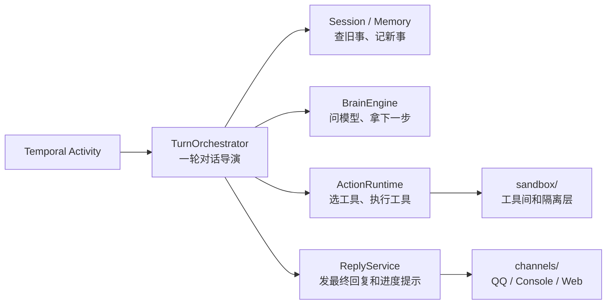

# P6：TurnOrchestrator 命名边界

> 本阶段目标：给已经瘦身后的 `HarnessRunner` 一个更准确的正式名称：`TurnOrchestrator`。

## 本阶段目标

P1 到 P5 之后，原来的 `HarnessRunner` 已经不再像最早那样包办一切：

- 回复发送交给 `ReplyService`。
- 入站和会话调度交给 `MessageIngressService` / `ConversationService`。
- 工具选择和执行交给 `ActionRuntime`。
- 模型推理交给 `BrainEngine`。
- 渠道实现搬到正式的 `channels/` transport 包。

这时继续叫它 `HarnessRunner` 已经有点历史包袱了。它现在真正的角色是：

```text
安排一轮对话怎么跑。
```

所以 P6 把正式类名改成 `TurnOrchestrator`。

## 修改前样貌

```text
harness.runner.HarnessRunner
  ├─ process_turn()
  ├─ archive_session()
  ├─ reflect()
  └─ get_metrics()
```

虽然职责已经变窄，但名字还像旧时代留下来的总控器。

形象一点：演员、道具、灯光、扩音都已经分出去了，可门牌上还写着“万能后台”。

## 修改后样貌

```text
harness.runner.TurnOrchestrator
  ├─ process_turn()
  ├─ archive_session()
  ├─ reflect()
  └─ get_metrics()

harness.runner.HarnessRunner
  └─ 兼容子类，继承 TurnOrchestrator
```

新的角色表更贴切：

```text
TurnOrchestrator：导演，安排一轮对话的节奏
BrainEngine：参谋，负责模型推理
ActionRuntime：工具组，负责选工具和执行工具
ReplyService：发言人，负责把话送出去
ConversationService：调度台，负责找会话和启动工作流
channels：前台窗口，负责接收和发送外部消息
sandbox：工具间，负责隔离和执行
```

## 迁移职责

本阶段没有改变运行行为，只改变正式命名和组装入口。

| 位置 | 修改前 | 修改后 |
|---|---|---|
| 正式类名 | `HarnessRunner` | `TurnOrchestrator` |
| 兼容名称 | 无 | `HarnessRunner(TurnOrchestrator)` |
| worker 组装 | `HarnessRunner(...)` | `TurnOrchestrator(...)` |
| activities 类型 | `Optional[HarnessRunner]` | `Optional[TurnOrchestrator]` |
| harness 包入口 | 只导出 `HarnessRunner` | 同时导出 `TurnOrchestrator` 和 `HarnessRunner` |

`WorkerDependencies.harness_runner` 字段名暂时保留。它像旧路标，还能帮助现有注入链路保持稳定；真正实例已经是 `TurnOrchestrator`。

## 行为保持清单

本阶段刻意保持以下内容不变：

- 不改 `process_turn()` 的签名。
- 不改 Temporal Activity 名称。
- 不改 `inject(harness=...)` 参数。
- 不改 `archive_session()`、`reflect()`、`get_metrics()` 行为。
- 不删除 `HarnessRunner` 导入路径。

原因很简单：这次是把角色牌贴对，不是换舞台地板。

## 改进后的流程



现在读代码时，名字会提醒你：

```text
TurnOrchestrator 不应该亲自问模型细节。
TurnOrchestrator 不应该亲自执行工具。
TurnOrchestrator 不应该亲自处理渠道协议。
TurnOrchestrator 只负责安排这一轮如何推进。
```

## 验证结果

- `py_compile` 已通过：`harness/runner.py`、`harness/activities.py`、`orchestration/worker.py`、`harness/__init__.py`。
- 导入检查已通过：`TurnOrchestrator` 新路径和 `HarnessRunner` 兼容路径都可导入。
- `worker.init_dependencies()` 仍组装并注入同一个能力对象，Temporal Activity 函数名未变。

## 下一阶段接力点

P7 可以考虑清理应用层剩余的历史命名和文档债：

```text
WorkerDependencies.harness_runner -> turn_orchestrator
inject(harness=...) -> inject(turn_orchestrator=...)
旧文档中的 HarnessRunner 描述 -> TurnOrchestrator / 兼容名称说明
```

这一步建议稍后做，因为它会碰到更多引用和文档；P6 先保证正式名称已经站稳，旧名字仍能平稳过渡。
