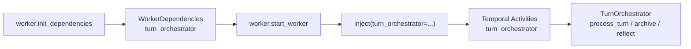

# P7：TurnOrchestrator 路标清理

> 本阶段目标：清理 P6 后剩余的旧命名路标，让 worker 和 activities 的正式调用链统一使用 `turn_orchestrator`。

## 本阶段目标

P6 已经把正式类名从 `HarnessRunner` 改成了 `TurnOrchestrator`，但为了降低风险，保留了两个旧路标：

```text
WorkerDependencies.harness_runner
inject(harness=...)
```

这两个名字还能跑，但读起来会让人误以为系统的正式角色仍然是 HarnessRunner。

P7 的目标是把正式调用链改成：

```text
WorkerDependencies.turn_orchestrator
inject(turn_orchestrator=...)
```

同时保留兼容入口，避免旧调用方立刻失效。

## 修改前样貌

```text
worker.init_dependencies()
  └─ return WorkerDependencies(harness_runner=TurnOrchestrator(...))

worker.start_worker()
  └─ inject(harness=deps.harness_runner)

harness.activities
  └─ _harness.process_turn(...)
```

这有点像办公楼门口已经换了新招牌，内部指示牌却还写着旧部门名。

## 修改后样貌

```text
worker.init_dependencies()
  └─ return WorkerDependencies(turn_orchestrator=TurnOrchestrator(...))

worker.start_worker()
  └─ inject(turn_orchestrator=deps.turn_orchestrator)

harness.activities
  └─ _turn_orchestrator.process_turn(...)
```

兼容层仍保留：

```text
WorkerDependencies.harness_runner  # property alias
inject(harness=...)                # legacy keyword alias
HarnessRunner                      # compatible subclass of TurnOrchestrator
```

所以新代码读起来清楚，旧代码也不会突然摔倒。

## 迁移职责

| 位置 | 修改前 | 修改后 |
|---|---|---|
| WorkerDependencies 字段 | `harness_runner` | `turn_orchestrator` |
| WorkerDependencies 兼容 | 无 | `harness_runner` property |
| Activity 注入参数 | `inject(harness=...)` | `inject(turn_orchestrator=...)` |
| Activity 注入兼容 | 无 | `harness=` legacy keyword |
| Activity 内部变量 | `_harness` | `_turn_orchestrator` |
| worker 启动注入 | `deps.harness_runner` | `deps.turn_orchestrator` |

## 行为保持清单

本阶段只清理命名，不改变业务行为：

- 不改 Temporal Activity 名称。
- 不改 Workflow 调用 Activity 的方式。
- 不改 `process_turn()`、`archive_session()`、`reflect()`、`get_metrics()` 签名。
- 不删除 `HarnessRunner` 兼容类。
- 不删除 `inject(harness=...)` 兼容参数。

## 改进后的流程



现在这条链上的名字终于一致：

```text
组装的是 TurnOrchestrator
保存的是 turn_orchestrator
注入的是 turn_orchestrator
调用的是 _turn_orchestrator
```

## 验证结果

- `py_compile` 已通过：`harness/activities.py`、`orchestration/worker.py`、源码入口文档相关模块。
- 导入检查已通过：`TurnOrchestrator`、`HarnessRunner`、`inject(turn_orchestrator=...)`、`inject(harness=...)`、`WorkerDependencies.harness_runner` 兼容属性。
- 未运行端到端 Temporal 流程；该流程依赖 Temporal 服务、Redis、模型配置和渠道连接。

## 下一阶段接力点

P8 可以考虑从 `TurnOrchestrator` 中继续拆 `MemoryService` / `TurnMemoryPort`。

目前 `TurnOrchestrator` 仍直接知道 `SessionStore` 的不少细节：

```text
append_events()
get_events()
recall_memories()
retain_memories()
archive()
reflect()
get_metrics()
```

下一步如果要更接近 managed hand/brain boundary，可以把“记忆召回、事件记录、长期留存、归档反思”包装成更窄的记忆端口。这样回合导演只说“帮我查旧事 / 记新事”，不用知道记忆仓库里面怎么翻箱子。
