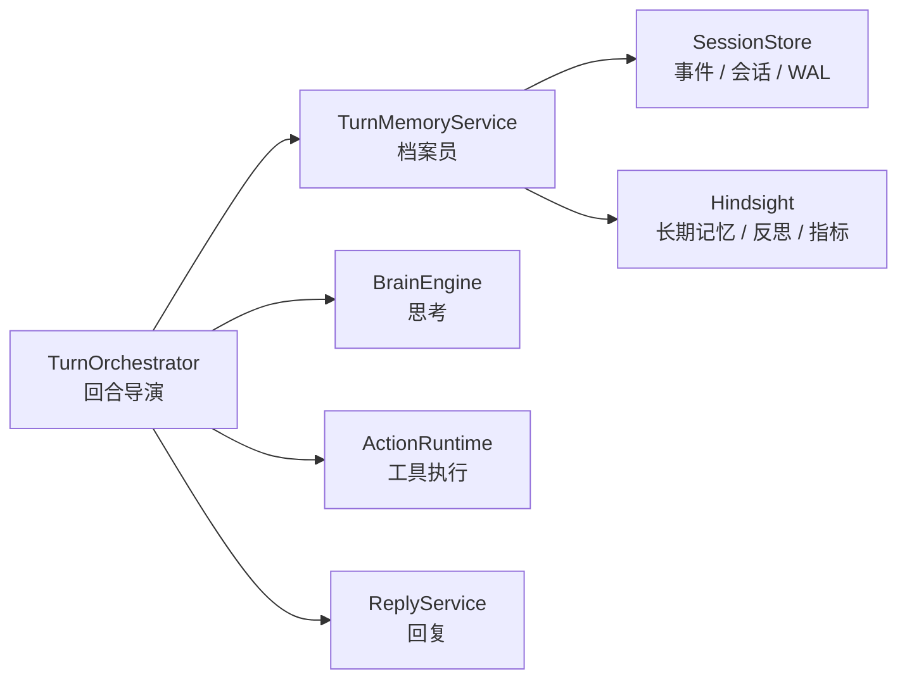

# P8：TurnMemoryService 记忆端口

> 本阶段目标：把 `TurnOrchestrator` 对 `SessionStore` 的直接了解收窄成一个记忆端口：`TurnMemoryService`。

## 本阶段目标

P1 到 P7 之后，回合导演已经不再亲自说话、找工具、问模型、处理渠道，也有了正式名字 `TurnOrchestrator`。

但它还直接知道很多记忆仓库细节：

```text
get_session()
create_session()
append_events()
get_events()
recall_memories()
retain_memories()
archive()
delete_wal()
reflect()
_hindsight.get_metrics()
_hindsight.log_metrics()
```

这让导演还像是在兼职档案管理员。

P8 新增 `TurnMemoryService`，让回合导演只通过窄接口说：

```text
确保会话存在
记录用户消息
加载近期事件
召回相关记忆
记录模型消息
记录工具结果
留存长期记忆
归档事件
反思和指标
```

## 修改前样貌

```text
TurnOrchestrator
  ├─ self._session.create_session()
  ├─ self._session.append_events()
  ├─ self._session.get_events()
  ├─ self._session.recall_memories()
  ├─ self._session.retain_memories()
  ├─ self._session.archive()
  ├─ self._session.delete_wal()
  ├─ self._session.reflect()
  └─ self._session._hindsight.get_metrics()
```

形象一点：导演一边排戏，一边打开档案柜、贴标签、写日志、整理归档。

## 修改后样貌

```text
TurnOrchestrator
  └─ TurnMemoryService
       ├─ ensure_session()
       ├─ record_user_message()
       ├─ load_recent_events()
       ├─ recall_memories()
       ├─ record_model_message()
       ├─ record_tool_result()
       ├─ retain_memories()
       ├─ archive_events()
       ├─ delete_wal()
       ├─ reflect()
       └─ get_metrics()
```

现在更像：

```text
导演：这一轮开始了，帮我查旧事、记新事。
档案员：收到，我去 SessionStore / Hindsight 里处理。
```

## 迁移职责

| 职责 | 修改前 | 修改后 |
|---|---|---|
| 确保会话存在 | `TurnOrchestrator._ensure_session()` | `TurnMemoryService.ensure_session()` |
| 记录用户消息 | 手写 `Event(USER_MESSAGE)` + `append_events()` | `record_user_message()` |
| 加载事件历史 | `self._session.get_events()` | `load_recent_events()` |
| 召回长期记忆 | `self._session.recall_memories(...)` | `recall_memories(...)` |
| 记录模型消息 | 手写 `Event(MODEL_MESSAGE)` | `record_model_message()` |
| 记录工具结果 | 手写 `Event(TOOL_RESULT)` | `record_tool_result()` |
| 留存长期记忆 | `self._session.retain_memories(...)` | `retain_memories(...)` |
| 归档事件 / 删除 WAL | `archive()` / `delete_wal()` | `archive_events()` / `delete_wal()` |
| 反思和指标 | `reflect()` / `_hindsight` | `reflect()` / `get_metrics()` / `maybe_log_metrics()` |

## 行为保持清单

本阶段刻意保持以下内容不变：

- 不改 `SessionStore` 本身。
- 不改 Hindsight 记忆策略。
- 不改 `Event` 数据结构。
- 不改归档文件写入流程。
- 不改 group context 归档快照逻辑。
- 不改 `ActionRuntime` 的工具审计写入方式。

`TurnOrchestrator._session` 暂时保留为兼容引用，但主流程已经不再直接通过它访问记忆仓库。

## 改进后的流程



这一步之后，`TurnOrchestrator` 的工作语言更像业务动作，而不是存储 API：

```text
record_user_message
recall_memories
record_model_message
record_tool_result
retain_memories
```

## 验证结果

- `py_compile` 已通过：`application/memory.py`、`harness/runner.py`、`harness/activities.py`、`orchestration/worker.py`。
- 导入检查已通过：`TurnMemoryService`、`TurnOrchestrator`、`HarnessRunner`、`orchestration.worker`。
- 未运行端到端 Temporal 流程；该流程依赖 Temporal 服务、Redis、模型配置和渠道连接。

## 下一阶段接力点

P9 建议处理 Brain 和 Action 之间的协议化：

```text
BrainEngine 返回 ModelResponse
TurnOrchestrator 解析 tool_calls
ActionRuntime 执行
```

这条链现在能跑，但还比较“模型响应原样透传”。如果要更接近 Anthropic managed 风格，可以引入：

```text
BrainDecision
TurnStep
ActionRequest
ActionResult
```

让 Brain 输出“下一步决策”，ActionRuntime 接收“行动请求”，TurnOrchestrator 只负责把决策和结果串起来。
