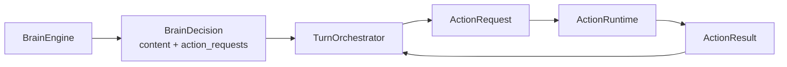

# P9：BrainDecision / ActionRequest 协议化

> 本阶段目标：让 Brain 和 Action 之间不再只靠原始 `ModelResponse.tool_calls` 传话，而是通过明确的协议对象交接。

## 本阶段目标

P8 之后，`TurnOrchestrator` 已经不再亲自摸记忆仓库。但它仍然直接理解模型响应：

```text
response.content
response.tool_calls
tc.name
tc.arguments
tc.id
```

这能跑，但边界仍然偏“模型 API 细节外溢”。

P9 新增轻量协议对象：

```text
BrainDecision
ActionRequest
ActionResult
```

让链路变成：

```text
BrainEngine -> BrainDecision -> TurnOrchestrator -> ActionRequest -> ActionRuntime -> ActionResult
```

## 修改前样貌

```text
TurnOrchestrator
  ├─ response = BrainEngine.generate_chat(...)
  ├─ 读取 response.content
  ├─ 读取 response.tool_calls
  ├─ 从 tc.name / tc.arguments 拼工具调用
  └─ ActionRuntime.execute(tool_name, arguments)
```

形象一点：大脑递过来的是模型原始小纸条，导演还要自己拆纸条、猜哪些是动作、再转告工具组。

## 修改后样貌

```text
BrainEngine
  └─ generate_chat_decision() -> BrainDecision

BrainDecision
  ├─ content
  ├─ stop_reason
  ├─ input_context
  └─ action_requests: list[ActionRequest]

ActionRuntime
  └─ execute_request(ActionRequest) -> ActionResult
```

现在更像：

```text
大脑：这是我的决策，包含最终文本和要执行的动作请求。
导演：收到，我把动作请求交给工具组。
工具组：这是动作结果。
```

## 新增组件

```text
src/agent/protocol.py
  ├─ ActionRequest
  ├─ BrainDecision
  └─ ActionResult
```

职责：

| 对象 | 职责 |
|---|---|
| `BrainDecision` | 表达一次模型步骤的决策：文本、停止原因、输入快照、动作请求 |
| `ActionRequest` | 表达一个工具动作：id、name、arguments |
| `ActionResult` | 表达一个工具执行结果：output、summary、error、metadata |

## 迁移职责

| 职责 | 修改前 | 修改后 |
|---|---|---|
| 模型响应转动作 | `TurnOrchestrator` 读 `response.tool_calls` | `BrainEngine.to_decision()` |
| 工具请求表达 | 裸 `tc.name / tc.arguments` | `ActionRequest` |
| 工具执行入口 | `ActionRuntime.execute(tool_name, arguments)` | `ActionRuntime.execute_request(request)` |
| 工具结果表达 | 裸 dict | `ActionResult` |
| 模型事件工具调用 | 直接 `tc.to_dict()` | `BrainDecision.model_event_tool_calls()` |

旧方法仍保留：

```text
BrainEngine.generate_chat()
BrainEngine.generate_final()
ActionRuntime.execute()
```

所以外部旧调用方不会断。

## 行为保持清单

本阶段刻意保持：

- 不改模型调用参数。
- 不改工具选择逻辑。
- 不改工具执行逻辑。
- 不改事件日志结构。
- 不改 ReplyService 的进度提示输入；仍用原始 tool calls 做兼容显示。

P9 只改变内部交接语言。

## 改进后的流程



这一步之后，手脑边界更像 managed 架构：

```text
Brain 不执行工具，只产出动作请求。
ActionRuntime 不理解模型，只执行动作请求。
TurnOrchestrator 不拆模型 API，只编排决策和结果。
```

## 验证结果

- `py_compile` 已通过：`agent/protocol.py`、`brain/engine.py`、`actions/runtime.py`、`harness/runner.py`。
- 导入检查已通过：`BrainDecision`、`ActionRequest`、`ActionResult`、`BrainEngine`、`ActionRuntime`、`TurnOrchestrator`。
- 未运行端到端 Temporal 流程；该流程依赖 Temporal 服务、Redis、模型配置和渠道连接。

## 下一阶段接力点

P10 建议作为收尾阶段：

```text
架构文档校准
兼容层清理计划
依赖方向检查
阶段总结
```

到 P9 为止，核心手脑分离边界已经基本到位。后续不建议继续无限拆阶段，应该开始收束，避免架构洁癖压过机器人可用性。
