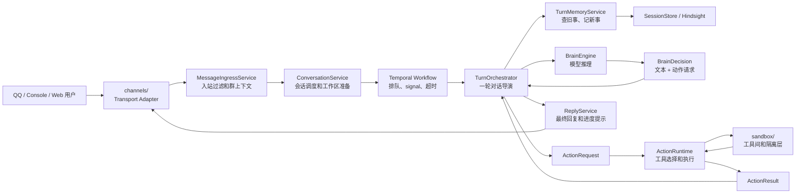

# P10：架构收尾与最终形态

> 本阶段目标：停止继续拆分，把 P1-P9 的改造成果收束成一张清楚的架构地图，并列出兼容层清理计划。

## 收尾判断

这一轮改造已经完成了最关键的边界调整：

```text
入口、会话、回合、脑、手、记忆、回复、渠道、沙箱
```

都已经有了明确位置。

继续拆当然还能拆，但收益会开始下降。P10 的判断是：

```text
现在应该收束，而不是继续追求无限纯化。
```

## 最终组件层

```text
channels/
  外部窗口：QQ / Console / Web 协议适配，负责听见和说出。

application/
  应用服务：入站过滤、会话调度、回复发送、回合记忆端口。

orchestration/
  时间编排：Temporal workflow / worker / scheduler。

harness/
  回合编排：TurnOrchestrator 串起一轮对话。

brain/
  大脑：模型调用、HyDE 改写、BrainDecision。

actions/
  手：工具选择、ActionRequest 执行、ActionResult。

sandbox/
  工具间：工具注册、执行隔离、nsjail、MCP/skills。

session / storage / resources /
  底座：会话、记忆、文件、Redis、模型资源。
```

## 最终流程



## 手脑分离状态

现在的边界可以这样理解：

```text
BrainEngine 不执行工具，只产出 BrainDecision。
ActionRuntime 不理解模型，只执行 ActionRequest。
TurnOrchestrator 不亲自问模型、不亲自执行工具、不亲自处理渠道协议、不亲自翻记忆仓库。
```

它更像 Anthropic managed 风格的手脑分离：

```text
脑：读上下文，做决策。
手：执行动作，返回结果。
导演：安排一轮怎么推进。
```

还有一点工程现实：`TurnOrchestrator` 仍然是 ReAct loop 的流程承载者。它不是“纯理论最小 orchestrator”，但已经是一个清楚、可维护、可继续演进的边界。

## P1-P9 成果回顾

| 阶段 | 结果 |
|---|---|
| P1 | `ReplyService`：大脑不再亲自发消息 |
| P2 | `MessageIngressService` / `ConversationService`：worker 不再是总控脚本 |
| P3 | `ActionRuntime`：工具选择、执行、摘要、审计从回合导演中移出 |
| P4 | `BrainEngine`：模型调用和 HyDE 改写从回合导演中移出 |
| P5 | `channels/`：渠道从 `sandbox/` 概念中搬出 |
| P6 | `TurnOrchestrator`：正式命名回合导演 |
| P7 | `turn_orchestrator` 路标清理：worker/activity 调用链命名统一 |
| P8 | `TurnMemoryService`：记忆仓库访问从回合导演中移出 |
| P9 | `BrainDecision` / `ActionRequest` / `ActionResult`：脑和手通过协议对象交接 |

## 兼容层清理状态

> 2026-07-22 全仓审计后更新。

| 兼容层 | 状态 | 说明 |
|---|---|---|
| `HarnessRunner(TurnOrchestrator)` | 已删除 | 仓内已统一使用 `TurnOrchestrator` |
| `inject(harness=...)` | 已删除 | 正式入口仅接受 `turn_orchestrator` |
| `WorkerDependencies.harness_runner` property | 已删除 | 仓内无调用 |
| `sandbox.channels.*` | 已删除 | 仓内已统一使用 `channels.*` |
| `TurnOrchestrator._session` | 已删除 | 主流程只通过 `TurnMemoryService` |
| `BrainEngine.generate_chat()` / `ActionRuntime.execute()` | 保留 | 目前仍分别被 decision/request 方法内部调用，不是纯兼容代码 |

## 不建议继续拆的部分

短期不建议继续拆：

```text
TurnOrchestrator.process_turn() 的 ReAct loop 主结构
archive_session() 的文件归档生命周期
ActionRuntime 内部工具摘要逻辑
BrainEngine 对具体模型响应的适配
```

原因：这些地方虽然还能进一步纯化，但会增加大量机械迁移，收益不如先跑一轮真实回归。

## 后续建议

接下来建议进入“验证和收敛”而不是继续加 P11/P12：

1. 跑一轮真实消息链路：NapCat/Console -> Temporal -> TurnOrchestrator -> tool -> reply。
2. 针对 P1-P9 补轻量单元测试，优先覆盖协议对象和 service facade。
3. 等稳定后再删除兼容层。
4. 更新 `docs/draw_docs/02_src_architecture.md` 这类大文档，避免旧图继续误导。
5. 最后做一次小型代码 review，关注行为回归而不是继续抽象。

## 验证结果

P10 执行的验证：

```text
py_compile: 核心改造文件通过
imports: 新旧兼容入口通过
依赖方向搜索: 核心运行时代码未发现关键反向依赖
```

未执行完整端到端验证，因为它依赖 Temporal 服务、Redis、模型配置和实际渠道连接。

## 一句话结论

```text
HpAgent 已经从“ReAct 大协调器 + 工具沙箱”演进为“TurnOrchestrator + BrainEngine + ActionRuntime”的手脑分离组件架构。
```

现在最重要的不是继续拆，而是让这套新边界在真实运行中站稳。
