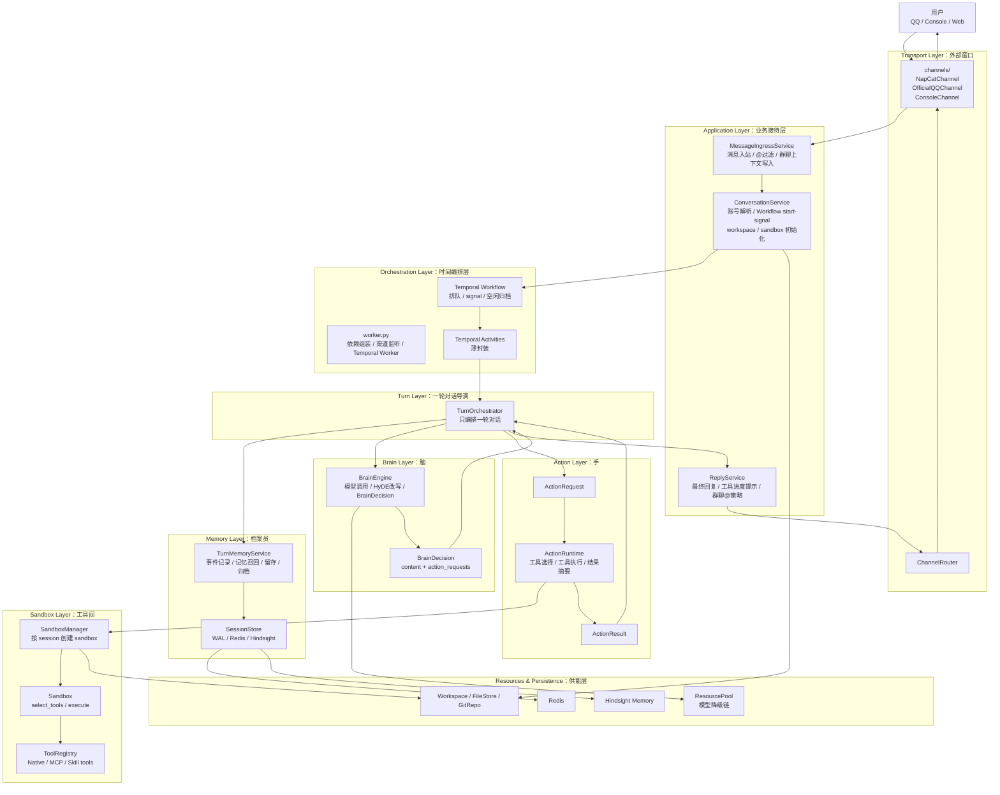
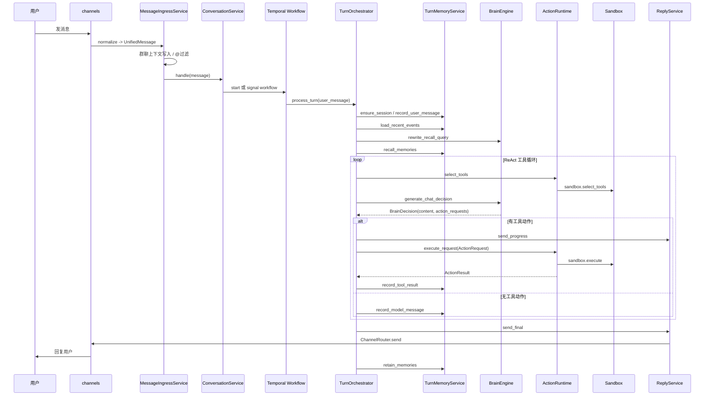

可以。下面是**当前 最新组件架构图**，

**1. 最新总架构图**

````

````

**2. 更适合画 Excalidraw 的分层版**

你可以按从左到右画：

```
[外部用户]
    ↓
[channels: QQ / Console / Web]
    ↓
[MessageIngressService]
    ↓
[ConversationService]
    ↓
[Temporal Workflow / Activities]
    ↓
[TurnOrchestrator]
    ├── [TurnMemoryService] -> [SessionStore / Redis / Hindsight]
    ├── [BrainEngine] -> [ResourcePool / LLM]
    ├── [ActionRuntime] -> [SandboxManager / Sandbox / Tools]
    └── [ReplyService] -> [ChannelRouter] -> [channels]
```

**3. 一轮对话跑起来是什么样**

````

````

**4. 各组件一句话职责**

```
channels
外部窗口。只负责接收外部消息、发送外部回复。

MessageIngressService
门房。判断消息要不要进入 Agent，例如群聊 @ 过滤、群上下文写入。

ConversationService
调度台。负责账号解析、session/workflow 查找、workspace 和 sandbox 准备。

Temporal Workflow / Activities
时间编排器。负责排队、signal、空闲归档，不做业务细节。

TurnOrchestrator
导演。安排一轮对话怎么走，但不亲自问模型、不亲自执行工具、不亲自翻记忆库。

TurnMemoryService
档案员。记录事件、召回记忆、留存记忆、归档 WAL、反思指标。

BrainEngine
脑。负责 HyDE 改写、模型调用，输出 BrainDecision。

BrainDecision
大脑决策单。里面有回复文本、停止原因、输入快照、动作请求列表。

ActionRuntime
手的调度员。负责选择工具、执行动作请求、摘要长工具输出、返回 ActionResult。

SandboxManager / Sandbox
工具间。真正绑定 workspace、注册工具、执行工具、安全隔离。

ReplyService
发言人。负责最终回复、工具进度提示、群聊 @ 策略。

ResourcePool
能源站。负责模型调用和模型降级链。
```

**5. 当前最核心的“手脑分离”结构**

你画 Excalidraw 时可以把这块画大一点：

```
                 ┌────────────────────┐
                 │  TurnOrchestrator   │
                 │      回合导演        │
                 └─────────┬──────────┘
                           │
        ┌──────────────────┼──────────────────┐
        │                  │                  │
        ▼                  ▼                  ▼
┌──────────────┐   ┌────────────────┐   ┌──────────────┐
│ BrainEngine  │   │ ActionRuntime  │   │TurnMemorySvc │
│     脑        │   │      手         │   │    档案员     │
└──────┬───────┘   └───────┬────────┘   └──────┬───────┘
       │                   │                   │
       ▼                   ▼                   ▼
BrainDecision        ActionResult        SessionStore
ActionRequest        Sandbox/Tools       Hindsight
```

现在的理解可以浓缩成一句：

```
TurnOrchestrator 不做专业活，只负责调度专业的人。
BrainEngine 想，ActionRuntime 做，TurnMemoryService 记，ReplyService 说，channels 听和传。
```