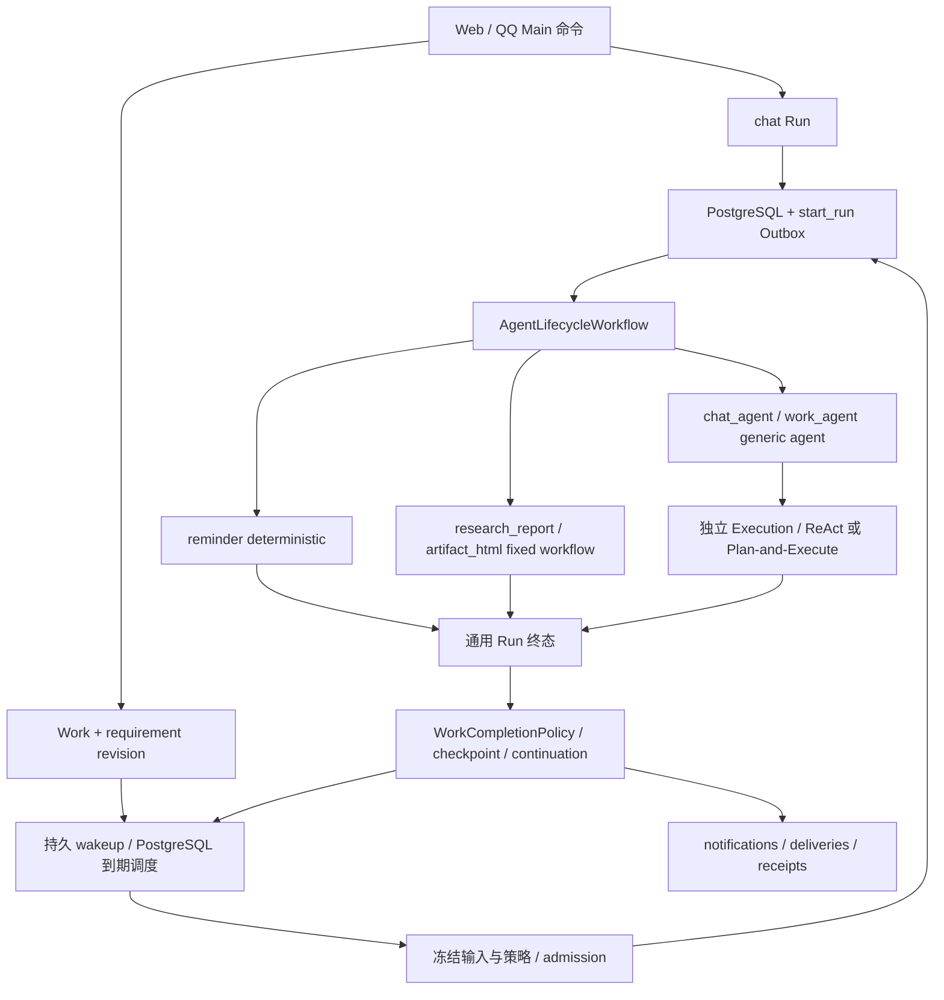

# Durable Work V1：当前实现

同步日期：2026-10-05；代码基线 `0fcf505`。本文描述已实现契约，历史目标设计和验证记录见[实施索引](../implementation/README.md)。

## 主体与执行身份

| 对象 | 职责与边界 |
| --- | --- |
| Account | 跨 Web / QQ 的所有权、模型访问、日额度和容量主体。 |
| Main Agent / Conversation | 理解当前交互、创建或调整 Work；保留聊天顺序与同对话单 active chat Run。 |
| Work | 持续委托；保存当前 requirement revision、checkpoint、continuation、control epoch 和协调 Run 指针。 |
| Run | 有限执行事实；保存冻结输入、策略版本、预算、执行结果和终态。Work Run 的 Conversation / trigger Message 为空；当前所有 Run 的 session_id 为空。 |
| Execution | Run 内独立的 root 或 Subagent 上下文；有自己的 transcript、segment、attempt lease、fencing token 和 operation。 |
| Artifact / Workspace | 成果版本与长期资源。生成、发布、保存、采用分别记录，不能以某一项冒充全部完成。 |
| Notification / Delivery | 不可变通知与每个目标的投递状态；渠道接受、用户读取和用户验收是不同事实。 |

Work 生命周期为 `active / pausing / paused / stopping / stopped / completed`；continuation 为 `ready / at_time / awaiting_input / awaiting_delivery / retry_after / blocked / none`。Run 终态为 `succeeded / failed / cancelled`；Message 和 Artifact Version 使用各自的 `completed` 状态，不能混用。

Work 的需求 revision 不可变。修订、暂停、停止和推进是带幂等键、版本检查与审计的命令。关联 Conversation 不导入聊天全文、附件或文件权限；后台执行不占聊天 admission，也不伪造 user / assistant Message。

## 统一有限执行链

`StrategyRegistry` 选择服务端注册的 `strategy_kind / executor_key / executor_version / strategy_policy_version`，admission 固定在 Run 与 root manifest 中。没有注册的能力或版本直接拒绝，不退回无约束 Agent。

| capability | strategy_kind / executor_key | 行为 |
| --- | --- | --- |
| 聊天 | `generic_agent / chat_agent` | Main 上下文与 Work 管理工具。 |
| `reminder` | `deterministic / reminder` | 持久通知入队；不调用模型，不创建 Git / 文件 / Sandbox。Run 成功后 Work 可继续等待投递回执。 |
| `research_report` | `fixed_workflow / research_report` | 在统一 Lifecycle 内运行固定研究图；保留证据、引用核验、报告和必需保存。 |
| `generic_work` | `generic_agent / work_agent` | Work brief + ReAct / Plan-and-Execute，不加载 Main 聊天全文或管理工具。 |
| `artifact_build` | `fixed_workflow / artifact_html` | Artifact-build Work 拥有新 Run 和模型成本，不从来源聊天 Run 借额度。 |

所有外部 I/O 都在 Activity 中执行。Workflow 只编排和等待；通用资源准备使用 Execution attempt 隔离的 scratch，Git 仅在明确需要代码资源时使用。

## 调度、执行权与完成

`work_schedules / work_schedule_occurrences / work_wakeups` 是 PostgreSQL 持久调度事实，由主 Worker 的 due loop 检查。Work 不创建 Temporal Schedule；`applied_version` 表示 PostgreSQL evaluator 已安装当前配置。Memory reflection / metrics 仍使用 Temporal Schedule。

支持 immediate、带时区 offset 的 once 和 IANA 时区 daily。once 采用 catch-up；daily 历史漏触发合并为最新 occurrence，保留 `missed_from`。DST 重叠取 first fold，缺失本地时间跳过当日。旧 schedule version / requirement callback 记录跳过，不启动新 Run。

Work 协调权由 `active_coordinator_run_id + requirement_revision + control_epoch` 决定；它与 Execution attempt lease、显式 Git 资源锁和跨进程容量票据分别校验。迟到旧 attempt 回执保留原来源，不得写当前 transcript、Workspace 或完成新 revision。暂停/停止有未知外部结果时保持收敛中，不能提前宣告停止。

`WorkCompletionPolicy` 使用本 revision 的持久证据推进状态：成功 operation receipt、研究报告、精确 Artifact Version、必需 Workspace 保存、渠道回执和显式用户验收。Generic Work 的文字回复仅是候选；没有有效完成证据时进入等待输入。ongoing 委托不因一轮成功就完成。成功后的 ready continuation 在终态事务中创建去重 wakeup；等待输入、blocked、暂停、停止和完成不会自动续跑。

## 资源、费用与上下文

Work 有显式 `work_input_refs`，权限以 `subject_kind=work` 管理；聊天采用 Conversation grant。Run admission 冻结候选与输入引用，使用前检查当前权限。Chat 和 Work brief 展示候选第一页最多 20 条元数据及分页指引，文件正文须 select / read；运行中新增资料在下一 Run 生效。

模型发送顺序是 entitlement / tier → 规范化并校验 Provider 请求 → 冻结 Model Input Snapshot → Account UTC 日额度、累计 Work（若有）、Run 原子预留 → 真实分发 → 结算或释放。Anthropic 独立 system 字段仍计入预算。快照存在不证明请求已发出。

新 revision、Run 重试、fallback 和 Subagent 都不重置 Work 累计预算。预算调整是显式版本化命令。`CapacityService` 用 PostgreSQL 票据限制 coordinator / model / tool / fetch 并发，轮转账户并为交互保留容量；等待不占物理执行票据。具体默认值见[配置](../reference/configuration.md)。

## 成果与投递

Artifact Version 保存 producing Run / Execution / operation；Work adoption 记录精确版本和 requirement revision，不改写原生产者。生成版本、采用版本、Workspace 保存、用户验收和渠道接受分别记账。HTML 可在成果页下载；当前手工长期保存按文本源码上传，不扩大上传 MIME allowlist。

`notifications / delivery_targets / deliveries / delivery_decisions` 替代旧 QQ delivery 与提醒 intent 模型。聊天通知引用已完成 Message；Work 通知引用生产事件/operation。Web 接受是进入私有 inbox，QQ 接受是 Adapter 收到发送回执，两者都不是已读。外部 sending lease 失效转 uncertain，不自动重发；显式 resolution 记录已接受、未发送或重复风险决定。QQ 群目标只接受摘要，Main 群聊工具观察值也裁剪账户私有信息。

## 有限 Subagent

仅 Generic Work root 可执行一次不可变委派，最多三个并行分支、每分支最多两次尝试；禁止递归。分支只获得 parent 的当前授权资源子集和只读工具 manifest，有独立 Execution / transcript / attempt，费用记入同一 Run / Work。分支不能修改 Work、授权、长期文件或直接通知；root 验证结果后继续完成判断。串行 Plan-and-Execute steps 不等同 Subagent。

## 部署与验证边界

迁移 054–058 建立上述边界；054 / 055 / 057 有开发期空业务存储检查，没有 Task / Work 双写或历史回填。旧库切换见[部署](../operations/deployment.md)，禁止修改已应用迁移 checksum 来绕过门禁。

受控数据库、Temporal、浏览器和沙箱验证已有证据，见[实施索引](../implementation/README.md)。真实模型完整工具往返、真实 QQ 发信和持续压力仍有未完成验收；Research 默认 stage lease 与 Activity 恢复窗口的不匹配也未由本次 UI / 协议修复解决。不能把隔离测试通过解释为所有生产恢复场景已验证。
