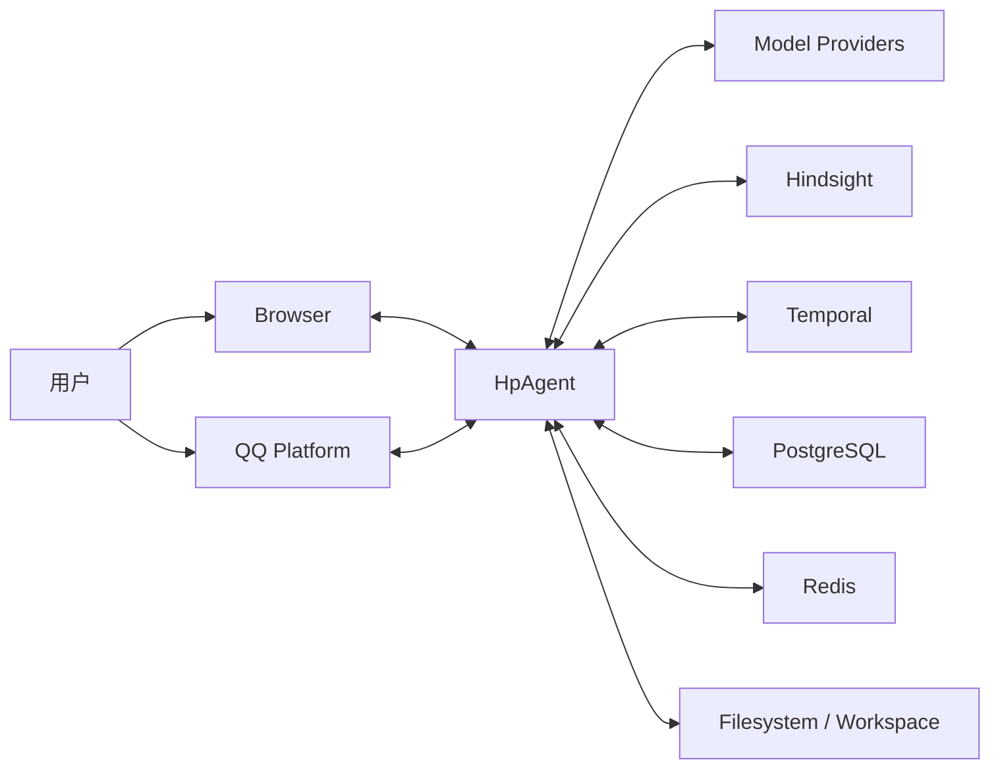

# 01 — 系统上下文

> 对应的 Excalidraw 仅供人工维护，本次整改未修改其内容。

HpAgent 为 QQ 用户和 Web 用户提供带工具调用与长期记忆的对话能力。本层只描述系统边界，不描述 Python 类或内部调用顺序。

| 外部对象 | 关系 |
|---|---|
| 用户、Browser | 使用 Web UI 发起对话、查看进度和结果 |
| QQ Platform | 传递 QQ 私聊/群聊消息与回复 |
| Model Providers | 提供聊天、快速处理、Embedding、Rerank 等模型能力 |
| Hindsight | 按统一 `account_id` recall/retain 长期记忆 |
| Temporal | 持久化 QQ 与 Web 工作流生命周期、重试、取消和超时 |
| PostgreSQL | 保存 Web 领域状态、Outbox、统一账号与身份绑定 |
| Redis | 保存 QQ 热状态、群上下文以及 Web 在线事件 |
| Filesystem / Workspace | 保存会话归档、workspace、Git 工作区和本地运行数据 |

系统边界内包括 QQ/Web Surface、应用服务、Agent execution core、Brain、ActionRuntime、Sandbox 与持久化适配器。具体部署单元见 [02_container.md](02_container.md)。
