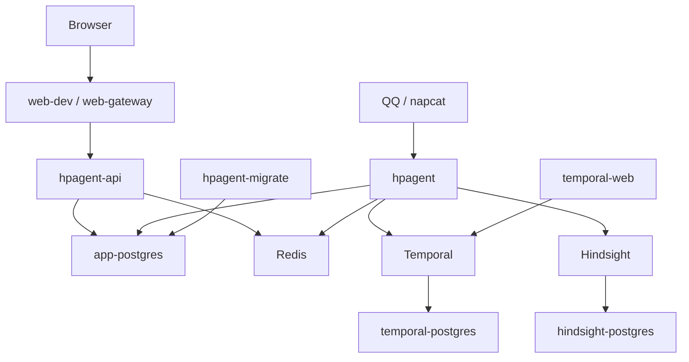

# 02 — 容器架构

> 本文以仓库根目录 `docker-compose.yaml` 为事实源。Excalidraw 由人工维护，可能需要后续同步。

## 服务清单

| 服务 | 类型 | Profile | 宿主端口 | 持久化/职责 |
|---|---|---|---|---|
| `app-postgres` | 基础设施 | 默认 | `127.0.0.1:5434` | `app-pgdata`；Web 数据、Outbox、账号和身份绑定 |
| `redis` | 基础设施 | 默认 | `127.0.0.1:6379` | `redis-data`；QQ 热状态、群上下文、Web 在线事件 |
| `temporal-postgres` | 基础设施 | 默认 | 不暴露 | `temporal-pgdata`；Temporal 状态 |
| `temporal` | 基础设施 | 默认 | `127.0.0.1:7233` | Workflow/Activity 编排 |
| `hindsight-postgres` | 基础设施 | 默认 | 不暴露 | `hindsight-pgdata`；长期记忆向量数据 |
| `hindsight` | 基础设施 | 默认 | `127.0.0.1:8001→8888`、`9999` | 记忆 API |
| `hpagent-migrate` | 一次性业务进程 | `agent`,`web`,`web-prod` | 不暴露 | 执行 PostgreSQL migration |
| `hpagent` | 业务进程 | `agent`,`web`,`web-prod` | `127.0.0.1:8082` | QQ Worker、Web Temporal workers、Agent execution |
| `hpagent-api` | 业务进程 | `web`,`web-prod` | `127.0.0.1:8080` | FastAPI、认证、命令、查询、SSE |
| `web-dev` | Web 开发 | `web` | `127.0.0.1:5173` | Vite HMR；代理 API |
| `web-gateway` | Web 生产 | `web-prod` | `${WEB_GATEWAY_PORT:-80}` | 静态前端与 API gateway |
| `napcat` | QQ 适配 | `qq` | host network | QQ/OneBot 接入 |
| `temporal-web` | 运维工具 | `tools` | `127.0.0.1:8088` | Temporal UI |

## 拓扑

容器内部通过 `app-network` 和 Docker DNS 通信。`napcat` 使用 host network。数据库容器只向需要的本机调试端口开放或完全不暴露；生产凭证通过环境变量传入。

## 启动组合

- 基础设施：`docker compose up -d`
- Agent：`docker compose --profile agent up -d`
- Web 开发：`docker compose --profile web up -d`
- Web 生产：`docker compose --profile web-prod up -d --build`
- QQ/工具：分别使用 `qq`、`tools` profile
