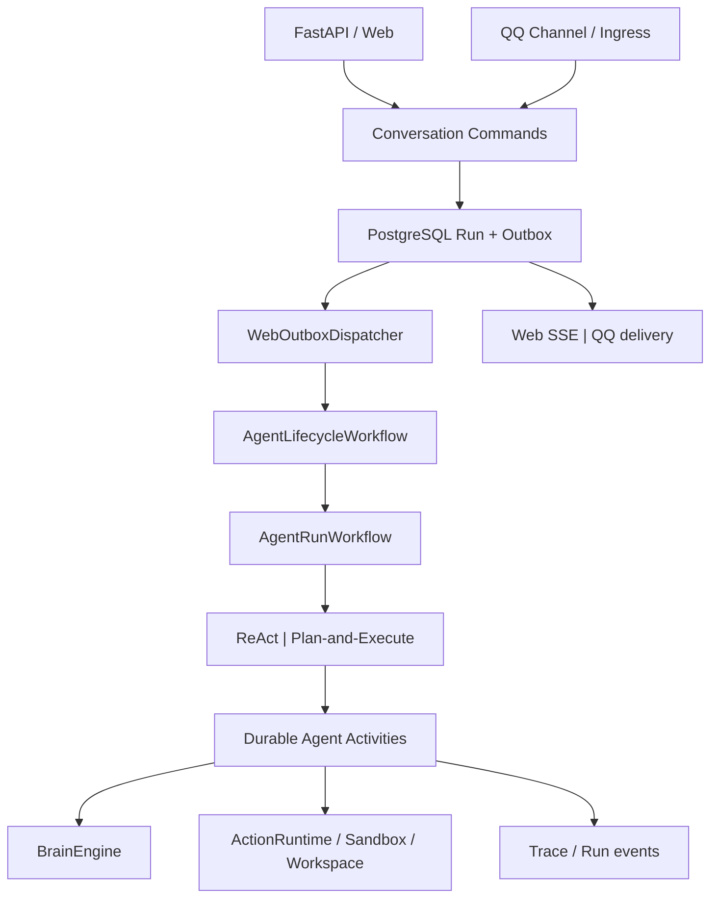

# 03 — 组件架构

## 当前生产拓扑（Phase 3 W3-B）

QQ 与 Web 共享 `conversation_domain` 的 Conversation/Message/Session 命令与 PostgreSQL
authority。两个入口都在事务中创建 Run + Outbox，由同一 Dispatcher 启动
`AgentLifecycleWorkflow`，随后进入 `AgentRunWorkflow` 和 ReAct / Plan-and-Execute。

## 核心规则

1. QQ 与 Web 保留各自的协议接入与结果展示/投递，执行 authority 和 runtime 相同。
2. Conversation admission、消息幂等、Run、Session 和 Outbox 由 PostgreSQL 管理。
3. 每个 capability segment 单独 acquire/execute/release；重试保持 operation ID 并取得新 fencing token。
4. Brain 只做模型决策；ActionRuntime 管理工具选择和执行；Workspace/Sandbox 在 Activity 内恢复。
5. Research、Document、Artifact 使用独立 Workflow，但共享必要资源和 lifecycle task queue。
6. Reflection/Metrics 使用独立 schedule queue；它不是第二套 Agent runtime。

## 已退役 runtime

W3-B 已删除旧 QQ turn Workflow/Activity、`QQExecutionHost`、`WebExecutionHost`、
`AgentExecutionFacade`、`DefaultBrainActionLoop`、`WebRunWorkflow`、whole-turn
`execute_agent_activity`，以及未接入生产的实验 Multi-Agent factory/registry/runtime。
共享 DTO、Trace、预算、上下文、反思和 scheduler survivor 已在 W3-A 迁入各自 capability。

W3-C 已删除 QQ `SessionStore`、WAL/checkpoint、SQLite session metadata、archive helpers
和相关 viewer/migration adapter。Workspace 隔离、Git workspace、Run file workspace 与
tenant file store 保留其独立文件职责，不作为 Conversation authority。

当前实现与恢复边界见 [Durable Agent Temporal 改造实施说明](../durable-agent-temporal.md)。
