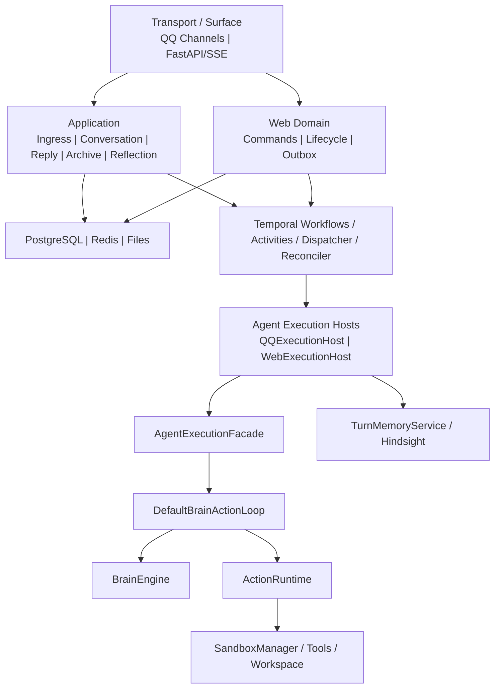

# 03 — 组件架构

## Conversation 命令提取（Phase 3 W2-A）

Chat 的共享命令和 Session owner 已迁至 `conversation_domain`；Web API 已直接调用。
发送/retry 经同一个 PG 事务 admission policy 创建 Run + Outbox，HTTP URL 在 API
适配层投影。具体合同见 [当前实现说明](../durable-agent-temporal.md#conversation-command-boundaryw2-a)。
W2-B 已将 QQ ingress 接入同一 PG command / Outbox / durable runtime；
W2-C 已实现独立 PG delivery 状态、分段恢复和 QQ 协议回执；
W2-D 已通过 G06；W3 retirement 尚未执行。
下方旧组件图中的 Web Domain 命令归属已过时，属于 architecture/visual drift；
Excalidraw 保持不变，需人工在完整双入口收敛后更新。

## 当前 Durable 合同与生命周期（Phase 3 W1-D）

W1-D 将 Chat binding 改为显式注入，transcript 允许无 Conversation/Session 并保留
Run/account 约束；共享终态 Trace 不再写死 Web。完整 Gate 见
[W1 总实施报告](../../../artifacts/architecture-audit/phase3/W1_implementation_report.md)。

Web 已固定经 `AgentLifecycleWorkflow` → `AgentRunWorkflow`；Dispatcher 无分流开关，
生产 registry 不再注册 legacy Web Workflow/Activity。Chat source/context、事件与资源适配
由 composition 提供。完整切换证据见 [W1-C 报告](../../../artifacts/architecture-audit/phase3/W1_C_implementation_report.md)。

当前 durable 主线使用 schema v3。`AgentRunInput` 只保存稳定的 Run/account、source/context 与 strategy；父 Workflow 不持有执行 lease。Web lifecycle 读取 PG 身份后启动 Agent child，各次 bootstrap/model/tool/planning/evaluation/approved-tool Activity 都通过 `execute_segment` 获取当次 token，完成或失败后释放。重试使用新的 segment/token，operation ID 保持稳定。已替换 W1-A 的启动时 `AgentExecutionInput` envelope。

通用 `DurableWait` 保存 PG `agent_run_waits` 恢复点，Workflow signal 仅唤醒，业务 probe 读取权威状态后才结束等待；timer 可在 deadline 恢复。Tool Approval 已接入。等待期间无 Activity、workspace lock、事务或 execution lease；PG Run 仍保持原有非终态，等待状态由 wait 表表达，Conversation admission 与执行 lease 独立。恢复重新 acquire 并重验 Run 状态。主能力 Activity 的 data-plane 事务在同一事务内核验 fencing，拒绝过期 token 和取消后的迟到提交。

执行 segment 的 PG 状态为 requested/active/released；released 保留清理记录，阻止丢失响应后的迟到 acquire 重建旧区间。Activity retry backoff 由 Workflow 在 release 之后执行。durable Run 不继承旧 Web 单次执行总超时，业务等待使用独立 deadline。当前 Chat loader/action/resource adapter、QQ/legacy 分流及 W1 整包收敛状态另行验收；没有实现 ModelInputSnapshot 或新的产品入口。

实现与验证见 [W1-B 实施报告](../../../artifacts/architecture-audit/phase3/W1_B_implementation_report.md)。下方历史组件图尚未覆盖 durable 分支，属于明确的 architecture/visual drift；Excalidraw 由人工维护。

## 历史组件图（W2-B 后非当前生产拓扑）

## 核心规则

1. QQ 与 Web 不共享 transport：QQ 由 Channels/ReplyService 输出，Web 由 FastAPI/SSE 与数据库生命周期输出。
2. QQ 与 Web 不共享短期状态：QQ 使用 SessionStore/Redis/WAL，Web 使用 PostgreSQL conversation/message/run 模型。
3. QQ 与 Web 共享 Agent execution core：生产 single-agent loop 只有 `DefaultBrainActionLoop.execute()` 一份。
4. Host 负责 Surface 适配：加载请求、创建事件/Audit sink、提交回复、retain；Facade 不依赖 QQ/Web。
5. Brain 只做模型决策，ActionRuntime 只做工具选择与执行，Sandbox 管理工具和 workspace 隔离。
6. PostgreSQL `accounts`/`identity_bindings` 是身份唯一生产事实源；`account_service.py` 仅作为待迁移历史实现保留，不在 composition root 中。

## 历史组件清单（待完整 W2 后同步图示）

| 边界 | 组件 | 职责 |
|---|---|---|
| Transport | `NapCatChannel`, `OfficialQQChannel`, FastAPI, SSE | 协议接入与输出 |
| Application | `MessageIngressService`, `ConversationService`, `SessionArchiveService`, `MemoryReflectionService` | 用例编排，不执行 Agent loop |
| Web Domain | `CommandService`, lifecycle services, Outbox | Web 事务和状态机 |
| Agent Execution | Hosts、Facade、`DefaultBrainActionLoop` | 统一执行协议和唯一循环 |
| Brain | `BrainEngine`, `ResourcePool` | query rewrite、模型调用和降级 |
| Action | `ActionRuntime` | 工具检索、执行、审计数据 |
| Sandbox | `SandboxManager`, tool registry, workspace isolation | 隔离和资源生命周期 |
| Memory | `TurnMemoryService`, `ContextAssemblyService`, Hindsight adapters | recall/retain 与上下文适配 |
| Persistence | repositories/UoW、SessionStore、LocalFileStore | 领域状态、热状态和归档 |
| Orchestration | QQ/Web Workflows、Activities、Outbox Dispatcher、Reconciler | 时间、重试、取消和恢复 |
| Observability | `common.logging.log_event` | 结构化生命周期事件与 correlation fields |

`src/agent/` 的 Multi-Agent 实现目前为 experimental/inactive，不属于生产主链路。

W2 整包实施与 G06 证据见 [W2 总报告](../../../artifacts/architecture-audit/phase3/W2_implementation_report.md)。
