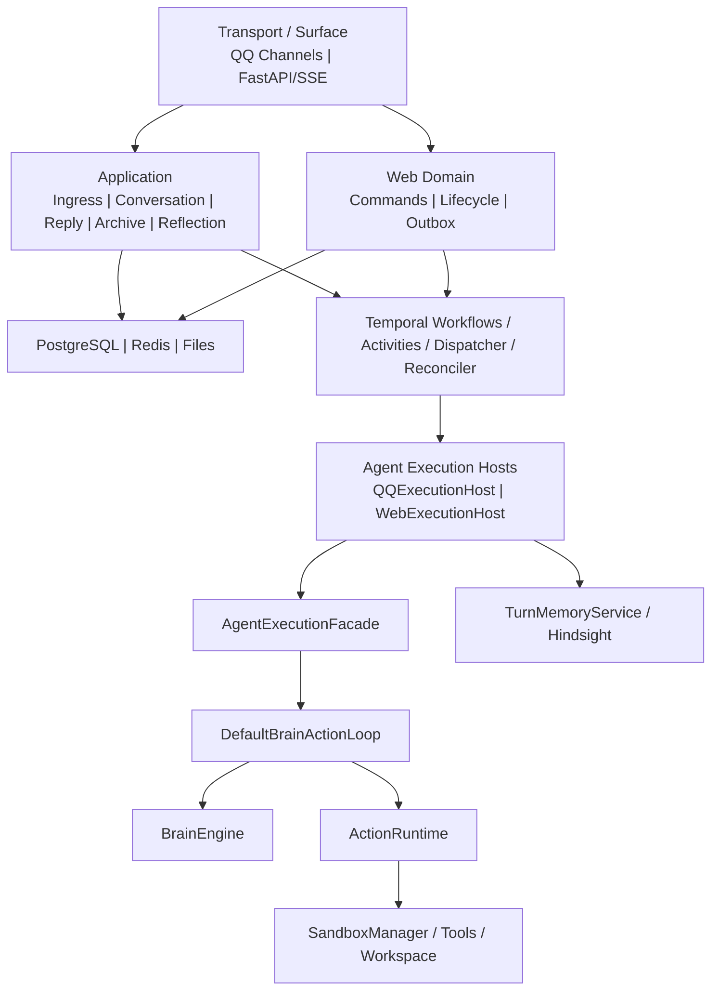

# 03 — 组件架构

## 边界与依赖方向

## 核心规则

1. QQ 与 Web 不共享 transport：QQ 由 Channels/ReplyService 输出，Web 由 FastAPI/SSE 与数据库生命周期输出。
2. QQ 与 Web 不共享短期状态：QQ 使用 SessionStore/Redis/WAL，Web 使用 PostgreSQL conversation/message/run 模型。
3. QQ 与 Web 共享 Agent execution core：生产 single-agent loop 只有 `DefaultBrainActionLoop.execute()` 一份。
4. Host 负责 Surface 适配：加载请求、创建事件/Audit sink、提交回复、retain；Facade 不依赖 QQ/Web。
5. Brain 只做模型决策，ActionRuntime 只做工具选择与执行，Sandbox 管理工具和 workspace 隔离。
6. PostgreSQL `accounts`/`identity_bindings` 是身份唯一生产事实源；`account_service.py` 仅作为待迁移历史实现保留，不在 composition root 中。

## 主要组件

| 边界 | 组件 | 职责 |
|---|---|---|
| Transport | `NapCatChannel`, `OfficialQQChannel`, FastAPI, SSE | 协议接入与输出 |
| Application | `MessageIngressService`, `ConversationService`, `SessionArchiveService`, `MemoryReflectionService` | 用例编排，不执行 Agent loop |
| Web Domain | `CommandService`, lifecycle services, Outbox | Web 事务和状态机 |
| Agent Execution | Hosts、Facade、`DefaultBrainActionLoop` | 统一执行协议和唯一循环 |
| Brain | `BrainEngine`, `ResourcePool` | query rewrite、模型调用和降级 |
| Action | `ActionRuntime` | 工具检索、执行、审计数据 |
| Sandbox | `SandboxManager`, tool registry, workspace isolation | 隔离和资源生命周期 |
| Memory | `TurnMemoryService`, `ContextAssemblyService`, Hindsight adapters | recall/retain 与上下文适配 |
| Persistence | repositories/UoW、SessionStore、LocalFileStore | 领域状态、热状态和归档 |
| Orchestration | QQ/Web Workflows、Activities、Outbox Dispatcher、Reconciler | 时间、重试、取消和恢复 |
| Observability | `common.logging.log_event` | 结构化生命周期事件与 correlation fields |

`src/agent/` 的 Multi-Agent 实现目前为 experimental/inactive，不属于生产主链路。
