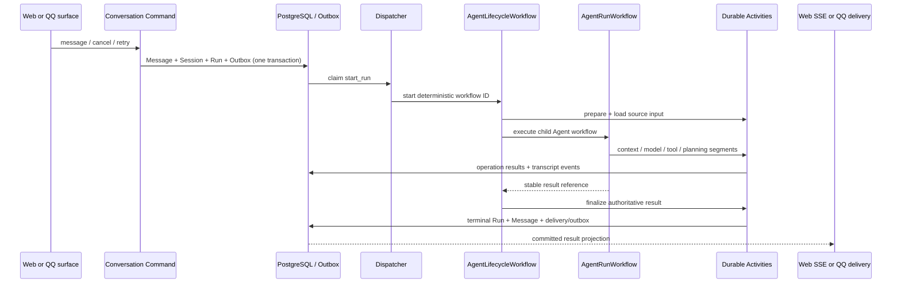
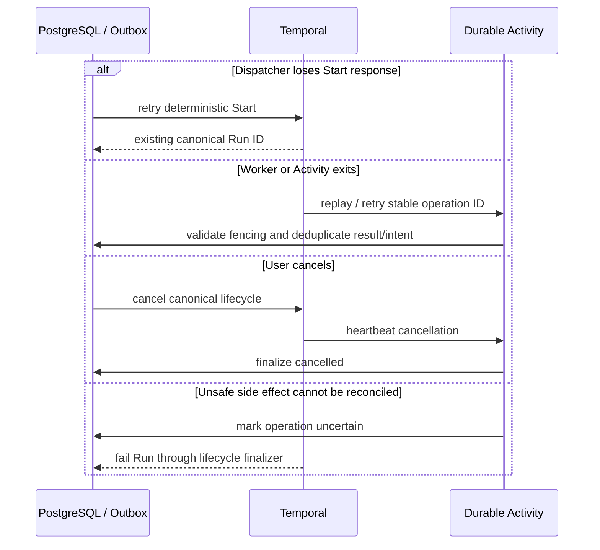

# 04 — 关键时序

## Web / QQ canonical Run

Web and QQ enter the same chain. QQ protocol identity and group context are frozen at ingress;
execution does not return to a channel-specific Host. QQ delivery retries committed payload
without creating a new Run or model call.

## Failure / recovery

Canonical phase3 History fixtures cover lifecycle, ReAct, Plan-and-Execute and tool approval.
History for deleted `WebRunWorkflow` retired with that Workflow type.
