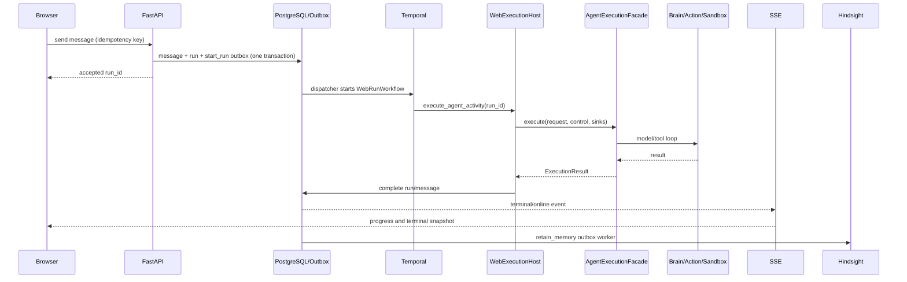
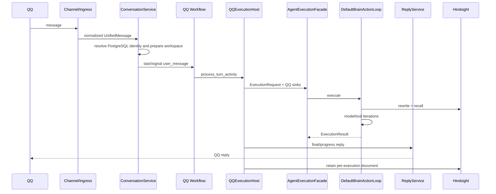

# 04 — 关键时序

## Web Chat



Outbox recovery reclaims expired leases. Reconciler compares active PostgreSQL runs with Temporal facts after worker/process interruption.

## QQ Chat



`execution_id` 由 Workflow ID 与 message ID 确定生成；Activity retry 会复用同一 ID，用户事件与副作用审计按 execution 隔离。

## Web Failure / Cancel

```mermaid
sequenceDiagram
    participant B as Browser
    participant A as API
    participant D as PostgreSQL/Outbox
    participant T as Temporal
    participant H as WebExecutionHost

    alt User cancel
        B->>A: cancel run
        A->>D: cancel_requested + cancel_run outbox
        D->>T: cancel workflow
        T->>H: cancellation observed at checkpoint
        H->>D: finalize cancelled
    else Model/tool/run timeout or stable failure
        H-->>T: StableExecutionFailure(error_code)
        T->>D: finalize failed
    else Dispatcher/worker interruption
        D->>D: recover expired outbox lease
        D->>T: retry idempotent dispatch/activity
        D->>D: reconciler converges terminal state
    end
    D-->>B: SSE terminal snapshot; reconnect resumes by cursor
```

Temporal retry只重做可重试边界；数据库 terminal transition、Outbox claim 和 execution-scoped audit 提供幂等保护。Workspace 无法安全恢复时使用稳定 `workspace_recovery_required` 失败码收口。
