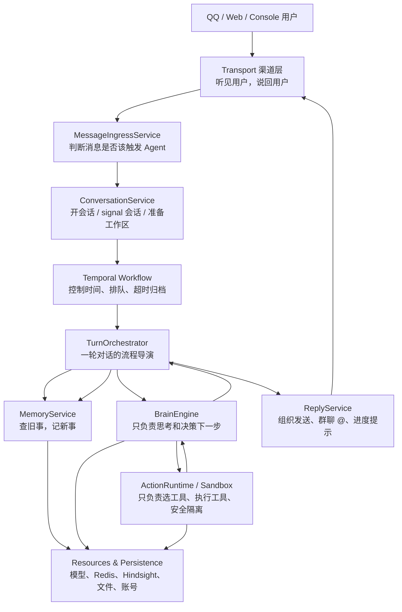

# 架构改进进度 00：总览与阶段地图

> 日期：2026-07-07  
> 当前阶段：P10，架构收尾完成  
> 关联方案：`docs/architecture_hand_brain_refactor_plan.md`

---

## 1. 这个目录用来做什么

`docs/architecture_progress/` 是 HpAgent 架构改进的“施工日志”。

每推进一个阶段，就在这里新增一份 Markdown 文件，记录：

- 本阶段要解决的架构问题。
- 修改前组件长什么样。
- 修改后组件长什么样。
- 迁移了哪些职责。
- 哪些行为必须保持不变。
- 下一阶段接力点是什么。

它不是抽象愿景文档，而是每次改造后的现场照片。目标是让以后回头看时，能清楚知道系统是怎么从“ReAct 大协调器 + 工具沙箱”一步步长成更清晰的“手脑分离”架构的。

---

## 2. 当前系统像什么

当前系统像一个很能干的总管带着一个工具间：

```text
QQ 用户
  ↓
Channel
  ↓
worker.handle_message  ← 门口接待、账号识别、开会话、建工作区都在这里
  ↓
Temporal Workflow      ← 控制时间、排队、空闲超时
  ↓
HarnessRunner          ← 思考、查记忆、叫工具、发回复、归档都在这里
  ↓
Sandbox                ← 真正的工具间：选工具、执行工具、安全隔离
```

这套能跑，而且跑通了最重要的闭环：

```text
听见消息 → 组织上下文 → 调模型 → 调工具 → 回答用户 → 记住重要信息
```

但它也带来一个问题：`worker.py` 和 `HarnessRunner` 都太忙了。一个像门口总管，一个像万能导演，什么都能做，也什么都往自己身上揽。

---

## 3. 最终目标像什么

最终目标不是把系统拆碎，而是让每个角色只演自己的戏。



一句话：

```text
Transport 负责听见和说出；
Application 负责业务规则；
Orchestration 负责时间和会话编排；
Brain 负责想；
Action Runtime 负责做；
Resources/Persistence 负责供能和记账。
```

---

## 4. 分阶段施工地图

### P0：架构认知对齐

状态：已完成。

目标：

- 明确“渠道不是手，工具执行才是手”。
- 明确当前 `HarnessRunner` 更像 Turn Orchestrator，不是纯 Brain。
- 建立本目录，后续每次改造都留下阶段文档。

本阶段产物：

- `docs/architecture_hand_brain_refactor_plan.md`
- `docs/architecture_progress/00_overview_and_stage_plan.md`

改造后的样貌：

```text
先不动代码，先把地图画对。
以前：sandbox = 工具 + 渠道 + 安全沙箱
现在：sandbox = 工具运行时核心；channels = transport adapter
```

### P1：抽出 ReplyService / ProgressNotifier

状态：已完成。

目标：

- 把回复发送、群聊智能 @、工具进度提示从 `HarnessRunner` 中拿出来。
- 让大脑不再亲自“开口说话”，而是把回复交给发言人。

修改前：

```text
HarnessRunner
  ├─ 思考
  ├─ 调工具
  ├─ 发最终回复
  ├─ 发工具进度提示
  └─ 群聊 @ 策略
```

修改后：

```text
HarnessRunner / TurnOrchestrator
  ├─ 思考
  └─ 调工具

ReplyService
  ├─ 发最终回复
  ├─ 发工具进度提示
  └─ 群聊 @ 策略
```

形象一点：大脑不再自己拿喇叭喊话，而是把话写好交给发言人。

### P2：抽出 MessageIngressService / ConversationService

状态：已完成。

目标：

- 把 `worker.handle_message()` 里的业务逻辑迁出。
- 让 `worker.py` 重新变成启动器和运行时宿主。

修改前：

```text
worker.handle_message
  ├─ 群聊上下文写入
  ├─ @bot 过滤
  ├─ account 解析
  ├─ workflow start/signal
  ├─ workspace 初始化
  ├─ git repo 初始化
  └─ sandbox 创建/重建
```

修改后：

```text
MessageIngressService
  ├─ 群聊上下文写入
  └─ @bot 过滤

ConversationService
  ├─ account 解析
  ├─ workflow start/signal
  ├─ workspace 初始化
  └─ sandbox 创建/重建

worker.py
  ├─ 注册 workflow/activity
  ├─ 启动 channel monitor
  └─ shutdown cleanup
```

形象一点：门口总管不用再亲自搬桌子、找档案、搭舞台；他只需要把人交给对应岗位。

### P3：引入 ActionRuntime facade

状态：已完成。

目标：

- 保留 `Sandbox` 核心，但给上层一个更干净的行动接口。
- 让 Brain/Turn 不直接认识 `SandboxManager`。

修改前：

```text
HarnessRunner
  -> SandboxManager.get_sandbox_for_session()
  -> Sandbox.select_tools()
  -> Sandbox.execute()
  -> 工具结果摘要
  -> 写工具审计事件
```

修改后：

```text
TurnOrchestrator
  -> ActionRuntime.select_tools()
  -> ActionRuntime.execute()

ActionRuntime
  -> SandboxManager
  -> Sandbox
  -> ToolResultSummarizer
  -> tool audit event
```

形象一点：大脑只按“帮我查一下”这个按钮，不再关心工具间钥匙挂在哪里。

### P4：拆出 BrainEngine + TurnOrchestrator

状态：已完成。

目标：

- 把“流程导演”和“脑内思考”分开。
- `TurnOrchestrator` 负责一轮对话的步骤顺序。
- `BrainEngine` 负责模型推理和下一步动作决策。

修改前：

```text
HarnessRunner
  ├─ 查记忆
  ├─ 组上下文
  ├─ 调模型
  ├─ 判断工具调用
  ├─ 调工具
  ├─ 发回复
  └─ 留存记忆
```

修改后：

```text
TurnOrchestrator
  ├─ MemoryService.recall()
  ├─ BrainEngine.next_step()
  ├─ ActionRuntime.execute()
  ├─ BrainEngine.finalize()
  ├─ MemoryService.retain()
  └─ ReplyService.send()

BrainEngine
  ├─ HyDE 查询改写
  ├─ 调用 ResourcePool
  └─ 产出 ModelResponse / ToolCall / FinalAnswer
```

形象一点：导演安排流程，参谋负责思考，工具手负责干活，发言人负责说话。

### P5：迁移 channels 包并清理旧 import

状态：已完成。

目标：

- 将 `sandbox/channels/` 迁移到 `channels/`。
- 保留短期兼容 import，确认稳定后删除旧路径。
- 在文档和代码结构上彻底表达“渠道不是 Sandbox”。

修改后目标：

```text
src/
  channels/
    base.py
    napcat.py
    official_qq.py
    console.py
    router.py

  sandbox/
    sandbox.py
    sandbox_manager.py
    nsjail.py
    tools/
```

形象一点：前台窗口搬出工具间，工具间终于只剩工具。

### P6：TurnOrchestrator 命名边界

状态：已完成。

目标：

- 将 `HarnessRunner` 的正式类名改为 `TurnOrchestrator`。
- 保留 `HarnessRunner` 作为兼容子类，避免旧 import 立即失效。
- 让 worker 和 activities 的类型语义转向 TurnOrchestrator。

修改后：

```text
TurnOrchestrator
  ├─ process_turn()
  ├─ archive_session()
  ├─ reflect()
  └─ get_metrics()

HarnessRunner(TurnOrchestrator)
  └─ 兼容旧导入
```

形象一点：导演已经不再搬道具、拿麦克风、亲自写台词；现在门牌也终于换成“回合导演”。

### P7：TurnOrchestrator 路标清理

状态：已完成。

目标：

- 将 `WorkerDependencies.harness_runner` 的正式字段改为 `turn_orchestrator`。
- 将 `inject(harness=...)` 的正式参数改为 `inject(turn_orchestrator=...)`。
- 保留旧字段和旧参数作为兼容入口。

修改后：

```text
WorkerDependencies.turn_orchestrator
inject(turn_orchestrator=deps.turn_orchestrator)
_harness -> _turn_orchestrator
```

形象一点：P6 换了部门招牌，P7 把楼道里的指示牌也换对了。

### P8：TurnMemoryService 记忆端口

状态：已完成。

目标：

- 将 `TurnOrchestrator` 对 `SessionStore` 的直接访问收窄到 `TurnMemoryService`。
- 让回合导演使用业务语言记录、召回、留存、归档记忆。
- 保留 `TurnOrchestrator._session` 作为短期兼容引用。

修改后：

```text
TurnOrchestrator
  -> TurnMemoryService
      -> SessionStore / Hindsight
```

形象一点：导演终于不用亲自翻档案柜了，他只需要告诉档案员“查旧事、记新事”。

### P9：BrainDecision / ActionRequest 协议化

状态：已完成。

目标：

- 新增 `BrainDecision`、`ActionRequest`、`ActionResult`。
- 让 Brain 输出动作请求，而不是让回合导演直接拆模型 tool_calls。
- 让 ActionRuntime 接收动作请求并返回动作结果。

修改后：

```text
BrainEngine -> BrainDecision -> TurnOrchestrator -> ActionRequest -> ActionRuntime -> ActionResult
```

形象一点：大脑不再递模型原始纸条，而是递一张清楚的行动单。

### P10：架构收尾与最终形态

状态：已完成。

目标：

- 收束 P1-P9 的架构改造，不再继续无限拆分。
- 固化最终组件层和运行流程。
- 列出兼容层清理计划和后续验证建议。

修改后：

```text
channels -> application -> orchestration -> TurnOrchestrator
                                      ├-> TurnMemoryService
                                      ├-> BrainEngine -> BrainDecision
                                      ├-> ActionRuntime -> ActionResult
                                      └-> ReplyService
```

形象一点：施工结束，不再继续拆墙；现在开始贴门牌、验收通道、准备真实跑一圈。

---

## 5. 每阶段文档命名规则

后续阶段文档建议使用：

```text
docs/architecture_progress/
  00_overview_and_stage_plan.md
  01_reply_service.md
  02_ingress_and_conversation_service.md
  03_action_runtime_facade.md
  04_brain_engine_turn_orchestrator.md
  05_channels_transport_layer.md
  06_turn_orchestrator_naming.md
  07_turn_orchestrator_route_cleanup.md
  08_turn_memory_service.md
  09_brain_action_protocol.md
  10_closure_and_final_shape.md
```

每份文档都使用同一结构：

```text
# 架构改进进度 XX：阶段名称

## 本阶段目标
## 修改前样貌
## 修改后样貌
## 迁移职责
## 行为保持清单
## 验证结果
## 下一阶段接力点
```

---

## 6. 当前进度看板

| 阶段 | 名称 | 状态 | 代码是否已改 | 文档 |
|---|---|---|---|---|
| P0 | 架构认知对齐 | 已完成 | 否 | 本文件 |
| P1 | ReplyService / ProgressNotifier | 已完成 | 是 | `01_reply_service.md` |
| P2 | MessageIngressService / ConversationService | 已完成 | 是 | `02_ingress_and_conversation_service.md` |
| P3 | ActionRuntime facade | 已完成 | 是 | `03_action_runtime_facade.md` |
| P4 | BrainEngine + TurnOrchestrator | 已完成 | 是 | `04_brain_engine_turn_orchestrator.md` |
| P5 | channels 迁移为 Transport Layer | 已完成 | 是 | `05_channels_transport_layer.md` |
| P6 | TurnOrchestrator 命名边界 | 已完成 | 是 | `06_turn_orchestrator_naming.md` |
| P7 | TurnOrchestrator 路标清理 | 已完成 | 是 | `07_turn_orchestrator_route_cleanup.md` |
| P8 | TurnMemoryService 记忆端口 | 已完成 | 是 | `08_turn_memory_service.md` |
| P9 | Brain/Action 协议化 | 已完成 | 是 | `09_brain_action_protocol.md` |
| P10 | 架构收尾与最终形态 | 已完成 | 是 | `10_closure_and_final_shape.md` |

---

## 7. 施工原则

- 每次只移动一类职责，不顺手重写业务逻辑。
- 每次改造都要保持外部行为等价。
- 每次改造后都新增一份阶段文档。
- 先新增 facade，再迁移调用方，最后清理旧路径。
- 不把“架构更优雅”凌驾于“机器人继续能用”之上。

---

## 8. 下一步

本轮架构改造到 P10 收束。下一步不建议继续新增 P11/P12，而是进入验证和清理：

1. 跑真实端到端链路：渠道 -> Temporal -> TurnOrchestrator -> 工具 -> 回复。
2. 补轻量测试：`BrainDecision`、`ActionRequest`、`TurnMemoryService`、`ReplyService`。
3. 稳定后删除兼容层：`HarnessRunner`、`inject(harness=...)`、`sandbox.channels.*`。
4. 更新大图文档 `docs/draw_docs/02_src_architecture.md`。

当前判断：核心组件边界已经达到“足够接近 Anthropic managed 手脑分离”的工程状态，后续重点应转为回归验证。
