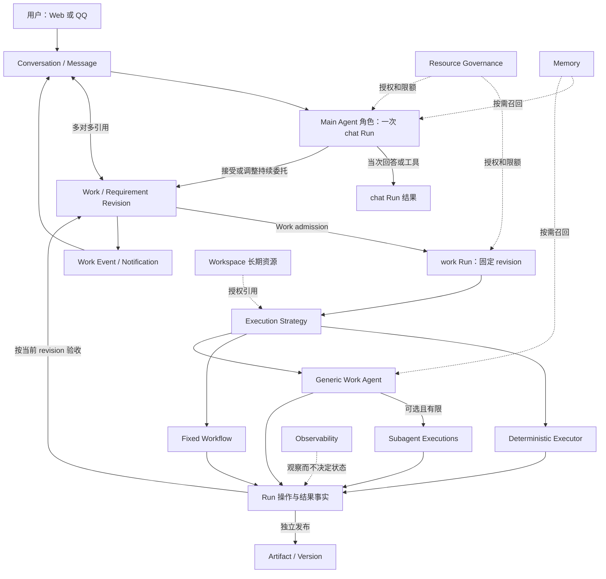
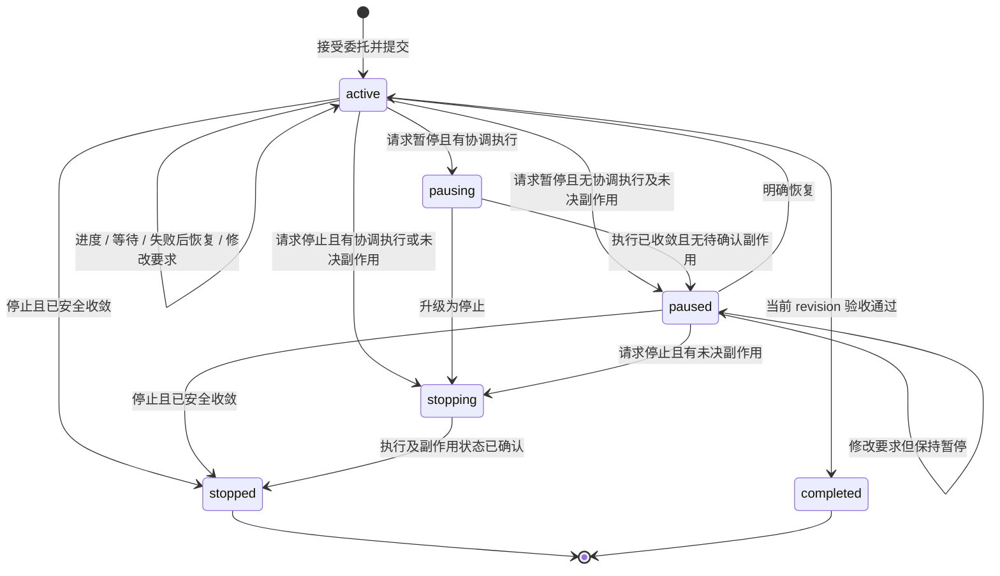
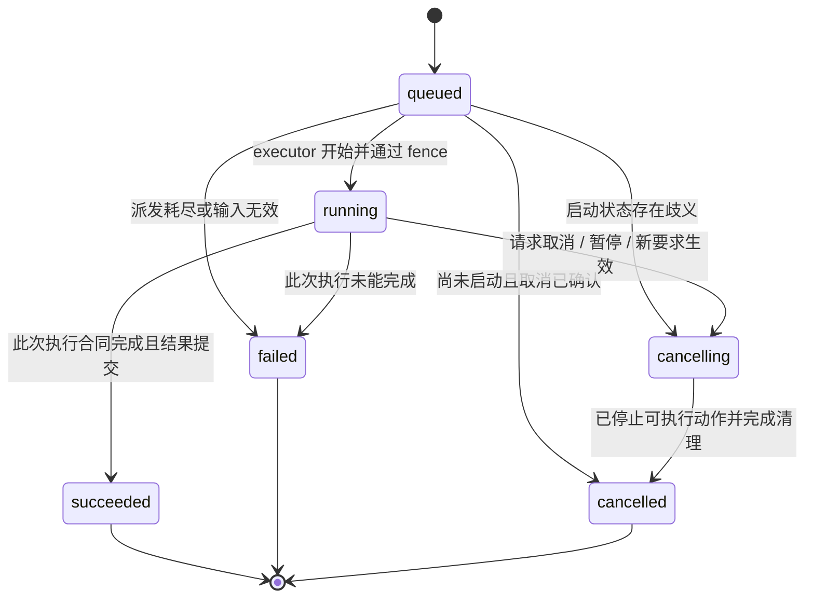
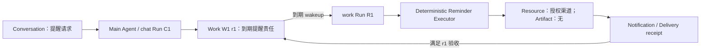
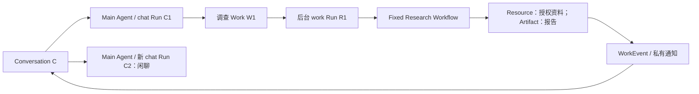
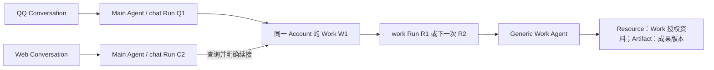
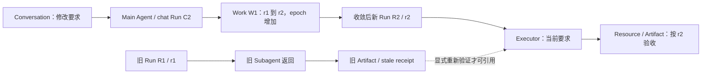
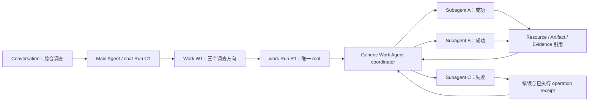
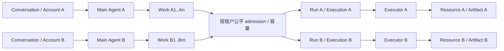

# HpAgent Durable Work V1 Implementation Design

> 历史设计/复查基线：本文保留当时状态与证据。当前已实现架构见 [Durable Work V1](../architecture/durable-work-v1.md)，阶段演进和后续人工修复见[实施索引](../implementation/README.md)。
> 源码链接已改为仓库相对路径，行号沿用原研究基线；退休文件以路径文字保留，不链接到不存在的当前文件。

> 研究基线：`main@3e6379f`（`Fix migration runtime path and queued warning timer`）；研究日期：2026-10-01。本文是下一阶段的目标设计，不是对现有实现能力的承诺。本轮只静态检视源码、数据库定义与测试布局，没有运行集成环境、修改生产代码或提交 commit。

## 1. 设计结论与范围

HpAgent 应以 **Main Agent 接收委托，Work 持续承担责任，Run 记录具体执行，Execution Strategy 决定执行方法** 为主干。Main Agent 是账户面向用户的交互角色；它与 Generic Work Agent 可以复用执行引擎，但输入职责、可用工具和授权范围不同。

本次设计接受已冻结的十四条原则，并作出以下具体取舍：

1. 将 Research Task 的委托、调度、状态和资源主体职责合并进 Work；保留 Research 的计划、证据、引用核验、报告和固定 Workflow。目标运行时不同时保留 Task 与 Work 两个持续委托实体。
2. 保留 Conversation 单 active **聊天 Run** 的约束。后台 Work Run 的 `conversation_id` 为空；通过关联表和通知引用回到聊天，不占聊天 admission，不伪造 user/assistant 消息。
3. 把通用 Run 生命周期从 `conversation_domain.commands` 中抽出。聊天消息完成是聊天专属投影，Work 状态推进是 Work 专属命令，二者共用执行事实。
4. Work 协调权属于一个逻辑 Run，不属于某个 Agent 对象或 Worker 进程。协调权、执行尝试租约、共享资源锁、租户容量是四种不同约束。
5. 立即取消通用执行对 Session/Git 的强制依赖。Git 是可选执行资源；无文件需求的提醒不创建目录，无代码需求的问答不创建 Git branch。
6. 需求 revision 不可变。完成某次 Run、产生 Artifact、满足某版要求、送达通知分别记账；禁止任何一个事实冒充其他事实。
7. V1 不建立横跨所有领域的万能 Context 子系统。Main、Work coordinator、可选 Subagent 各自使用有边界的上下文组装，复用授权、召回和快照机制。
8. V1 默认没有 Subagent。预留独立 Execution 身份，最后阶段才启用有限并行；不将现有串行 plan-and-execute 子 Workflow 宣称为并行 Subagent。

开发阶段直接替换旧架构。不设计历史数据搬迁、运行时 migration flag、Task/Work 双写或旧 API 兼容层。保留数据库建库及 schema 校验工具，不等于保留旧领域架构。

### 1.1 术语与租户边界

当前仓库的 `account_id` 同时是数据所有权、配额和跨入口身份归一边界。V1 沿用这一事实：一个 Account 是一个租户/个人管家主体。QQ 群、Conversation、模型进程都不是租户。本文不凭空增加“组织租户下多人共享 Work”；未来若引入组织协作，应另行设计成员与共享权限。

| 名称 | 唯一核心职责 | 不承担的职责 |
|---|---|---|
| Main Agent | 理解当前用户意图、查询/创建/调整委托、解释结果 | 不作为所有 Work 的常驻监督进程，不拥有全账户执行上下文 |
| Conversation | 有序交互记录及交互来源 | 不定义 Work 身份、不保有后台执行权 |
| Work | 已接受的持续委托、当前要求、继续履行所需稳定状态 | 不保存全部聊天、文件副本、执行日志或模型思考过程 |
| Run | 一次有明确输入、策略、成本和结果的执行 | 不等同 Work，不凭成功状态宣布委托完成 |
| Execution | Run 内一个独立执行上下文；通常只有 root | 不形成新 Work，不成为新的预算主体 |
| Execution Strategy | 选择并执行受支持的工具、固定流程或 Agent 路径 | 不拥有委托状态或用户权限 |
| Workspace | 长期资源、版本、目录和资源授权 | 不等同临时执行目录，不由 Work 或 Agent 拥有 |
| Artifact | 可独立引用、版本化的成果 | 不等同任意文件，不以是否出现在聊天决定存在性 |
| Resource Governance | 能力授权、资源作用域、费用和执行容量 | 不负责目标理解或成果质量判断 |
| Observability | 可解释性、诊断和关联追踪 | 不作为完成、授权或实际副作用的真相源 |

## 2. 当前实现：证据与实际调用关系

以下路径均对应研究基线，行号是定位入口。实施前应核对后续变更。标记 `E01` 等用于后文引用。

### 2.1 源码证据索引

| 编号 | 代码位置 | 已确认的实际行为 |
|---|---|---|
| E01 | [commands.py](../../src/conversation_domain/commands.py#L146)、[admission.py](../../src/conversation_domain/admission.py#L23) | 发消息在同一事务内做幂等、Conversation 行锁、active Run admission、Session 绑定、两条消息分配、Run/预算/资源快照和 start outbox。 |
| E02 | `src/conversation_domain/sessions.py:14`（基线文件，现已移除）、`src/conversation_domain/run_input.py:1`（基线文件，现已移除） | 聊天 Run 需要 Conversation/Session/trigger；Session 轮换与 active Run 耦合。 |
| E03 | [app.py](../../src/web_api/app.py#L1238)、[auth.py](../../src/web_api/auth.py#L91) | Web 会话身份解析到 Account，写操作使用 CSRF 和幂等键，再调用 Conversation 命令。 |
| E04 | [ingress.py](../../src/application/ingress.py#L1)、[surface_commands.py](../../src/conversation_domain/surface_commands.py#L33) | QQ 验证 active identity binding，按 Account+route 映射 Conversation，用入口 receipt 去重，再调用相同聊天命令；`/cancel` 默认查询该 Conversation 的 active Run。 |
| E05 | [agent_lifecycle_workflow.py](../../src/orchestration/agent_lifecycle_workflow.py#L1)、[run_lifecycle_activities.py](../../src/orchestration/run_lifecycle_activities.py#L1)、[lifecycle.py](../../src/web_domain/lifecycle.py#L1) | 生命周期 Workflow 只接收 run_id，prepare/load → Agent 子 Workflow → finalize；最终状态仍回到 Conversation CommandService。 |
| E06 | [contracts.py](../../src/agent_workflows/contracts.py#L23)、[execution_bindings.py](../../src/conversation_domain/execution_bindings.py#L33) | 已有 RunSource/RunContext，但当前 ChatExecutionBindings 仍要求 chat.session_id。接口抽象先于完整非聊天执行能力。 |
| E07 | [segments.py](../../src/agent_workflows/segments.py#L1)、[store.py](../../src/agent_activities/store.py#L471) | 分段执行、等待时释放资源已经存在；执行租约却按 Account 独占，同账户另一个 segment 会 LeaseConflict。 |
| E08 | [store.py](../../src/agent_activities/store.py#L272)、[plan_execute.py](../../src/agent_workflows/plan_execute.py#L66) | transcript 按 Run 建立；plan steps 串行 await，共用同一 Run/transcript，不是独立上下文的并行 Worker。 |
| E09 | [runtime.py](../../src/agent_activities/runtime.py#L236)、[isolation.py](../../src/workspace/isolation.py#L230) | model/tool 路径进入资源准备；SessionResourceRecoveryService 要求 account_repo，持 Account 锁恢复 session branch，准备文件和 sandbox。 |
| E10 | [services.py](../../src/research_domain/services.py#L132)、[trigger_task](../../src/research_domain/services.py#L197) | Task 保存 objective/source strategy/output/schedule。trigger 对 Task 单 active Run；带 Conversation 时额外检查聊天槽并生成合成消息；无 Conversation 时为 detached Run。 |
| E11 | [research_workflow.py](../../src/orchestration/research_workflow.py#L109)、[research runtime](../../src/research_activities/runtime.py#L244) | 固定调查流程：规划→发现/排序/抓取/提取/交叉验证/缺口，最多三轮→综合→引用核验→历史比较→Artifact→Workspace save→完成。规划读 live Task。 |
| E12 | [research runtime](../../src/research_activities/runtime.py#L701)、[complete](../../src/research_activities/runtime.py#L826) | 发布读取当前 Task.objective，保存读取当前 Task timezone；完成校验 required save。挂 Conversation 时走 CommandService，detached 时直接更新 runs，形成两套终态路径。 |
| E13 | `src/orchestration/research_schedule.py:1`（基线文件，现已移除）、[schedule workflow](../../src/orchestration/research_workflow.py#L85) | Task 的 desired/applied schedule version 驱动 Temporal Schedule；daily、overlap SKIP；触发 fire_id 使用 Temporal workflow run_id。 |
| E14 | `src/application/scheduler.py:218`（基线文件，现已移除）、[worker reminder handler](../../src/orchestration/worker.py#L842)、`src/sandbox/tools/local/reminder.py:97`（基线文件，现已移除） | 另一条提醒链使用本地持久化调度文件：先标 triggered/计算下次时间，再调用直接发送 handler；没有 Work/Run/可靠 delivery 闭环。 |
| E15 | [resources.py](../../src/workspace/resources.py#L154)、[select](../../src/workspace/resources.py#L265)、[revoke](../../src/workspace/resources.py#L110) | 资源主体是 conversation/task；Run 冻结候选 node 集，选用时固定文件版本并检查当前 grant；撤销后阻断后续使用并请求取消相关 Run。 |
| E16 | [catalog.py](../../src/workspace/catalog.py#L141)、[output.py](../../src/file_runtime/output.py#L37)、[file_scope.py](../../src/workspace/file_scope.py#L134) | Workspace save/version、不可变 Run 文件发布和临时 RunFileWorkspace 是不同机制；OutputPublisher 当前拒绝已取消/终态 Run 发布。 |
| E17 | [artifact services](../../src/web_artifacts/services.py#L29)、[build.py](../../src/web_artifacts/build.py#L79)、[Research artifact](../../src/research_domain/persistence.py#L523) | 普通 Artifact 以完成的 assistant Message 为来源；Research 有专门来源和发布路径。独立 HTML 构建从来源 Message 取得旧 Run 用于模型预算。 |
| E18 | [model_budget_coordinator.py](../../src/resources/model_budget_coordinator.py#L24)、[run_budget.py](../../src/resources/run_budget.py#L110)、[account_daily_budget.py](../../src/resources/account_daily_budget.py#L61) | Account UTC 日额度与 Run 预算原子 reserve/settle/release；无 Work 聚合上限。聊天 retry 创建新的 Run 预算。 |
| E19 | [resource_pool.py](../../src/resources/resource_pool.py#L235)、[model_observability_queries.py](../../src/web_api/model_observability_queries.py#L20) | 请求快照冻结发生在预算保留及真实发送前；模型输入可见性受 entitlement 控制。快照存在不能证明请求已经发出。 |
| E20 | [outbox.py](../../src/web_domain/outbox.py#L1)、[web_dispatcher.py](../../src/orchestration/web_dispatcher.py#L129)、[workflow_execution.py](../../src/web_domain/workflow_execution.py#L18) | 已有提交后派发、稳定 workflow_id、重复启动恢复及 start/cancel 竞态补偿。chat/research 分路，outbox 依赖 Run。 |
| E21 | [web_reconciler.py](../../src/orchestration/web_reconciler.py#L42) | PostgreSQL 为领域状态权威；Temporal completed 而领域未提交终态，被当作 terminal_commit_missing，不直接宣布成功。 |
| E22 | [delivery.py](../../src/conversation_domain/delivery.py#L4)、[qq_delivery.py](../../src/application/qq_delivery.py#L72) | 成功聊天事务生成 QQ delivery；发送中崩溃进入 uncertain，不静默重发。当前 delivery 主身份是 run_id，只覆盖聊天最终回复。 |
| E23 | [terminal_publisher.py](../../src/web_api/terminal_publisher.py#L95)、[queries.py](../../src/web_api/queries.py#L280)、[types.ts](../../web/src/api/types.ts#L134) | terminal publisher 跳过无 Conversation 的事件；通用 get_run 实际 inner join assistant Message；前端 RunSnapshot 要求 assistant_message。 |
| E24 | [metadata.py](../../src/tracing/metadata.py#L49)、[snapshot_repository.py](../../src/model_observability/snapshot_repository.py#L15) | Trace 元数据有白名单和大小上限；模型输入查询受 Account/Run 所有权约束。 |
| E25 | [context_assembly.py](../../src/application/context_assembly.py#L90)、[history.py](../../src/research_domain/history.py#L14)、[memory_retention.py](../../src/application/memory_retention.py#L87) | 聊天按 Conversation watermark 读历史并召回 Hindsight；Research 从已授权 Workspace 候选取有限历史；记忆保留以已完成聊天对为依据。 |

### 2.2 当前三条真实执行链

**Web/QQ 聊天：** Web `send_message` 或 QQ `Ingress → ConversationService → SurfaceConversationCommands` → `CommandService._send_message_in_uow` → admission + Session + Message/Run/budget/resource snapshot + outbox → `TemporalOutboxDispatcher` → `AgentRunLifecycleWorkflow` → loader → `AgentRunWorkflow` → 分段 Activity → `WebRunLifecycleService/CommandService` 提交结果 → memory/terminal outbox、QQ delivery。源头和呈现不同，核心聊天命令一致。[E01–E09、E20、E22]

**Research：** `/api/v1/tasks` 或 Research Schedule → `ResearchTaskCommandService.trigger_task` → Task Run/预算/资源快照/save intent → `start_research_run` → `ResearchReportWorkflow` → 专用 Activity/Repository → Artifact + Markdown 文件 + 可选必需 Workspace save → attached/detached 两套完成路径。[E10–E13]

**提醒：** session sandbox 的 `create_reminder` → `TaskScheduler.schedule` → 本地调度文件 → `poll_loop` → Worker reminder handler → ChannelRouter。它绕过了上述 Run、outbox 与 delivery 状态链。仅统一 Task 名称不能解决可靠性。[E14]

### 2.3 Current → Target 映射

| 当前对象 | 当前承担的职责 | 目标归属与操作 |
|---|---|---|
| Conversation | 消息顺序、来源绑定、用户请求入口；间接承担 Research 后台占位与通用执行生命周期 | **保留**交互与聊天 admission；**修改**为只拥有 chat Run；**新增**Work 多对多关联与事件卡片；**删除**后台 Research 合成消息；通用生命周期**移入 Run**。[E01/E04/E10/E23] |
| Research Task | 持续目标、状态、来源策略、输出位置、定时配置、单 active Task Run；可绑定一个 Conversation | 生命周期、委托和调度**合并进 Work**；来源/报告配置归不可变 requirement 的 Research 规范；Research 证据和报告存储**保留**为执行能力；**删除**`tasks` 和 `runs.task_id` 目标运行依赖。[E10–E13] |
| Run | queued/running/cancelling/completed/failed/cancelled、chat/research 来源、执行标识、预算和结果归属 | **保留并修改**：明确 chat/work 两种 owner shape，冻结 requirement/strategy，新增 root Execution、统一结果与终态服务。领域成功名称统一为 `succeeded`；Message/Artifact 的完成状态可仍叫 completed。[E05/E18/E21] |
| Durable Workflow | 重试、Activity 编排、取消、审批等待；Research Schedule 独立唤醒 | **保留**为 Execution Strategy 的执行基础设施；**修改**为通用 Run 驱动；Research Workflow 保留；**不新增**永生 Work Workflow。[E05/E07/E11/E13/E20] |
| Agent | react/plan_and_execute 引擎、工具、transcript；当前依赖 ChatExecutionBindings 与 session sandbox | 引擎**保留**；角色/输入**修改**为 Main 和 Generic Work；WorkAgent 是一种 Execution Strategy；**新增**独立 Execution 上下文；**删除**强制 Session/Git 和 Account 独占执行租约。[E06–E09] |
| Workspace | 同时存在 account Git repo/session branch 与 Workspace v4.1 资源目录/版本/授权 | **保留**长期资源模型和授权检查；task subject **替换为 work**；临时目录归 Execution 资源准备；Git **收窄**为可选能力，不能作全系统会话边界。[E09/E15/E16] |
| Artifact | Message 来源的 HTML 与 Research 专用报告来源；有版本与异步构建 | 独立成果实体**保留**；**修改**来源为 producing Run/Execution/operation + 可选 Message；**新增**Work 引用与按 revision 采纳事实；**删除**必须伪造 Message 及专门 research-origin 的分流。[E17] |
| Budget | Account/day + 单 Run 预算；retry 会得到新 Run budget | 全部归 **Resource Governance**；现有账本**保留**；**新增**Work 累计上限、租户容量和公平排队；分支/retry 共用聚合额度，不按 Agent 实例开户。[E18/E19] |
| Observability | Run trace、模型输入快照、工具事实关联、SSE 投影、故障 reconciliation | Trace/snapshot **保留并补充** work/revision/execution 维度；**分离**通用 Run 查询与 chat snapshot；业务履约记录归 Work，操作事实归 Run，不将它们搬入 Trace。[E19–E24] |

### 2.4 不是改名就能解决的六个缺口

- **双重阻塞：** 去掉 Research 的 Conversation 绑定之后，Account execution lease 和 account Git 锁仍会让同账户聊天与 Work 互等。[E07/E09]
- **运行中读可变目标：** Research 规划和发布读取 live Task；目标变化可造成一次 Run 内部使用混合要求。必须从创建 Run 时固定的 revision 读取。[E11/E12]
- **终态不统一：** detached Research 自己写 Run 终态，聊天消息、memory、SSE 等路径又默认需要 Conversation。统一的是领域 Run 事实，不能把聊天副作用强加给所有 Run。[E12/E23]
- **独立成果的执行归属不完整：** HTML 构建消耗来源聊天 Run 预算，掩盖了真正的构建尝试。后续构建应归当前执行。[E17]
- **提醒承诺缺少履约证据：** 本地 scheduler 标 triggered 与可靠送达不是同一事实，发送失败也不能靠重新创建提醒兜底。[E14/E22]
- **已有 fence 会拒绝旧结果：** 当前执行 fence 与 OutputPublisher 拒绝取消后的提交。需要狭窄的 late receipt 通道，不能通过放宽普通写权限“支持保留旧结果”。[E07/E16]

## 3. 目标关系与依赖方向

推荐目标模块边界（新路径是设计建议，不代表已经存在）：

| 目标模块 | 职责/接口 |
|---|---|
| `src/work_domain/` | WorkCommandService、Requirement、Continuation、WorkCompletionPolicy；提供 accept/revise/pause/resume/stop/advance/accept_result |
| `src/run_domain/` | Run admission、生命周期、Execution、结果回执、取消与协调权释放；不依赖聊天消息格式 |
| `src/application/main_agent.py` | Main 角色与 Work 工具组合、账户内 Work 识别；不存业务状态 |
| `src/application/work_context.py` | 从固定 revision/checkpoint/允许的引用生成执行输入 |
| `src/orchestration/` | outbox、Run dispatcher/reconciler、受控 strategy registry、schedule adapter |
| `src/agent_workflows/`、`src/agent_activities/` | 可复用 Agent 引擎、operation 幂等、分段执行与可选 Subagent |
| `src/research_domain/`、`src/research_activities/` | 专用调查规范、证据/引用/报告、固定流程，不再拥有第二套委托生命周期 |
| `src/workspace/`、`src/file_runtime/` | 授权与资源版本、临时文件作用域、文件发布和持久保存 |
| `src/resources/` | Account/Work/Run 预算、模型 entitlement、容量调度 |
| `src/delivery/` | 通知目标、投递意图与回执、QQ/Web 适配；不调用 Agent 重做业务 |

依赖方向是“入口/应用编排 → 领域命令 → 端口”；Temporal、Hindsight、QQ、Redis 是适配器。Work 领域不 import Temporal Workflow，不依赖 Research Repository 的内部表结构；通过类型化结果和验证器取得验收证据。

## 4. Durable Work V1 最小数据模型

下面区分业务必需数据和后续能力数据。不是建议立即建立所有可想象的实体；不新增通用 Goal、Topic、TemporalView、SemanticView 或持久 Agent 表。

字段约定：对象 ID 用 UUID，revision/version/epoch 用有下界检查的 bigint，业务时间用 UTC `timestamptz`，原始用户时区另存 IANA 名称；结构化 spec/checkpoint/receipt 使用有 schema_version、白名单及体积上限的 JSON，不接受任意无约束状态包。外键引用使用 `(account_id, object_id)`，revision 引用再包含 work_id/revision。

### 4.1 `works`：持续委托与当前控制状态

| 字段 | 语义/约束 |
|---|---|
| `work_id`, `account_id` | 稳定身份及唯一所有者；账户复合外键贯穿所有引用 |
| `title` | 展示/检索标签；改名不改变要求 |
| `status` | `active / pausing / paused / stopping / stopped / completed`；没有与 Run 同义的 running/succeeded |
| `current_requirement_revision` | 指向同 Work 的不可变 requirement；从 1 开始递增 |
| `row_version` | 管理命令乐观并发版本；与 requirement revision 不同 |
| `control_epoch` | 推进许可的代际；取得新协调权及 pause/stop/revise 时递增；不能代替 requirement revision |
| `active_coordinator_run_id` | 当前唯一负责推进的 Run，可空；包括 queued/running/cancelling，不是 Worker PID，也不按 TTL 自动清空 |
| `continuation` | 有界、类型化的下一步：`ready / at_time / awaiting_input / awaiting_delivery / retry_after / blocked / none`；含 reason、可选 due_at、receipt/operation 引用 |
| `checkpoint` | 有界稳定进度：已确认事实/决定、未解决事项、下一步及证据引用；含 `checkpoint_version`、适用 revision、来源 Run；建议硬上限 16 KiB，超出内容放 Artifact/Evidence |
| `completed_requirement_revision`, `completion_receipt` | 完成时固定的 revision、验收条目/证据引用/评估者、可选用户接受命令；不可仅是模型说“完成” |
| `created_at / updated_at / completed_at / stopped_at` | 业务时间；归档仅为列表可见性，不新增一种履约终态 |

Work 的“正在执行”是 `active_coordinator_run_id` 对应 Run 状态的投影；“被阻塞”是 continuation 及原因的投影。这样不会出现 Work.running 与 Run.running 两套相互漂移的状态机。

`active + awaiting_input` 仍表示系统负有持续责任，但当前没有可执行动作。`paused` 表示用户要求暂缓；`stopped` 表示用户结束责任；`completed` 表示某个明确 requirement revision 已满足。Run 失败本身不会引入一个永久 `Work.failed` 终态。

### 4.2 `work_requirements`：不可变的用户要求

主键 `(account_id, work_id, revision)`。字段包括：

- `objective`、`constraints`、`acceptance_criteria`、`completion_mode`（`deliverable / ongoing`）。验收条目有稳定条目 ID、是否必需、允许的证据类型；质量判断可来自规则、专用验证器或明确的用户接受。
- `capability_key` 及有 schema/version 的 `spec`：例如 reminder 内容/目标渠道、Research source strategy/报告规范。它描述要做什么，不存 Agent prompt 或任意可执行代码。
- `timing`：`immediate / once / daily`、本地时间、IANA timezone 和解析后的实际时间；持续监控使用 ongoing。到期策略也明确，例如 one-shot 恢复后补发、daily 只处理最新一期，不能隐式补发无限历史任务。
- `resource_requests` 与 `deliverable_policy`：所需资源引用、输出目录/entry、写入操作、是否 required、渠道内容范围；这是要求，不等于授予权限。
- `created_by`、`source_message_id`/`command_id`、`change_reason`、`created_at`、内容 hash。来源引用可空，但 Account 与对象所有权必须一致。

改变目标、约束、验收、工作时间或成果要求创建新 revision。补充一个只用于这次查证的证据、修改标题、授权撤销和暂停不必改 requirement；它们分别进入 checkpoint/引用、展示字段、ResourcePolicy、控制状态。授权撤销立即生效，不能等 requirement 更新。

### 4.3 关联数据：引用而非内容所有权

| 关系 | 最小表达 | 规则 |
|---|---|---|
| Work ↔ Conversation | `work_conversations(account_id,work_id,conversation_id,linked_by_command_id,source_message_id,created_at)` | 多对多；创建来源只是一个关联，不是唯一主 Conversation；link 不复制历史、不自动订阅通知、不授予资源权限 |
| Work → Run | `runs.work_id` + `requirement_revision` | 不另建可漂移的 join 表；work Run 必须有 revision，chat Run 必须没有 Work owner |
| Work → Workspace Resource | 扩展现有 `resource_grants`/policy subject 为 `work`；requirement/有界 context refs 记录所需 node/file revision | 复用授权事实，不另建第二套 ACL。引用是用途/来源，grant 是权限，Run snapshot 是本次候选；三者不同 |
| Work → 非 Workspace 附件 | 小型 `work_input_refs`，固定 `file_id`、来源 Message/operation、用途、有效状态 | 用户明确将附件委托给 Work 时建立持久引用及授权依据；不复制文件，不自动保存 Workspace；撤销与 GC 纳入既有机制 |
| Work ↔ Artifact Version | `work_artifacts(account_id,work_id,artifact_version_id,source_requirement_revision,role,accepted_for_revision,acceptance_event_id)` | `role=input/evidence/deliverable`；生成不等于采纳；同成果可被多个已授权 Work 引用；采纳必须指向精确版本，新 revision 采纳追加记录/事件而不覆盖旧采纳 |
| Work 业务事件 | `work_events(event_id,account_id,work_id,event_seq,event_type,requirement_revision,command_id,run_id?,bounded_payload)` | append-only，记录接受/改要求/暂停/恢复/结果采纳/完成等事实；不是 Run trace，也不是事件溯源框架替代主表 |
| Work 唤醒 | `work_wakeups(wakeup_id,account_id,work_id,trigger_key,kind,expected_revision?,due_at,state,run_id?,reason)` | 状态 `pending/consumed/superseded/skipped`；唯一 `(work_id,trigger_key)`；一次唤醒只创建一个 root Run。重试使用新的、可追踪 retry trigger |

Work 无须单独持有 `workspace_id` 作为身份组成部分；一个 Work 可以用零个或多个资源。文件 bytes、目录、版本仍属于 Workspace/File/TenantFileStore。

### 4.4 `runs` 与 `run_executions`

Run owner 使用互斥形状：

| `source_kind` | 必需字段 | 必须为空的字段 |
|---|---|---|
| `chat` | account、conversation、trigger_message、context_message_seq | work_id、requirement_revision、work_control_epoch |
| `work` | account、work_id、requirement_revision、work_control_epoch、wakeup/trigger 引用 | conversation_id、session_id、trigger_message_id、context_message_seq |

work Run 的用户来源通过 WorkEvent/Conversation link 查，不为了方便查询填回 `conversation_id`。chat Run 无 Session 依赖。`workflow_id` 下沉为执行基础设施标识，不再强迫非 Temporal executor 提供假的 ID。

Run 还保存 `status`、`retry_of_run_id?`、固定 `strategy_kind / executor_key / executor_version / strategy_policy_version`、输入引用、资源快照引用、预算快照、失败/取消原因、开始结束时间。RunInput 固定本次执行的目标与允许结果类型，例如“完成一期报告”或“完成一轮调查并保存进度”；执行失败后不能临时改合同，把任意残缺结果重定义成 succeeded。同一 Run 不在执行中切换 strategy；方法改变产生下一次 Run。

`run_executions` 从无并行阶段就为每个 Run 建一条 root：

- `(execution_id,account_id,run_id,role,parent_execution_id?,branch_key,attempt_no)`；`role=root/subagent`，root 唯一。
- 固定的 input/context manifest 引用、可用工具和 Resource Scope、执行状态、result_ref；Agent transcript 改为一 Execution 一份。
- 执行尝试 fence、segment 和 durable wait 引用 Execution；operation ID 包含 Execution/步骤/尝试的稳定命名空间。
- 初始阶段仅 root；最终可选阶段才允许 root 创建若干 subagent。Workflow child、Activity retry 与领域 Execution 不是一一对应，不对每次 Activity 重试创建新 Execution。

`execution_result_receipts` 是小型不可变结果/迟到回执记录：`account_id/run_id/execution_id/operation_id/attempt/revision/result_ref/digest/received_at/disposition`；唯一 operation receipt，标记 `current/stale/cancelled/quarantined`。正常大内容仍放既有 operation result、File、Evidence、Artifact。这里不另建内容仓库。

现有 `agent_operations` 的幂等/side-effect intent 能力泛化为 `execution_operations`，供三种策略共同使用；保留原始 producing Run/Execution，并增加明确的逻辑 `effect_key`、目标/参数摘要、派发与 receipt 状态。跨 Run 重试可以引用已登记的同一 effect，不能把它的原始 run_id 改成新 Run。Research stage_results 继续保存专用阶段结果，但关联通用 operation，而不是成为另一套副作用裁决账本。

### 4.5 最小约束与真相源

1. 所有 Work/Run/Execution/Artifact/File 关联使用 Account 复合外键；仅 UUID 全局唯一不构成授权。
2. 活跃 chat Run 按 Conversation 唯一；活跃 work Run 按 Work 唯一，活跃集合均为 `queued/running/cancelling`。`active_coordinator_run_id` 与唯一活跃 work Run 由同事务及 deferred constraint 校验一致。
3. Work 终态时 active coordinator 必须为空。暂停/停止发起时有旧 Run 尚未结束，保持指针，不抢先释放名额。
4. requirement 不原地 UPDATE；Run 的 revision/策略/owner 不原地 UPDATE。Work completed 的验收记录不可追改。
5. `work_wakeups`、outbox business key、外部 operation ID 各有唯一键；幂等键冲突且请求不同必须拒绝。
6. Work 当前状态、Run 终态和操作 receipt 是 PostgreSQL 事实；Temporal 状态、Redis 消息、Trace 和模型文字都不能覆盖它们。
7. 核心第一阶段只需 Work/Requirement/Conversation link/Event/Wakeup、Run 关联与协调权；资源引用、成果引用按接入阶段落表。不要为未实现能力建立空的“统一知识图谱”。

## 5. Work 与 Run 状态机

### 5.1 Work：责任的生命周期

`active` 的 continuation 表达等待、资源不足或下一次动作。它不是“永远重试”：每类失败有重试限额、backoff 和最终 blocked 原因；无法推进时，通知用户需要何种输入/授权/预算，仍保存委托。

`pausing/stopping` 若遇到外部副作用 uncertain，展示“暂停/停止请求已接收，仍有一次操作结果待确认”；禁止误报已停止，也不能盲目重发。可查询回执或由用户/运维显式记录“按已发生/未发生处理”的解决决定，然后收敛状态。

V1 `stopped/completed` 不原地 reopen；“再做一轮/改变已完成目标”创建新 Work 并引用旧成果。活跃的 ongoing Work 可以持续修订要求，不因完成一期报告而变 completed。

### 5.2 Run：一次执行的生命周期

Run `succeeded` 表示本次执行约定的交付已经完成，结果可以是 `deliverable_ready / progress_saved / waiting_input / waiting_due / notification_enqueued`。例如“调查阶段一并保存证据”成功，不代表整个调查完成；“将提醒加入可靠投递队列”成功，不代表渠道已接受提醒。

短时间审批可以保持 running 并写 durable wait，释放物理资源；跨天等待、用户暂停、长期缺少输入应提交阶段进度并结束当前 Run，Work 保持 continuation。已终态 Run 不复活；重试是新 Run，绑定当前有效要求和显式重试关系。

### 5.3 各类结果与控制的处理

| 情况 | Run/Execution 事实 | Work 决策 |
|---|---|---|
| 一次成功但未完成 | Run succeeded，结果有阶段进度/缺口/等待原因 | 更新 checkpoint；active+下一步或等待，不设置 completed |
| Run 失败但可继续 | failed，错误/已完成 operation/Evidence 保留 | 有界重试新 Run；已成功副作用引用复用；不能仅因 retry 换 ID 就重做副作用 |
| 用户暂停 | 增 epoch、停止新派发，active Run → cancelling；待确认后 cancelled | 先 pausing 后 paused；移除可执行唤醒，保留待恢复的责任与证据 |
| 用户停止 | 同上并关闭 schedule/后续 retry，作废未发送业务投递 | 先 stopping 后 stopped；不删除 Artifact，不声称撤销已发生外部操作 |
| 用户修改目标 | 新 requirement revision，epoch++；旧 Run 取消/旧 wakeup 失效 | Work 身份保持；重新评估 checkpoint 与成果适用性，旧内容不得自动变成新验收证据 |
| 旧 revision 返回结果 | 原 Run 的真实成功/失败/取消事实不改写；保留允许的 stale receipt | 不更新当前 checkpoint/输出目标/完成状态；要复用，当前 coordinator 必须重新检查后产生显式采纳事件 |
| 两分支成功一分支失败 | 分支分别记 Execution 状态；root 记录缺口、重试或降级决定 | 必需分支缺失则不能完成；可选分支失败只有在当前验收允许且披露缺口时才可完成 |
| Run 成功但通知失败 | 成果 Run 保持 succeeded；delivery pending/uncertain | 普通报告可已完成，另显通知失败；提醒的核心验收是渠道接受，故仍 awaiting_delivery/blocked |

### 5.4 完成必须经过明确验收

统一 `WorkCompletionPolicy` 在提交事务内检查：当前 requirement revision、status=active、协调权/epoch（或匹配既存意图的受限 receipt handler、经授权的用户接受命令）、成果精确版本、所有 required criteria、required Workspace save 的 operation receipt、是否存在冲突/未决必需副作用。用户确认等待中的成果不需要先启动一个新 Agent Run，但必须匹配当前待确认的 revision 和成果版本。

执行器提交类型化结果及完成建议；不能直接 `UPDATE works SET status='completed'`。Agent 质量评价是验收证据的一种，不是唯一权威。若要求“用户确认报告”，发出确认请求并进入 awaiting_input，用户接受命令须指明 revision/Artifact version；不为每份普通报告强制追加确认。

对于 ongoing Work，一期结果采纳只记录一期满足和下一次 due，不终结整个 Work；停止持续服务由用户 stop 或 requirement 中明确的终止条件决定。

## 6. 执行所有权、事务与竞态

### 6.1 四类限制必须分别实现

| 限制 | 键/所有者 | 生效期间 |
|---|---|---|
| Conversation admission | conversation_id → chat Run | 一次聊天 Run 的 queued/running/cancelling |
| Work coordinator ownership | work_id → root Run + control_epoch | 本次推进负责期；等待/取消收敛期间仍可占有；不依据 Worker TTL 自动转让 |
| Execution attempt fence | execution_id → segment/attempt token | 一个受限执行片段；保留当前分段租约的防迟到语义，移除 Account 全局互斥 |
| 资源/容量约束 | 特定 Git checkout/持久文件操作；Account/全局容量票据 | 仅真正占用该资源或执行槽时；等待不占模型/工具槽 |

当前 `account_execution_leases` 改为 Execution lease，不能只将主键改为 run_id 后仍让并行分支共享 transcript 与 scratch。Git 如果复用同一 checkout，保留以 repository/checkout 为键的独占锁；模型调用和普通文件读取不得进入这个锁。

### 6.2 接受 Work：聊天中的短事务

Main 的 `accept_work` 工具和 Web 表单使用同一命令：

1. 以入口 Account、来源 Message、幂等键验证调用身份；模型给出的 account_id/外部 channel target 不能成为权威。
2. 验证目标/时间/验收、支持的 capability、资源范围及目的地权限；尚不明确的信息先在 Main 对话中澄清，尚未接受的提案不创建 Work。
3. 一个 PostgreSQL 事务插入 Work + revision 1 + 可选 Conversation link + 授权依据/输入引用 + accepted event + wakeup/schedule intent + outbox；返回 work_id/revision。
4. Main 依据已提交 receipt 回复“已接受”；chat Run 正常结束。即使聊天回复生成或投递失败，已提交 Work 也不回滚；同一工具重试返回原 receipt。

不在这个事务里启动 Temporal 或等待后台结果。不要求 Main 一次交互只能创建一个 Work，但每份委托须有独立幂等身份与作用域。

聊天 retry 必须先加载该原始用户 Message 已提交的 Work 命令 receipt，复用已持久化的命令意图/幂等身份；不能因新 Run ID 或模型重新生成 tool_call_id 就再次接受同一委托。一次请求内确有两份委托，分别用稳定的 mandate slot 表达，不按自然语言全文 hash 强行合并。用户后来明确新建同内容委托是新命令，不与旧委托自动去重。

### 6.3 推进 Work：唯一 root Run 的原子取得

1. Dispatcher/Scheduler/用户推进命令提出一个去重 wakeup。
2. 短事务锁定 Work；检查 Account active、Work active、当前要求、continuation 到期、无 active coordinator、唤醒未作废、资源/能力可用、租户接纳额度。
3. 若容量不足，保留 pending wakeup 并明确 queued reason，不丢委托、不先启动一堆 Agent。若缺权限/预算，Work 进入相应 blocked continuation。
4. 冻结策略决定、当前 requirement、checkpoint 引用和 Resource Scope；epoch++；创建 queued work Run、root Execution、Run budget/资源快照；设置 active pointer；consume wakeup 并同事务产生 start_run outbox。
5. 提交后按 strategy 启动有限执行。outbox 重试只重派同一 Run；不再创建一个 Run。

容量接纳只限制当前执行窗口，Work 本身已经 accepted。普通聊天走独立交互通道，不检查该账户有没有其他 Work。

### 6.4 revise/pause/stop 与当前执行

管理命令使用 `If-Match: row_version` 和幂等键。事务内取得 Work 后再取得当前 Run：

- **revise：** 允许 active/pausing/paused，拒绝 stopping 和终态；插入 r+1、更新指针、epoch++、记录 change event；按新要求标记 checkpoint 待复核；旧 Run → cancelling；取消旧待派发 wakeup/旧未发送业务 delivery；active Work 安排“旧执行收敛后重新评估”的 pending wakeup。原为 pausing/paused 的 Work 保持暂停意图，新 revision 不能偷偷恢复。
- **pause：** epoch++，停止新 action，禁用 schedule 执行/后续派发；有执行或已发送但未确认的副作用进入 pausing，两者均无才可直接 paused；取消尚未发送的业务 delivery 并保留恢复所需意图/证据。恢复时先核验旧投递 receipt，已发送过的不重复发送，确实未发送的按最新要求创建可追溯的新意图。
- **stop：** 同样先 fence，随后停止调度和未发送业务动作；在执行和不确定副作用收敛后 stopped。
- **resume：** 仅 paused 可恢复，记录新 event/epoch，重查权限预算，以最新 revision 建下一次 Run；不复活旧 Run，不自动补跑暂停期间所有 daily occurrence。

Temporal signal/cancel 是提交后控制手段，不是停止的线性化点。权限/控制在 PG 提交时即撤销；执行器之后每次读受限资源、派发副作用、提交推进结果都必须通过 fence。

### 6.5 迟到结果、安全收敛与副作用

普通推进/读写授权要求同时满足：

`Account active ∧ Run active ∧ Execution fence current ∧ Work active ∧ active_run matches ∧ control_epoch matches ∧ requirement_revision matches ∧ ResourcePolicy allows`

chat Run 去掉 Work 部分，保留相应 Conversation/资源授权。任何 executor，包括固定流程和 deterministic tool，都必须通过这条边界，不能只有 Agent 有 fence。这个公式约束活跃 Execution 的新动作；已经提交的 notification 投递、费用结算、清理与迟到 receipt 使用各自狭窄的既存 intent 权限，不要求复活生产该 intent 的 Run，也不能借此启动新业务执行。

迟到 receipt 走另一条受限路径：仅接受已经登记的同 Account/Run/Execution/operation/attempt 的结果、固定 hash 与受管内容位置；不授予任何新工具调用、Workspace 写入、资源读取、当前 Work 更新或通知权。普通 OutputPublisher 继续拒绝过期执行写入。新接收的大结果由可信结果摄取服务保留为旧版本证据/候选 Artifact；资源已经撤销时按保留策略隔离内容或只留 receipt 元数据，不能为了保留结果重新读取被撤销资源。

业务写入与 revise 的顺序由 Work/Run 锁及 epoch 检查确定。外部 API 无法与 PG 做同一个原子事务：在发送前持久化 dispatch intent，紧接着重查 fence；若请求已经发出后用户停止，承认可能已经发生。记录 provider receipt/uncertain，禁止承诺绝对撤回或跨非幂等渠道 exactly-once。

对需要跨 Run 去重的副作用，逻辑 effect_key 由 Work、明确动作及 occurrence/交付版本确定，不包含这次 retry 的 Run ID；目标/参数变化与同 key 冲突必须拒绝。新 Run 先查旧 intent/receipt：已成功就引用，未发送才可继续，uncertain 先查证，只有明确新增动作才创建新 effect。实际外部尝试使用自己的 operation/attempt 使用记录记账；业务去重键和计费尝试键不能混用。

释放 coordinator 需确认：所有分支停止产生新动作、当前操作无可继续的有效许可、必需副作用已确定或明确阻塞后续。只读请求可逻辑取消并撤销其 fence，迟到内容走 receipt；未知外部写入不能单凭租约过期就由新 Run 接手重做。恢复优先让原 Run 继续/清理；需要替换 Run 时先确定旧执行已受 fence 约束且副作用已收敛。

### 6.6 终态提交与恢复

根执行结束时，短事务写 operation/result receipt、Run 终态、Work 进度/验收决定、清空匹配 active pointer、下一 wakeup 和 outbox。长耗时质量评估在事务外准备，提交时必须重查 revision/epoch。对 chat Run，同一终态服务调用聊天投影完成 assistant Message；对 work Run，没有聊天消息副作用。

若取消先提交，普通完成不能把 cancelling 翻成 succeeded；已执行成果仅作为 receipt 保留。若完成先提交，Run succeeded 是真实事实；随后用户修改要求仍创建 r+1，旧完成证据不会自动满足 r+1。

沿用现有 start-outbox/稳定 Workflow ID/start-cancel 补偿与 reconciler 原则 [E20/E21]，扩展所有策略。Temporal 完成但业务提交丢失：优先从可验证 operation receipt 幂等 finalize，无法验证则 Run failed+明确 reason；绝不据 Temporal completed 推导 Work completed。outbox dead-letter 也通过同一个 Run 终态服务处理，避免留下永不释放的 Work 指针。

锁顺序分事务族固定：业务控制 `Work → Run → Execution → 资源 policy/目标（稳定 ID 顺序）`；预算事务 `Account/day → Work budget → Run budget → operation ledger`；预算事务不反向取得 Work 主表控制锁。现有 grant/revoke/catalog 路径应一起梳理，不能新增相反锁序；不得跨网络持有 DB 锁。

## 7. Conversation 与后台 Work 解耦

### 7.1 聊天拥有交互，Work 拥有责任

一次 chat Run 可以查询若干 Work，创建或修改其中一个，然后结束。它不变成 Work coordinator，也不等待 Work Run 完成。来源 chat Run 与后台 Run 之间记录 causation 引用，不能复用同一个 Run ID。

用户停止正在流式回答的 chat Run，仅取消这一回答；此前已经提交的 Work 继续有效。产品必须将“停止回答”“暂停这份工作”“终止这份工作”显示为不同动作；Main 的回复应包含已提交 work_id/状态，不以“回答被取消”暗示后台委托被撤回。

取消一个 work Run 只结束此次尝试，默认将 Work 置为 `active + blocked(reason=attempt_cancelled)`，等待显式 retry/resume/stop；不自动立即重开一个 Run 来抵消用户取消。Work.pause/stop 是更高层命令，会阻断后续尝试及调度。内部故障重试则按明确 retry policy 执行。

归档 Conversation 不停止 Work，不删除 Work、不撤销 Work 自有 grant。其通知目标可以禁用或改为账户私有通知箱；是否停止委托必须由单独命令表达。

### 7.2 Main 如何识别旧 Work

V1 不以“与之前主题相似”直接认定旧 Work。按以下证据排序：

1. 用户点击 Work 卡片/明确 work_id/已解析的回复引用。
2. 当前 Conversation 已关联 Work，且最近用户明确聚焦的 Work 与本次指代一致。
3. 在本 Account 的可见 Work 中查询 title、目标摘要、状态、时间和来源，返回有上限的候选。

多个候选有歧义时，Main 可以做只读状态汇总，但修改目标、恢复/停止、扩大授权前必须消歧。不能以最近活跃 Work 为默认所有者将闲聊归进去。查询先用数据库身份/关联/时间过滤；V1 的语义排序可选，不先建设全局主题分段系统。

成功续接后建立该 Conversation 与 Work 的 link。link 表示“这里谈过这份工作”，不意味从此每条 Message 都属于 Work，也不意味旧聊天全文自动进入 Work Context。

### 7.3 QQ/Web 跨入口身份、权限与通知

沿用 Web AuthContext 和 QQ verified identity binding 归一到 Account [E03/E04]。只有同一个 Account 的 Web 与 QQ 身份才能续接其 Work；昵称、群号、复制的 work_id 都不能代替身份授权。绑定到不同账户返回不可见，不通过模糊匹配“帮助合并”。

跨入口续接不要求使用同一个 Conversation。Web 新会话可查询该 Account 的 Work、读取授权摘要并关联。QQ 创建 Work 时的来源渠道是 provenance，不是永久 owner。

“有权管理 Work”和“可以向某个渠道公开 Work 内容”必须分开：

- Web 账户私有通知箱默认可见本账户通知。
- QQ 群回复只使用该群交互允许公开的信息；来自私人 Workspace/其他会话的细节不能因同 Account 就自动发到群里。
- Work notification target 单独记录 channel/binding/audience/允许的内容范围与由谁选择。新增 Conversation link 不自动订阅通知，更不能默认向所有历史群广播。
- 发送时重查身份绑定仍有效、机器人/渠道可用、目标仍获授权及消息所属 revision。群中不适合公开的内容采用最小状态与受保护 Web 链接；下载仍需账户授权。

QQ 保留 `/cancel` 仅停止当前聊天 Run 的语义，新增明确 Work 控制入口，例如 `/work <id> status|pause|resume|stop`。Web 提供相同命令 API。状态查询和停止不依赖付费模型额度，以便预算耗尽时仍能控制系统。

### 7.4 查询与事件 API

所有写命令使用统一幂等记录；针对既有 Work 的修改带 row_version，revision 相关接受动作同时带 requirement_revision。不让客户端指定 ownership epoch、真实 Account 或允许的工具集合。

| API/命令（目标） | 行为 |
|---|---|
| `POST /api/v1/works` | 接受明确委托；返回 Work、revision、已关联 Conversation、履约状态；可没有 Conversation |
| `GET /api/v1/works`、`GET /api/v1/works/{id}` | 账户内筛选；返回要求摘要、continuation、当前 Run、预算、成果和投递状态，字段彼此分离 |
| `POST /api/v1/works/{id}/revisions` | 提交新目标/约束/验收/时间；对旧执行执行 fence/cancel，不原地修改旧要求 |
| `POST /api/v1/works/{id}/pause`、`.../resume`、`.../stop` | Work 责任控制；返回实际 active/pausing/paused/stopping/stopped 状态 |
| `POST /api/v1/works/{id}/advance` | 明确推进/重试；创建去重 wakeup，受 Work admission/预算约束；不等于无限 retry |
| `POST /api/v1/works/{id}/accept-result` | 仅当验收要求用户接受或采纳旧成果时使用；指定 revision、精确结果版本和范围 |
| `PUT /api/v1/works/{id}/conversations/{cid}` | 建立幂等多对多 link；要求同时拥有两个对象，不改变 ResourcePolicy |
| `GET /api/v1/works/{id}/runs`、`.../events`、`.../artifacts`、`.../resources` | 按领域查看记录；events 可游标追平；资源写入/撤销复用治理命令 |
| `POST /api/v1/works/{id}/resources`、`DELETE .../{grant_id}` | 显式授权/撤销 Work 资源；撤销通过通用 Run 控制阻断受影响执行 |
| `GET/PUT /api/v1/works/{id}/notification-targets` | 选择、检查或禁用投递目标；渠道/身份变化重新校验公开范围 |
| `GET /api/v1/runs/{id}` | 返回可区分的 chat/work Run DTO；仅 chat variant 含 assistant_message |
| `POST /api/v1/runs/{id}/cancel` | 只取消这次 Run，Work 保留责任并停止自动重启 |
| `POST /api/v1/runs/{id}/retry` | chat 保留；work 返回指向 Work.advance 的明确领域错误，避免绕过当前 revision/协调权 |

不保留 `/tasks` 兼容路由。Research evidence/report 查询放到 `GET /api/v1/runs/{id}/research/evidence|report`，先验证 Account 与 Run，再验证 executor capability；不依赖 Task ID。

错误合同至少包含：对象不可见统一 404；row_version/revision 冲突 409 并返回可见当前版本；同 Work 协调冲突 409 并返回现有 Run；已接受但等待容量用 202+明确 continuation，而不是假报启动成功；不支持的 spec/时间表达 422。幂等重放返回原结果，不能因状态后来变化重做旧命令。要求输入缺失时尚未接受委托，由 Main 澄清后再调用 accept。

Web 分别订阅 chat Run 流和 Work 业务事件。允许 Work 卡片插入当前界面，但它是 `work_event_id` 的展示投影，不是 pending assistant Message；时间排序与聊天 sequence 各自明确。Redis/SSE 丢失时从 PG 的 WorkEvent 游标和当前 snapshot 恢复，断开页面不影响 Work 执行。

## 8. Execution Strategy 与最小上下文

### 8.1 策略选择位置

策略选择发生在 **应用层 Work Execution Planner / 受控 StrategyRegistry**，取得 Work admission 前准备、事务内校验并冻结。Main 可以建议 capability 和方法偏好；必须由受支持策略、委托规范、所需权限、预算和当前 continuation 决定是否可用。模型不能提交任意 Workflow 类名、工具路径或直接绕过授权启动 Worker。

需要持续责任但不需要模型推理的任务照样创建 Work。需要大量当次推理但用户没有交出后续责任的聊天，不因 token 多而必然创建 Work；若执行必须离开本轮继续履约，应明确接受为 Work。

| 路径 | 选择条件 | 输入及输出 | 对现有代码的作用 |
|---|---|---|---|
| `deterministic`：tool / scheduler | 输入已结构化、下一动作和验收可以明确表达，例如提醒、定时固定查询 | 固定 spec + 授权目标 + operation ID；返回可验证 receipt/文件引用 | 替换本地 reminder scheduler/handler；可由短 Temporal Workflow 或可靠 dispatcher 执行，不启动 Generic Agent |
| `fixed_workflow` | 有稳定、已验证的多步流程，例如 Research Report | 固定 requirement + 资源范围 + 有界历史；返回报告/引用核验/save receipt | 保留 `ResearchReportWorkflow`，使其读取 revision/RunInput，统一 lifecycle/预算/发布 |
| `generic_agent` | 下一步需动态推理/选择工具，固定流程不适用且有授权范围 | Work Brief + checkpoint + 可用引用/工具 + budgets；返回进度、成果或需要用户输入 | 复用 AgentRunWorkflow/react/plan_and_execute，增加 WorkContextProvider；不要求 Conversation/Session |

`react/plan_and_execute` 是 Generic Agent 内部的推理组织方式；不是与 deterministic/fixed_workflow 同层级的领域策略。Generic 的一次失败不能自动升级为权限更大的 executor。切换方法在下一次 Run 决定并记录理由；如改变用户要求或资源授权，应先走相应命令。

### 8.2 Schedule 是唤醒机制，不是 Work 生命

保留现有 desired/applied 调度同步思想 [E13]，推广为 `work_schedules`（每 Work V1 至多一条）：schedule_id、spec revision、schedule_version、desired_enabled、applied_version、timezone、next_due_at/last_evaluated_at。它是从 requirement 和控制状态产生的调度投影，不是第三套任务实体。

- one-shot：PG 持久化 due wakeup；due dispatcher 到时创建 Run。daily：由 Temporal Schedule 或同一到期服务生成 occurrence，依旧经过 PG Work admission。
- 唯一 occurrence key 是 `schedule_id + schedule_version + scheduled_for_UTC`，传递计划触发时间；不能用 `workflow.info().run_id` 作为业务 occurrence 身份。
- 相同时间规范的非调度要求调整不必更换 schedule_version；真正变更时间/启停规范更新 schedule_version。回调检查当前 enabled、schedule_version、Work 状态，创建 Run 时固定最新有效 requirement。
- 同一 Work 有 active coordinator 时不并发开启第二期。daily 默认合并为最多一个最新待执行 occurrence，并记录被跳过项；one-shot 不丢弃。服务故障恢复扫描到期记录补偿，仍依赖唯一键去重。
- 暂停/停止后的迟到 schedule 回调只产生 skipped/superseded 记录；不启动 Run。恢复时按照 requirement 的 missed-fire 策略处理，不自动倾倒积压任务。

Work.awaiting_input、awaiting_delivery、paused 或尚未到期时，可以没有任何存活 Temporal Workflow。Work 的可恢复性来自 PG 要求、稳定 checkpoint、wakeup 和 operation receipt。

### 8.3 上下文分层：不再扩成横向万能系统

| 角色/机制 | 默认输入 | 按需读取/召回 | 不能隐式获得 |
|---|---|---|---|
| Main chat Run | 当前 User Message、有限 Conversation 历史/watermark、用户偏好、必要的当前 Work 卡片摘要 | 指定旧 Message、候选 Work 摘要、Hindsight、明确授权文件/成果 | 全部 Work 日志、所有 Conversation 私有内容、所有 Workspace 文件 |
| Work root Agent | 固定 requirement、验收、checkpoint、已采纳成果摘要、触发原因、可见资源目录、预算/权限 | 本 Work 证据、必要来源 Message、经授权文件版本、相关长期 Memory | 完整来源 Conversation、其他 Work transcript、隐含额外能力 |
| Subagent | 一份有界子目标/约束、相关证据引用、输出合同、root 授予的更小 scope | 仅分支范围内资源/证据 | Main 的完整上下文、协调权、创建 Work、创建下一层 Agent、直接公开结果 |
| Fixed/Deterministic | 类型化输入和精确引用 | 流程规定的资源 | 默认模型召回、聊天历史或 Git workspace |

当前 User Message 是 Main 的当前意图证据；需要变成 Work 新要求时，通过 accept/revise 固化。后台执行看到的是已经接受的 requirement，不持续偷读用户后来在 Conversation 里说的每句话。

长期 Memory 提供偏好、经验和背景，不能覆盖当前明确要求或实时权限。Goal 在 V1 是 requirement 的 objective/acceptance；不另建 Goal 实体。Workspace 提供可授权资源，Artifact 提供已经形成的成果，Run 提供必要的执行证据；它们都通过引用进入。

保留时间和语义作为检索信号即可：时间帮助判断最近指代/版本，语义帮助找候选内容；它们不是两个必须持续维护的顶层 Session 实体。冲突时优先当前明确意图、当前 revision 和对象身份；相似旧主题不得覆盖用户此次要求。

一次性扩大上下文记录在当前 Execution context manifest：来源、版本、选择理由、scope、截断信息、checkpoint version。除非形成明确的 requirement/checkpoint/引用变更，不扩散到 Work 的长期状态。具体模型请求继续使用 ModelInputSnapshot，不能把上下文选材记录和模型请求快照混为一张“真相表”。

### 8.4 有限 Subagent：后续可选能力

启用条件是独立推理上下文确有收益，例如互相独立的三个调查方向；简单多 URL 抓取可以是固定流程并行 Activity，不必升级 Subagent。

V1 约束建议以服务端配置固定：最大深度 1，初始最大并行分支 3，root 只有一个。分支没有 spawn 工具、Work 管理权或直接用户投递权。创建分支必须绑定同 work_id/root Run/revision/epoch，限制 scope 为父 scope 子集，且重查当前 ResourcePolicy；不能借由父 Agent 转发绕过权限。

分支各自 transcript、operation namespace、临时目录、执行租约。父 scope 的可写长期资源默认不下放；分支产出不可变 Evidence/Artifact 候选，由 root 核验并执行 Workspace 写入，避免并发覆盖。分支回传摘要、结果引用、错误、缺口和成本，不把长报告逐层塞进模型上下文。

root 对分支结果负责：可重试失败分支、明确降级，或保存进度等待下一 Run。一个子 Workflow 成功不构成 Work completed；所有分支预算保留/结算直接进入同 Run 与同 Work 聚合，root 汇总时不重复计费。

## 9. Artifact、资源、预算、投递与可观测性

### 9.1 资源授权贯穿每次执行

保留现有 Workspace v4.1 的三步语义：**创建 Run 冻结候选 → 首次选用固定文件版本 → 使用时复核当前授权** [E15]。不同 Run 可按当前授权获取新的文件版本，不能把某次快照理解为永久通行证。

Work 来源 Conversation 的 grant 不自动拷贝，也不对多个 Conversation grant 取并集。用户在委托中选择资料时，生成显式 Work grant 或附件授权依据，并记录选择 provenance。需要保存报告不自动授予递归读取整个目录；修正现有 Research output 设置顺带增加广泛 read grant 的做法。[E10/E15]

Run 的候选 scope 不随模型请求扩大。临时扩充需要用户/受授权命令更新 Work resource grants，并以新 Run 或明确的受控 scope 版本生效；新 grant 不隐式污染已冻结上下文。撤销立即阻止后续读取、模型调用前使用已选资料、Workspace 写入和未经许可的投递；必要时取消含有该资料的执行，避免把已撤销内容继续提交给模型。

`RunFileWorkspace` 是临时运行环境，不是第二个 Workspace：按 Account/Run/Execution 隔离 input/scratch/output，选中文件才 materialize；恢复时可按引用重建。Git checkout 由需要代码工具的 executor 按授权 Git resource 初始化；通用模型决策路径不 provision Git。

所有 Workspace 写入使用当前 grant、Work/Run fence、operation ID、目标 revision/hash 的乐观并发条件。两个不同 Work 修改同一文件时不靠 Work 单协调权解决冲突：一个成功，另一个拿到 version conflict 并重新读取/请求处理。

### 9.2 成果发布、持久保存、业务采纳分别记录

目标 Artifact/Version 必须能从 producing Run/Execution/operation 创建，允许 optional source_message_id；文件版本、来源证据与内容 hash 可回溯。纯文本消息依旧留在 Conversation；零输出提醒不强造 Artifact。

三件事不能合并：

1. `ArtifactVersion ready`：成果存在，生成执行可追溯。
2. `Workspace save committed`：已经按授权写入指定长期资源，operation receipt 与目标版本匹配。
3. `Work result accepted for revision r`：该成果及必要 save 满足此版要求。

Research 保留报告 Markdown、claim/citation/evidence、历史比较以及 required save 校验 [E11/E12/E16]，删除按 Message 来源/Research 来源分叉的公共 Artifact 生命周期。旧 revision 的 Artifact 可展示为历史结果，不能被 latest 查询误选为当前合格结果。

在已有 Run 内同步生成的 Artifact 计入该 Run。用户之后另行请求 HTML 构建/编辑：若接受为后台持续工作，则创建一个小型 Artifact-build Work 和独立 Run，source_message/version 只是输入引用；不继续向已结束的来源聊天 Run 计费。不会为所有文件都创建 Work；只有另一次被接受的异步委托才需要。

文件保留/GC 需将 Work input refs、Artifact version、checkpoint 内受管引用、有效审批/操作 intent 纳入可达性检查；Work 停止不自动删除成果或 Workspace 文件。删除具体文件由其自身生命周期及引用规则决定。

### 9.3 预算：Account → Work → Run → Execution 使用事实

保留 `Account/day + Run` 账本，在同一 reserve/settle/release 事务中插入 **Work 累计预算**这一层。Work budget/ledger 由 Resource Governance 拥有，Work 只提供展示引用和阻塞原因。

- 建议复用现有维度命名：model tokens/calls、tool calls、source fetches、bytes 等。模型调用同时受 Account entitlement、UTC 日额度、Work 累计额度和 Run 额度限制；工具/文件成本至少受 Work/Run 对应维度限制。
- `work_budgets(account_id,work_id,limits,used,reserved,version)` 与 operation ledger 持久化累计；所有 revision、Run retry、模型 fallback、分支尝试都计入。增额是有权限、有事件的预算调整，不靠新 revision 或新 Run 重置。
- 一项真实调用用全局可区分、可幂等重放的 operation identity；同一次调用的三层账本是同一使用事实的三个限制视角，不是三份费用。派发前失败可释放；已发送但结果不明保持待结算，不能为“回收预算”假定未消费。
- 取消/失败/改 revision 后仍允许匹配原 operation 的结算与清理；禁止新的 reserve。跨午夜按原 reservation quota_date 结算，避免重复扣下一天额度。
- 多次实际模型尝试分别记账；纯粹重放已完成 operation 不新扣。分支成本已入账，汇总 Artifact 时不再把分支总额当新调用扣一遍。
- Main 管理/聊天的模型消耗归自身 chat Run/Account，默认不追溯转嫁某个 Work。后台继续调用则归 Work Run。非模型提醒不产生虚假的 token 消费，但有受限 operation/投递容量。
- ongoing Work 也有累计预算或明确可调整限额；累计达到上限后等待增额。Account 日额度恢复不清零 Work 累计成本。V1 不自动无限续费。

保存进度不应依赖“最后再调用一次必定有额度的模型”。checkpoint/错误/receipt 能确定性提交；可保留 root 最终整理预算，但 Account 硬额度不能被保底机制绕过。

### 9.4 多租户容量与公平性

当前 Account execution lease 是互斥，不是公平调度或预算 [E07/E18]。目标需要两个维度：

- **接纳：** 每账户可接受的活跃/排队 Work 上限、root coordination 并发上限、每 Work 分支上限；超出接受上限前明确拒绝，已接受但等容量则保存 pending wakeup。
- **执行：** 模型调用/工具调用/抓取等真实资源的全局和每账户并发票据；等待/暂停释放票据。跨 Worker 的限制不能只使用进程内 semaphore。

采用有明确公平性的按账户轮转、账户内有界队列即可，不先建设通用集群调度器。对 interactive 与 background 分开设容量，保证后台不能占满全部交互槽；共享供应商容量也必须有交互保留，不仅仅分两个队列名称。可为后台设置低于 Account 总日额度的上限，为交互保留额度，但总硬上限不可突破。默认数值是部署配置，验收用小数值验证公平性，不把某个并发数写成领域规则。

长 Work 的各执行片段重新竞争容量，单个 Work 不能凭永久占槽耗尽一切资源。配额耗尽、Account disabled、凭证撤销要禁止新 action；状态/停止 API 保持可用。已经发生的费用和错误照实入账。

### 9.5 Outbox 与 delivery：可靠留下结果，再投递

沿用事务 outbox，但调整 schema 为 `aggregate_type/id + account_id + event_type + optional run_id/work_id + business_key + bounded payload`，并以 FK/类型检查约束已支持的对象，不能把任意 JSON 聚合当作无限扩展点。Work accepted/paused/schedule 等事件可以没有 Run。禁止伪造 Run 只为塞进 outbox。

统一 `start_run`，由 Run 固定 strategy 决定路由；删除 `start_research_run` 分支。新增受控事件：Work wakeup/schedule sync、Work 状态发布、通知派发。每个消费者只恢复自己的事件类型；dead-letter 是可见故障，不更改已成功的业务副作用。

将 `qq_deliveries` 推广为独立 notification/delivery：

| 数据 | 必要字段/语义 |
|---|---|
| `notifications` | notification_id、account、source_event/run/operation、work/revision 可空、内容或受控模板/Artifact 引用；唯一业务键。业务 payload 不复制全部成果 |
| `delivery_targets` | 经过验证的 channel/binding/route/audience、target_version、启用状态；intent 固定目标版本，渠道凭证不入模型上下文 |
| `deliveries` | delivery_id、notification_id、target_id、状态、part、attempt、provider receipt、lease、error、幂等键；多渠道多分片不以 run_id 作唯一键 |

状态为 `pending → sending → accepted/failed/uncertain`，明确可重试失败回 pending；`cancelled` 表示发出前取消。Web 私有通知箱持久写入为可验证 accepted；QQ 的 accepted 表示渠道适配器可证明已接受，**不宣称用户已读**。若适配器只能返回布尔成功，保存该层级 receipt 并如实标识，不能伪造送达证明。

投递意图分为“履约动作”（例如提醒）与“已提交事实的通知”（例如报告完成、暂停回执）。前者要求 Work active、当前等待 intent/revision/epoch 匹配；后者允许对应 Work 已 completed/paused/stopped，但只投递其明确事件允许的内容，不能执行额外业务。生产 intent 的 Run 已 succeeded 不阻止合法投递。revise/stop 作废旧的未发送履约动作及过期成果推送，不应同时吞掉应告知用户的控制回执；已 sending 的动作进入查证/收敛，不伪装成发出前取消。

通知订阅/公开范围调整属于 delivery policy；若目标渠道本身是用户验收条件（如“提醒发到 QQ”），更换它必须创建 requirement revision，不能用修改 target 绕过要求版本。目标路由变化不原地改已登记 intent 的地址；重新验证并生成有因果关系的新 intent。禁止把撤销的私人目标悄悄替换成群聊目标。

保留当前发送中崩溃转 uncertain 的保守行为 [E22]。只有明确未发送或渠道提供可靠幂等键/可查询回执时自动重试；不确定的非幂等发送需要查证或显式接受重复风险。重试投递不重新运行调查/生成报告。

提醒的验收条目是“指定时间之后向已授权目标提交提醒，取得指定层级的渠道接受证据”。root Run 可在 notification durable enqueue 后 succeeded，Work 保持 awaiting_delivery。受限 DeliveryReceiptHandler 只对该 Work 当前等待的确切 intent、revision/epoch/目标检查后，追加 receipt 并完成 Work；它不获得通用协调权限，也不执行新 Agent。若要求被修改或停止，旧 receipt 保留为历史事实，不完成新要求。

普通报告若验收只要求 Artifact ready，通知失败不撤销 Work 完成；若用户明确要求“发给某渠道并成功接受”，该 delivery 也成为必需验收。Main 的“最终呈现”是统一交互角色/呈现政策，不意味着每个已提交结果都要额外唤醒一次模型。

### 9.6 Observability 只解释，不裁决

统一关联字段：`account_id / work_id? / requirement_revision? / run_id / execution_id / parent_execution_id? / operation_id / workflow_execution_id? / artifact_version_id? / notification_id?`。WorkEvent 关联用户命令与 Run；Trace 关联阶段耗时/错误；operation receipt 证明执行事实；ModelInputSnapshot 证明具体构造过的模型请求。字段的 nullable 情况明确支持纯聊天和无模型执行。

模型 snapshot/usage 继续遵守现有 entitlement 和元数据白名单 [E19/E24]；不要在普通 Trace 复制完整 prompt、文件内容或私密 Memory。`snapshot created`、`budget reserved`、`provider dispatched`、`usage settled` 分别记录，不能拿其中一个推断全部已发生。

需要的产品视图：Work 的当前要求/状态/下一步/阻塞原因/已接受成果；单次 Run 的执行状态/策略/费用；详细 trace 按权限另开。不得仅给用户 Temporal workflow 状态来解释“工作是否完成”。

Hindsight 继续是独立长期 Memory。可从已采纳的稳定事实/用户偏好选择性 retain，并标记 Work/revision/Run/Artifact 来源和 Account；不将每个分支草稿、错误推断或完整日志自动写入长期 Memory。Memory 不承担 Work 未完成责任、调度或 checkpoint 的权威存储。

## 10. 六个验收场景

图中 Main 始终代表 chat Run 中的交互角色；后续 Work Run 有独立身份。`Resource / Artifact` 节点允许为空成果：不是每份工作都应造文件。每个场景都要做真实 PG 约束与故障窗口验证，不能仅靠模拟顺序执行通过。

### 10.1 “明天九点提醒我”

前提：系统有可信用户时区，提醒内容和目标渠道可从本次请求/交互明确获得；否则 Main 先补齐必要信息。以本次研究日期和 Asia/Shanghai 为例，“明天九点”解析为 **2026-10-02 09:00 +08:00**，不是服务器本地时间的模糊字符串。

| 时点 | 数据变化 | 授权/一致性检查 |
|---|---|---|
| 接受请求 | chat Message/Run C1；W1 active+r1，continuation=at_time；Conversation link；schedule/wakeup+outbox | Web/QQ identity→Account；校验用户时区、所选提醒目标及公开范围 |
| 回复已接受 | C1 succeeded，assistant Message 完成 | 只能以已提交 Work receipt 作答；无须保持 Main 存活 |
| 到期 | 唯一 occurrence → R1 queued、root Execution、active pointer/epoch；freeze deterministic spec | Account/Work active；当前 schedule version；协调权、额度、目标仍有效 |
| 执行 | R1 running；创建 notification+delivery intent 后 R1 succeeded；pointer 清空；W1 awaiting_delivery | 发送意图和 revision/epoch 匹配；无 Git/Workspace 初始化；不调用模型 |
| 渠道接受 | delivery accepted+receipt；W1 completed、completed_revision=1 | ReceiptHandler 仅接受该等待 intent；重查未 pause/stop/revise；不把“已入队”当完成 |

故障验收：同一到期事件重复到达只建一个 Run；dispatcher 重启不丢提醒；发送中进程死亡进入 uncertain，W1 不 completed；用户停止与发送竞态如实展示已发生/待确认，不盲目重发。若刚接收到“提醒我”但内容完全缺失，不得凭设计假造内容。

### 10.2 大型调查后台运行时用户继续闲聊

| 时点 | 数据变化 | 授权/一致性检查 |
|---|---|---|
| 委托调查 | W1/r1/link/wakeup 提交，C1 随后 succeeded | 资料显式授予 Work；不把 C 的全部 grant 拷贝给 W1 |
| 后台执行 | R1.source=work，conversation_id=NULL；active pointer=R1 | Work 单 active；执行租约键为 Execution；不取得 Account 全局锁 |
| 继续闲聊 | 新建 C2，只有 C 的其他 chat Run 会触发 admission busy | 背景 R1 不在 Conversation active index 中；交互容量独立，主问答不进入 Git 锁 |
| 调查出结果 | Artifact/File/save receipt；R1 succeeded；验收通过后 W1 completed；通知事件入队 | 发布/保存查当前 Work epoch+revision+资源 grant；Work 事件不伪造 assistant 占位 |

验收应持续阻塞一个真实后台执行片段，同时完成至少一轮聊天模型调用；只证明能插入 C2 queued 行不算通过。报告未满足引用或保存要求时，R1/Work 依照执行合同分别失败或待继续，不能因“有报告”自动完成。

### 10.3 用户在 QQ 创建 Work，之后从 Web 继续

| 时点 | 数据变化 | 授权/一致性检查 |
|---|---|---|
| QQ 接受 | QQ identity→Account A；QQ conversation link；W1/r1；独立 R1 | verified binding、稳定 ingress receipt 去重；QQ 群不成为 owner |
| Web 登录查询 | A 的 Web session 查询 W1；如在新会话讨论，增加第二条 link | 使用已绑定的同 Account；不同 Account 返回不可见；不凭 work_id 转移所有权 |
| “继续刚才的调查” | 明确候选后向 W1 追加输入/修订；若 R1 仍执行，只查询/调整，不再建第二 coordinator | row_version 与 active pointer 检查；模糊候选先消歧 |
| 下一次推进 | R2 固定最新 revision、checkpoint 与授权资源引用 | 不导入完整 QQ 历史；只读取明确来源引用；Main Web scope 与 Work scope 分开 |
| 展示成果 | Web 读 Artifact version；按目标配置通知 | 新 Web link 不自动向 QQ 群推送私有结果，下载再次校验 Account |

验收包括解绑 QQ 身份后拒绝该入口继续修改/接收新敏感推送，Web 原账户仍可管理 Work；现有业务工作不因某个入口断开自动消失。

### 10.4 用户修改目标后，旧分支稍后返回

| 时点 | 数据变化 | 授权/一致性检查 |
|---|---|---|
| 原先 | W1 active/r1，pointer=R1；branch E1/E2 固定 r1/e1 | 同一 Work/root Run，独立分支 scope |
| 修订事务 | 插入 r2，epoch e2；R1 cancelling，pointer 暂保留；r1 未发送动作失效；待收敛 wakeup | row_version、用户目标授权；新要求不扩大旧 branch scope |
| 旧分支返回 | 对原 operation 增加 receipt/stale Artifact 引用；R1 不能被翻回运行/成功 | 普通 write/Workspace save/current checkpoint 提交被 fence 拒绝；仅可信 late receipt 入口可保留 |
| 收敛与重启 | R1 cancelled、指针清空；R2 queued/r2，epoch e3 | 确认外部写入不再未知；同 Work 唯一 active constraint |
| 复用旧证据 | R2 重新核验/读取获准旧成果，记录 accepted_for_revision=2 的显式事件 | 结果内容相关性、当前资源权限、r2 验收；不得仅更新标签假装是 r2 产物 |

还需覆盖另一种顺序：R1 先成功提交，紧接着用户修订。R1 维持 succeeded 和 r1 provenance，W1 进入 r2 后不继承 r1 完成结论。如果 W1 已真正 completed，则该修改按新后续 Work 接受，不原地篡改已完成记录。

### 10.5 三个调查分支中一个失败

| 时点 | 数据变化 | 授权/一致性检查 |
|---|---|---|
| 启动 | R1/root+三个 child Execution，均属 W1/r1 | depth=1，分支数≤配置；授权是 root 子集；租户并发与总预算 |
| 部分返回 | A/B succeeded，C failed；各自结果/费用入账，root 仍 running | operation/revision/fence 检查；分支无权 completed Work 或直接发用户 |
| 有界补救 | 在余额内重试 C 的新 attempt/Execution，或结束 R1 保存进度 | 不重做 A/B 已成功操作；重试仍计入 W1 与 R1；无下一层 Agent |
| 必需证据缺失 | root 可 succeeded(progress_saved) 或 failed（看本 Run 合同）；W1 active+retry_after/blocked | requirement 明确三个方向是否必需，不能以多数成功投票完成 |
| 允许降级交付 | 明确缺口的 Artifact + 验收记录；满足当前 criteria 才 W1 completed | 如原要求不能降级，需用户接受 r2 或其既定质量条款，不能由 Agent 自行删掉标准 |

此场景在 Subagent 阶段才是上线门槛；前几阶段可以用单 root 或固定并行 Activity 满足同类调查，但不能宣称已实现独立 Agent 上下文并行。

### 10.6 两个租户同时运行大量 Work

| 时点 | 数据变化 | 授权/一致性检查 |
|---|---|---|
| 接受多份委托 | 每 Account 各自 Work/r1/pending wakeup；超过允许接受上限的请求明确拒绝 | 身份/Account active、委托数量上限；不能让 A 无限灌满存储 |
| 派发 | 按账户轮转接纳 root Run，取得共享容量票据；超容量仍 pending | 每 Work 唯一协调者、每账户协调上限、全局执行限制；跨进程原子计数/租约 |
| 执行 | 对每次模型/工具操作原子 reserve Account+Work+Run | 无跨租户 resource snapshot、Memory bank、file namespace 或 Artifact 查询；包含相同名称资源的越权测试 |
| 一方耗尽 | A 的相关 Work blocked_budget/等待额度；B 继续推进 | A 的新 Run/新 revision/子分支不能绕过 Work 累计；已发生费用仍结算 |
| 聊天与故障恢复 | A/B 可在交互保留容量内继续查询/聊天；票据超时由 recovery 收敛 | 后台不能占满交互；进程死亡不造成双 owner；uncertain 写入不能随意重试 |

验收不仅统计“没有跨账户查询结果”，还必须验证：A 的长队列不饿死 B，后台执行不阻塞可用交互配额，同一 Work 的 fan-out 不突破总预算；暂停等待不持有模型/工具执行槽。

## 11. 实施阶段与退出标准

阶段顺序是依赖顺序，不是运行时兼容开关。各阶段在同一目标架构中逐步完成；不让用户侧同时维护旧 Task 和新 Work 两份责任。需要跨阶段才能保证完整的功能，在完整竖切验证之前不宣称可用。现有身份、权限和费用检查全程保留；“整合在后面”不等于前面允许绕过它们。

V1 限定执行基础设施：三类 root Run 都先复用 **有限生命周期的 Temporal 编排**。deterministic 可以是只执行一项确定动作的短 Workflow，不调用模型。这样无需同轮再建设第二个自研 durable worker 引擎。领域 Run 不强制依赖 Temporal ID，未来更换执行后端是端口变化；本次不实现该扩展。Work 自身没有必须存活的 Workflow。

### 阶段一：Work Domain Foundation

**修改范围**

- 建 Work/Requirement/Continuation/事件/关联/wakeup 的最小领域，定义所有状态转换、版本与协调权约束。
- 抽取通用 Run 生命周期，增加 Work owner shape；将 Research Task 的业务责任收敛到 Work；修正执行读取 live objective 的路径。
- 保留 Research capability 数据，将 task_id 关系换成 Work/Run 固定 revision；不删调查证据模型。

**关键文件**

- 新增建议：`src/work_domain/{models,commands,persistence,completion}.py`、`src/run_domain/{models,lifecycle,admission,persistence}.py`。
- 修改：[commands.py](../../src/conversation_domain/commands.py)、[repositories.py](../../src/persistence/repositories.py)、[Research services](../../src/research_domain/services.py)、[Research persistence](../../src/research_domain/persistence.py)、[Research runtime](../../src/research_activities/runtime.py)。
- schema 入口：[migrate.py](../../src/persistence/migrate.py)、[schema runtime smoke](../../scripts/schema-runtime-smoke.sh)。

**数据库变化**

- 新增 §4.1–4.3 核心表；Run 加 Work/revision/control_epoch、固定 strategy 字段；增加 owner shape、Account 复合 FK、active unique index、active pointer 一致性与 requirement 不可变约束。
- 将 Run `completed` 改为领域 `succeeded` 并同步 Run 状态检查、终态触发器、DTO；不误改 Message/Artifact/Temporal 的 completed。
- Work 业务 outbox 允许无 Run；依赖对象形状受约束。Research 的 task ownership 替换，删除 Task 主表作为目标 schema 的最终状态。
- 为使替换真正闭合，现有 resource subject/FK、Research history/save intent 中指向 Task 的最小身份关系必须在本阶段重定向到 Work；阶段四再完成更全面的资源选择、成果采纳与预算治理，不能先删 Task 却留下悬空授权主体。
- 不能仅改早期 SQL：当前 Research owner shape 已被 `030_research_web_file_composition.sql` 修改，资源 Account 完整性在 `053_workspace_resource_account_integrity.sql` 仍引用 Task。必须更新最终约束/触发器及 api/worker grants。
- 沿用有 checksum 的 schema runner，通过新的目标 DDL 描述最终 schema，不改已记录 SQL 的 checksum 来绕过校验；从空库验证完整应用。无历史回填逻辑。本轮及未来设计实施均不默认授权清空用户已有数据库。

**API 变化**

- 增加 Work create/read/revise/pause/resume/stop/links/advance 与版本化响应；Main tool 和 Web API 共用同一命令，不各写 SQL。
- `/tasks` 业务 CRUD/trigger 被 `/works` 替换；专用 Research evidence/report 查询保留能力、更改身份路径。

**测试**

- 真实 PG：同幂等键重复接受、不同 payload 冲突、跨 Account FK/查询越权、revision 不可变、状态非法转换、并发 revise 的 row_version 冲突。
- 并发 trigger：同 Work 只能一个活跃 Run；不同 Work 可分别 admission；queued 也占 Work 协调槽。
- Run succeeded 不自动 completed Work；Work complete 必须明确当前 revision 与证据。新目标不能读旧 live Task 混合输入。
- 参考/改造现有 [Phase A invariants](../../test/web_persistence/test_phase_a_invariants.py)、[Research persistence tests](../../test/web_persistence/test_research_r0_r2.py)、[schema contract](../../test/web_persistence/test_schema_contract.py)。新增测试建议集中 `test/work_domain/`，不是照抄字段赋值断言。

**完成标准**

在不运行 Agent 的情况下，能用相同命令接受提醒/调查两种委托、跨 Conversation 查询/关联、修订/暂停/停止，并用伪造的受控执行回执验证完整责任状态机；非法状态与跨账户关系由 DB 和应用同时拒绝。空库 schema/runtime 权限检查通过。

**可删除旧代码**

`TaskRepository` 的委托 CRUD/trigger 状态路径、Task 数据形状及 `/tasks` DTO/路由；Research 里 duplicated Run 终态 SQL；聊天 CommandService 中已经被通用 RunLifecycle 替代的终态实现。不能误删 ResearchRepository 的证据、引用和报告逻辑。

### 阶段二：Conversation / Work Execution Decoupling

**修改范围**

- 实现聊天接受 Work 后立即结束、后台 Work 独立 Run；统一 loader、生命周期/取消/finalize/outbox/reconciler。
- 解开 ChatExecutionBindings/Session/Git 前提；引入 root Execution、Execution fence 与独立 context/scratch；保留资源级独占。
- 执行 revision/epoch fence、stale receipt、pausing/stopping 收敛；同 Account 聊天与后台真实并行。

**关键文件**

- [admission.py](../../src/conversation_domain/admission.py)、`src/conversation_domain/run_input.py`（基线文件，现已移除）、[execution_bindings.py](../../src/conversation_domain/execution_bindings.py)。
- [contracts.py](../../src/agent_workflows/contracts.py)、[store.py](../../src/agent_activities/store.py)、[fencing.py](../../src/agent_activities/fencing.py)、[segments.py](../../src/agent_workflows/segments.py)、[runtime.py](../../src/agent_activities/runtime.py)。
- [isolation.py](../../src/workspace/isolation.py)、[context_assembly.py](../../src/application/context_assembly.py)、[worker.py](../../src/orchestration/worker.py)。
- [agent_lifecycle_workflow.py](../../src/orchestration/agent_lifecycle_workflow.py)、[web_dispatcher.py](../../src/orchestration/web_dispatcher.py)、[web_reconciler.py](../../src/orchestration/web_reconciler.py)、[workflow_execution.py](../../src/web_domain/workflow_execution.py)。

**数据库变化**

- chat/work owner shape 最终互斥，Conversation active index 只覆盖 chat；移除 Run 必需 session_id、Session/Conversation 强制一对一执行依赖。
- 加 `run_executions`/执行尝试租约，transcript 唯一性从 run_id 改为 execution_id；segment/wait/operation 与 Execution 复合关联；替换 `account_execution_leases`。
- 加 result receipt 与控制命令事件；workflow_executions 按 Run/Execution 引用，不通过 Conversation 所有权链。
- 将 Agent 专用 operation 账本泛化为 execution_operations；建立逻辑 effect_key 的唯一性/参数冲突检查与跨 Run 结果引用，保留原始执行 provenance。

**API 变化**

- get_run 改为 chat/work discriminated DTO；chat snapshot 保持正确消息投影，work variant 不要求 assistant_message。
- cancel_run 与 Work.pause/stop 分开；Work status/events 可在 Main 无执行、原 Conversation 忙或关闭时查询。
- QQ `/cancel` 不改变范围，Work 控制另有明确目标；Web 模型/状态码适配新 Run 状态。

**测试**

- 真实 Temporal+PG：后台执行卡住时，同账户原 Conversation 完成第二轮聊天；新 Conversation 同样可用；同一 Conversation 同时两条 chat 仍按约定 busy。
- start 前/后取消、outbox 在启动 RPC 成功后崩溃、finalize 后丢响应、Worker SIGKILL、Work coordinator 指针与 Run 状态恢复。
- revise 与结果提交两种顺序、迟到 receipt 不可写 Workspace/完成新 revision；未知外部副作用不自动释放后重做。
- 改造 [durable integration](../../test/test_durable_agent_temporal_integration.py)、[segments persistence](../../test/web_persistence/test_agent_segments.py)、[worker kill](../../test/web_persistence/test_durable_agent_activity_worker_kill.py)、[outbox recovery](../../test/test_web_outbox_recovery.py)、[agent source contract](../../test/test_agent_source_contract.py)。

**完成标准**

场景二与场景四的无 Subagent 版本通过；不只是解除 Conversation 唯一键，而是真实聊天模型调用与 Work 能同时推进。普通聊天与提醒测试中不发生 Git 初始化。重启恢复不得产生双协调者。

**可删除旧代码**

Research attached/detached 分叉、Research synthetic Message 创建、Account 级 Agent execution lease、ChatExecutionBindings 中 Session 前提、通用 Agent 路径的 SessionResourceRecoveryService 调用。Session/Git 管理工具仅在可选 Git executor 仍需时收窄保留；不保留全局 Session façade。相关旧 Session 数据表在无剩余通用依赖后删除，Git 能力改以显式资源绑定表达。

### 阶段三：Execution Strategy

**修改范围**

- 实现 StrategyRegistry/Planner、固定策略快照和统一有限 Run 执行入口。
- deterministic reminder + WorkSchedule/wakeup；Research fixed Workflow 读取固定 revision；Generic Work Agent 使用 WorkContextProvider。
- Main 暴露 Work 工具，保持简单交互直接完成。完成状态通过 WorkCompletionPolicy，不由 Workflow 或模型直接设置。

**关键文件**

- 新增建议：`src/orchestration/{run_dispatcher,execution_strategy,work_schedule}.py`、`src/application/{main_agent,work_context}.py`、确定性提醒 executor。
- 改造 [research_workflow.py](../../src/orchestration/research_workflow.py)、`src/orchestration/research_schedule.py`（基线文件，现已移除）、[Research runtime](../../src/research_activities/runtime.py)、[Research history](../../src/research_domain/history.py)。
- 替换 `src/application/scheduler.py`（基线文件，现已移除）、`src/sandbox/tools/local/reminder.py`（基线文件，现已移除） 和 [Worker handler](../../src/orchestration/worker.py#L842) 的用户提醒链。

**数据库变化**

- `work_schedules` desired/applied、稳定 occurrence 唯一键、missed-fire 记录/水位；Work continuation 到期信息。
- RunInput/strategy/context manifest 固定绑定 requirement revision；Research plan/source/report 的 Work/Run 关联与 history baseline 更新。
- 复用既有审批与 operation intent，补齐非 Agent executor 的授权/fence 接口，不建绕行路径。

**API 变化**

- Work create/revision 接受结构化 capability/timing/验收规范；过去独立更新 Task schedule/output 的 API 合并为 requirement revision 命令。
- 资源 grant 与通知 target 仍用专属命令，不能因为要求里写了目标目录/渠道就自动提升权限。

**测试**

- 三种 strategy 使用同一生命周期与取消规则；不支持的 capability 明确拒绝，不能回退成权限无限的 Agent。
- one-shot/daily、时区、到期重放、停用版本回调、启动时 schedule 同步丢失、重复 occurrence、不补跑无限历史；覆盖本次日期示例与夏令时边界的明确解析政策。
- 提醒不调用模型、Research 保留引用/历史/required save 行为、Generic 在无 Conversation/Session 下可执行。
- 参考 `test/test_research_schedule.py`（基线文件，现已移除）、[Research Temporal integration](../../test/test_research_temporal_integration.py)、[Research save kill test](../../test/web_persistence/test_workspace_research_sigkill.py)。

**完成标准**

每一策略都能从 Work 接受、唤醒、执行、保存 receipt 并得出合理 continuation。确定性提醒的调度与执行闭环成立；完整真实投递验收由阶段四补齐后才能对外承诺场景一已完成。

**可删除旧代码**

`start_research_run` 特殊 outbox/dispatcher、ResearchTaskScheduleWorkflow 的 Task 身份路径、本地 JSON 用户提醒调度与直发 handler、要求所有 Work 使用 Generic Agent 的假设。`TaskScheduler` 若还有非用户委托消费者，先核实并分别迁入合适基础设施；不得因文件名称含 Task 就删除记忆维护等系统作业。

### 阶段四：Artifact / Workspace / Budget / Observability Integration

此阶段把前面保留的治理检查串成完整产品闭环，可按 A–D 四个小批次实施，但权限/预算绕过不允许作为过渡状态。

| 批次 | 修改范围与关键文件 | 数据库/API 变化 |
|---|---|---|
| A. 资源与成果 | [resources.py](../../src/workspace/resources.py)、[catalog.py](../../src/workspace/catalog.py)、[file_scope.py](../../src/workspace/file_scope.py)、[OutputPublisher](../../src/file_runtime/output.py)、[Artifact services](../../src/web_artifacts/services.py)、[Artifact build](../../src/web_artifacts/build.py) | resource subject=work；work_input_refs/work_artifacts；Artifact producing execution；save intent 固定 revision/目标版本；Work resources/artifacts API、文件 retention 查询跟进 |
| B. 预算与容量 | [model_budget_coordinator.py](../../src/resources/model_budget_coordinator.py)、[run_budget.py](../../src/resources/run_budget.py)、[account_daily_budget.py](../../src/resources/account_daily_budget.py)、[resource_pool.py](../../src/resources/resource_pool.py)；新增 Work budget/capacity 服务 | Work budget/ledger、Account/全局容量票据与公平调度状态；Work 预算投影和显式增额管理；Run retry 不能清零 Work |
| C. 通知与入口 | [delivery.py](../../src/conversation_domain/delivery.py)、[qq_delivery.py](../../src/application/qq_delivery.py)、[surface_commands.py](../../src/conversation_domain/surface_commands.py)、[terminal_publisher.py](../../src/web_api/terminal_publisher.py)、[queries.py](../../src/web_api/queries.py) | notifications/targets/deliveries；WorkEvent outbox 与游标；QQ/Web 跨入口续接、Work 控制、channel receipt，脱离 assistant Message 的 Work 通知 |
| D. 诊断与 UI | [tracing](../../src/tracing/metadata.py)、[model snapshots](../../src/model_observability/snapshot_repository.py)、[types.ts](../../web/src/api/types.ts)、[workbench.ts](../../web/src/store/workbench.ts)、[runFeed.ts](../../web/src/sse/runFeed.ts) | Trace/snapshot 的 Work/Execution 关联，Account 可见性不变；独立 Work 列表/卡片、状态/成本/投递展示；chat/work DTO 消费和 PG 恢复 |

**测试**

- 资源：grant 撤销在已选文件、生成中、保存前各窗口生效；Work 不因关联第二 Conversation 获得额外文件；目标文件 revision 冲突；相同名称文件的跨租户隔离；引用中的文件不被 GC 误删。
- 预算：并行 reserve 不超聚合上限；失败/重试/跨 revision/fallback 仍累计；取消后的迟到结算；跨 UTC 日；已发送未知调用不释放额度；新 Artifact build 不扣来源聊天 Run。
- 投递：业务已提交但发送失败、send 后进程死亡、分片重复、目标解绑、revise/stop 与通知竞态；不重新执行业务来修复通知。报告完成与提醒完成的不同验收政策必须各有测试。
- UI/入口：QQ 创建、Web 新 Conversation 续接；群中不泄露 Web 私密材料；SSE 断线恢复/重复去重；Work card 不占 chat message admission；预算耗尽还能查询/停止。
- 多租户：两个账户饱和、多个 dispatcher/worker 并发、公平轮转、保留交互容量、租约恢复和 branch 预算（此时可用合成 Execution）验证。
- 参考 [resource integrity](../../test/web_persistence/test_resource_account_integrity.py)、[workspace revoke Temporal](../../test/web_persistence/test_workspace_temporal_revoke_tool.py)、[run budget](../../test/web_persistence/test_run_budget.py)、[account daily contract](../../test/test_account_daily_budget_contract.py)、[QQ delivery](../../test/web_persistence/test_qq_delivery.py)、[model observability API](../../test/web_api/test_model_observability.py)、[disconnect E2E](../../web/e2e/disconnect.spec.ts)。

**完成标准**

场景一、二、三、四（无并行分支亦验证迟到）、六通过真实数据库/Temporal/入口适配器的集成验收；Work 完成、Run 成功、Artifact ready、Workspace save 与 delivery receipt 可独立查询，且关联可追溯。Trace/Redis 不可用不能误改业务状态。此时形成不依赖 Subagent 的完整 Durable Work V1。

**可删除旧代码**

Artifact 必须有 source_message 的公共构建前提、Research-only artifact origin 判别、按来源 Run 计费的异步 build 路径、`qq_deliveries(run_id)` 作为唯一投递模型、只支持 assistant snapshot 的通用 Run 查询、task resource grant 分支。保留行为可靠的格式转义、发送 uncertain 处理、文件版本/幂等及预算算法。

### 阶段五：Optional Subagent Enhancement

**修改范围**

- 在 Generic Work Agent 内实现一次有界 delegation：结构化 brief、独立 Execution、scope 子集、结果引用、分支失败与聚合。
- 不修改 Work 身份、Run owner shape、预算树或跨入口规则；不引入二级 Agent 递归和领域 Agent 固定路由。

**关键文件**

- [agent_run.py](../../src/agent_workflows/agent_run.py)、[plan_execute.py](../../src/agent_workflows/plan_execute.py)、[contracts.py](../../src/agent_workflows/contracts.py)、[runtime.py](../../src/agent_activities/runtime.py)、[store.py](../../src/agent_activities/store.py)。
- 新增建议：`src/agent_workflows/delegation.py`、Work brief/scope/branch result 的类型契约；不是替换现有串行 plan 引擎。

**数据库变化**

- 启用已有 run_executions.parent/role/branch_key，增加 root-child 归属/深度/唯一尝试约束；不得跨 Run/Work/Account 链接 parent。
- 工具 manifest、scope、transcript、operation、file workspace 使用 execution_id；必要索引和 per-branch cost 查询，预算仍只用 Account/Work/Run 三层。

**API 变化**

- Run 详情可查询分支状态/结果/耗费；Main 仍以 Work 状态和摘要为主，不把每个 Subagent 变成用户必须管理的聊天。
- 服务端提供受控 delegate 工具，子执行没有该工具；并发/深度上限由服务端校验，prompt 禁令不是限制实现。

**测试**

- 场景五完整通过；三个分支彼此看不到私有 transcript/scratch，有限 scope 被服务端检查；父取消/修订后所有子执行被 fence。
- 分支失败的有界重试、迟到成功保留、Artifact 去重、费用只计一次；budget/capacity 达上限拒绝新分支，已有结果仍可保存。
- 父 Worker 崩溃恢复后不会重复 fork；重复 child start 使用相同逻辑 branch identity 恢复；旧 attempt 不能覆盖新 attempt。
- 现有 Workflow replay fixtures 按新目标契约重新生成/验证；无需提供旧生产历史重放兼容，但新契约必须可重放。

**完成标准**

场景四的并行迟到版本和场景五通过；可展示在哪类真实调查上分支隔离带来收益。没有启用 Subagent 时阶段四架构完整可用；Subagent 失败不破坏 Work 责任与预算模型。

**可删除旧代码**

删除为并行路径临时沿用的 Run 级共享 transcript/scratch/branch operation 假设。保留 serial plan-and-execute 作为独立有效策略；不为了“统一多 Agent”把它强制改成 fan-out。

## 12. 交给后续实施的约束与验证清单

### 12.1 不可偏离的实现合同

| 合同 | 应观察到的事实 |
|---|---|
| 持续责任决定 Work | 一个定时提醒需要 Work；普通问答可只有 chat Run；不按 token/领域机械划分 |
| Main 是角色 | Worker/模型实例死亡后，用户仍访问同 Account 的 Work；不恢复一个“Main 进程”才能继续 |
| Work 不依赖 Conversation | 无 Conversation 的 Work 合法；两个 Conversation 可同时关联同 Work |
| 后台不占聊天 admission | 工作 Run 的 conversation_id=NULL，且没有合成消息；同账户实际执行并行通过 |
| Work 单协调者 | queued/running/cancelling 唯一、指针一致；内部分支不是第二协调者 |
| 版本隔离 | r1 operation/结果不能满足 r2，连 Artifact save/notification 也必须校验 |
| Work 与 Run 成功分离 | 有成功但未完的 Work、有失败 Run 后继续的 Work、有已完报告但失败通知 |
| 持久不等于永生执行 | 等待明天/用户输入/暂停期间无模型或工具占槽，允许无运行 Workflow |
| 工作上下文有边界 | Work Brief 不包含全部 Conversation；Subagent 不继承全账户资源 |
| 资源引用不等于授权 | link/文件 ID/Artifact ID 不能提升权限；每次敏感读取/写入/投递重查 |
| 结果可追溯 | Work 验收→精确 Artifact/save/receipt→Run/Execution/operation 可逐层定位 |
| 使用事实可审计 | retries、fallback、branch、late settlement 聚合到同 Work，费用不被取消清零 |
| 投递独立可靠 | 发送失败不重做研究；uncertain 不假装成功；provider accepted 不冒充用户已读 |
| 没有旧架构双轨 | 无 `/tasks`兼容分流、Task/Work 双写、Session/Git 通用依赖或 migration flag |

### 12.2 必须覆盖的数据库与权限面

不只改 Python service。现有 schema 依赖散布在 migration/trigger/grant：

- `001/004/007/008` 的 Message↔Run、重试、终态和 admission 不变量。
- `014/015/032/033/034` 的 transcript、operation、Account lease、segment、durable wait 所有权。
- `021/022/023/024/030` 的 Task/Research Run/Artifact/调度/挂 Conversation 形状。
- `035/036` 的 QQ ingress receipt/binding/delivery。
- `038/039` 的预算/model snapshot；`043/045/046/047/048/053` 等后续资源授权、保存和 Account 完整性约束。

以上是修改面清单，不表示可以按文件编号盲删。实施应生成最终 schema 关系清单，检查已经覆盖旧定义的后续触发器；尤其验证 api/worker 两个数据库角色均只能完成其授权操作。升级源类型后需要重新验证真实运行角色，不能只用数据库 owner 跑测试。

### 12.3 不在 V1 范围内

不做跨账户协作 Work、通用 Goal/Task/Session 三套工作实体、全局 Topic Memory 图、无限 Agent 递归、自动扩大资源权限、每 Work 永生 Workflow、跨所有外部系统 exactly-once 承诺、任意 executor 插件上传或自动预算无限续充。

V1 有意采用一个 root Run、三类受控执行策略、清晰的 revision/fence 和有限引用。并发的复杂度只出现在确实需要隔离推理的 Generic Work Agent 内部；长期责任不由某个模型上下文能否一直装得下决定。

### 12.4 本轮验证范围

本设计依据基线代码的调用关系、最终 schema 演进和现有测试组织完成；源码事实与目标建议已分开标注。本轮未运行 PostgreSQL/Temporal/Web/QQ 集成测试，因此上述退出标准均为后续实施必须验证的合同，不是已经通过的测试报告。
