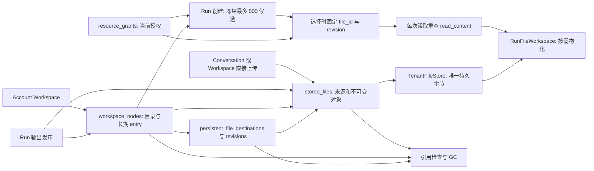

# Workspace v4.1 — P0～P5 整改验收

基线：`main@6118639d5bc57ac67fe407e3c827d43ca0fc272e`。设计依据：`docs/architecture/workspace-v4.1.md`。本轮使用隔离 PostgreSQL 数据库、Temporal namespace `hpagent-acceptance-20260926`、独立 TenantFileStore 和 Redis 测试 DB；现有开发库未清理或迁移。001～052 的迁移校验和未修改，新增 053。

## 本轮命令与实际结果

以下 PostgreSQL URL 均指向隔离数据库；API 与 Worker 使用各自角色。矩阵中的字母引用此表。

| 代号 | 实际命令 | 结果 |
|---|---|---|
| U | `.venv/bin/python -m pytest -q -m 'not postgres' test --tb=line` | 最终复跑 492 passed，26 skipped，285 deselected。 |
| P | `PYTHONPATH=src .venv/bin/python -m pytest -q --tb=line -m postgres test/web_persistence` | 216 passed，19 skipped；隔离 PostgreSQL。19 项需要额外 Temporal 条件，本命令不计验收。 |
| P2 | 同上，目标为 `test_workspace_v41_p2.py` 与 `test_resource_account_integrity.py` | 11 passed，真实 PostgreSQL。 |
| D | 同一隔离 PostgreSQL 环境运行 `test_workspace_docx_chain.py` | 1 passed；真实 DOCX 字节、文件编辑工具、发布、CAS revision 2、旧 Run revision 1 与冲突另存。 |
| A | `PYTHONPATH=src .venv/bin/python -m pytest -q --tb=line -m postgres test/web_api` | 最终复跑 46 passed，22 deselected；隔离 PostgreSQL/Redis。直接上传在不先 GET Workspace 的条件下又复跑 2 passed。 |
| T | `TEMPORAL_HOST=127.0.0.1:7233 TEMPORAL_NAMESPACE=TEMPORAL_TEST_NAMESPACE=hpagent-acceptance-20260926` 下运行 `test_web_temporal_integration.py`、`test_web_temporal_e2e.py`、`test_web_temporal_lifecycle.py`、`test_research_worker_kill.py` | 15 passed。现有 Research SIGKILL 测试仅覆盖 fetch 边界。 |
| T2 | 同一隔离 Temporal 环境运行 `test_workspace_v41_p4_temporal.py`、`test_durable_agent_activity_worker_kill.py` | 2 passed；覆盖现有保存 Activity 重试与 Durable Activity Worker 崩溃测试，未覆盖本轮要求的发布/保存全部强杀窗口。 |
| T3 | 同一隔离 Temporal 环境运行 `test_workspace_research_sigkill.py` | 最终复跑 2 passed；真实 Worker 分别在发布提交、长期保存提交后遭 SIGKILL，新 Worker 恢复。断言非空历史基线、保存意图和发布 operation ID 不变，报告、发布、entry 各一份。 |
| T4 | 同一隔离 Temporal 环境运行 `test_workspace_temporal_revoke_tool.py` | 1 passed；真实 Worker 执行阻塞文件读取，撤销后数据库进入 `cancelling` 且新读取拒绝；阻塞工具退出后 Run 临时目录才清理。客户端发送 cancel 后，测试专用 Workflow 在工具释放时仍正常返回；最终状态由测试在退出后手动确认，生产 Outbox 到回调链未覆盖。 |
| F | `cd web && npm run typecheck && npm run lint && npm run test -- --run && npm run build` | 全部通过；82 个前端单测、生产构建通过。 |
| B | `cd web && npx playwright test --project=chromium`，由 `web/scripts/e2e-backend.sh` 启动隔离服务 | 第二次完整运行 17 passed。第一次 16 passed、1 failed；trace 显示 Vite 资源 `ERR_NETWORK_CHANGED`，失败的 multi-tab 用例单独复跑 2 passed。 |
| S | `PYTHONPATH=src .venv/bin/python scripts/acceptance/workspace_scale.py` | 1k/10k 不同文件、发现、选择与按需物化通过；600 候选显式拒绝。 |
| L | `.venv/bin/python -m ruff check`（本轮 Python 修改文件）与 `.venv/bin/python -m mypy` | 通过；mypy 检查 37 个源文件。 |

### 规模测量

| Workspace 条目 | 不同文件 | 单文件 / 总字节 | Run 候选 | 实际物化 | 发现 | 选择并物化 | 峰值 RSS / 初始峰值增长 |
|---:|---:|---:|---:|---:|---:|---:|---:|
| 1,000 | 1,000 | 128 / 128,000 bytes | 400 | 20 个，2,560 bytes | 1.441 s | 7.728 s | 40,920 / 640 KiB |
| 10,000 | 10,000 | 128 / 1,280,000 bytes | 400 | 20 个，2,560 bytes | 1.966 s | 14.934 s | 40,920 / 640 KiB |

单进程 `ru_maxrss` 记录的是峰值，不代表生产 Worker 总内存。数据装载分别耗时 105.802 s 与累计 1110.135 s。每个 Run 遵守 500 候选上限，未尝试一次物化 10k 文件。

## I01～I19 证据矩阵

“通过”只用于本轮真实执行覆盖的断言；静态检查和旧阶段报告不代替运行验收。

| 编号 | 源码证据 | 本轮命令与实际结果 | 结论及未验收项 |
|---|---|---|---|
| I01 | `src/workspace/catalog.py:save_file` 建 entry，`src/web_domain/file_services.py` 发布唯一对象。 | A：直接上传保存后 `physical_bytes` 等于原始字节；S：10k 不同对象计数。 | 通过。 |
| I02 | `src/workspace/catalog.py:move` 更新 node 位置和名称。 | A：直接上传后移动并下载，内容不变；B：P1 浏览器移动下载通过。 | 通过。 |
| I03 | `stored_files.source_run_id`、`runs.task_id`、Research 保存意图。 | P：P4 30 次独立 Research Run；T3：发布/保存两个提交后强杀窗口恢复通过。 | 通过本轮独立 Task 来源与恢复场景。 |
| I04 | `src/workspace/file_scope.py` 的 Run 输入绑定保留文件来源。 | P：P0 发布 DOCX 后作为下一 Run 输入的用例通过。 | 通过该输入来源契约；完整 DOCX 编辑链见 I13。 |
| I05 | `src/workspace/resources.py:snapshot_in_uow` 冻结候选并限制 500。 | P2 候选不扩张通过；S 中 400 候选按需使用、600 候选拒绝。 | 通过。 |
| I06 | `run_resource_candidates`、`run_resource_access`、`RunFileWorkspace` 区分选择/物化/读取。 | P2 读取状态通过；S 在 1k/10k 条目下各只物化 20 个。 | 通过；内存仅测单进程峰值。 |
| I07 | `ResourcePolicy.revoke` 对主体全部已选资源重算；`candidates` 重查元数据权限。 | P2：目录/文件两种撤销顺序、仍有效/全失效、重复撤销、冻结候选隐藏通过；T4：真实 Worker 新读取拒绝。 | 通过撤销后权限收敛；生产取消确认链见 I08。 |
| I08 | `src/workspace/resources.py`、`src/workspace/file_scope.py`、Durable 取消链路。 | P2 受控阻塞 adapter；T4 真实 Worker 证明 `cancelling` 与工具退出/临时目录清理分离。 | 部分通过：T4 的 Temporal cancel 与最终确认由测试显式调用，生产 Outbox 自动派发和回调未验收。 |
| I09 | `src/web_domain/file_lifecycle.py` 引用检查，`src/web_domain/file_cleanup.py` 清理。 | A：直接上传 entry 保留时拒绝删除，移除后 GC 删除持久字节；P：P1 GC 竞态和失败重试通过。 | 通过本轮 GC 契约。 |
| I10 | P0/P4 的独立 Research Run 来源与 Workspace 保存代码。 | P：独立输出、30 次受控 Research Run 与保存；T3 发布/保存强杀恢复通过。 | 通过本轮受控 Research 链；外部 provider 未运行。 |
| I11 | Research Task 冻结目录与保存操作 ID。 | P：P4 目标改动、固定旧目标与保存重试测试通过。 | 通过该持久化契约。 |
| I12 | `output_publish_operations`、`workspace_save_operations`、`workspace_version_operations`。 | A：直接上传创建重放；P：P0 发布、P3 版本、P4 保存重试；T3：两个跨进程提交后强杀窗口均恢复且 operation ID 不变。 | 通过本轮指定故障窗口；其它故障点未逐一枚举。 |
| I13 | `src/workspace/catalog.py` CAS 更新保留冲突输出。 | P：P3 并发 CAS；D：真实 DOCX 字节、文件工具、PostgreSQL 与 FileStore 完成上传→授权→修改→发布→revision 2→旧 Run 仍读 revision 1→冲突另存。 | 通过。 |
| I14 | `claim_file_deletion` 行锁下检查 entry、revision 与 Run 绑定。 | A：直接上传 GC；P：P1 并发、失败重试及修订保留通过。 | 通过本轮 GC 并发契约。 |
| I15 | `src/workspace/discovery.py` 以 file_id/hash 与当前权限过滤摘要。 | P：P4 历史读撤销及 P5 摘要搜索授权测试通过。 | 通过该数据库契约。 |
| I16 | Research required 保存意图与 Durable/Outbox/Temporal 主链。 | T+T2+T3：19 个真实 Temporal 测试通过；T3 发布与 Workspace 保存提交后 Worker SIGKILL，新 Worker 恢复，业务结果各一份。 | 通过本轮两个跨进程故障窗口。 |
| I17 | `src/persistence/migrate.py` Schema Gate；迁移 053。 | 隔离空库 001～053 成功；U 中 Gate 替身测试和 B 真实服务启动通过。 | 通过。 |
| I18 | 普通 Workspace 路径位于 `src/workspace`、`src/web_api/app.py`、`web/src`。 | A：直接访问旧 `/api/v1/persistent-files/{logical_path}` 返回 404，最终 schema 无 `persistent_file_destinations.logical_path`；旧工具和审批卡仅静态审查。 | 部分通过，旧工具/卡的动态不可达探针未运行。 |
| I19 | 普通文件链由 PostgreSQL、TenantFileStore、RunFileWorkspace 构成。 | A/B/S 执行文件流程，未设置 Git 工作区依赖。 | 部分通过；缺少显式无 Git 环境断言。 |

## 整改根因与缺口

- 指定 Actions Run `36240313481` 的 Job 元数据确认 PostgreSQL 契约、旧单元测试、lint/typecheck 三项失败。GitHub 日志 API 与网页读取均遇网络超时；失败内容按相同基线本地复现。旧契约失效是身份冲突文案、手工 Run scope 缺少授权回调、旧测试删除 Run 前未清资源快照；Document Worker 替身缺少 `include_selected`，两个 Schema Gate 替身没有真实连接，另有 mypy 两处错误。
- 直接 Workspace 上传不创建 Conversation/Message：`conversation_id=NULL`、真实 `source_workspace_id`。API/浏览器验证上传、幂等、失败后新操作重试、保存、移动、下载与跨 Conversation 授权候选；API 还验证移除 entry 后 GC 删除字节。
- 迁移 053 使用复合 FK 约束资源表的账户一致性，触发器核验多态主体与 Run。P2 的绕过 API 直接 SQL 恶意 ID 测试通过。
- 真实 Temporal 文件工具、Research 发布/保存强杀与完整 DOCX 业务链已补跑。T4 的取消与最终确认由测试显式触发，尚未证明生产 Outbox 自动派发及生命周期回调；I18 的旧工具/审批卡、I19 的无 Git 环境断言也仍缺动态验证，因此不得宣布 P0～P5 全部通过。
- 本轮提交已保存在本地 `codex/workspace-v41-final-acceptance`。GitHub HTTPS 推送两次、SSH 22/443 和 Actions 日志 API 均连接超时；新 HEAD 的远端 Actions 结果尚未取得，属于未验收项。

## 架构流程

