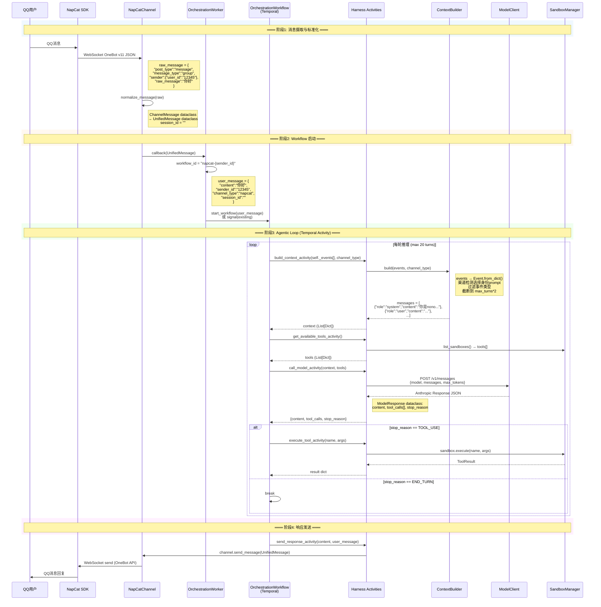

# HpAgent 架构与数据流分析

## 1. 四层架构总览

```
┌─────────────────────────────────────────────────┐
│  Orchestrator (指挥) — Temporal Workflow         │
│  协调 Harness/Session/Sandbox 的 agentic loop     │
└────┬──────────────┬──────────────┬──────────────┘
     │              │              │
┌────▼────┐  ┌──────▼──────┐  ┌───▼───────────┐
│ Harness │  │  Session    │  │   Sandbox      │
│ (大脑)   │  │  (记忆)     │  │   (双手)       │
│ 无状态   │  │  事件存储    │  │   工具+通道     │
└────┬────┘  └─────────────┘  └───┬───────────┘
     │                             │
┌────▼─────────────────────────────▼────────────┐
│              Resources (资源)                   │
│         模型 API 密钥 + 退避链路                 │
└────────────────────────────────────────────────┘
```

### 各层职责

| 层 | 路径 | 职责 |
|---|------|------|
| Orchestrator | `src/orchestration/` | Temporal Workflow 协调 agentic loop，维护事件历史，确定性地调度各活动 |
| Harness | `src/harness/` | 无状态大脑操作：构建上下文、调用 LLM、执行工具、发送响应 |
| Session | `src/session/` | 会话生命周期管理、事件持久化（文件/数据库）、事件回溯 |
| Sandbox | `src/sandbox/` | 所有外部操作代理：工具执行、通道 I/O |
| Resources | `src/resources/` | 模型 API 密钥管理、退避链路、HTTP 代理 |

---

## 2. 模块间通讯方式

| 通讯路径 | 机制 | 数据格式 |
|---------|------|---------|
| Channel → Worker | asyncio callback | `UnifiedMessage` (dataclass) |
| Worker → Workflow | Temporal `start_workflow` / `signal` | `Dict[str, Any]` (user_message dict) |
| Workflow → Harness | Temporal `execute_activity` | `List[Dict]` (events), `List[Dict]` (tools) |
| Harness → LLM | httpx `POST /messages` | Anthropic-compatible JSON |
| Harness → Sandbox | 直接 Python 方法调用 | `tool_name: str, arguments: Dict` |
| Harness → Channel | 直接 Python 方法调用 | `UnifiedMessage` |
| 外部 → Workflow | Temporal `query` / `signal` | `get_events`, `cancel_session` |

---

## 3. 数据格式定义

### 3.1 核心类型 (`src/common/types.py`)

#### Event — 系统内部通用事件
```
Event
├── event_id: str          # UUID
├── session_id: str        # 所属会话 ID（当前为空字符串）
├── timestamp: float       # 事件时间戳
├── event_type: EventType  # USER_MESSAGE | MODEL_MESSAGE | TOOL_CALL | TOOL_RESULT | ERROR | ...
├── content: Dict          # 事件核心数据（含 channel_type, sender_id, text 等）
└── metadata: Dict         # 附加元数据
```

#### UnifiedMessage — 统一消息格式（跨渠道标准化）
```
UnifiedMessage
├── message_id: str         # UUID
├── session_id: str         # 所属会话 ID（当前为空字符串，未使用）
├── sender_id: str          # 发送者标识（QQ号、Web用户ID等）
├── channel_type: ChannelType  # NAPCAT | WEB | CONSOLE
├── content: str            # 消息文本
├── timestamp: float        # 发送时间
├── metadata: Dict          # 渠道特定元数据（post_type, detail_type, group_id 等）
└── media_urls: List[str]   # 附件 URL
```

#### 其他关键类型
```
ChannelType:  NAPCAT | WEB | CONSOLE
EventType:    USER_MESSAGE | MODEL_MESSAGE | TOOL_CALL | TOOL_RESULT | ERROR
             | SESSION_START | SESSION_COMPLETE | SESSION_ARCHIVED | ...
StopReason:   END_TURN | TOOL_USE | MAX_TOKENS | REFUSAL | ERROR
ModelResponse: content + tool_calls[] + stop_reason + usage
ToolCall:     id + name + arguments{}
ToolResult:   tool_call_id + status + content + error
SessionMetadata: session_id + creator_id + channel_type + tags + status
```

### 3.2 Session 层类型 (`src/session/models.py`)

```
Session
├── session_id: str
├── status: SessionStatus    # ACTIVE | ARCHIVED | COMPLETED
├── creator_id: str          # 创建者 ID（渠道 sender_id）
├── channel_type: str        # 渠道类型字符串
├── tags: List[str]
├── created_at / updated_at: float
└── metadata: Dict

EventRecord  (持久化用)
├── event_id + session_id + event_index
├── timestamp + event_type
└── content + metadata
```

---

## 4. 完整数据流时序图



---

## 5. 数据格式转换链

```
OneBot JSON (dict, WebSocket)
  │  napcat.py:normalize_message()
  ▼
ChannelMessage (dataclass)
  │  .to_unified_message(session_id="")
  ▼
UnifiedMessage (dataclass)           ← 核心传输格式，跨模块边界
  │  worker.py: 解构为 dict
  ▼
user_message dict                    ← Temporal Workflow 入参
  │  workflow.py: 存入 self._events[]
  ▼
self._events[] (List[Dict])          ← 事件存储在 Workflow 内存
  │  activities.py: Event.from_dict()
  ▼
Event (dataclass)                    ← ContextBuilder 消费
  │  context_builder.py: build()
  ▼
messages[] (List[Dict])              ← LLM API 格式
  │  model_client.py: POST /messages
  ▼
ModelResponse (dataclass)            ← LLM 返回
  │  activities.py: 解构为 dict 回 Workflow
  ▼
Back to self._events[]               ← 写入事件历史
  │
  ... (loop 直到 END_TURN)
  │
  ▼
send_response_activity()
  │  UnifiedMessage 重建
  ▼
NapCatChannel.send_message()
  │  → OneBot API JSON → WebSocket
  ▼
QQ 消息回复
```

---

## 6. Session / Workflow ID 的生成逻辑

### 当前逻辑 (`src/orchestration/worker.py:91`)

```python
workflow_id = f"napcat-{message.sender_id}"
```

- `sender_id` 来自 NapCat WebSocket 事件中的 `data.sender.user_id`
- 对私聊：`sender_id` = QQ 号
- 对群聊：`sender_id` = 发送者的 QQ 号
- 同一 QQ 用户的所有消息路由到同一个 Workflow

### 问题

- `sender_id` 是渠道特定的（QQ号仅在 NapCat 渠道中有意义）
- Web 渠道的用户 ID 与 QQ 号完全不同
- 即使同一用户，QQ 端和 Web 端对应不同的 workflow_id，事件历史无法共享

---

## 7. 事件存储现状

```
                    ┌──────────────────────────────┐
                    │ OrchestrationWorkflow        │
                    │ self._events: List[Dict]      │  ← 唯一事实的事件存储
                    │ (Temporal Event History)      │
                    └──────────┬───────────────────┘
                               │
            ┌──────────────────┼──────────────────┐
            │                  │                  │
    ┌───────▼───────┐  ┌──────▼──────┐  ┌────────▼────────┐
    │ get_events()  │  │ get_status()│  │ cancel_session()│
    │ Query         │  │ Query       │  │ Signal          │
    └───────────────┘  └─────────────┘  └─────────────────┘

TemporalSessionManager          ← 通过 Query 读取，写入是 no-op
FileSessionRepository           ← JSON 文件存储，已实现但未接入主流程
FileEventRepository             ← JSON 文件存储，已实现但未接入主流程
```

**关键问题**：`SessionManager` / `FileSessionRepository` 存在于代码中但从未被 `init_dependencies()` 初始化或注入，主流程完全不知道它们的存在。
