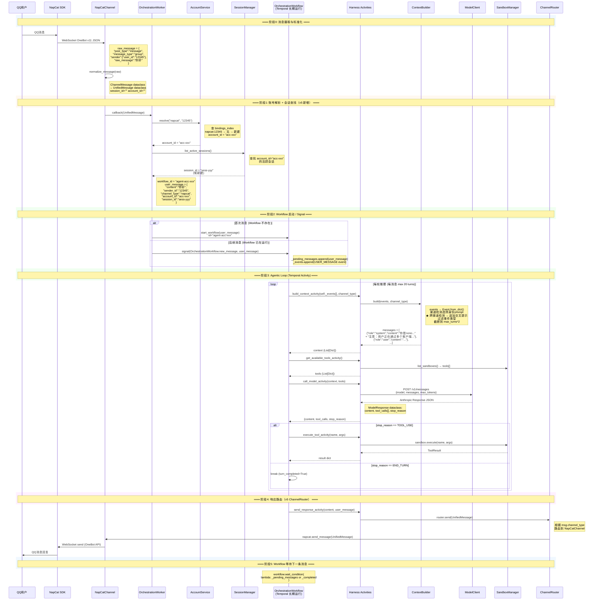

# HpAgent v5 架构与数据流分析

## 1. 五层架构总览

```
┌──────────────────────────────────────────────────────────┐
│  Orchestrator (指挥) — Temporal Workflow                  │
│  长期运行：协调 Harness/Session/Sandbox 的 agentic loop    │
│  通过 signal 接收跨渠道消息，event history 统一存储        │
└────┬──────────────┬──────────────┬──────────────┬────────┘
     │              │              │              │
┌────▼────┐  ┌──────▼──────┐  ┌───▼───────────┐  ┌───────▼──────┐
│ Harness │  │  Account    │  │   Session     │  │   Sandbox    │
│ (大脑)   │  │  (身份)     │  │   (记忆)      │  │   (双手)     │
│ 无状态   │  │  渠道→账号   │  │   事件持久化   │  │   工具+通道   │
│Activity │  │  统一解析    │  │   文件/PG双模  │  │   ChannelRouter│
└────┬────┘  └─────────────┘  └───────────────┘  └───┬───────────┘
     │                                                │
┌────▼────────────────────────────────────────────────▼────────┐
│                    Resources (资源)                           │
│               模型 API 密钥 + 退避链路                         │
└──────────────────────────────────────────────────────────────┘
```

### 各层职责

| 层 | 路径 | 职责 |
|---|------|------|
| Orchestrator | `src/orchestration/` | Temporal Workflow 长期运行，通过 signal 接收跨渠道消息，`self._events[]` 混存 QQ+Web 历史 |
| Harness | `src/harness/` | 无状态大脑操作：构建上下文、调用 LLM、执行工具、通过 ChannelRouter 发送响应 |
| Account | `src/account/` | **v5 新增** — 渠道 ID → 统一账号 ID 解析，支持多渠道路由到同一 Workflow |
| Session | `src/session/` | 会话生命周期管理、事件持久化（文件/PostgreSQL 双后端）、事件回溯 |
| Sandbox | `src/sandbox/` | 所有外部操作代理：工具执行、ChannelRouter 多渠道 I/O 路由 |
| Resources | `src/resources/` | 模型 API 密钥管理、退避链路、HTTP 代理 |

---

## 2. 模块间通讯方式

| 通讯路径 | 机制 | 数据格式 |
|---------|------|---------|
| Channel → Worker | asyncio callback | `UnifiedMessage` (dataclass) |
| Worker → AccountService | 直接 Python 方法调用 | `(channel_type, channel_user_id) → account_id` |
| Worker → SessionManager | 直接 Python 方法调用 | `SessionMetadata`, `Session` |
| Worker → Workflow | Temporal `start_workflow` / `signal` | `Dict[str, Any]` (user_message dict，含 account_id + session_id) |
| Workflow → Harness | Temporal `execute_activity` | `List[Dict]` (events), `List[Dict]` (tools) |
| Harness → LLM | httpx `POST /messages` | Anthropic-compatible JSON |
| Harness → Sandbox | 直接 Python 方法调用 | `tool_name: str, arguments: Dict` |
| Harness → Channel | ChannelRouter → IChannel | `UnifiedMessage` (按 channel_type 路由) |
| 外部 → Workflow | Temporal `query` / `signal` | `get_events`, `get_status`, `new_message`, `cancel_session` |

---

## 3. 数据格式定义

### 3.1 核心类型 (`src/common/types.py`)

#### Event — 系统内部通用事件
```
Event
├── event_id: str          # UUID
├── session_id: str        # 所属会话 ID
├── timestamp: float       # 事件时间戳
├── event_type: EventType  # USER_MESSAGE | MODEL_MESSAGE | TOOL_CALL | TOOL_RESULT | ERROR | ...
├── content: Dict          # 事件核心数据（含 channel_type, sender_id, account_id, text 等）
└── metadata: Dict         # 附加元数据
```

#### UnifiedMessage — 统一消息格式（v5 新增 account_id）
```
UnifiedMessage
├── message_id: str         # UUID
├── session_id: str         # 所属会话 ID
├── account_id: str         # ★ v5 新增：统一用户账号 ID（跨渠道关联）
├── sender_id: str          # 发送者标识（QQ号、Web用户ID等——渠道级别）
├── channel_type: ChannelType  # NAPCAT | WEB | CONSOLE
├── content: str            # 消息文本
├── timestamp: float        # 发送时间
├── metadata: Dict          # 渠道特定元数据（post_type, detail_type, group_id 等）
└── media_urls: List[str]   # 附件 URL
```

#### 其他关键类型
```
ChannelType:  NAPCAT | WEB | CONSOLE
EventType:    USER_MESSAGE | MODEL_MESSAGE | TOOL_CALL | TOOL_RESULT | ERROR
             | SESSION_START | SESSION_COMPLETE | SESSION_ARCHIVED | ...
StopReason:   END_TURN | TOOL_USE | MAX_TOKENS | REFUSAL | ERROR
ModelResponse: content + tool_calls[] + stop_reason + usage
ToolCall:     id + name + arguments{}
ToolResult:   tool_call_id + status + content + error
SessionMetadata: session_id + account_id + creator_id + channel_type + tags + status
```

### 3.2 Account 层类型 (`src/account/models.py`)

```
Account
├── account_id: str              # 统一账号 ID (UUID)
├── bindings: Dict[str, str]     # 渠道类型 → 渠道用户 ID 映射
│                                #   例: {"napcat": "12345", "web": "user_abc"}
├── created_at: float
└── updated_at: float
```

### 3.3 Session 层类型 (`src/session/models.py`)

```
Session
├── session_id: str
├── account_id: str              # ★ v5 新增：统一用户账号 ID
├── status: SessionStatus        # ACTIVE | ARCHIVED | COMPLETED
├── creator_id: str              # 会话创建者 ID（渠道 sender_id）
├── channel_type: str            # 渠道类型字符串
├── tags: List[str]
├── created_at / updated_at: float
└── metadata: Dict

EventRecord  (持久化用)
├── event_id + session_id + event_index
├── timestamp + event_type
└── content + metadata
```

### 3.4 Sandbox 层类型 (`src/sandbox/`)

```
ToolDefinition:    name + description + parameters + tool_type + metadata
ToolResult:        success + output + error + metadata
ToolType:          NATIVE | MCP | SKILL

ChannelMessage  (渠道内部中间格式)
├── message_id + sender_id + content
├── channel_type + timestamp
├── metadata + media_urls + reply_to_id
└── → to_unified_message(session_id="") → UnifiedMessage
```

---

## 4. 完整数据流时序图



---

## 5. 数据格式转换链（含 v5 新增步骤）

```
OneBot JSON (dict, WebSocket)
  │  napcat.py:normalize_message()
  ▼
ChannelMessage (dataclass)
  │  .to_unified_message(session_id="")
  ▼
UnifiedMessage (dataclass)           ← 核心传输格式，跨模块边界
  │  account_id="" (此时尚未解析)
  │
  │  worker.py: account_service.resolve(channel_type, sender_id)
  ▼
account_id = "acc-xxx"               ← ★ v5 新增步骤
  │
  │  worker.py: session_manager → session_id
  ▼
session_id = "sess-yyy"              ← ★ v5 新增步骤
  │
  │  worker.py: 解构为 dict
  ▼
user_message dict                    ← Temporal Workflow 入参
  │  {content, sender_id, channel_type, account_id, session_id, metadata, timestamp}
  │
  │  workflow.py: 存入 self._events[]
  ▼
self._events[] (List[Dict])          ← 事件存储在 Workflow 内存
  │  含 "type": "USER_MESSAGE"|"MODEL_MESSAGE"|"TOOL_RESULT"
  │
  │  activities.py: Event.from_dict()
  ▼
Event (dataclass)                    ← ContextBuilder 消费
  │  context_builder.py: build()
  ▼
messages[] (List[Dict])              ← LLM API 格式
  │  含 system (渠道身份+跨渠道提示) + user + assistant + tool_result
  │  model_client.py: POST /messages
  ▼
ModelResponse (dataclass)            ← LLM 返回
  │  activities.py: 解构为 dict 回 Workflow
  ▼
Back to self._events[]               ← 写入事件历史
  │
  ... (loop 直到 END_TURN)
  │
  ▼
send_response_activity()
  │  UnifiedMessage 重建（含 account_id, channel_type）
  ▼
ChannelRouter.send(msg)
  │  根据 msg.channel_type 路由
  ├── NAPCAT → NapCatChannel.send_message()
  │              → OneBot API JSON → WebSocket
  │              → QQ 消息回复
  └── WEB    → WebChannel (规划中)
                 → WebSocket 推送
```

---

## 6. Workflow ID / Session ID 生成逻辑

### v5 逻辑 (`src/orchestration/worker.py`)

```
Channel Message
  │
  ├─ sender_id = "12345" (QQ号)
  ├─ channel_type = "napcat"
  │
  ▼
AccountService.resolve("napcat", "12345")
  │  查 bindings_index: napcat → 12345 → account_id
  │  若无则新建: account_id = uuid4()
  │
  ▼
account_id = "acc-xxx"
  │
  ▼
workflow_id = f"agent-{account_id}"
  │  例: "agent-acc-xxx"
  │
  ▼
同一用户在 QQ 端和 Web 端：
  QQ:  sender_id="12345" → account_id="acc-xxx" → workflow_id="agent-acc-xxx"
  Web: sender_id="user_abc" → account_id="acc-xxx" → workflow_id="agent-acc-xxx"
  ★ 两个渠道路由到同一个 Workflow，事件历史完全共享
```

### v4 → v5 对比

| 维度 | v4 | v5 |
|------|----|----|
| workflow_id 格式 | `napcat-{sender_id}` | `agent-{account_id}` |
| 键值来源 | 渠道 sender_id (QQ号) | 统一 account_id (UUID) |
| QQ/Web 共享 | 否（两个独立 Workflow） | 是（同一个 Workflow） |
| 账号解析 | 无 | AccountService.resolve() |
| 会话管理 | session_id 闲置 | SessionManager 接入 |

---

## 7. 事件存储架构

```
                    ┌──────────────────────────────────────┐
                    │ OrchestrationWorkflow                │
                    │ self._events: List[Dict]              │  ← 运行时事件存储
                    │ (Temporal Event History)              │    QQ+Web 事件混存
                    │                                      │
                    │ _pending_messages: List[Dict]         │  ← 信号队列
                    │                                      │
                    │ long-running: wait_condition 等待     │
                    └──────────┬───────────────────────────┘
                               │
            ┌──────────────────┼──────────────────┐
            │                  │                  │
    ┌───────▼───────┐  ┌──────▼──────┐  ┌────────▼────────┐
    │ get_events()  │  │ get_status()│  │ cancel_session()│
    │ Query         │  │ Query       │  │ Signal          │
    └───────────────┘  └─────────────┘  └─────────────────┘

    ┌──────────────────────────────────────────────────────┐
    │ 持久化层（可选，双后端）                                │
    │                                                      │
    │ FileSessionRepository    ← JSON 文件 (sessions.json,  │
    │ FileEventRepository        events.json)              │
    │                                                      │
    │ PostgresSessionRepository ← PostgreSQL (docker-compose│
    │ PostgresEventRepository     hpagent-postgresql)      │
    │ PostgresAccountRepository                            │
    └──────────────────────────────────────────────────────┘
```

---

## 8. ChannelRouter 路由机制

```
                     ChannelRouter
                    ┌─────────────────────────────────┐
                    │ _channels: Dict[ChannelType,     │
                    │             IChannel]            │
                    │                                 │
                    │ NAPCAT  → NapCatChannel         │
                    │ WEB     → WebChannel (规划中)    │
                    │ CONSOLE → ConsoleChannel         │
                    └────────────┬────────────────────┘
                                 │
                    router.send(UnifiedMessage)
                                 │
                    ┌────────────┴────────────┐
                    │ msg.channel_type        │
                    │                         │
            ┌───────▼───────┐        ┌───────▼───────┐
            │ NapCatChannel │        │ WebChannel    │
            │ send_message  │        │ send_message  │
            │ → QQ 回复     │        │ → WebSocket   │
            └───────────────┘        └───────────────┘
```

---

## 9. ContextBuilder Prompt 组装顺序（v5 更新）

```
_build_system_prompt(events, channel_type)
  │
  ├─ 1. 渠道身份声明 (_pick_identity)
  │      NAPCAT → nono猫娘 | CONSOLE → CLI助手 | WEB → Web助手
  │
  ├─ 2. 渠道风格提示 (_pick_style_guidance)
  │      NAPCAT → 聊天风格 | CONSOLE → 极简输出 | WEB → Markdown
  │
  ├─ 3. 跨渠道提示 (_build_cross_channel_hint)  ← ★ v5 新增
  │      检测 events 中是否存在多个 channel_type
  │      若有 → "注意：用户正在通过多个客户端（napcat, web）与你对话..."
  │
  ├─ 4. 工具使用纪律 (TOOL_USE_ENFORCEMENT_GUIDANCE)
  │
  ├─ 5. 环境感知 (_build_environment_hints)
  │      Docker/Linux → 容器环境提示
  │
  └─ 6. 项目上下文 (_build_context_files)
         .hermes.md / CLAUDE.md / .cursorrules / SOUL.md
```
