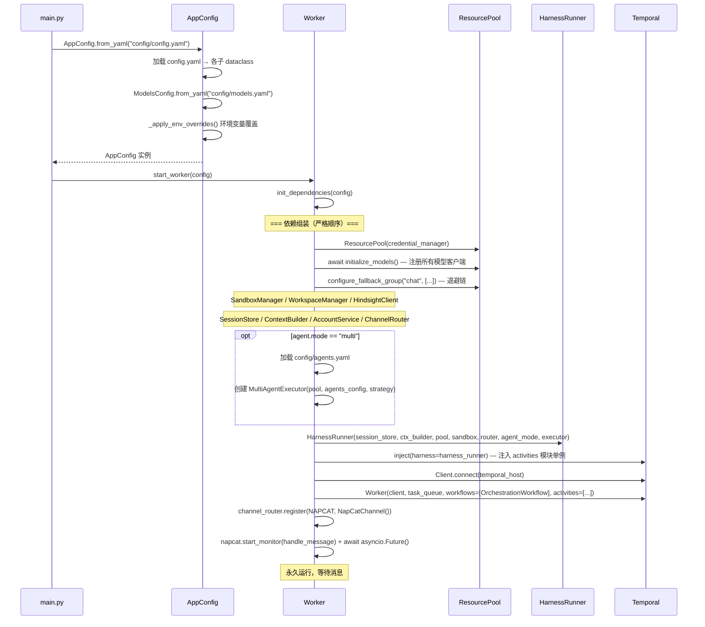
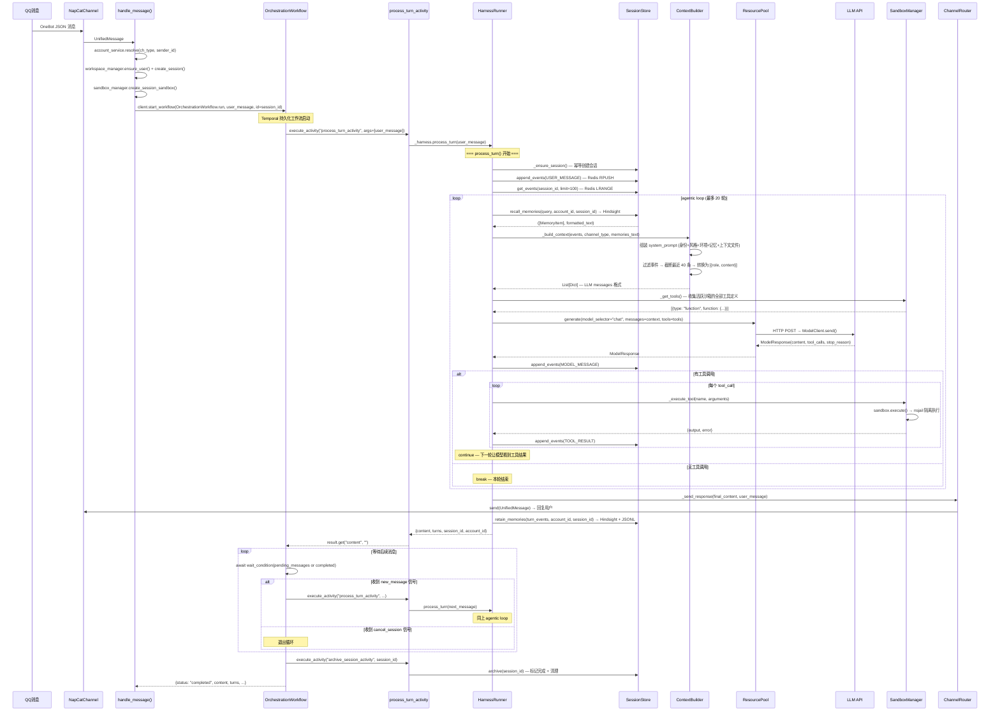
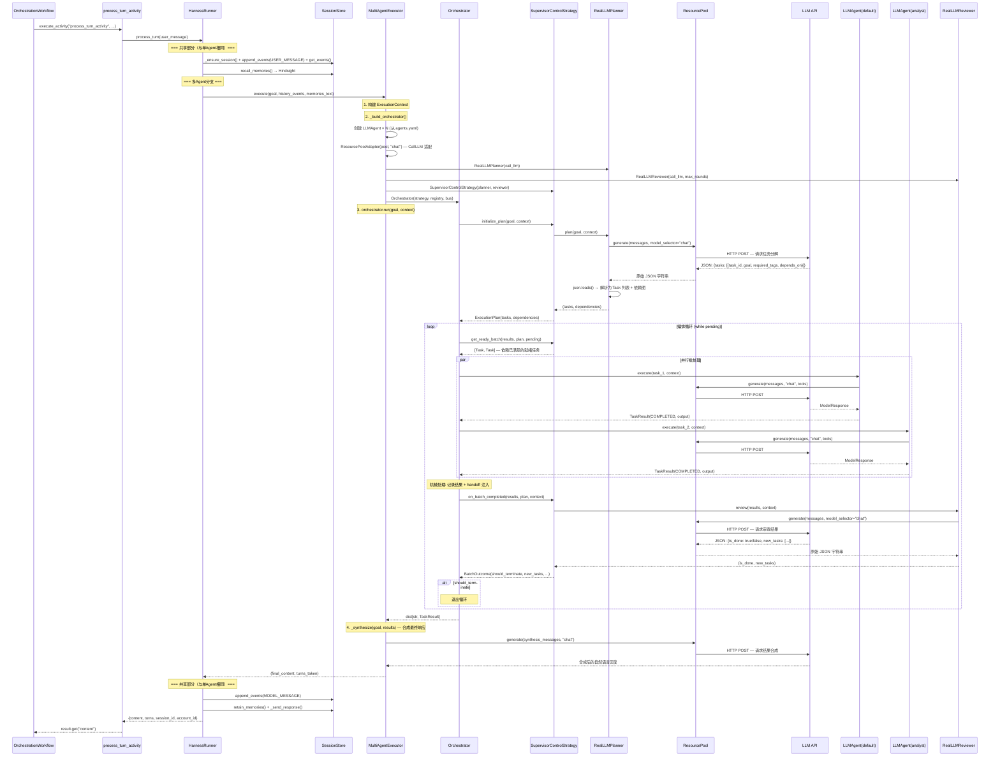
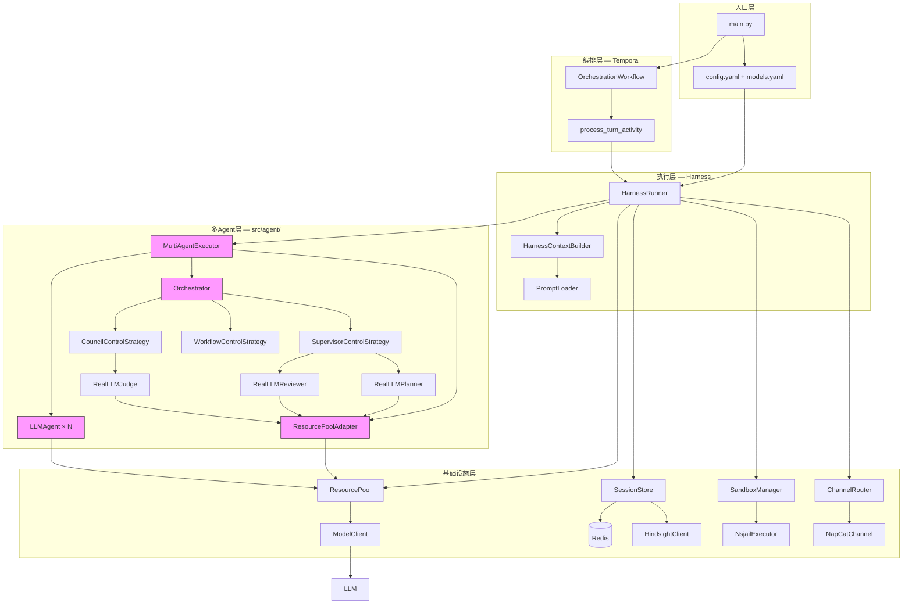

# HpAgent 项目流程时序图

## 1. 启动流程



## 2. 单Agent模式 — 消息处理全链路



## 3. 多Agent模式 — 消息处理全链路



## 4. 组件依赖关系



## 5. 阅读代码的推荐顺序

按数据流从外到内、从简到繁：

| 顺序 | 文件 | 看什么 |
|------|------|--------|
| 1 | `src/main.py` | 入口 — 加载配置 → 启动 Worker |
| 2 | `config/config.yaml` | 理解可配置项 |
| 3 | `src/orchestration/config.py` | 配置 dataclass 层次结构 |
| 4 | `src/agent/types.py` | 核心数据类型 (Task / TaskResult / ExecutionPlan / BatchOutcome) |
| 5 | `src/agent/interfaces.py` | 5个抽象基类 (BaseAgent / ControlStrategy / AgentRegistry / MessageBus) |
| 6 | `src/agent/context.py` | ExecutionContext + SharedMemory |
| 7 | `src/agent/llm_agent.py` | 最简 Agent 实现 — 理解 Agent 如何执行任务 |
| 8 | `src/agent/factory.py` | 三个 build_* 工厂函数 — 理解编排器如何组装 |
| 9 | `src/agent/strategies.py` | 三种 Strategy (Supervisor/Council/Workflow) + RealLLM* |
| 10 | `src/agent/orchestrator.py` | 纯机械调度循环 — 并行批处理 + 超时 + handoff |
| 11 | `src/agent/runner.py` | MultiAgentExecutor — 多Agent执行器（桥接 HarnessRunner） |
| 12 | `src/harness/runner.py` | HarnessRunner — 单Agent/多Agent 统一入口 |
| 13 | `src/orchestration/worker.py` | 依赖组装 + Temporal Worker 启动 |
| 14 | `src/orchestration/workflow.py` | Temporal Workflow 编排层 |

## 6. 关键数据流

```
用户消息
  → UnifiedMessage (渠道层)
  → user_message dict (Worker)
  → Temporal Workflow 输入
  → HarnessRunner.process_turn()
      ├── [单Agent] ReAct 循环
      │     Event → ContextBuilder → [{role, content}] → ResourcePool.generate()
      │     → ModelResponse → Event → tools → ... → 回复
      │
      └── [多Agent] MultiAgentExecutor.execute()
            user_content → LLM(Planner) → ExecutionPlan(tasks)
            → 并行 LLMAgent × N → dict[str, TaskResult]
            → LLM(Reviewer) → BatchOutcome → ...
            → LLM(Synthesizer) → 回复
  → ChannelRouter.send(UnifiedMessage)
  → 用户看到回复
```
