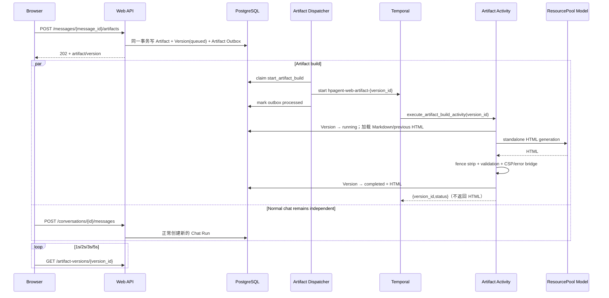

# Web Artifact 改造关键流程

本文记录 2026-08-15 Web Artifact 改造后的领域边界、持久化流程、运行组合和安全策略，作为后续排障与迭代依据。

## 1. 不变量

- Chat Run 仍只代表一次 Agent 对话执行，主结果仍是 completed Assistant Markdown Message。
- Artifact 只能从属于当前账号、状态为 `completed`、内容非空的 assistant message 派生。
- Artifact Build 不创建 `runs`，不查询或占用 conversation active-run 锁。
- Artifact 失败只改变 `artifact_versions`，不回写 source message 或 source run。
- HTML 不进入 `messages.content`、Hindsight 或 Temporal Event History；Activity 在返回前直接把 HTML 提交 PostgreSQL。
- QQ 的 `ExecutionRequest`、`ExecutionResult`、Host 与执行协议没有 Artifact 语义。

## 2. 资源模型

Migration：`persistence/migrations/010_web_artifacts.sql`。

```text
completed assistant message
  └─ artifacts (0..n)
       └─ artifact_versions (1..n)
            └─ artifact_outbox_events (start_artifact_build)
```

`artifacts.source_message_id` 是来源事实。版本状态为 `queued → running → completed|failed`，数据库约束保证 completed 才能保存 HTML、failed 不保存半成品 HTML。新版本默认以最新 completed version 为 parent；失败版本不会成为后续默认 parent。

Artifact 使用独立 `artifact_outbox_events`，没有伪造 `run_id`，并保留 pending/processing/processed/dead_letter、attempt count、lease 与过期恢复语义。

## 3. 创建与构建时序



Workflow ID 固定为 `hpagent-web-artifact-{artifact_version_id}`。Outbox 重试启动同一个 ID，Temporal `REJECT_DUPLICATE` 防止生成第二个 Version。

## 4. API

| 方法 | 路径 | 用途 |
|---|---|---|
| POST | `/api/v1/messages/{message_id}/artifacts` | 创建 Artifact 与 v1，需 CSRF/Idempotency-Key |
| GET | `/api/v1/messages/{message_id}/artifacts` | 刷新后恢复某消息的 Artifact |
| GET | `/api/v1/artifacts/{artifact_id}` | 获取 Artifact 与最新 Version |
| GET | `/api/v1/artifacts/{artifact_id}/versions` | 获取全部版本 |
| POST | `/api/v1/artifacts/{artifact_id}/versions` | 按 instruction 创建新版本 |
| GET | `/api/v1/artifact-versions/{version_id}` | Poll build 状态 |

所有查询都带 `account_id` 条件。创建来源时也先验证 account ownership；跨账号资源统一表现为 404。

`idempotency_commands.operation` 新增 `create_artifact` 和 `create_artifact_version`。相同 key + 相同 payload 重放原 202 响应；相同 key + 不同 payload 返回 `idempotency_conflict`。

## 5. Generator 与模型入口

`WebArtifactGenerator` 由主 worker composition 创建，复用已初始化的 `WorkerDependencies.resource_pool`，选择 `chat` model chain；构造函数不创建模型客户端。输入始终包含 source Markdown，版本修改额外包含 previous completed HTML 与 instruction。

输出处理：

1. 剥离单个最外层 `html` Markdown fence。
2. 验证非空且包含完整 `<html>...</html>`。
3. 注入 restrictive CSP 与 runtime error bridge。
4. 按 `ARTIFACT_HTML_MAX_BYTES` 检查 UTF-8 大小，默认 1 MiB。
5. Activity 事务提交 completed + HTML；错误则提交 failed + 稳定 failure code。

稳定错误码包括 `artifact_model_timeout`、`artifact_model_unavailable`、`artifact_invalid_html`、`artifact_html_too_large`、`artifact_build_failed`。

## 6. 浏览器安全边界

前端不使用 `dangerouslySetInnerHTML`。completed HTML 通过：

```html
<iframe sandbox="allow-scripts" srcdoc="..."></iframe>
```

刻意不加入 `allow-same-origin`。系统在 Artifact `<head>` 注入：

```text
default-src 'none'
script-src 'unsafe-inline'
style-src 'unsafe-inline'
img-src data: blob:
font-src data:
connect-src 'none'
media-src data: blob:
object-src 'none'
frame-src 'none'
form-action 'none'
base-uri 'none'
```

因此 Artifact 可以操作自己的 DOM、运行内联 JS、使用 SVG/Canvas/data/blob，但不能访问父页面 DOM/storage/cookie、请求 HpAgent API/外网、加载外部脚本样式或嵌套页面。runtime error bridge 使用 `postMessage`；父页面只接受 `event.source === iframe.contentWindow` 的消息。

## 7. 前端状态与恢复

`web/src/store/artifacts.ts` 独立于 `workbench.ts`。Artifact 的 queued/running 状态不会修改 `activeRun`、`isRunning` 或 Composer disabled 状态。右侧 Panel 只在用户生成/打开 Artifact 后出现；窄屏转为覆盖层。

普通消息继续由 `ReactMarkdown` 渲染。completed assistant message 下显示生成/打开操作。Artifact 创建后按 1s、2s、3s、5s 上限轮询，terminal 后停止。刷新后第一次点击消息下的 Artifact 操作会通过 message list API 恢复资源，再加载 versions；不依赖 Zustand 的旧内存。

## 8. Worker 组合与运维

Artifact Workflow/Activity 注册到现有 Web lifecycle Worker 进程，不新增容器。主 worker 与 standalone Web worker 都启动 Artifact dispatcher 和独立 lease recovery task，并在 shutdown 时取消任务。

关键配置：

```bash
export ARTIFACT_HTML_MAX_BYTES=1048576
```

关键验证命令：

```bash
.venv/bin/python -m pytest -q test/test_web_artifacts.py
.venv/bin/python -m pytest -q test/test_qq_execution_compat.py
cd web && TMPDIR=/tmp npm run typecheck
cd web && TMPDIR=/tmp npm test
cd web && TMPDIR=/tmp npm run build
```

需要 PostgreSQL/Temporal 的持久化与 E2E 测试仍使用项目既有环境变量和 compose 测试栈。全量本地 Python 测试若容器不允许 nsjail namespace，会出现 `exit_code=255`，该环境失败与 Artifact 逻辑无关。

## 9. 当前实现范围

已实现 standalone HTML/CSS/JS、durable build、版本修改、polling、安全 iframe、CSP、runtime error 隔离与刷新恢复路径。未引入 token streaming、React/TSX Artifact、CDN/npm、公开分享、HTML Hindsight retain 或自然语言自动识别 Artifact intent。
