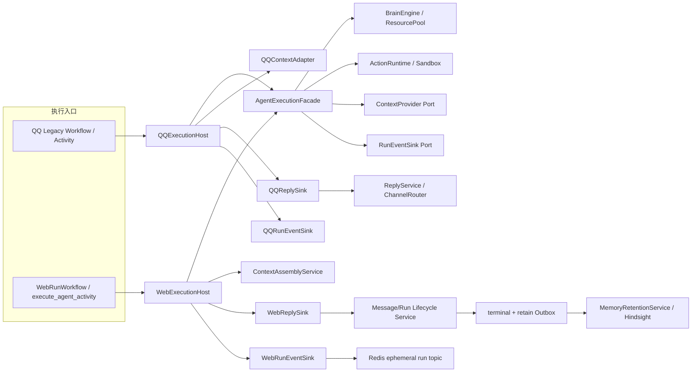

# HpAgent Agent 执行内核融合设计

## 1. 文档信息

| 项目 | 内容 |
|---|---|
| 文档版本 | 0.2 |
| 状态 | 已评审 |
| 文档类型 | Agent 执行内核融合详细设计 |
| 日期 | 2026-08-04 |
| 需求基线 | [HpAgent Web MVP 需求规格说明书 0.4](hpagent-web-mvp-requirements.md) |
| 领域基线 | [HpAgent Web 领域模型与状态模型设计 0.3](hpagent-web-domain-and-state-model.md) |
| 架构基线 | [HpAgent Web 系统架构设计 0.4](hpagent-web-system-architecture.md) |
| 数据基线 | [HpAgent Web 数据库与持久化详细设计 0.3](hpagent-web-database-design.md) |
| API 基线 | [HpAgent Web API 与 SSE 契约 0.3](hpagent-web-api-contract.md) |
| Temporal 基线 | [HpAgent Web Temporal 与执行生命周期详细设计 0.2](hpagent-web-temporal-design.md) |

本文定义现有 QQ Agent 内核如何在不伪装渠道、不共享错误短期上下文、不破坏现有 QQ 行为的前提下同时服务 Web。融合目标是共享模型、工具、Sandbox 和 Agentic Loop，而不是让 Web 复用 QQ 的入站消息、ChannelRouter、account 级 Session 指针或长期 Workflow。

## 2. 范围与非目标

### 2.1 本文范围

- 从现有 `TurnOrchestrator` 提取渠道无关执行能力。
- 定义 `AgentExecutionFacade`、`RunEventSink`、`ReplySink`。
- 定义 Web/QQ 的 Context、Reply、Event 和 Memory 适配方式。
- 把 Web Session、Conversation、Message、Run 与现有 Sandbox/Workspace 对接。
- 明确 Web delta、最终 Message、Run 和长期记忆的写入边界。
- 给出不破坏 QQ 链路的渐进迁移、兼容测试和回退策略。

### 2.2 非目标

- 不在本文重新定义 Temporal timeout、取消状态机或 Outbox 表结构。
- 不让 Agent 内核承担浏览器认证、账号绑定或 HTTP/SSE 建连。
- 不把 QQ 短期事件迁移为 Web Message。
- 不在 MVP 统一 QQ 和 Web 的长期 Workflow 形态。
- 不承诺把现有所有内部 WAL/工具审计立即迁移到 PostgreSQL。
- 不为 Web 注册一个负责持久化和 SSE 的伪 QQ Channel。

## 3. 当前实现事实与问题

### 3.1 当前 `TurnOrchestrator` 的职责

当前 `TurnOrchestrator.process_turn(user_message)` 同时执行：

1. 从字典读取 `account_id`、`session_id`、`channel_type` 和发送者元数据。
2. 通过 `TurnMemoryService.ensure_session` 隐式创建 Session。
3. 读取 QQ 群聊窗口和订阅状态。
4. 把用户消息写为 Session Event。
5. 从 SessionStore 加载近期 Event。
6. 进行 HyDE query rewrite 和 Hindsight recall。
7. 构建 prompt，选择模型和工具，运行单/多 Agent 循环。
8. 把模型和工具结果继续写为 Session Event。
9. 通过 `ReplyService -> ChannelRouter` 发送进度和最终回复。
10. 在本轮末尾直接调用 Hindsight retain。

这些职责对 QQ 当前链路可用，但不能原样作为 Web 执行入口：

- Web 用户 Message 已由发送事务持久化，执行时再次记录会重复。
- Web Run 已绑定确定 `session_id`，Activity 不得隐式创建领域 Session。
- Web 历史必须按 `conversation_id` 和 Message 状态加载，不能读 account active Session 或其他 Conversation Event。
- Web 最终回复必须与 Run 终态原子提交，不能只调用 ChannelRouter。
- Web retain 必须由 completed Run 的 Outbox 驱动，不能在 Agent 内核中即兴调用。
- 当前 `_last_hyde_context` 等实例可变状态不适合并发 Web Run。

### 3.2 当前可复用能力

| 当前组件 | 可复用能力 | 必须调整的边界 |
|---|---|---|
| `BrainEngine` / `ResourcePool` | query rewrite、模型选择、降级链、决策解析 | 接受取消/deadline 和可选安全流式 observer |
| `ActionRuntime` | 工具检索、Sandbox 调用、结果规范化和摘要 | 接受 execution control；审计写入改经端口，不能固定 SessionStore |
| `SandboxManager` | Session 级工具和 Workspace 资源 | Web 只使用 Run 已绑定 Session；不得按浏览器连接创建 |
| `HarnessContextBuilder` | prompt、预算、工具纪律和渠道风格 | 输入改为显式 interaction profile，不依赖消息伪装 |
| `MultiAgentExecutor` | 多 Agent 编排和最终合成 | 遵守相同 Context/Sink/Cancel 边界；MVP 可继续受 feature flag 控制 |
| `TurnMemoryService` | QQ Session Event、recall/retain 兼容路径 | Web 不使用其短期历史和隐式 Session 创建 |
| `ReplyService` / `ChannelRouter` | QQ 群聊 @、进度提示和最终发送 | 只作为 `QQReplySink` 内部实现，不服务 Web |

## 4. 融合原则与核心决策

| 主题 | 决策 |
|---|---|
| 共享单位 | 共享 Agentic Loop、模型、工具和 Sandbox，不共享渠道入站/出站协议 |
| 执行入口 | 新增 `AgentExecutionFacade.execute(request, ports, control)` |
| Web 定位输入 | Activity 只传可信 `run_id`，Host 从数据库解析完整执行请求 |
| QQ 定位输入 | QQ Adapter 将现有 `user_message` 转为兼容执行请求 |
| 短期上下文 | Web 从当前 Conversation Message 查询；QQ 暂时从现有 Session Event 查询 |
| 长期记忆 | 两端使用同一 Account Hindsight bank；recall 输入和短期历史仍隔离 |
| 在线事件 | `RunEventSink` 只负责可丢失的安全 delta/进度，不决定终态 |
| 最终回复 | `ReplySink` 负责 surface 对应的最终交付；Web 以数据库事务为准 |
| Web 终态事件 | 只由已提交终态 Outbox Publisher 发布，不由 Agent 内核发布 |
| Web 失败终态 | 已知失败、超时和崩溃统一由 Workflow `finalize_failed_activity` 提交 |
| Web 渠道 | Web 是 execution surface/profile，不注册为发送型 QQ Channel |
| Session | Web Run 创建前已绑定 Conversation active Session；Facade 不创建领域 Session |
| Workspace 隔离 | 必须显式选择 session worktree 或经启动硬校验的单进程 Account 锁模式 |
| 并发状态 | 每 Run 状态存在局部 `ExecutionState`；Facade 单例不得保存跨 Run 可变状态 |
| QQ 迁移 | 先以 Adapter 包裹现有行为，再逐段提取；旧 Workflow 和路由保持可回退 |

## 5. 目标组件关系



依赖方向必须从入口适配器指向执行内核端口。`AgentExecutionFacade` 不 import Web API、Redis、PostgreSQL Repository、ChannelRouter、OneBot 或 assistant-ui 类型。

## 6. 统一执行模型

### 6.1 `ExecutionRequest`

执行内核接收服务端已解析的结构，而不是 `UnifiedMessage`：

```python
@dataclass(frozen=True)
class ExecutionRequest:
    execution_id: str       # Web=run_id；QQ=workflow_id + ingress message_id 的确定性 UUIDv5
    account_id: str
    session_id: str
    conversation_id: str | None
    trigger_message_id: str | None
    user_content: str
    interaction_profile: str
    metadata: Mapping[str, JsonValue]
```

规则：

- Web 字段全部由 `WebExecutionHost` 从数据库 Run 归属链加载，客户端不能直接指定。
- QQ Adapter 从既有 AccountService 和 `user_message` 解析；`conversation_id` 可为空。
- 新 QQ 消息的 `execution_id` 固定为 `qq-turn-{uuid5(HPAGENT_QQ_TURN_NS, workflow_id + ":" + message_id)}`。`UnifiedMessage.message_id` 必须在渠道归一化时生成一次，并随 Workflow Start/Signal payload 持久化，不能在 Activity 重试时重建。
- 对上线前已存在且缺少 message_id 的 QQ Workflow History，兼容 Adapter 只允许用 `workflow_id + session_id + sender_id + timestamp + content_sha256` 计算确定性 UUIDv5；不得使用内存对象 ID、当前时间或单独的 session_id。新入站消息禁止走该 fallback。
- QQ 稳定 execution_id 用于工具缓存、审计关联和 `tool-invocation:{execution_id}:{tool_call_id}` 幂等键；它不是 Account 或 Session 主键。
- `interaction_profile` 表达 prompt/交互风格，如 `qq_private`、`qq_group`、`web_chat`，不是输出路由地址。
- metadata 在进入内核前经过白名单清洗，不传 Cookie、Token、原始 HTTP Header 或不必要的 QQ 原始事件。
- Facade 不根据 `interaction_profile` 选择 ReplySink；Sink 由 Host 显式注入。

### 6.2 `ExecutionPorts`

```python
@dataclass(frozen=True)
class ExecutionPorts:
    context: ContextProvider
    events: RunEventSink
    audit: ExecutionAuditSink
```

`ContextProvider` 是两阶段接口：先加载并校验短期基础上下文，再使用 Facade 生成的 recall query 召回长期记忆。不得在 HyDE/query rewrite 之前提前 recall。

最终 Reply 不在 Agentic Loop 内隐式发送。Host 在 Facade 返回 `ExecutionResult` 后调用 `ReplySink.complete`。QQ Host 可用 `QQFailureNotifier` 发送兼容安全文案；Web Host 对所有已知/未知失败只抛 StableExecutionFailure，由 Temporal Workflow 统一收口，取消走独立取消分支。

这细化了架构文档中的 Reply/Event Port：`RunEventSink` 可由 Facade 在执行中调用；`ReplySink` 放在紧邻 Facade 的 Host 边界，由 Host 在拿到完整结果后调用。这样共享内核仍只面向端口，同时避免把 Web 终态数据库事务嵌入 Agentic Loop。

### 6.3 `ExecutionControl`

```python
class ExecutionControl(Protocol):
    @property
    def deadline(self) -> datetime: ...
    def raise_if_cancelled(self) -> None: ...
    async def heartbeat(self, phase: str, **safe_details: JsonValue) -> None: ...
```

它由 Web Temporal Activity Adapter 实现，向模型流、工具和 Sandbox 传播取消、deadline 和 heartbeat。QQ 兼容实现可先只提供 deadline/no-op heartbeat，但不得改变 QQ 当前超时行为。

### 6.4 `ExecutionResult`

```python
@dataclass(frozen=True)
class ExecutionResult:
    execution_id: str
    final_content: str
    turns_taken: int
    memory_observations: tuple[MemoryObservation, ...]
    usage: UsageSummary
```

- 不返回账号授权决定或 Web DTO。
- 不包含需要由前端信任的 Run 状态。
- `memory_observations` 是非权威候选，只供 QQ legacy retain 或未来策略参考；它不等于最终可持久化记忆。
- Web retain 只使用已经提交的数据库 User/Agent Message；WebReplySink 和 Outbox 不保存或转发候选正文。
- Web Activity 必须在 `WebReplySink.complete` 成功提交后才向 Temporal 返回成功。

## 7. `AgentExecutionFacade`

### 7.1 职责

`AgentExecutionFacade` 只负责一轮 Agent 执行：

1. 从 Context Port 获取已经隔离的短期上下文、长期记忆和 profile prompt 输入。
2. 清理本 Run 的工具 hints/局部缓存。
3. 执行 HyDE query rewrite。
4. 调用 BrainEngine，处理模型决策。
5. 通过 ActionRuntime 选择和执行工具。
6. 把当前 Run 内模型/工具结果加入局部 transcript 和 Audit Port。
7. 通过 RunEventSink 发布安全进度和文本 delta。
8. 产出最终内容、轮次数、用量和非权威 memory observations。

它不负责：

- 创建/选择 Account、Conversation、Message、Run 或领域 Session；
- 读取 account active Session 指针；
- 调用 ChannelRouter 或构造 `UnifiedMessage`；
- 直接访问 Redis、SSE Response 或 assistant-ui；
- 直接把 Web Message/Run 写成终态；
- 直接调用 Web Hindsight retain；
- 决定取消是合法还是意外。

### 7.2 逻辑流程

```text
AgentExecutionFacade.execute(request, ports, control)
  control.raise_if_cancelled()
  base = ports.context.load_base(request)        # 短期消息、profile、归属
  state = ExecutionState(...)                 # 每次调用独立
  state.transcript = base.short_term_messages

  recall_query = brain.rewrite(request.user_content, base)
  memories = ports.context.recall_long_term(request, recall_query)

  while state.turns < max_tool_turns:
      context = ports.context.compose(state.transcript, memories, base.profile)
      control.heartbeat("selecting_tools")
      tools = actions.select_tools(...)

      control.heartbeat("calling_model")
      decision = brain.generate(..., token_observer=events)
      audit.record_model_decision(...)

      if decision.has_actions:
          events.on_progress(safe tool summaries only)
          for request in decision.actions:
              control.raise_if_cancelled()
              result = actions.execute(..., control=control)
              audit.record_tool_result(...)
              state.transcript.append(result)
          continue

      return ExecutionResult(final_content=safe_finalize(decision.content), ...)
```

### 7.3 并发安全

Facade 和其长生命周期依赖可由 Worker 复用，但每次执行的下列状态必须是局部对象：

- HyDE 输入/输出；
- transcript 和本轮 events；
- `turns_taken`、`final_content`、tool call 集合；
- stream accumulator 和 delta 边界；
- cancellation/deadline；
- memory observations；
- 当前 Run 工具缓存引用。

当前 `TurnOrchestrator._last_hyde_context` 不得直接保留在共享 Facade 实例上。即使 MVP 只有一个 Agent Worker，Temporal 仍可能并发执行不同 Account/Conversation 的 Activity；任何实例字段泄漏都会导致上下文串线。

ActionRuntime 的可变缓存必须至少以 `session_id + execution_id` 分区，并在执行结束/取消时清理。不能只以 Account 分区，也不能让一个 Run 的 reset 清除另一个 Conversation 的状态。

### 7.4 单 Agent 与 Multi-Agent

两种模式都必须走相同的 Context、Event、Reply、Audit 和 ExecutionControl 边界。MVP 默认执行模式由服务端配置决定，不接受浏览器临时切换。Multi-Agent 尚未完成取消、流式和审计适配时不得只为 Web 单独绕过端口启用。

### 7.5 从 `TurnOrchestrator` 提取的职责映射

| 当前 `process_turn` 代码段 | 目标所有者 |
|---|---|
| 解析 `user_message` 字典 | QQExecutionHost；Web 不使用该字典 |
| `ensure_session` 和资源准备 | QQ legacy Host / Web Session Service + WebExecutionHost |
| 群聊订阅和窗口读取 | QQContextAdapter |
| 记录用户 Session Event | QQExecutionAuditSink；Web 用户 Message 已由发送事务写入 |
| 加载近期 Session Event | QQContextAdapter |
| 加载 Conversation Message | Web ContextAssemblyService |
| HyDE/query rewrite | AgentExecutionFacade + BrainEngine |
| Hindsight recall | surface ContextProvider 的 `recall_long_term` |
| prompt/token budget 组装 | ContextProvider + HarnessContextBuilder |
| 模型/工具循环和最终安全清理 | AgentExecutionFacade |
| 模型/工具中间事件记录 | ExecutionAuditSink |
| 工具进度和 delta | RunEventSink |
| 最终回复 | Host 调用 ReplySink |
| Hindsight retain | QQ legacy Adapter / Web MemoryRetentionService |
| 每轮指标 | 统一执行观测器，不直接读取 SessionStore 私有字段 |

提取完成后，`TurnOrchestrator` 可以保留类名和 Activity 注入方式作为 QQ 兼容壳，但不得继续拥有另一份独立 Agentic Loop；否则 Web/QQ 会逐渐产生两套行为。

## 8. `RunEventSink`

### 8.1 接口

```python
class RunEventSink(Protocol):
    async def on_started(self, execution_id: str) -> None: ...
    async def on_delta(self, execution_id: str, message_id: str | None, delta: str) -> None: ...
    async def on_progress(self, execution_id: str, progress: SafeProgress) -> None: ...
    async def close(self) -> None: ...
```

接口不提供 `completed/failed/cancelled` 终态方法，避免 Agent 内核绕过 Reply/Lifecycle 和终态 Outbox。终态事件属于提交后发布路径。

### 8.2 `WebRunEventSink`

Web 实现：

- 构造每次在线发布生命周期的 `stream_id`。
- 在同一 `stream_id` 内分配单调递增、内存级 `event_seq`。
- 只在 prepare 已提交 Run=`running` 后发布 `run.started`，并把 `message.delta` 和安全 `run.progress` 发布到 Redis run topic。
- 每次发布前检查 Sink 未关闭；必要时轻量检查 Run 未终态。
- Redis 不可用时记录 degraded 并丢弃在线事件，不能让 Run 因 SSE 不可用失败。
- Activity 取消、失败或完成提交后立即 `close()`，拒绝迟到事件。

Web Sink 禁止：

- 写 Agent Message 的最终 content/status；
- 写 Run 终态；
- 发布 `run.completed`、`run.failed` 或 `run.cancelled`；
- 把 delta 写入 Temporal History 或业务数据库；
- 发布隐藏推理、完整工具参数、凭证、工具原始结果或跨账号信息。

如果模型 Provider 不支持安全文本流，MVP 不应把完整 final content 人工切片伪装成真实 token 流；可只发布安全进度，最终由 RunSnapshot 恢复。

### 8.3 `QQRunEventSink`

QQ 不需要模拟 Web token SSE。兼容实现：

- `on_delta` 默认 no-op，避免逐 token 刷屏。
- `on_progress` 委托现有 `ReplyService.send_progress`，保留群聊密度和工具 hint 行为。
- 进度发送失败只记录日志，保持当前 QQ Agent 执行语义。
- 未来如需 QQ 主动进度，可在此 Adapter 中演进，不修改 Facade。

### 8.4 `ExecutionAuditSink`

Audit Port 不等于用户回复或长期聊天历史：

- QQ Adapter 继续调用现有 `TurnMemoryService.record_user_message`、`record_model_message`、`record_tool_result`，保持 Session Event/WAL 行为。
- Web 用户 Message 已在发送事务持久化，Audit Sink 不得再创建一条 Message。
- Web 可把模型决策、工具调用和结果的安全摘要写入 Session Workspace/WAL 或专用审计设施；这些记录不成为 Message/Run 真相源。
- Web 后续 Run 的短期上下文不得从 Audit WAL 反向加载，只能从 ContextAssemblyService 查询数据库 Message。
- 原始工具输出、凭证和隐藏推理遵守最小化/脱敏策略，不因“审计”名义无上限保存。

失败策略必须按审计类别固定：

| 审计类型 | 失败策略 |
|---|---|
| 普通模型调用、工具选择、只读工具结果和性能观测 | best effort；记录 degraded 指标，不让 Run 仅因观测 WAL 不可用而失败 |
| 具有外部副作用的工具执行意图/授权审计 | fail closed；在执行副作用前必须获得耐久审计确认，否则工具不得开始 |
| 外部副作用执行后的结果审计 | 尽力重试并高优先级告警；不能声称已回滚已经发生的副作用 |
| Message/Run 终态 | 不属于 Audit Sink；必须走数据库 Lifecycle 事务 |
| 隐藏推理、原始敏感工具输出、凭证 | 默认不记录，不能因 Audit 配置开启而放宽 |

ActionRuntime 必须依据工具元数据声明的 side-effect class 决定是否需要 fail-closed intent audit；不能由模型自由声明某次调用“无副作用”。

## 9. `ReplySink`

### 9.1 接口

```python
class ReplySink(Protocol):
    async def complete(self, request: ExecutionRequest, result: ExecutionResult) -> ReplyOutcome: ...

class QQFailureNotifier(Protocol):
    async def notify_failure(self, request: ExecutionRequest, failure: ExecutionFailure) -> None: ...
```

`ReplySink` 表示“一轮执行如何对所属 surface 交付权威结果”，不是普通事件广播器。它必须幂等，并返回 surface 的当前权威状态。

Web 不定义 `ReplySink.fail`：失败终态所有者固定为 Workflow `finalize_failed_activity`，从类型层面消除第二个提交入口。QQ 如需发送兼容安全失败文案，使用不改变领域状态的 `QQFailureNotifier`。

### 9.2 `QQReplySink`

- 内部复用现有 `ReplyService.send_final`。
- `ReplyService` 继续构造 `UnifiedMessage` 并调用 `ChannelRouter.send`。
- QQ 群聊 @、bot 消息回写群窗口、渠道失败日志等兼容行为保持不变。
- `QQFailureNotifier` 可发送现有安全失败文案；是否发送由 QQ 兼容配置决定。
- 为避免迁移改变现有语义，QQ Channel send 返回 false/抛错默认记录告警，不把已经完成的 Agent 计算改成 Temporal Activity 失败。

QQ 仍然通过如下链路回复：

```text
QQExecutionHost
  -> AgentExecutionFacade
  -> QQReplySink
  -> existing ReplyService
  -> ChannelRouter
  -> NapCat/Console IChannel
```

### 9.3 `WebReplySink`

`WebReplySink` 不发送网络消息，而是调用 Message/Run Lifecycle Service：

- `complete` 执行 Temporal 设计中的成功事务：完整 Agent Message、Run completed、retain Outbox、terminal Outbox 同事务提交。
- WebReplySink 不暴露 `fail` 方法，WebExecutionHost 对 StableExecutionFailure 只能向上抛出。
- 已知应用失败、Activity crash、heartbeat timeout 均统一由 Workflow `finalize_failed_activity` 使用 Lifecycle Service 收口。
- 取消统一由 `finalize_cancelled_activity` 按合法/意外取消证据裁决，不进入普通失败分支。
- 如果数据库提交失败，`complete` 必须抛错；不得把 Redis 发布成功或模型已经返回当作 Web 完成。
- 如果数据库已是终态，返回当前权威状态，不覆盖完成/失败/取消竞态的裁决。

成功提交后不直接发布终态 SSE。Terminal Event Publisher 消费同事务写入的 Outbox，再发布完整 RunSnapshot。

### 9.4 调用顺序和异常分流

```text
try:
    result = facade.execute(...)
    authoritative = web_reply_sink.complete(request, result)
    return authoritative
except TemporalCancellation:
    raise                              # 交给合法/意外取消收口规则
except KnownExecutionFailure as exc:
    raise StableExecutionFailure.from_known(exc)  # Workflow 单一失败收口入口
except Exception:
    raise                              # Workflow finalize_failed 兜底
finally:
    run_event_sink.close()
```

取消异常必须先于普通异常捕获，Web 也不存在可被调用的失败 ReplySink，不能抢先把合法用户取消写成 failed。

## 10. `ContextAssemblyService`

### 10.1 职责

ContextAssemblyService 为 Web 构建一次 Run 的只读上下文快照，并提供两阶段 Context Port：

1. `load_base` 按 `run_id` 加载 Run、Conversation、trigger Message、Agent Message 和 Session 归属链。
2. 校验所有组合归属和 current execution。
3. 按 `account_id + conversation_id` 查询短期 Message。
4. 使用 Run 创建时冻结的 `context_message_seq` 作为上界。
5. 按 Message 状态过滤并转换为模型输入，选择 `web_chat` profile。
6. Facade 使用短期基础上下文执行 HyDE/query rewrite。
7. `recall_long_term` 按 Account bank 和改写后的 query 召回 Hindsight。
8. `compose` 将短期 transcript、长期记忆、profile 和 token budget 组装为每轮模型输入。

### 10.2 Web Message 过滤

| Message | 是否进入后续 Run 的短期上下文 |
|---|---|
| `role=user, status=accepted` 且 sequence 不超过水位 | 是 |
| `role=assistant, status=completed` 且 sequence 不超过水位 | 是 |
| 当前 Run 预建的 `pending` Agent Message | 否 |
| `failed` Agent Message | 否 |
| `aborted` Agent Message | 否 |
| 其他 Conversation 的任何 Message | 否 |
| sequence 高于 `context_message_seq` | 否 |

当前 Run 内的 model/tool 中间事件保存在局部 transcript，并通过 Audit Port 记录必要审计；它们不作为未来 Run 的持久聊天历史。最终只有 completed Agent Message 进入后续短期上下文。

### 10.3 Hindsight recall

- bank 由服务端 Account 映射确定，例如 `hpagent-u-{account_id}`。
- `conversation_id/session_id/run_id` 默认只作为来源和审计 metadata，不作为 Web recall 的强制过滤条件。
- Web MVP 默认按 Account bank、记忆类型、语义相关度和时间权重召回，使新 Conversation 能使用 QQ 或旧 Conversation 中形成的长期偏好。
- recall 暂时不可用时使用空长期记忆降级执行并记录指标。
- recall 返回非法结构、bank 不匹配或疑似跨账号数据时安全失败，禁止注入 prompt。
- 禁止在 recall 降级时读取同 Account 的其他 Conversation Message 作为补偿。
- QQ 与 Web 可以召回相同 Account bank，但各自短期上下文来源不变。

### 10.4 Prompt profile 与渠道解耦

现有 `HarnessContextBuilder` 通过 `ChannelType` 选择身份 prompt。目标接口改为显式 `interaction_profile`：

```python
context_builder.build(
    transcript=messages,
    interaction_profile="web_chat",
    recalled_memories=memories,
    token_budget=budget,
)
```

迁移期可由兼容 Adapter 把 QQ `ChannelType.NAPCAT/CONSOLE` 映射到 profile，但 Facade 不使用 profile 做网络路由。Web 使用 `web_chat` 不表示创建一个 Web `IChannel`。

## 11. Session、Conversation 与 Sandbox

### 11.1 Web Session 规则

- 发送事务在创建 Run 前锁定 Conversation，查询或创建唯一 active Session。
- Run 以外键绑定确定的 `session_id`。
- `WebExecutionHost` 只加载并验证该 Session，不调用 `get_active_session_id(account_id)`。
- AgentExecutionFacade 不调用 `ensure_session` 创建领域 Session。
- 只有独立 Session 轮换事务可以创建后继 Session，并且必须在新 Run 创建前完成。
- Run 正常完成、失败或取消后 Session 通常保持 active。

### 11.2 Sandbox/Workspace 规则

- Sandbox 仍按 `session_id` 管理，因它表达 Conversation 的连续工作资源，而不是浏览器连接。
- `WebExecutionHost` 可幂等恢复/创建该 Session 对应的进程内 Sandbox 和 Workspace 资源。
- 创建运行资源不等于创建数据库 Session。
- 同一 Conversation 单活跃 Run 避免并发写同一 Session Workspace。
- 不同 Conversation 即使属于同一 Account，也使用不同 Session/Sandbox，不能借 Account active 指针串线。
- Worker 重启时从 `runs.session_id` 和持久 Workspace 引用恢复，不能依赖进程内缓存。

当前 `GitRepoManager` 的 Session 分支仍在同一个 `<account>/repo` 工作树中执行 checkout。仅有不同分支名并不能支持并发 Session；QQ 和 Web 或两个 Web Conversation 同时执行时会互相切换工作树。因此：

部署必须显式配置且只能选择：

```text
workspace_isolation_mode =
    session_worktree
    | single_process_account_lock
```

启动保护是硬校验，不是 warning：

| 模式 | 启动时必须验证 | 不满足时 |
|---|---|---|
| `session_worktree` | WorkspaceManager 能为每个 session_id 返回不同 canonical worktree；Sandbox 挂载路径等于该 worktree | Worker 拒绝启动 |
| `single_process_account_lock` | QQ/Web Agent Activity 在同一进程注册；配置副本数为 1；未启用 prefork/multiprocess executor；所有 Host 注入同一个 AccountLockRegistry | Worker 拒绝启动 |
| `single_process_account_lock` | 成功取得 `<workspace_root>/.hpagent-agent-worker.lock` 的 OS 级独占进程锁 | 已有第二进程时拒绝启动 |

不能识别或缺失 `workspace_isolation_mode` 时默认 fail closed。健康检查必须暴露当前模式、进程锁状态和 Agent Activity 注册清单，但不能暴露本机绝对工作区路径。

1. 目标实现为每个 Session 创建独立 git worktree，例如 `<account>/worktrees/<session_id>`，共享同一 Account 仓库对象库；Sandbox 绑定该 worktree。
2. `sessions.workspace_ref` 保存可重建的逻辑引用，不保存不可迁移的本机绝对路径。
3. Session 后续 Run 复用同一 worktree；Session 归档时按受控流程合并/保留产物。
4. 在独立 worktree 落地前，所有可能访问 Account repo 的 QQ/Web 执行必须取得 Account 级执行锁，跨 Conversation 串行化；不能直接开放并发 checkout。
5. MVP 单 Agent Worker 下该兼容锁可由共享 Worker 运行时管理并在 `finally` 释放；Worker 崩溃后旧进程消失。此方案要求 QQ 与 Web Agent Activity 确实由同一 Agent Worker 进程执行；若部署为不同进程，本地锁立即失效，必须先升级为带租约和 fencing token 的分布式所有权协议。未来增加 Agent Worker 副本也受同一硬门槛约束。

Account 级兼容锁只限制执行阶段，不改变 API 的多 Conversation/多标签页幂等和数据隔离语义。等待锁期间 Activity 必须 heartbeat、响应取消并受 Run 总 timeout 约束。

`single_process_account_lock` 下每次取得 Account 锁后、开始 checkout 或工具执行前，必须运行 WorkspaceRecoveryGuard：

1. 根据 Worker 本地执行登记检查并终止/回收属于已死亡旧执行的孤儿 nsjail 和工具子进程。
2. 检查当前 branch、HEAD、工作树 dirty 状态以及 merge/rebase/cherry-pick 等未完成操作。
3. 检查 `.git/index.lock` 等 Git 锁文件；只有确认创建它的进程已经死亡且没有活跃 Git 子进程时才允许清理 stale lock。
4. 工作树干净或处于当前 Session 的预期 branch 时，幂等切换/恢复 Session branch。
5. 若发现其他 Session 的未提交修改、无法确认来源的 Git 操作或恢复可能丢数据，则 fail closed：保留现场、写安全审计并让当前 Run 以 `workspace_recovery_required` 失败；禁止自动 `reset --hard` 或丢弃文件。
6. RecoveryGuard 成功后才允许构建 Sandbox；在 `finally` 中清理子进程登记并释放 Account 锁。

进程崩溃会释放内存 Account 锁和 OS 进程锁，但不会证明工作树一致；因此恢复检查不能省略。`workspace_recovery_required` 应触发高优先级告警和受控人工/自动修复流程。

### 11.3 QQ 兼容 Session

QQ legacy Workflow 在迁移期继续使用现有 SessionStore、account 级 Workflow 和 signal 行为。Web 的 Conversation Session Repository 必须作为独立路径接入，不能先全局改变 `SessionStore.get_active_session_id(account_id)` 的含义。

最终如统一 Session 基础设施，也必须由显式 scope key 区分：

```text
SessionScope
  surface = qq | web
  account_id
  conversation_id = required for web, optional for legacy qq
```

## 12. `MemoryRetentionService`

### 12.1 Web retain

Web 只对 completed Run 进行 retain：

1. WebReplySink 完成事务写入 `retain_memory` Outbox。
2. MemoryRetentionService 领取 Outbox 并回查权威 Run/Message/Account。
3. 确认 Run 仍为 completed、Agent Message completed，归属一致。
4. 组装最小 retain payload。
5. 使用 Account bank 调用 Hindsight。
6. 用 Outbox `business_key=retain-memory:{run_id}` 和 Hindsight `document_id=web-run:{run_id}` 保证端到端幂等。
7. 成功后把 Outbox 标记 processed；暂时失败重试，永久失败 dead-letter/告警。

retain 不在 Agent Activity 成功返回前同步阻塞。Hindsight retain 失败不回滚 completed Run。

Web 路径不得使用 `ExecutionResult.memory_observations` 直接 retain。`retain_memory` Outbox payload 只保存 `run_id` 等定位 ID 和事件版本，不保存候选正文；消费者始终回查已提交数据库 Message 后组装 payload，避免 Facade 候选与最终 Message 不一致。

### 12.2 retain 内容

MVP retain 以本次 completed Run 为单位，至少包含：

- 触发用户 Message 的安全文本；
- 最终 completed Agent Message；
- `account_id` 对应 bank；
- `run_id` 幂等来源；
- `channel_type=web`、`account_id`、`conversation_id`、`session_id`、`run_id`、`user_message_id`、`assistant_message_id` 等来源 metadata；
- 必要时间戳。

不默认 retain：隐藏推理、原始 prompt、凭证、完整工具原始输出、failed/aborted 部分回复。Conversation/Session 标签默认只用于来源和审计；MVP Web recall 不以当前 `conversation_id` 强制过滤，避免破坏 Account 级跨 Web Conversation/QQ 长期记忆共享。未来若增加用户显式的私密记忆空间，必须另行升级需求和权限模型。

### 12.3 QQ retain

第一阶段 QQ 继续通过现有 `TurnMemoryService.retain_memories` 调用 Hindsight，以降低回归风险。该调用封装为 `QQLegacyMemoryRetentionAdapter`，不要求为了 Web 首发同步迁移 QQ 到 Outbox。

后续可让 QQ 也使用统一 MemoryRetentionService，但必须先补齐 QQ turn 的稳定幂等 ID、失败补偿和兼容测试。Web 不等待该统一工作完成。

### 12.4 Hindsight Client 兼容扩展

当前 `HindsightClient.retain` 固定生成 `document_id=session:{session_id}`，不能直接满足 Web completed Run 级幂等。应新增显式方法或窄 Adapter，例如：

```python
retain_document(
    *,
    account_id: str,
    document_id: str,
    events: list[dict],
    source_metadata: dict,
)
```

- Web MemoryRetentionService 传 `document_id=web-run:{run_id}`。
- `source_metadata` 明确包含真实 conversation/session/run/message ID。
- 不允许把 `run_id` 伪装成 `session_id` 来绕过旧接口。
- 现有 QQ `retain(... session_id ...)` 的 document ID、标签和 context 行为保持不变。
- recall 继续以 Account bank 为主隔离；Web 不提交 group tag，QQ group tag 仍按现有策略使用。

## 13. Web 与 QQ Host

### 13.1 `WebExecutionHost`

由 `execute_agent_activity(run_id)` 调用：

1. Repository 根据 `run_id` 加载权威归属和预建 Agent Message。
2. 验证 Run 是当前 execution 且允许执行。
3. 恢复 Session 对应 Sandbox/Workspace 运行资源。
4. 创建每 Run `WebRunEventSink`、Web Context Port 和 ExecutionControl。
5. 调用 `AgentExecutionFacade.execute`。
6. 成功时调用 `WebReplySink.complete` 提交数据库。
7. 所有已知/未知失败均抛给 Workflow；WebReplySink 不提供失败提交方法。
8. 始终关闭 Event Sink、清理 Run 局部缓存。

Host 不接收浏览器 `account_id`、message content 或 channel type 作为执行真相。

### 13.2 `QQExecutionHost`

QQ legacy `process_turn_activity` 初期只做薄适配：

1. 保持现有 AccountService、Workflow ID、Session 选择和资源准备。
2. 确保 Start/Signal payload 携带归一化 `message_id`，按确定性 UUIDv5 规则生成 QQ execution_id，并映射为 `ExecutionRequest`。
3. 注入 `QQContextAdapter`、`QQRunEventSink` 和 `QQReplySink`。
4. 执行 Facade。
5. 继续调用 legacy retain adapter。
6. 返回与当前 Activity 相同的 `{content, turns, session_id, account_id}`。

迁移期间允许通过 feature flag 在旧 `TurnOrchestrator.process_turn` 和新 QQExecutionHost 之间切换；默认先保持旧路径，直到兼容测试通过。

## 14. Web 不伪装成 QQ Channel

以下做法明确禁止：

- 为了复用 `ReplyService`，把 Web Run 构造成假的 `UnifiedMessage`。
- 伪造 `sender_id`、QQ metadata、group_id 或 OneBot detail type。
- 在 ChannelRouter 注册一个内部写 PostgreSQL/Redis 的 Web Channel。
- 让 ChannelRouter 的 send 成功代表数据库 Message completed。
- 从 `ChannelType.WEB` 推导 Account、Conversation 或授权范围。
- 通过 QQ 群窗口或 Session Event 保存 Web 历史。

Web 是 WebExecutionHost 选择的一组 Context/Event/Reply 适配器；QQ 是 QQExecutionHost 选择的另一组适配器。渠道差异位于组合根，不位于 Agentic Loop 的 if/else 中。

## 15. 失败、取消和副作用

| 场景 | Facade/Host 行为 | 领域结果 |
|---|---|---|
| Message 短期上下文失败 | 抛 `context_build_failed` | Workflow finalize_failed 收口 |
| Hindsight recall 暂时失败 | 空记忆降级继续 | Run 可正常完成，记录 degraded |
| 模型/工具已知失败 | 抛 StableExecutionFailure | Web 只由 Workflow finalize_failed 提交；QQ 使用兼容安全文案 |
| Redis Event Sink 失败 | 关闭或降级 Sink，继续执行 | Web 最终结果仍以数据库为准 |
| Web complete 数据库提交失败 | Activity 失败 | Workflow finalize/Reconciler 收口，不宣告完成 |
| 用户合法取消 | ExecutionControl 传播取消，停止 Sink | 由 Temporal 取消收口规则写 cancelled/aborted |
| 意外 Temporal 取消 | 同样停止执行，但保留取消来源 | 无数据库合法证据时写 failed/unexpected |
| QQ Channel 发送失败 | 告警，保持兼容行为 | 不反向修改不存在的 Web Run |
| retain 失败 | Web Outbox 重试；QQ 兼容路径记录 | completed Web Run 不回滚 |
| 共享工作树恢复无法证明安全 | 不 checkout、不丢弃文件，抛 `workspace_recovery_required` | Workflow 统一收口 failed 并告警 |

Facade 不判断合法取消；它只尽快停止。合法性由 Temporal 文档定义的数据库状态和取消命令证据裁决。

## 16. 渐进迁移与 QQ 保护

### 16.1 阶段 0：冻结当前行为

- 为 QQ 私聊、群聊、Console、工具调用、无工具回复、模型 fallback、Channel send 失败建立 characterization tests。
- 固定当前 Activity 输入/返回结构和 Workflow signal 协议。
- 记录 Hindsight recall/retain 标签、群聊 @ 和工具进度行为。

### 16.2 阶段 1：先引入端口和 Legacy Adapter

- 新增端口类型和 `QQReplySink/QQRunEventSink/QQLegacyContextAdapter`。
- 先让 Adapter 委托现有 ReplyService、TurnMemoryService，不改变执行顺序。
- 不同时修改 Web、QQ Workflow 和模型循环。

### 16.3 阶段 2：提取 Facade

- 把 Brain/Action 循环从 TurnOrchestrator 移到 AgentExecutionFacade。
- TurnOrchestrator 暂时成为 QQExecutionHost/兼容壳。
- 把 `_last_hyde_context`、turn events 和 final content 改为调用局部状态。
- 用同一输入对旧/新实现做确定性外围断言；禁止影子执行真实模型或工具造成双副作用。
- feature flag 在模型/工具执行前只选择一次路径；新路径开始后失败不得回退旧路径重跑本轮。

### 16.4 阶段 3：接入 Web 基础

- 先完成 Conversation Message 查询、状态过滤和 `context_message_seq` 测试。
- Session 表成为 Web active 真相源，Run 提前绑定 Session。
- 显式选择 `workspace_isolation_mode`；完成启动硬校验和 RecoveryGuard 后才允许真实工具执行。
- 建立 WebExecutionHost、WebRunEventSink、WebReplySink。
- 只有隔离测试通过后，真实 Web Activity 才能调用 Facade。

### 16.5 阶段 4：接入 Web Temporal 与 retain

- `execute_agent_activity` 使用 WebExecutionHost。
- 接入取消/heartbeat/deadline。
- completed 事务写 terminal/retain Outbox。
- MemoryRetentionService 消费 completed Run retain。

### 16.6 阶段 5：收口

- 新 QQ Host 达到兼容基线后再默认开启 feature flag。
- 保留旧 TurnOrchestrator 路径至少一个稳定发布周期。
- 删除兼容代码前先确认无旧 Temporal History 需要旧 Activity/Workflow type。
- Web 出现问题时可关闭 Web execution flag，不需要回滚 QQ Adapter 或 ChannelRouter。

## 17. 模块落位建议

| 目标模块 | 内容 |
|---|---|
| `src/agent_execution/models.py` | ExecutionRequest、Result、Failure、Control DTO |
| `src/agent_execution/ports.py` | ContextProvider、RunEventSink、ReplySink、AuditSink Protocol |
| `src/agent_execution/facade.py` | 渠道无关 Agentic Loop |
| `src/agent_execution/hosts/qq.py` | QQExecutionHost 和 legacy 映射 |
| `src/agent_execution/hosts/web.py` | WebExecutionHost |
| `src/agent_execution/adapters/qq_reply.py` | ReplyService/ChannelRouter Adapter |
| `src/agent_execution/adapters/web_event.py` | Redis WebRunEventSink |
| `src/agent_execution/adapters/web_reply.py` | Message/Run Lifecycle Adapter |
| `src/application/context_assembly.py` | Web ContextAssemblyService |
| `src/application/memory_retention.py` | retain Outbox consumer/application service |
| `src/workspace/isolation.py` | workspace_isolation_mode 启动校验、AccountLockRegistry、WorkspaceRecoveryGuard |

目录名称可按项目最终包结构调整，但依赖方向和端口职责不能反转。现有 `harness/runner.py` 在迁移期保留为兼容入口。

## 18. 测试与验收

### 18.1 组件测试

| 编号 | 场景 | 预期结果 |
|---|---|---|
| AE-001 | Facade 使用 fake Context/Event/Audit ports | 不 import ChannelRouter/Redis/Repository 也能完成工具循环 |
| AE-002 | 两个 Run 并发执行 | HyDE、transcript、delta 和工具缓存不串线 |
| AE-003 | Web Context 查询两个 Conversation | 每个结果只含自身 Message |
| AE-004 | Message 含 pending/failed/aborted Agent 回复 | 均不进入后续短期上下文 |
| AE-005 | context_message_seq 后出现新 Message | 新 Message 不进入冻结上下文 |
| AE-006 | Hindsight recall 暂时失败 | 空记忆降级，短期上下文不跨 Conversation |
| AE-007 | Hindsight 返回跨 Account 数据 | 安全失败，内容不进入模型 prompt |
| AE-008 | Web delta 发布 Redis 失败 | Run 继续，最终 Message/Run 可提交 |
| AE-009 | Event Sink close 后收到迟到 token | 丢弃，不发布新事件 |
| AE-010 | Web complete 事务失败 | Activity 不返回成功，不发布终态事件 |
| AE-011 | 用户取消正在运行的模型/工具 | Sink 关闭，取消传播，不调用普通 fail 抢先收口 |
| AE-012 | QQ 最终回复 | 仍经 ReplyService/ChannelRouter 到原 Channel |
| AE-013 | QQ 群聊工具进度 | 密度判断、hint 和智能 @ 行为保持兼容 |
| AE-014 | QQ Channel send 失败 | 记录告警，不改变既有 Activity 结果语义 |
| AE-015 | Web Host 收到伪造 account_id | 忽略客户端字段，只按 run_id 服务端归属加载 |
| AE-016 | Web Run 已绑定 Session A | 只恢复 A 的 Sandbox，不创建 Session B |
| AE-017 | completed Run retain 重复消费 | 同一 business key 只形成一次逻辑长期记忆写入 |
| AE-018 | failed/aborted Run | 不写 Web retain Outbox/不进入未来 Message 上下文 |
| AE-019 | 模型流包含 tool 参数或隐藏推理 | Event Sink 只发布允许的 assistant 文本 delta |
| AE-020 | Web 与 QQ 同账号并发 | 共享 Account bank，但短期 Context、Session 和输出互不串线 |
| AE-021 | 旧共享 Account repo 下 QQ/Web 并发 | Account 执行锁使 checkout 串行；等待期间 heartbeat 且可取消 |
| AE-022 | Session 独立 worktree 模式下两个 Conversation 并发 | Sandbox 分别绑定各自 worktree，不发生分支或文件串写 |
| AE-023 | Web `on_progress` 被调用 | 只产生 API 0.3 允许的 `run.progress` phase/summary；不进入 Message content |
| AE-024 | Facade 抛 KnownExecutionFailure | Activity 不提交 failed；只由 Workflow finalize_failed 形成一次逻辑终态和终态 Outbox |
| AE-025 | process-lock 模式检测到第二 Agent Worker 进程或错误注册拓扑 | Worker 拒绝启动，不只记录 warning |
| AE-026 | Worker 崩溃后共享 Account 工作树存在 stale Git lock/异常状态 | 新执行先运行 RecoveryGuard；安全可证时恢复，否则 `workspace_recovery_required`，不直接 checkout |
| AE-027 | Facade memory_observations 与最终数据库 Message 不同 | Web retain 只使用数据库内容，Outbox 不携带候选正文 |
| AE-028 | 普通 Audit WAL 失败与副作用 intent audit 失败 | 前者 degraded 继续；后者 fail closed 且工具未执行 |
| AE-029 | Web 新 Conversation recall | 默认能召回同 Account 的 QQ/旧 Conversation 相关记忆，不受 conversation_id 强制过滤 |
| AE-030 | 同一 QQ 消息 Activity 重投 | execution_id 和 tool invocation key 保持一致，不使用内存对象 ID |

### 18.2 QQ 回归门槛

在默认启用新 QQ Host 前，以下行为必须与旧路径一致：

- Account/IdentityBinding 解析。
- account 级 legacy Workflow start/signal/replacement。
- Session/Workspace/Sandbox 准备和重建。
- 私聊、群聊、Console 的 prompt profile。
- 群聊上下文、工具进度、智能 @ 和 bot 消息回写。
- 单 Agent/已启用 Multi-Agent 的选择规则。
- 模型 fallback、最大工具轮数和空回复兜底。
- XML tool call 安全清理。
- Session Event/WAL 审计和 QQ Hindsight retain。
- Activity 返回 DTO 和错误传播。

QQ 回归未通过时只关闭新 QQ Host feature flag；不得为了修 Web 而修改 ChannelRouter 的既有发送协议。

## 19. 可观测性

- 每次执行记录 `surface`、`execution_id/run_id`、`account_id` 安全标识、`conversation_id`、`session_id`。
- 记录 Context 消息数量、水位、过滤数量和 Hindsight degraded，不记录正文作为标签。
- 记录模型轮数、工具数、取消阶段、Event Sink 丢弃/降级数量。
- Web 分别记录 delta publish、terminal commit、terminal publish，避免混为“已回复”。
- QQ 分别记录 Agent 完成和 Channel send 结果。
- 记录 Facade 并发执行数和检测到的 execution-state 泄漏断言。
- MemoryRetentionService 记录消费延迟、重试、dead-letter 和幂等命中。

## 20. 安全约束

- ContextAssemblyService 的组合归属校验不能由 Facade 绕过。
- Web 请求中的 account/conversation/session/message ID 均不作为授权真相。
- RunEventSink 只接受经过分类的安全事件，不提供任意 dict 透传接口。
- ExecutionFailure/QQFailureNotifier 必须来自稳定错误码和安全文案；Web 没有失败 ReplySink 入口。
- 日志、Redis、Temporal payload、heartbeat 不保存提示词、长期记忆正文、凭证或工具原始敏感输出。
- Hindsight Account bank 映射由服务端生成，不能接收模型或浏览器指定 bank。
- QQ metadata 进入共享内核前白名单化；Web 不继承 QQ group/sender 权限语义。

## 21. 评审清单

- [ ] AgentExecutionFacade 是否完全不知道 ChannelRouter、Redis、HTTP/SSE 和 assistant-ui？
- [ ] Web 是否没有通过 UnifiedMessage 或伪 Channel 接入？
- [ ] QQ 最终回复是否仍只经 ReplyService/ChannelRouter？
- [ ] Web delta 与数据库终态是否由不同端口承担？
- [ ] `run.progress` 是否只使用 API 0.3 的稳定 phase/安全 summary 并由 Adapter 独立展示？
- [ ] Web 终态事件是否只在数据库提交后由 Outbox Publisher 发布？
- [ ] Web 已知失败、超时和崩溃是否只由 Workflow finalize_failed 提交终态？
- [ ] Web Context 是否严格按 Conversation、状态和 context_message_seq 查询？
- [ ] Facade 是否不创建/选择领域 Session？
- [ ] Sandbox 是否只使用 Run 已绑定 session_id？
- [ ] QQ legacy Session/Workflow 是否在迁移期保持不变？
- [ ] Hindsight 是否按 Account 共享，而短期消息仍按 surface/Conversation 隔离？
- [ ] Web retain 是否只由 completed Run Outbox 驱动？
- [ ] Web retain 是否忽略非权威 memory_observations，并只回查数据库 Message？
- [ ] QQ retain 是否可在首阶段保留兼容实现？
- [ ] 每 Run 状态是否局部化并通过并发串线测试？
- [ ] QQ execution_id 是否由 workflow_id + ingress message_id 确定性生成并进入 Workflow payload？
- [ ] 取消是否传播到模型、工具、Event Sink 且不在 Facade 判断合法性？
- [ ] Audit Sink 是否区分 best-effort 观测和 fail-closed 外部副作用 intent？
- [ ] Conversation metadata 是否默认不限制 Account bank recall？
- [ ] workspace_isolation_mode 是否必填并在错误进程/副本拓扑下拒绝启动？
- [ ] 共享工作树是否在每次加锁后先运行无损 RecoveryGuard？
- [ ] Redis/Channel/Hindsight 单点失败是否遵守各自降级规则？
- [ ] 是否有 feature flag 和旧 QQ 路径回退窗口？
- [ ] 是否避免影子执行真实模型/工具产生双副作用？

## 22. 待实现阶段确认

- BrainEngine/Provider 的安全文本流 observer 接口形式。
- ExecutionAuditSink 对 Web 内部 tool/model 事件的持久化粒度。
- QQExecutionHost feature flag 和旧路径保留周期。
- 独立 git worktree 的创建、归档、合并冲突和磁盘回收参数。
- Multi-Agent 在 Web MVP 是否随默认配置启用。
- `run.progress` 安全摘要模板与生产端合并窗口的实现参数；事件字段以 API 0.3 为准。

这些实现选择不得改变本文的核心边界：共享 Agent 能力而非渠道协议；Web 以数据库为真相源；QQ 继续通过 ChannelRouter；Conversation 短期上下文隔离；长期记忆按 Account 共享；Agent 内核不持有 surface 特定输出逻辑。
