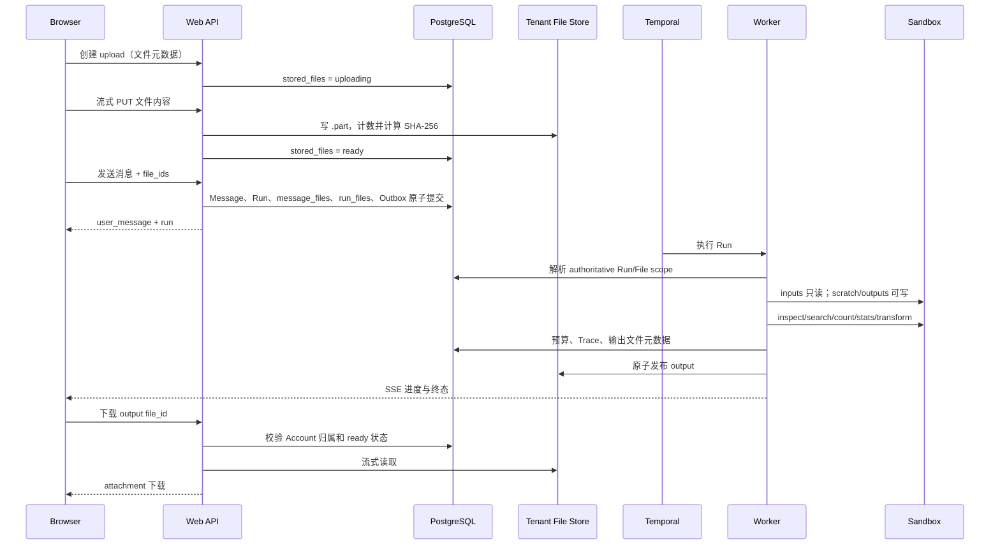

# HpAgent Web 文件 Workspace Agent：P0 + P1 工作指导

## 1. 文档信息

| 项目 | 内容 |
|---|---|
| 文档版本 | 0.1 |
| 状态 | 待评审 |
| 文档类型 | 跨模块实施指导与验收基线 |
| 日期 | 2026-08-25 |
| 实施范围 | P0 安全基础 + P1 用户闭环 |
| 适用入口 | HpAgent Web |
| 关联基线 | [Web 系统架构](hpagent-web-system-architecture.md)、[API 与 SSE 契约](hpagent-web-api-contract.md)、[数据库设计](hpagent-web-database-design.md)、[Agent 执行融合设计](hpagent-agent-execution-integration.md)、[Temporal 设计](hpagent-web-temporal-design.md) |

本文把“用户上传日志或文本文件，Agent 在租户 Workspace 内搜索、统计、受控修改并返回结果文件”的新场景，拆成可实施、可测试、可灰度和可回滚的 P0 + P1 工作项。

本文是新增能力的实施基线，不代表当前代码已经实现。代码与本文不一致时，应把差异记录为 architecture drift，不得用配置绕过安全门禁。

---

## 2. 目标、范围与非目标

### 2.1 用户目标

P1 完成后，用户可以：

1. 在 Web 对话中选择并上传普通文本或日志文件。
2. 在同一条消息中引用一个或多个已上传文件。
3. 要求 Agent 查找关键字、精确计数、生成有限统计或执行受控文本转换。
4. 在长时间处理期间看到上传进度和 Agent 当前阶段。
5. 下载 Agent 生成的新文件。
6. 在 Trace 中查看文件处理、工具执行和预算消耗的安全元数据。

### 2.2 P0 范围

P0 只建设安全基础，不对普通用户开放完整文件 Agent：

- 文件领域模型、数据库约束、租户归属和生命周期。
- 独立于 Git Repo 的租户文件存储。
- 流式上传、大小校验、哈希校验和安全下载基础。
- Sandbox 路径边界、只读输入、可写输出和原子写入。
- 大文件 native tool 的流式读取基础和统一输出上限。
- Run 累计预算、幂等用量账本和稳定耗尽行为。
- Trace 元数据白名单、脱敏和大小限制。
- 部署挂载、配置、Feature Flag 和失败关闭策略。

### 2.3 P1 范围

- 文本/日志文件上传 UI。
- Message、Run 与输入文件的事务绑定。
- Worker 将输入文件映射到本次 Run 的只读执行范围。
- `inspect_file`、`search_file`、`count_matches`、`text_stats`。
- `transform_file` 和结果文件发布、下载。
- 文件阶段、预算和输出文件的 SSE/Trace/UI 投影。
- 端到端、隔离、故障注入和大文件资源测试。

### 2.4 明确非目标

以下能力不进入 P0/P1：

- 向模型开放任意 Bash 或任意系统命令。
- 在原始上传文件上原地修改。
- 把上传文件提交到 Account Git Repo。
- 压缩包递归解压、Office/PDF/图片解析和可执行文件处理。
- 多媒体预览、在线协作编辑或文件版本管理产品。
- `session_worktree` 的完整实现。
- S3/OSS 分片直传、断点续传和跨地域复制。
- 把普通文件复用为现有 HTML Artifact。

上述能力如需实施，应单独进入 P2 设计和安全评审。

---

## 3. 已确认的当前事实

### 3.1 Web API 没有文件契约

- `SendMessageRequest` 当前只有 `content` 和 `agent_strategy`。
- 修改状态的 API 统一按 JSON 请求处理，当前协议中间件会拒绝普通 multipart 上传。
- 消息请求体存在 160 KiB 上限，不能承载大文件正文或 Base64。

因此禁止通过以下方式临时实现上传：

- 把 Base64 文件放进消息 JSON。
- 把文件全文拼进 `content`。
- 为上传接口取消所有请求大小限制。
- 让前端把客户端本地路径发送给 Agent。

### 3.2 Workspace 已有骨架，但不是大文件存储

当前 Web Run 通过：

```text
run_id -> account_id -> session_id -> account repo -> session branch
```

解析执行资源，并在 `single_process_account_lock` 模式下持有账户级锁。该机制适合保护 Git Workspace，不适合把大日志作为未跟踪文件留在共享 checkout 中。

大文件进入 Git Repo 会产生：

- Git 对象和备份膨胀。
- Session 切换时的 dirty workspace。
- 同一 Account 不同 Conversation 之间的文件可见性风险。
- Workspace recovery 无法区分用户文件、暂存文件和异常残留。

### 3.3 当前 native tools 不满足大文件约束

- `fs_read` 会先调用 `readlines()` 读取整个文件，再截断工具输出。
- `fs_edit` 会把整个文件读入内存。
- `Grep` 在达到返回条数上限后停止，不能提供全文件精确命中数。
- Bash 直接执行 `bash -c`，工作目录限制不等于文件系统、网络和进程隔离。
- 本地路径校验使用字符串前缀判断，不能可靠阻止同前缀目录和符号链接逃逸。

### 3.4 写工具与当前执行模式存在门禁

Legacy Web Agent 的副作用审计会拒绝 `fs_write`、`fs_edit` 和 Bash。Durable Agent 路径已有 operation intent、租约和重试协调基础。

因此 P1 中所有文件写入必须走 Durable Agent；未启用 Durable Agent 的环境只能提供只读文件分析能力，且前端必须隐藏“生成修改文件”能力。

### 3.5 Trace 已经存在

项目已有：

- `trace_runs`、`trace_events` 持久化。
- Run Trace 查询 API。
- `trace.event` SSE 投影。
- 前端 Trace Debug 面板。

本需求应扩展现有 Trace，不得新建第二套追踪系统。

### 3.6 当前缺少 Run 累计预算

现有上下文窗口、单次模型输出、工具轮数和超时不能代替整个 Run 的累计预算。当前还存在模型 usage 读取后未稳定写回 Trace 所消费字段的问题。

---

## 4. 不可违反的设计原则

### 4.1 PostgreSQL 是文件归属和状态真相源

文件是否属于当前 Account、Conversation、Message 和 Run，只能由数据库关系确定。文件系统路径、当前 Git branch、浏览器状态和模型参数都不是授权依据。

### 4.2 API 不拥有 Git Workspace

API 负责认证、上传流、文件元数据和命令事务，不执行：

- `git init`、checkout 或 branch 操作。
- Sandbox 创建。
- Agent 文件转换。
- 任意命令。

Worker 继续拥有 Workspace 和 Agent 执行资源。

### 4.3 文件逻辑属于租户，物理上不进入 Git Repo

原始文件存入独立 file store。Run 执行时由 Worker 以只读方式映射到 Sandbox 的 `inputs/`。转换结果写入 `outputs/` 并登记为新文件。

### 4.4 原始文件不可变

- 上传完成后以 SHA-256 和大小固化。
- Agent 不得原地改写输入。
- 每次转换生成新的 output file。
- 未完成输出使用临时文件，成功后原子发布。
- 取消或失败时不得把半成品标记为可下载。

### 4.5 模型不得直接读取大文件

模型只能收到：

- 文件名、大小、类型、编码等元数据。
- 有明确行数和字节上限的 head/tail 采样。
- 有明确返回条数和字节上限的搜索结果。
- 聚合统计结果。
- 输出文件 ID 和摘要。

禁止工具在内部读完整文件后再截断，也禁止把文件全文交给模型再要求模型自行统计或修改。

### 4.6 P0/P1 禁止任意 Bash

P0/P1 使用结构化 native tools。Web Agent 的 Bash 注册必须默认关闭；配置误开但隔离环境未通过健康检查时，Worker 必须启动失败或明确禁用该工具，不能降级为宿主机 `bash -c`。

### 4.7 重试必须幂等

Temporal activity、模型调用、文件转换、输出发布和预算扣减都必须使用稳定 `operation_id`。重试不得：

- 重复扣减预算。
- 重复生成多个输出记录。
- 覆盖已经发布的文件。
- 把同一个上传绑定到不相关的 Message 或 Run。

### 4.8 Trace 不记录内容

Trace、应用日志、指标和错误信息不得写入：

- 文件正文和匹配行正文。
- 原始文件系统路径。
- 完整模型 prompt 或 response。
- 完整命令参数和工具输出。
- Cookie、CSRF token、凭证或外部主体 ID。

---

## 5. 目标架构与数据流



### 5.1 建议的本地存储布局

首版使用独立持久卷，路径只由 `FileStorage` Adapter 解析：

```text
file-store/
  accounts/{account_id}/
    objects/{file_id}/
      blob
  staging/{upload_id}.part
```

Run 的执行视图由 Worker 构造：

```text
/work/
  inputs/
    {logical_file_name}   # 只读映射或受控只读副本
  scratch/                # 当前 Run 可写、可清理
  outputs/                # 当前 Run 可写，成功后发布
```

约束：

- 数据库存储相对 `storage_key`，不得存宿主机绝对路径。
- 客户端文件名只用于展示，必须规范化后映射为不冲突的 logical name。
- 普通文件权限默认 `0600`，目录默认 `0700`。
- 存储卷应启用 `noexec`；API 不挂载 Account Git Workspace。
- 输入、scratch 和输出的路径能力必须分别建模，不能只传一个可读写根目录。

---

## 6. 数据模型工作指导

### 6.1 `stored_files`

建议新增字段：

| 字段 | 说明 |
|---|---|
| `file_id` | UUID 主键 |
| `account_id` | 强制租户归属 |
| `conversation_id` | 上传时绑定的 Conversation；P1 不支持跨 Conversation 复用 |
| `purpose` | `input` 或 `output` |
| `status` | `uploading`、`ready`、`rejected`、`deleted` |
| `original_name` | 用户看到的原始文件名，长度受限 |
| `display_name` | 规范化、可安全展示的名称 |
| `storage_key` | 服务端生成的相对 key，禁止客户端控制 |
| `content_type` | 服务端判定值，不盲信浏览器 |
| `encoding` | P1 文本编码；无法确定时为空并拒绝进入工具链 |
| `size_bytes` | 实际流式计数值 |
| `sha256` | 上传完成后固化 |
| `failure_code` | rejected 时稳定错误码 |
| `created_at` / `ready_at` / `expires_at` | 生命周期 |

数据库必须保证状态形状：

- `uploading` 没有 `ready_at`、`sha256`。
- `ready` 必须有 `storage_key`、`size_bytes`、`sha256` 和 `ready_at`。
- `rejected` 必须有 `failure_code`，且不能绑定到 Message。
- `deleted` 不可下载、不可再次绑定。

### 6.2 `message_files`

用于把 ready input 固化到用户消息：

```text
(account_id, conversation_id, message_id, file_id, role, ordinal)
```

- P1 的 `role` 只允许 `input`、`output`。
- 同一文件不能重复绑定到同一 Message。
- `input` 只能绑定 user Message。
- `output` 只能绑定 completed assistant Message。
- 跨 Account、跨 Conversation 组合外键必须提交失败。

### 6.3 `run_files`

用于冻结本次执行看到的输入和产生的输出：

```text
(account_id, conversation_id, run_id, file_id, direction, logical_name, operation_id)
```

- `direction` 为 `input` 或 `output`。
- 创建 Run 时复制用户消息的 input 绑定。
- Retry Run 继续从原始 trigger Message 冻结输入，不读取浏览器当前选择。
- output 使用稳定 `operation_id` 保证 Temporal 重试不重复发布。

### 6.4 Run 预算表

建议新增：

1. `run_budgets`
   - 冻结 policy version、各维度 limit、used、reserved 和最终答复预留。
   - 一个 Run 只有一条预算记录。
2. `run_usage_ledger`
   - 唯一键至少包含 `(run_id, operation_id, dimension)`。
   - 状态为 `reserved`、`settled` 或 `released`。
   - 记录实际值、估算来源和时间，不记录正文。

预算聚合更新和 ledger 插入必须在同一数据库事务内完成。

### 6.5 数据库权限

- API：创建和更新 input 上传状态；读取当前 Account 可下载文件；不得创建 Agent output。
- Worker：读取 Run input；创建 output；写预算和 Trace。
- 清理任务：只处理已过期、未绑定或已标记删除的文件。
- 不给 API/Worker 超出业务所需的表级或存储目录权限。

---

## 7. HTTP、DTO 与 SSE 契约

### 7.1 创建上传

```http
POST /api/v1/conversations/{conversation_id}/uploads
Content-Type: application/json
X-CSRF-Token: <token>
Idempotency-Key: <uuid>
```

```json
{
  "file_name": "service.log",
  "size_bytes": 7340032,
  "content_type": "text/plain",
  "sha256": "<optional-lowercase-hex>"
}
```

返回：

```json
{
  "file": {
    "file_id": "<uuid>",
    "file_name": "service.log",
    "status": "uploading",
    "size_bytes": 7340032
  },
  "content_url": "/api/v1/uploads/<file_id>/content"
}
```

要求：

- Conversation 不存在和属于其他 Account 都返回 opaque 404。
- `size_bytes` 只用于预检，实际接收字节数为最终真相。
- 同一 Idempotency-Key 和相同请求体返回同一 `file_id`。
- 同 key 不同请求体返回 `idempotency_conflict`。

### 7.2 上传内容

```http
PUT /api/v1/uploads/{file_id}/content
Content-Type: application/octet-stream
X-CSRF-Token: <token>
```

P0 对协议中间件只增加该路径的窄例外，不放宽其他 POST/PATCH/PUT 的 JSON 约束。

服务端必须：

1. 流式写入 `.part`。
2. 每个 chunk 更新实际字节数和 SHA-256。
3. 即使缺少或伪造 `Content-Length`，也在超过上限时立即停止。
4. 校验声明大小、实际大小和可选客户端哈希。
5. 检查文本类型、NUL 字节和编码。
6. fsync/关闭后原子 rename 为正式 blob。
7. 最后提交 `ready`；数据库提交失败时保留为可清理孤儿，不能对用户可见。

P1 不要求续传。上传失败后客户端重新创建 upload 或按明确契约重试完整 PUT。

### 7.3 查询和删除上传

```http
GET /api/v1/files/{file_id}
DELETE /api/v1/files/{file_id}
```

- 只允许删除未绑定文件；已绑定文件进入保留策略，不能破坏历史 Message/Run。
- 删除是逻辑标记优先，物理清理由后台任务完成。

### 7.4 消息附件

`SendMessageRequest` 扩展为：

```json
{
  "content": "统计 ERROR 和 timeout，并生成只保留错误行的新文件",
  "agent_strategy": "react",
  "file_ids": ["<uuid>"]
}
```

发送事务必须原子完成：

```text
user Message
+ queued Run
+ pending assistant Message
+ message_files inputs
+ run_files inputs
+ run_budgets snapshot
+ start_run Outbox
```

任一文件不是 ready、归属不一致、已删除或超过数量限制时，整个事务失败，不得产生半条 Message 或无附件 Run。

### 7.5 Message、Run 和输出 DTO

Message DTO 建议增加可忽略的新字段：

```json
{
  "files": [
    {
      "file_id": "<uuid>",
      "file_name": "errors-only.log",
      "purpose": "output",
      "status": "ready",
      "size_bytes": 182340,
      "download_url": "/api/v1/files/<file_id>/content"
    }
  ]
}
```

Run DTO 建议增加安全预算摘要：

```json
{
  "budget": {
    "status": "ok",
    "model_tokens_used": 18320,
    "model_tokens_limit": 80000,
    "tool_calls_used": 6,
    "tool_calls_limit": 20,
    "bytes_scanned": 7340032,
    "bytes_scanned_limit": 536870912
  }
}
```

具体默认值必须配置化；示例值不是生产承诺。

### 7.6 文件下载

```http
GET /api/v1/files/{file_id}/content
```

要求：

- 按当前登录 Account 和文件状态授权。
- 使用 `Content-Disposition: attachment` 和安全文件名。
- 返回 `X-Content-Type-Options: nosniff`。
- 流式响应，不一次性读入内存。
- 禁止路径参数、storage key、绝对路径和目录列表。
- P1 不提供 Range；如实现 Range，必须单独补契约和测试。

### 7.7 稳定错误码

至少定义：

| 错误码 | HTTP | 含义 |
|---|---:|---|
| `file_too_large` | 413 | 实际字节超过单文件上限 |
| `file_quota_exceeded` | 413/429 | Account 或 Message 配额不足 |
| `unsupported_file_type` | 415 | 非 P1 文本/日志类型 |
| `file_encoding_unsupported` | 422 | 编码无法安全处理 |
| `file_hash_mismatch` | 422 | 声明哈希与实际不一致 |
| `file_not_ready` | 409 | 绑定时仍在上传或已失败 |
| `file_already_bound` | 409 | 删除或变更已绑定文件 |
| `run_budget_exhausted` | 409 | Run 已无可用执行预算 |
| `file_processing_limit` | 422 | 工具参数或结果上限不合法 |
| `sandbox_unavailable` | 503 | 隔离环境未通过健康检查 |

资源归属不匹配统一使用现有 `resource_not_found`，不得暴露其他 Account 中存在该 file ID。

---

## 8. Native Tools 工作指导

### 8.1 保留结构化工具，不改成任意 Bash

P1 必须注册以下最小工具集：

| 工具 | 副作用分类 | 用途 |
|---|---|---|
| `inspect_file` | `read_only` | 元数据、编码和有限 head/tail 采样 |
| `search_file` | `read_only` | 有界返回的文本搜索 |
| `count_matches` | `read_only` | 全文件精确计数，只返回聚合值 |
| `text_stats` | `read_only` | 有界维度的日志/文本统计 |
| `transform_file` | `idempotent_write` | 受控转换并产生临时 output |
| `publish_output` | `idempotent_write` | 原子发布并登记下载文件 |

P0/P1 不注册：

- 任意 `Bash`。
- 任意 Python/Node 代码执行。
- 接受 shell 字符串的 pipeline。
- 接受绝对路径或宿主机路径的工具。

### 8.2 统一工具输入边界

所有文件工具：

- 只接受 Run scope 中的逻辑相对路径或内部 file handle。
- 拒绝空字节、绝对路径、`..`、设备路径和路径分隔符混淆。
- 在打开文件前后验证 canonical path 仍在授权根目录。
- 拒绝符号链接和非普通文件。
- 记录扫描字节到 Run budget。
- 定期检查取消信号和 deadline。

不要继续依赖字符串 `startswith()` 判断目录归属。实现应使用 canonical resolution 和 `is_relative_to` 等价语义，并对每个路径组件执行符号链接检查；Linux 上优先使用 `O_NOFOLLOW` 或基于目录 fd 的安全打开方式。

### 8.3 统一工具输出边界

每个工具结果必须带：

```json
{
  "truncated": false,
  "returned_bytes": 1024,
  "scanned_bytes": 7340032,
  "duration_ms": 42
}
```

并同时限制：

- 返回行数。
- 返回 UTF-8 字节数。
- 单行字节数。
- 搜索命中数。
- 上下文行数。
- 扫描字节数和执行时间。

工具层必须在生成结果时执行限制，不能先创建超大 Python 字符串再由 Sandbox 截断。

### 8.4 `inspect_file`

建议参数：

```text
file
head_lines <= configured limit
tail_lines <= configured limit
max_sample_bytes <= configured limit
```

结果包括：

- 展示文件名、大小、编码、是否可能为文本。
- 有界 head/tail。
- 是否截断。
- 是否执行了全量扫描。

默认不为获得行数而扫描完整超大文件；需要精确行数时使用 `text_stats` 或专用 count 操作，并扣减扫描预算。

### 8.5 `search_file`

- 默认字面量搜索。
- 正则模式必须显式请求，并使用线性时间或受超时保护的实现。
- 支持大小写、最多命中数和最多前后文行数。
- 达到返回上限时继续扫描与否必须由 `need_total` 明确决定。
- `need_total=false` 可早停；精确总数使用 `count_matches`，避免隐式高成本。

### 8.6 `count_matches`

- 扫描完整文件并只返回计数。
- 支持字面量或受限正则。
- 不返回全部匹配行。
- 统计过程中持续扣减 bytes scanned，并响应取消和预算耗尽。

### 8.7 `text_stats`

P1 只提供有界统计，例如：

- 总行数、空行数和最大行长。
- `ERROR/WARN/INFO/DEBUG` 等配置化日志级别数量。
- 用户明确给出的有限关键字列表频次。
- 有最大桶数的 Top-K；不得返回无限高基数 map。

### 8.8 `transform_file`

P1 只允许声明式操作：

- 保留/排除包含指定字面量或安全正则的行。
- 有限字面量替换。
- 安全正则脱敏。
- 截取明确的行范围。

每次转换：

1. 从 immutable input 或已发布的当前 Run output 读取。
2. 写入当前 operation 对应的临时文件。
3. 检查输出字节和磁盘预算。
4. fsync 并原子 rename。
5. 返回临时 output handle，不直接暴露物理路径。

禁止任意脚本、任意模板表达式、反向引用爆炸和原地覆盖。

### 8.9 `publish_output`

- 使用稳定 `operation_id` 查询或创建 output `stored_files`。
- 将临时文件原子移动到 file store。
- 计算大小和 SHA-256。
- 在数据库事务中标记 ready 并写入 `run_files`。
- Run 最终成功时，把 output 绑定到 assistant Message。
- 相同 operation 重试返回同一 file ID。

如果 Run 最终失败或取消，未发布临时文件进入清理队列；已成功发布但尚未绑定的文件保持不可见并按 orphan TTL 清理。

### 8.10 模型上下文防线

已有通用工具结果摘要逻辑不能成为大文件防线。结构化文件工具的结果在进入 ActionRuntime 前就必须有界；这些结果不应再次把大段原文交给 fast model 做摘要。

如果仍调用模型摘要器：

- 输入必须先经过工具字节上限。
- 摘要调用必须记入 Run budget 和 Trace。
- 摘要失败不能回退为把原始大结果直接送入主模型。

---

## 9. Sandbox 与执行安全

### 9.1 P0 必修项

- 修复 `safe_resolve`/`safe_cwd`，阻断同前缀目录和符号链接逃逸。
- 把 input、scratch、output 能力分离，默认最小权限。
- Bash 在 Web Agent 注册表中默认关闭。
- nsjail 二进制路径、镜像安装路径和健康检查保持一致。
- 配置声明 Bash 可用但 jail 不健康时 fail closed。
- 工具超时或 Run 取消时停止完整子进程组。
- stdout、stderr、临时文件和最终输出都有限额。

### 9.2 Durable 写入门禁

`transform_file` 和 `publish_output` 只能在 Durable operation intent 中执行：

- intent 先持久化。
- operation 使用稳定幂等键。
- lease/fencing 防止并发 Worker 重复提交。
- activity retry 先查询已有结果。
- 无法确认副作用结果时进入人工可诊断失败，不自动重复覆盖。

### 9.3 启动断言

Worker 启动时至少检查：

- file store 可读写且不与 Account Git Repo 重叠。
- staging、object、scratch 根目录 canonical 后互不包含。
- 配额和工具结果上限为正数且存在全局硬上限。
- production 环境没有注册宿主机 Bash fallback。
- Durable 写功能打开时，Durable Agent 和 operation intent Repository 可用。

任一安全断言失败时，不得仅记录 warning 后继续提供文件能力。

---

## 10. Run Budget 工作指导

### 10.1 必须区分三类限制

1. **单次模型上下文限制**：一次请求可接受多少 token。
2. **单次模型输出限制**：一次生成最多多少 token。
3. **Run 累计预算**：整个 Run 的模型、工具、文件和时间总消耗。

P0 新增的是第三类，不能用 `max_tool_turns` 或 Temporal timeout 替代。

### 10.2 预算维度

每个 Run 至少冻结：

- `model_input_tokens`
- `model_output_tokens`
- `model_total_tokens`
- `model_calls`
- `tool_calls`
- `bytes_scanned`
- `bytes_returned_to_model`
- `bytes_written`
- `output_file_bytes`
- `wall_time_ms`
- `final_response_reserve_tokens`

具体值来自配置和 policy version，不写死在工具代码中。生产默认值必须经过真实日志文件基准测试后确认。

### 10.3 Reserve / Settle 协议

每次模型或工具操作：

```text
1. 用 operation_id 原子 reserve 最坏或合理上界
2. 执行操作
3. 用 provider usage / 实际扫描字节 settle
4. 失败时按是否可能已经产生费用或副作用决定 settle 或 release
```

要求：

- Temporal 重试命中同一 ledger 记录，不重复 reserve。
- 模型 provider 没有返回 usage 时，按可解释的估算值记账，并标记 `estimated`。
- provider fallback 的每一次尝试分别记账。
- HyDE、规划、评估、工具结果摘要和最终回答全部计入。
- bytes scanned 由工具执行层计数，不能依赖模型声明。

### 10.4 耗尽行为

- 每次新操作前检查剩余预算。
- 预算不足时停止启动新工具。
- 优先使用最终回答预留，向用户说明已完成部分和未完成部分。
- 没有最终回答预留时，以稳定 `run_budget_exhausted` 失败。
- 预算耗尽不是可通过相同 Retry Run 无限重试的瞬时错误；新 Retry 必须创建新预算快照并受产品策略约束。

### 10.5 Usage 字段修复

在预算 enforcement 前必须统一模型返回 usage：

```text
input_tokens
output_tokens
total_tokens
usage_source = provider | estimated
```

ModelClient、Trace instrumentation、预算 ledger 和指标必须读取同一个 canonical 结构。禁止一处只写日志、另一处从不同字段读取。

---

## 11. Trace、日志和指标

### 11.1 复用现有 Trace

新增节点建议：

| 节点名 | 记录内容 |
|---|---|
| `FileIngestion` | file ID 后八位、大小、类型、结果码、耗时 |
| `WorkspacePrepare` | input 数量、隔离模式、耗时，不记录路径 |
| `FileInspect` | 扫描/返回字节、是否截断 |
| `FileSearch` | 查询模式、匹配数、扫描字节，不记录匹配正文 |
| `FileCount` | 聚合计数、扫描字节 |
| `FileTransform` | 操作类型、输入/输出大小、operation ID 摘要 |
| `OutputPublish` | output file ID 摘要、大小、状态 |
| `BudgetCheck` | 维度、used、limit、decision |

### 11.2 Trace 元数据约束

- 每类节点定义 metadata allowlist 和 schema version。
- 单节点 metadata 序列化后有硬字节上限。
- 文件名如可能包含敏感信息，普通 Trace 只保存清洗后的短展示名或哈希摘要。
- Trace 写失败保持 best effort，不回滚业务终态；但必须记录不含敏感内容的可观测错误。
- Trace API 应限制节点总量并支持分页或服务端裁剪，不能无限返回整棵树。

### 11.3 指标

至少增加：

- 上传成功/拒绝/失败数和上传字节。
- 文件处理耗时与扫描字节。
- 各 native tool 成功、失败、取消和预算拒绝数。
- Run token、工具调用和字节预算利用率。
- orphan 文件、清理失败和 file store 使用量。
- SSE 降级期间仍在运行的文件 Run 数。

指标标签不得包含 file ID、文件名、Account ID、Conversation ID 或高基数字段。

---

## 12. 前端工作指导

### 12.1 上传状态与 Agent 状态分离

上传发生在 Run 创建之前，前端必须维护独立状态：

```text
selected -> creating -> uploading -> validating -> ready
                                   -> failed
```

Agent Run 继续使用现有状态机和 SSE：

```text
queued -> running -> completed/failed/cancelled
```

不得把上传百分比伪装成 Run progress，也不得在上传失败时创建空 Run。

### 12.2 Composer 行为

- 支持文件选择和拖放，但 P1 只接受配置允许的文本/日志类型。
- 显示文件名、大小、上传百分比、失败原因、重试和移除。
- 存在 `creating/uploading/validating` 文件时禁用发送。
- 文件 ready 后只发送 `file_id`。
- 移除已 ready 但未发送的文件时调用 DELETE；网络失败保留本地状态并允许重试。
- 登录失效或页面刷新后，不把原始文件内容保存到 localStorage。

### 12.3 Run 等待态

在现有 `RunStatus` 基础上增加业务化阶段：

- `waiting_for_workspace`：正在准备工作区。
- `preparing_files`：正在准备文件。
- `inspecting_files`：正在检查文件。
- `searching_files`：正在搜索。
- `counting_or_analyzing`：正在统计。
- `writing_output`：正在生成结果文件。
- `publishing_output`：正在发布结果。
- `finalizing`：正在整理回答。

普通 UI 不显示 `Bash`、内部路径或 operation intent 等技术术语。完整技术信息保留在受控 Trace Debug 面板。

### 12.4 输出文件

- completed assistant Message 下展示 output 文件卡片。
- 卡片显示安全文件名、大小和下载按钮。
- 文件还未 ready 时不展示失效下载链接。
- 下载 401 时走现有登录恢复；404 不提示资源是否属于其他 Account。
- 取消 Run 后保留原始 input；未完成 output 不展示。

### 12.5 SSE 与回源

- `run.progress` 仍是可丢提示，文件和 Run 终态以 HTTP/数据库为准。
- SSE 断线继续使用现有 Run polling 降级。
- 收到 completed 后重新查询 Message/Run，获得 canonical output files 和预算摘要。
- 不依赖最后一条 `trace.event` 判断业务完成。

---

## 13. P0 工作拆解

任务编号应进入 Issue、PR、测试名和发布记录。

### FILE-P0-01：文件领域表与 Repository

- **规模**：L，进入开发前拆 migration、Repository、合约测试三个 PR。
- **目标**：实现 `stored_files`、`message_files`、`run_files`、`run_budgets`、`run_usage_ledger` 及组合外键和状态约束。
- **前置**：数据库/API/Temporal 基线不再存在未决冲突。
- **验收**：跨 Account/Conversation SQL 无法提交；ready/rejected 状态形状由数据库保证；空库 migration 成功。
- **测试**：真实 PostgreSQL、真实 commit、并发幂等、非法状态、删除保护。

### FILE-P0-02：FileStorage Adapter 与生命周期

- **规模**：L。
- **目标**：建立 staging、原子发布、流式读取、逻辑删除和 orphan 清理。
- **前置**：FILE-P0-01。
- **验收**：路径只由 file ID/storage key 解析；崩溃不会暴露 `.part`；清理不删除已绑定文件。
- **测试**：中途断流、磁盘满、rename/DB 提交故障、重复发布、孤儿清理。

### FILE-P0-03：上传与下载安全 API

- **规模**：L。
- **目标**：实现创建上传、流式 PUT、查询、删除和安全下载。
- **前置**：FILE-P0-01、02。
- **验收**：API 不缓存完整文件；无 Content-Length 仍执行硬上限；跨账号 opaque 404；CSRF 和幂等符合现有约定。
- **测试**：超限、哈希不匹配、MIME/编码、路径穿越文件名、并发重复上传、下载 ACL。

### FILE-P0-04：Sandbox 路径和文件能力加固

- **规模**：L。
- **目标**：替换字符串前缀路径判断，建立只读 input、可写 scratch/output 能力。
- **前置**：无，可与数据库工作并行。
- **验收**：绝对路径、`..`、同前缀目录、符号链接、FIFO/设备文件均失败关闭；输入不能修改。
- **测试**：Linux 路径攻击矩阵、TOCTOU 基础测试、只读挂载、取消和超时。

### FILE-P0-05：现有文件工具大文件安全改造

- **规模**：M。
- **目标**：移除 `fs_read.readlines()` 等整文件读取；统一行/字节/单行/输出限制和正确的原始长度元数据。
- **前置**：FILE-P0-04。
- **验收**：处理上限内最大文件时内存使用与文件大小不线性增长；工具不会先构造超大输出。
- **测试**：超长单行、无尾换行、CRLF、UTF-8 边界、空文件、大量命中、取消。

### FILE-P0-06：Run Budget 与模型 usage 统一

- **规模**：L。
- **目标**：实现 policy snapshot、reserve/settle ledger、canonical usage 和耗尽决策。
- **前置**：FILE-P0-01。
- **验收**：所有模型路径和工具路径可记账；Temporal retry 不重复扣减；保留最终回答预算。
- **测试**：provider usage 缺失、fallback、多次 activity retry、并发 reserve、预算边界和耗尽。

### FILE-P0-07：Trace 安全扩展

- **规模**：M。
- **目标**：建立文件/预算 Trace 节点 schema、metadata allowlist、大小限制和脱敏。
- **前置**：FILE-P0-06 的 canonical usage。
- **验收**：Trace 可解释预算和文件操作，但搜索正文、文件正文、路径和 prompt 不落库。
- **测试**：敏感 canary、超大 metadata、Trace sink 失败、历史查询归属。

### FILE-P0-08：部署配置与失败关闭

- **规模**：M。
- **目标**：拆分 file store 与 Git Workspace 挂载，增加配额和 Feature Flag，建立 Worker 启动断言。
- **前置**：FILE-P0-02、04、06。
- **验收**：API 无 Git Workspace 写权限；Bash 默认不可用；错误配置时文件能力不启动。
- **测试**：Compose 配置检查、只读权限、目录重叠、nsjail 路径和 feature flag matrix。

### P0 出口门禁

P0 只有在以下条件全部满足时完成：

- 数据库从空库迁移和权限测试通过。
- API/Worker 的文件系统权限符合最小权限。
- 跨租户、路径逃逸和符号链接测试全部失败关闭。
- 大文件读取内存有上界。
- Run budget 在 observe/enforce 两种模式下均有测试。
- Trace 敏感 canary 不落库、不进日志。
- Web Agent 没有宿主机任意 Bash 路径。
- Feature Flag 默认关闭，旧消息和无附件 Run 回归通过。

P0 完成不等于可以向生产用户开放上传。

---

## 14. P1 工作拆解

### FILE-P1-01：Message/Run 附件事务

- **规模**：L。
- **目标**：扩展发送 DTO，在同一事务内绑定 ready 文件、冻结 run_files 和预算。
- **前置**：FILE-P0-01、03、06。
- **验收**：任何附件非法时整个 send 事务回滚；Retry 使用原 trigger Message 文件。
- **测试**：多附件、重复 file ID、上传中、已删除、跨会话、跨账号、幂等重放。

### FILE-P1-02：Worker 文件执行范围

- **规模**：L。
- **目标**：Worker 从 Run authoritative context 解析文件，在账户锁内建立只读 inputs 与可写 scratch/output。
- **前置**：FILE-P0-02、04、FILE-P1-01。
- **验收**：模型只得到逻辑文件清单；不同 Run 看不到对方 input/output；清理不早于执行结束。
- **测试**：Worker restart、同账户不同会话、取消、错误分支、脏 Git Workspace。

### FILE-P1-03：只读文件 native tools

- **规模**：L。
- **目标**：实现 `inspect_file`、`search_file`、`count_matches`、`text_stats`。
- **前置**：FILE-P0-05、06，FILE-P1-02。
- **验收**：精确计数正确；搜索输出有界；扫描字节计入预算；模型从不收到文件全文。
- **测试**：与系统工具离线对照、超长行、编码、命中上限、预算中断和取消。

### FILE-P1-04：受控转换与输出发布

- **规模**：L。
- **目标**：实现 `transform_file`、`publish_output` 和 assistant Message output 绑定。
- **前置**：FILE-P1-02、03；Durable Agent 写入门禁通过。
- **验收**：输入不可变；输出原子发布；retry 返回同一 file ID；失败半成品不可下载。
- **测试**：过滤、替换、脱敏、输出超限、磁盘满、activity retry、取消、并发 lease。

### FILE-P1-05：Run Progress 与 Trace 接入

- **规模**：M。
- **目标**：增加文件处理阶段、预算摘要和 Trace live/historical 投影。
- **前置**：FILE-P0-07、FILE-P1-02～04。
- **验收**：普通进度不泄露技术细节；Trace 元数据可定位慢扫描和预算耗尽；终态可回源。
- **测试**：SSE gap、乱序/重复事件、Trace 写失败、历史查询、敏感 canary。

### FILE-P1-06：前端上传与附件 Composer

- **规模**：L。
- **目标**：实现选择、拖放、上传进度、失败重试、移除和发送门禁。
- **前置**：FILE-P0-03、FILE-P1-01。
- **验收**：只有 ready file IDs 可发送；刷新/登录失效不把文件内容写进浏览器存储；错误可恢复。
- **测试**：组件、API adapter、上传取消、CSRF 轮换、重复点击、可访问性。

### FILE-P1-07：等待阶段与输出下载 UI

- **规模**：M。
- **目标**：扩展 RunStatus，展示业务阶段、预算耗尽说明和 output 文件卡片。
- **前置**：FILE-P1-04、05、06。
- **验收**：SSE 断线仍可通过 polling 得到终态和输出；取消后不展示半成品。
- **测试**：running/completed/failed/cancelled、degraded SSE、401/404 下载、移动端布局。

### FILE-P1-08：端到端、性能、灰度和文档收口

- **规模**：L。
- **目标**：形成 P1 release gate，更新 API、数据库、部署、运行手册和 architecture drift。
- **前置**：全部 P0/P1 实现任务。
- **验收**：核心用户场景、隔离、预算、取消、重试和回滚演练全部通过。
- **测试**：见第 16 节测试矩阵。

### P1 出口门禁

- 文本/日志上传、搜索、计数、统计、转换、下载全链路通过。
- 对允许的最大文件执行时，API/Worker 内存保持在可接受上界。
- 模型输入审计证明没有文件全文或无限搜索结果。
- 跨账号、跨会话和符号链接攻击全部失败关闭。
- Durable retry 不重复扣预算、不重复发布 output。
- 取消能停止扫描/转换并清理临时文件。
- SSE 中断、Worker 重启和 API 重启不破坏 canonical 状态。
- 旧的无附件 Web/QQ Agent 流程回归通过。
- Feature Flag 可以在不回滚 migration 的情况下关闭入口和写能力。

---

## 15. 推荐开发顺序与 PR 边界

```text
PR 1  文件/预算 migration + DB contract tests
PR 2  FileStorage Adapter + lifecycle tests
PR 3  上传/下载 API + ACL/security tests
PR 4  Sandbox path/capability hardening
PR 5  streaming file primitives + bounded results
PR 6  model usage canonicalization + RunBudgetService
PR 7  Trace schema/allowlist + metrics
PR 8  Message/Run file binding + worker execution scope
PR 9  inspect/search/count/stats tools
PR 10 transform/publish durable tools
PR 11 frontend upload/composer
PR 12 progress/output UI + E2E + docs
```

规则：

- Migration 和兼容读取先于新写路径部署。
- 每个 PR 保持 Feature Flag 默认关闭。
- 不在同一 PR 中同时引入任意 Bash、文件上传和 UI。
- L 任务必须拆到单个 PR 可独立回滚和评审。
- 测试使用生成的临时目录和随机 Account/File ID，禁止写开发者真实 Workspace。

---

## 16. 测试矩阵

### 16.1 上传与存储

- 正常文本、空文件、无尾换行、CRLF、UTF-8 多字节边界。
- 无 `Content-Length`、伪造长度、超过上限、断流、重复 PUT。
- SHA-256 不匹配、NUL 字节、MIME 伪装、不支持编码。
- `../`、绝对路径、控制字符、超长文件名、同名文件。
- 磁盘满、权限错误、rename 失败、数据库提交失败。
- orphan TTL 和已绑定文件删除保护。

### 16.2 租户和会话隔离

- Account A 无法查询、绑定、下载 Account B 文件。
- 同 Account 的 Conversation A 无法绑定 Conversation B 文件。
- Retry 只能复用原 trigger Message attachments。
- 同账户并发 Run 遵守当前账户锁。
- Git branch 切换和 dirty workspace 不改变文件授权。

### 16.3 Native tools

- 最大允许文件内存峰值与文件大小不线性增长。
- 超长单行不会绕过单行/总返回字节限制。
- `search_file` 有界结果与 `count_matches` 精确总数语义分离。
- 正则超时、取消、预算耗尽及时停止。
- transform 输入哈希保持不变，输出内容和大小正确。
- output 超限、临时文件和 publish retry 行为正确。

### 16.4 Budget

- 模型、fallback、摘要器、工具调用全部记账。
- 同一 operation activity retry 不重复扣减。
- provider usage 缺失时记录 estimated。
- 最终回答预留生效。
- token、tool call、bytes scanned、bytes written 和 wall time 各自可触发耗尽。

### 16.5 Trace、日志和 UI

- 在文件正文和文件名中植入敏感 canary，确认不进入 Trace/日志/指标。
- Trace sink 失败不破坏业务终态。
- 上传失败不创建 Run。
- SSE gap、断线和乱序事件能通过 HTTP 回源恢复。
- 取消、失败、预算耗尽和成功下载均有可理解 UI。
- 键盘操作、焦点、进度语义和屏幕阅读器标签通过检查。

### 16.6 端到端验收场景

1. 上传日志，搜索 `timeout`，返回有限匹配行和精确数量。
2. 上传日志，统计 ERROR/WARN/INFO，模型只看到聚合结果。
3. 上传日志，生成仅保留 ERROR 行的新文件，原文件哈希不变。
4. 中途取消大文件转换，无半成品下载，原文件仍可用于新 Run。
5. 耗尽扫描或 token 预算，Agent 使用预留预算说明部分结果。
6. Worker 在 transform 后、publish 前重启，重试不产生重复 output。
7. SSE 中断后刷新页面，Run 终态、预算和 output 可从数据库恢复。
8. 使用另一个 Account 猜测 file ID，查询和下载均 opaque 404。

---

## 17. 配置与灰度

建议新增配置项，名称在实现前统一到现有配置系统：

```text
WEB_FILE_UPLOAD_ENABLED=false
WEB_FILE_TRANSFORM_ENABLED=false
WEB_FILE_SHELL_ENABLED=false
FILE_STORE_ROOT=...
FILE_MAX_BYTES=...
FILE_MAX_COUNT_PER_MESSAGE=...
FILE_ACCOUNT_QUOTA_BYTES=...
FILE_UNBOUND_TTL_SECONDS=...
FILE_OUTPUT_TTL_SECONDS=...
FILE_TOOL_MAX_RETURN_BYTES=...
FILE_TOOL_MAX_LINE_BYTES=...
RUN_BUDGET_MODE=off|observe|enforce
RUN_BUDGET_POLICY_VERSION=...
```

要求：

- 所有限额有应用级默认值和全局硬上限。
- production 不允许 `WEB_FILE_SHELL_ENABLED=true`。
- `observe` 只记录本应拒绝的预算决策，用于校准；进入用户灰度前切换为 `enforce`。
- 能力开关通过 `/me` capabilities 或等价只读契约投影给前端，前端不猜配置。

推荐灰度顺序：

1. migration 和兼容读取上线，全部开关关闭。
2. 内部账号开启上传和只读工具，预算 observe。
3. 修正阈值后预算 enforce。
4. 内部账号开启 transform/output。
5. 小比例用户灰度，观察错误率、内存、扫描字节和 orphan。
6. 完成 P1 门禁后扩大范围。

回滚时优先关闭 Feature Flag；不删除 migration 和已上传文件。清理任务继续运行，历史 Message/Run 保持可查询。

---

## 18. 建议修改位置

现有重点文件：

```text
src/web_api/models.py
src/web_api/app.py
src/web_api/settings.py
src/web_domain/services.py
src/persistence/
src/storage/
src/workspace/isolation.py
src/sandbox/sandbox.py
src/sandbox/sandbox_manager.py
src/sandbox/nsjail.py
src/sandbox/tools/local/_path_utils.py
src/sandbox/tools/local/fs_read.py
src/sandbox/tools/local/fs_edit.py
src/sandbox/tools/local/grep.py
src/sandbox/tools/local/bash.py
src/agent_execution/brain_action_loop.py
src/agent_execution/tracing/
src/agent_activities/runtime.py
src/resources/model_client.py
web/src/api/
web/src/sse/
web/src/store/
web/src/components/
docker-compose.yaml
web/nginx.conf
```

建议新增模块，最终命名需服从现有分层：

```text
src/web_domain/files.py
src/web_domain/file_services.py
src/persistence/file_repository.py
src/storage/file_store.py
src/agent_execution/run_budget.py
src/sandbox/tools/local/inspect_file.py
src/sandbox/tools/local/search_file.py
src/sandbox/tools/local/count_matches.py
src/sandbox/tools/local/text_stats.py
src/sandbox/tools/local/transform_file.py
src/sandbox/tools/local/publish_output.py
web/src/components/attachments/
```

不要为了减少文件数把上传状态机、物理存储、数据库授权和 Sandbox 路径解析全部放进 `app.py` 或单个工具函数。

---

## 19. Definition of Done

每个 P0/P1 任务完成时必须同时满足：

- 实现、配置、migration、权限和清理策略完整。
- 单元、真实 PostgreSQL 集成和相应 E2E 测试通过。
- 新 DTO、错误码、状态、SSE phase 和 Trace metadata 有契约测试。
- 资源上限在读取/生成过程中执行，不是事后截断。
- 日志和 Trace 通过敏感 canary 测试。
- 失败和取消不会发布半成品或破坏原文件。
- Temporal 重试和 HTTP 幂等重放有故障注入证据。
- 无附件 Web 流程和 QQ 流程没有回归。
- API、数据库、部署和运维文档同步更新。
- PR 描述引用本文任务编号、测试证据、Feature Flag 和回滚步骤。

---

## 20. P2 入口条件

只有 P1 在生产稳定运行并形成以下证据后，才允许评审任意 Bash：

- nsjail 或同等级 Sandbox 可证明 root 只读、输入只读、输出受限、默认禁网。
- CPU、内存、进程、打开文件数、输出、磁盘和墙钟限制均有故障注入测试。
- 取消能终止完整进程树。
- Shell command 能按读写副作用细分并纳入 Durable intent。
- 命令和输出不会泄露到 Trace/日志。
- 宿主机 fallback 被结构性移除，而非依赖提示词或正则黑名单。

在满足这些条件前，“任意 Bash”不是本需求的快捷实现，而是明确的上线阻断项。
