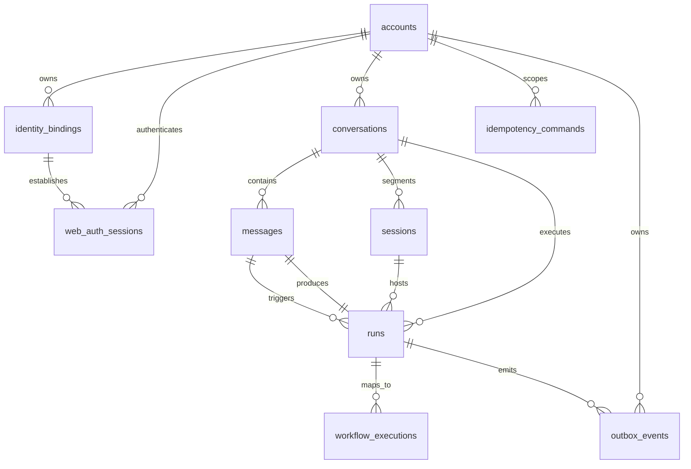
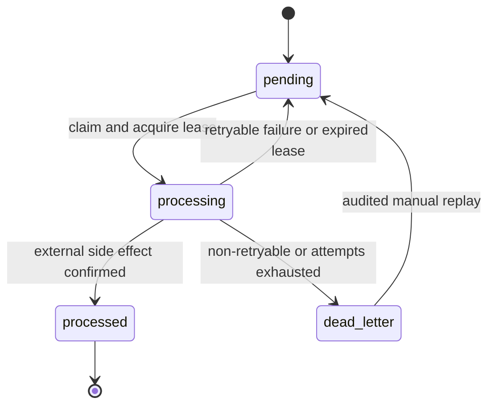

# HpAgent Web 数据库与持久化详细设计

> `artifacts`、`artifact_versions` 与独立 `artifact_outbox_events` 是 completed Assistant Message 的派生资源，不属于 `runs` 或 `outbox_events`。实际约束、权限与事务边界见 [Web Artifact 实现](hpagent-web-artifact-implementation.md)。

## 1. 文档信息

| 项目 | 内容 |
|---|---|
| 文档版本 | 0.3 |
| 状态 | 已评审 |
| 文档类型 | 数据库与持久化详细设计 |
| 日期 | 2026-08-04 |
| 领域基线 | [HpAgent Web 领域模型与状态模型设计 0.3](hpagent-web-domain-and-state-model.md) |
| 架构基线 | [HpAgent Web 系统架构设计 0.4](hpagent-web-system-architecture.md) |

本文把已评审的领域模型落实为 PostgreSQL 逻辑结构、字段类型、约束、索引和事务协议。本文是后续 API、并发控制、幂等命令、Outbox Dispatcher、Temporal Workflow 和 Reconciler 详细设计的共同输入。

本文按全新 `app-postgres` 建库设计，MVP **不考虑旧 JSON、Redis active Session 或既有事件数据迁移**。生产发布仍必须使用可回滚、可审计的版本化 schema migration。

## 2. 范围与设计结论

### 2.1 核心表

- `accounts`
- `identity_bindings`
- `conversations`
- `messages`
- `runs`
- `sessions`
- `workflow_executions`
- `idempotency_commands`
- `outbox_events`

系统架构已确定使用服务端有状态浏览器会话，因此本文增加支撑表 `web_auth_sessions`。该表只保存 Web 登录会话，与 Agent 运行资源 `sessions` 是两个不同概念。

### 2.2 关键结论

| 主题 | 结论 |
|---|---|
| 数据库 | 独立 PostgreSQL `app-postgres`，不复用 Temporal 或 Hindsight 私有数据库 |
| 业务 ID | 后端应用生成 UUIDv7，数据库字段统一为 `uuid` |
| 时间 | 使用 `timestamptz`，数据库和应用统一按 UTC 读写 |
| 状态字段 | MVP 使用 `text + CHECK`，不使用 PostgreSQL ENUM，降低状态演进迁移成本 |
| 删除策略 | 核心业务记录 MVP 不物理删除；使用状态归档或撤销，外键默认 `ON DELETE RESTRICT` |
| 多账号隔离 | 冗余保存 `account_id`，通过组合候选键和组合外键验证同归属 |
| Message 顺序 | 锁定 Conversation，通过 `last_message_seq` 成段分配，无独立全局 sequence |
| 单活跃 Run | `runs(conversation_id)` 的部分唯一索引 |
| 单 active Session | `sessions(conversation_id)` 的部分唯一索引，Session 表是唯一真相源 |
| 用户重试 | `retry_of_run_id` 部分唯一，MVP 形成线性重试链 |
| 可靠外部副作用 | 领域事务写 Outbox；提交后由独立消费者执行 |
| 流式 delta | 不进入数据库；最终 Message、Run 和终态 Outbox 才是持久化事实 |

## 3. PostgreSQL 基线与通用约定

### 3.1 版本和 schema

- 目标为仍受官方支持的 PostgreSQL 版本；首次实现时由部署设计锁定具体大版本。
- 业务表放在独立 schema `hpagent`，应用数据库角色默认 `search_path=hpagent,public`。
- migration 角色拥有 DDL 权限；API、Worker 和后台消费者使用不同的最小权限运行角色。
- Temporal 与 Hindsight 的数据库账号不能访问 `hpagent` schema。

### 3.2 类型约定

| 语义 | PostgreSQL 类型 | 规则 |
|---|---|---|
| 领域 ID | `uuid` | 应用生成 UUIDv7；客户端不得生成权威 ID |
| 客户端请求 ID | `uuid` | 客户端生成并在网络重试时复用 |
| 通用幂等键 | `varchar(128)` | API 校验字符集和长度，数据库按字节精确比较 |
| 状态/类型 | `text` | 配套 `CHECK`，值使用小写 snake_case |
| 时间 | `timestamptz` | `NOT NULL DEFAULT now()`，API 输出 RFC 3339 UTC |
| 顺序/版本 | `bigint` | 从 1 开始；计数器从 0 开始，必须非负 |
| 用户文本 | `text` | 长度限制由 API 与 CHECK 共同承担 |
| 结构化载荷 | `jsonb` | 只保存有版本的稳定 DTO，不保存任意 Python 对象 |
| 请求摘要 | `bytea` | 保存规范化请求体的 SHA-256，不保存密钥 |
| Cookie token 摘要 | `bytea` | 只存原始随机 token 的密码学摘要，不存 Cookie 原值 |

不依赖数据库内 UUID 生成函数，避免将 UUIDv7 能力绑定到具体 PostgreSQL 版本或扩展。`created_at` 使用数据库默认值；业务 ID、状态和跨实体关系由应用显式提供。

### 3.3 命名与通用字段

- 表名和列名使用复数表名、snake_case 列名。
- 主键命名 `pk_<table>`；外键 `fk_<child>__<parent>`；唯一约束 `uq_<table>__<columns>`；普通索引 `ix_<table>__<purpose>`。
- Run、Session 等可更新状态实体保存 `version bigint`，条件更新成功时执行 `version = version + 1`。Conversation 单独使用 `metadata_version` 保护标题/状态等元数据，不与 Message sequence 分配耦合。
- `updated_at` 由同一条更新语句显式设为 `now()`；不依赖 ORM 隐式行为。
- 数据库错误必须映射为稳定领域错误，不能把约束名、SQL 或原始异常返回浏览器。

## 4. 逻辑关系



`messages` 与 `runs` 存在受控环形引用：用户 Message 先被 Run 引用，Agent Message 再通过 `produced_by_run_id` 引用 Run。建表时先创建 `messages`，再创建 `runs`，最后用 `ALTER TABLE` 增加 Agent Message 到 Run 的组合外键。

## 5. 表详细设计

### 5.1 `accounts`

Account 是数据隔离根和 Hindsight bank 映射根。

| 字段 | 类型 | 空值 | 默认值 | 说明 |
|---|---|---:|---|---|
| `account_id` | `uuid` | 否 | 无 | 主键，Account Service 生成 |
| `status` | `text` | 否 | `'active'` | `active`、`disabled` |
| `version` | `bigint` | 否 | `1` | 乐观并发版本 |
| `created_at` | `timestamptz` | 否 | `now()` | 创建时间 |
| `updated_at` | `timestamptz` | 否 | `now()` | 最近更新时间 |

约束：

```sql
CONSTRAINT pk_accounts PRIMARY KEY (account_id),
CONSTRAINT ck_accounts__status CHECK (status IN ('active', 'disabled')),
CONSTRAINT ck_accounts__version CHECK (version >= 1),
CONSTRAINT ck_accounts__timestamps CHECK (updated_at >= created_at)
```

禁用 Account 不级联修改历史 Conversation/Run；认证和新命令入口必须拒绝 disabled Account。

### 5.2 `identity_bindings`

IdentityBinding 将 Web、QQ 等外部主体映射到统一 Account。

| 字段 | 类型 | 空值 | 默认值 | 说明 |
|---|---|---:|---|---|
| `identity_binding_id` | `uuid` | 否 | 无 | 主键 |
| `account_id` | `uuid` | 否 | 无 | 所属 Account |
| `provider` | `text` | 否 | 无 | `web`、`qq`；新增 provider 需 migration |
| `external_subject_id` | `text` | 否 | 无 | 渠道返回的稳定主体 ID |
| `normalized_subject_id` | `text` | 否 | 无 | provider 规则规范化后的匹配值 |
| `status` | `text` | 否 | `'active'` | `active`、`revoked` |
| `verified_at` | `timestamptz` | 是 | 无 | 完成可信验证的时间 |
| `revoked_at` | `timestamptz` | 是 | 无 | 撤销时间 |
| `metadata` | `jsonb` | 否 | `'{}'::jsonb` | 非敏感 provider 扩展信息 |
| `version` | `bigint` | 否 | `1` | 乐观并发版本 |
| `created_at` | `timestamptz` | 否 | `now()` | 创建时间 |
| `updated_at` | `timestamptz` | 否 | `now()` | 最近更新时间 |

主外键和候选键：

```sql
CONSTRAINT pk_identity_bindings PRIMARY KEY (identity_binding_id),
CONSTRAINT fk_identity_bindings__accounts
    FOREIGN KEY (account_id) REFERENCES accounts (account_id) ON DELETE RESTRICT,
CONSTRAINT uq_identity_bindings__account_binding
    UNIQUE (account_id, identity_binding_id)
```

检查约束：

```sql
CONSTRAINT ck_identity_bindings__provider
    CHECK (provider IN ('web', 'qq')),
CONSTRAINT ck_identity_bindings__status
    CHECK (status IN ('active', 'revoked')),
CONSTRAINT ck_identity_bindings__subject_not_empty
    CHECK (
        length(external_subject_id) BETWEEN 1 AND 2048
        AND length(normalized_subject_id) BETWEEN 1 AND 512
    ),
CONSTRAINT ck_identity_bindings__active_verified
    CHECK (status <> 'active' OR (verified_at IS NOT NULL AND revoked_at IS NULL)),
CONSTRAINT ck_identity_bindings__revoked_at
    CHECK (status <> 'revoked' OR revoked_at IS NOT NULL),
CONSTRAINT ck_identity_bindings__metadata_object
    CHECK (jsonb_typeof(metadata) = 'object')
```

唯一索引：

```sql
CREATE UNIQUE INDEX uq_identity_bindings__active_subject
ON identity_bindings (provider, normalized_subject_id)
WHERE status = 'active';

CREATE INDEX ix_identity_bindings__account
ON identity_bindings (account_id, status, provider);
```

大小写、空白、QQ 主体格式等规范化必须由 provider adapter 在写入前完成。数据库只比较规范化结果，不自行猜测 provider 规则。原始主体 ID 属于敏感标识，日志必须脱敏。

### 5.3 `web_auth_sessions`

该表持久化浏览器登录会话。Cookie 中携带原始高熵 token，数据库只保存其摘要。

| 字段 | 类型 | 空值 | 默认值 | 说明 |
|---|---|---:|---|---|
| `web_auth_session_id` | `uuid` | 否 | 无 | 服务端内部主键，不放入 Cookie |
| `account_id` | `uuid` | 否 | 无 | 登录 Account |
| `identity_binding_id` | `uuid` | 否 | 无 | 建立会话的 Web binding |
| `token_hash` | `bytea` | 否 | 无 | Cookie token 的密码学摘要 |
| `csrf_secret_hash` | `bytea` | 否 | 无 | CSRF secret 摘要 |
| `expires_at` | `timestamptz` | 否 | 无 | 绝对过期时间 |
| `idle_expires_at` | `timestamptz` | 否 | 无 | 空闲过期时间 |
| `last_seen_at` | `timestamptz` | 否 | `now()` | 最近活动时间，可限频更新 |
| `revoked_at` | `timestamptz` | 是 | 无 | 登出或安全撤销时间 |
| `created_at` | `timestamptz` | 否 | `now()` | 创建时间 |

约束和索引：

```sql
CONSTRAINT pk_web_auth_sessions PRIMARY KEY (web_auth_session_id),
CONSTRAINT fk_web_auth_sessions__accounts
    FOREIGN KEY (account_id) REFERENCES accounts (account_id) ON DELETE RESTRICT,
CONSTRAINT fk_web_auth_sessions__identity_bindings
    FOREIGN KEY (account_id, identity_binding_id)
    REFERENCES identity_bindings (account_id, identity_binding_id) ON DELETE RESTRICT,
CONSTRAINT uq_web_auth_sessions__token_hash UNIQUE (token_hash),
CONSTRAINT ck_web_auth_sessions__expiry
    CHECK (idle_expires_at <= expires_at AND expires_at > created_at)
```

```sql
CREATE INDEX ix_web_auth_sessions__account
ON web_auth_sessions (account_id, created_at DESC);
```

`uq_web_auth_sessions__token_hash` 同时支持按 Cookie token 摘要进行单行查找，无需再建立重复的 token 前缀索引。认证查询命中后还必须验证 Account active、IdentityBinding active/verified、`revoked_at IS NULL` 且两个过期时间均晚于当前时间。会话清理可物理删除已过期且超过安全审计保留期的记录。

### 5.4 `conversations`

Conversation 是用户可见对话容器，也是 Message sequence 和并发事务的锁定根。

| 字段 | 类型 | 空值 | 默认值 | 说明 |
|---|---|---:|---|---|
| `conversation_id` | `uuid` | 否 | 无 | 主键 |
| `account_id` | `uuid` | 否 | 无 | 所属 Account |
| `title` | `varchar(200)` | 否 | `''` | 用户标题或自动标题 |
| `status` | `text` | 否 | `'active'` | `active`、`archived` |
| `last_message_seq` | `bigint` | 否 | `0` | 已分配的最大 Message sequence |
| `metadata_version` | `bigint` | 否 | `1` | 标题、状态和其他 Conversation 元数据的乐观并发版本 |
| `created_at` | `timestamptz` | 否 | `now()` | 创建时间 |
| `updated_at` | `timestamptz` | 否 | `now()` | 最近业务活动时间 |
| `archived_at` | `timestamptz` | 是 | 无 | 归档时间 |

约束：

```sql
CONSTRAINT pk_conversations PRIMARY KEY (conversation_id),
CONSTRAINT fk_conversations__accounts
    FOREIGN KEY (account_id) REFERENCES accounts (account_id) ON DELETE RESTRICT,
CONSTRAINT uq_conversations__account_conversation
    UNIQUE (account_id, conversation_id),
CONSTRAINT ck_conversations__status
    CHECK (status IN ('active', 'archived')),
CONSTRAINT ck_conversations__last_message_seq
    CHECK (last_message_seq >= 0),
CONSTRAINT ck_conversations__metadata_version
    CHECK (metadata_version >= 1),
CONSTRAINT ck_conversations__archive_state
    CHECK ((status = 'archived') = (archived_at IS NOT NULL))
```

查询索引：

```sql
CREATE INDEX ix_conversations__account_list
ON conversations (account_id, updated_at DESC, conversation_id DESC);
```

列表游标使用 `(updated_at, conversation_id)`，避免仅以时间分页时出现重复或跳项。归档事务必须先锁定 Conversation，并确认不存在活跃 Run。修改 title/status 时递增 `metadata_version`；发送消息只修改 `last_message_seq/updated_at`，不得递增 `metadata_version`。

标题条件更新示例：

```sql
UPDATE conversations
SET title = :title,
    metadata_version = metadata_version + 1,
    updated_at = now()
WHERE account_id = :account_id
  AND conversation_id = :conversation_id
  AND metadata_version = :expected_metadata_version
RETURNING *;
```

零行更新时回查资源，用于区分安全的 not-found 与 `version_conflict`；不得用 `updated_at` 或 `last_message_seq` 作为标题 ETag。

### 5.5 `messages`

Message 保存 Web 用户可见消息。MVP 不把 token delta、工具调用或内部推理事件写入该表。

| 字段 | 类型 | 空值 | 默认值 | 说明 |
|---|---|---:|---|---|
| `message_id` | `uuid` | 否 | 无 | 主键 |
| `account_id` | `uuid` | 否 | 无 | 冗余归属字段 |
| `conversation_id` | `uuid` | 否 | 无 | 所属 Conversation |
| `role` | `text` | 否 | 无 | MVP 仅 `user`、`assistant` |
| `status` | `text` | 否 | 无 | `accepted`、`pending`、`completed`、`failed`、`aborted` |
| `content` | `text` | 是 | 无 | pending Agent Message 可为空 |
| `sequence` | `bigint` | 否 | 无 | Conversation 内单调递增 |
| `client_request_id` | `uuid` | 是 | 无 | 用户发送幂等 ID |
| `produced_by_run_id` | `uuid` | 是 | 无 | Agent Message 的生产 Run |
| `created_at` | `timestamptz` | 否 | `now()` | 创建时间 |
| `completed_at` | `timestamptz` | 是 | 无 | Agent Message 进入终态的时间 |

主键、候选键和 Conversation 外键：

```sql
CONSTRAINT pk_messages PRIMARY KEY (message_id),
CONSTRAINT uq_messages__account_conversation_message
    UNIQUE (account_id, conversation_id, message_id),
CONSTRAINT uq_messages__conversation_sequence
    UNIQUE (conversation_id, sequence),
CONSTRAINT fk_messages__conversations
    FOREIGN KEY (account_id, conversation_id)
    REFERENCES conversations (account_id, conversation_id) ON DELETE RESTRICT
```

角色与状态检查：

```sql
CONSTRAINT ck_messages__sequence CHECK (sequence >= 1),
CONSTRAINT ck_messages__role CHECK (role IN ('user', 'assistant')),
CONSTRAINT ck_messages__status
    CHECK (status IN ('accepted', 'pending', 'completed', 'failed', 'aborted')),
CONSTRAINT ck_messages__shape CHECK (
    (
        role = 'user'
        AND status = 'accepted'
        AND client_request_id IS NOT NULL
        AND produced_by_run_id IS NULL
        AND content IS NOT NULL
        AND completed_at IS NULL
    )
    OR
    (
        role = 'assistant'
        AND status IN ('pending', 'completed', 'failed', 'aborted')
        AND client_request_id IS NULL
        AND produced_by_run_id IS NOT NULL
        AND (
            (status = 'pending' AND completed_at IS NULL)
            OR
            (
                status IN ('completed', 'failed', 'aborted')
                AND completed_at IS NOT NULL
            )
        )
        AND (status <> 'completed' OR content IS NOT NULL)
    )
),
CONSTRAINT ck_messages__completed_at
    CHECK (completed_at IS NULL OR completed_at >= created_at)
```

内容语义明确为：`completed` Agent Message 的 `content` 必须非空值；`failed`、`aborted` 的 content 可以为空，因为 MVP 不精确持久化未确认的部分回复。`pending` 的 `completed_at` 必须为空，三个 Agent Message 终态的 `completed_at` 必须非空。

唯一索引和查询索引：

```sql
CREATE UNIQUE INDEX uq_messages__account_client_request
ON messages (account_id, client_request_id)
WHERE client_request_id IS NOT NULL;

CREATE UNIQUE INDEX uq_messages__produced_by_run
ON messages (produced_by_run_id)
WHERE produced_by_run_id IS NOT NULL;

CREATE INDEX ix_messages__conversation_history
ON messages (account_id, conversation_id, sequence DESC);

CREATE INDEX ix_messages__context
ON messages (account_id, conversation_id, sequence)
WHERE (role = 'user' AND status = 'accepted')
   OR (role = 'assistant' AND status = 'completed');
```

`produced_by_run_id` 到 `runs` 的组合外键在 `runs` 创建后增加：

```sql
ALTER TABLE messages
ADD CONSTRAINT fk_messages__producing_runs
FOREIGN KEY (account_id, conversation_id, produced_by_run_id)
REFERENCES runs (account_id, conversation_id, run_id)
ON DELETE RESTRICT;
```

数据库约束保证形状和归属，Agent Message 状态转换规则由第 8 章的条件更新保证。

### 5.6 `sessions`

Session 表示 Conversation 的运行资源段，不表示浏览器登录会话。

| 字段 | 类型 | 空值 | 默认值 | 说明 |
|---|---|---:|---|---|
| `session_id` | `uuid` | 否 | 无 | 主键 |
| `account_id` | `uuid` | 否 | 无 | 所属 Account |
| `conversation_id` | `uuid` | 否 | 无 | 所属 Conversation |
| `sequence` | `bigint` | 否 | 无 | Conversation 内 Session 序号 |
| `status` | `text` | 否 | `'active'` | `active`、`archiving`、`archived`、`failed` |
| `predecessor_session_id` | `uuid` | 是 | 无 | 同 Conversation 前序 Session |
| `summary` | `text` | 是 | 无 | 仅限同 Conversation 跨 Session 续接 |
| `workspace_ref` | `text` | 是 | 无 | Workspace 的逻辑引用，不保存本机绝对路径 |
| `version` | `bigint` | 否 | `1` | 状态并发版本 |
| `created_at` | `timestamptz` | 否 | `now()` | 创建时间 |
| `archived_at` | `timestamptz` | 是 | 无 | 归档完成时间 |
| `updated_at` | `timestamptz` | 否 | `now()` | 最近更新时间 |

约束：

```sql
CONSTRAINT pk_sessions PRIMARY KEY (session_id),
CONSTRAINT uq_sessions__account_conversation_session
    UNIQUE (account_id, conversation_id, session_id),
CONSTRAINT uq_sessions__conversation_sequence
    UNIQUE (conversation_id, sequence),
CONSTRAINT fk_sessions__conversations
    FOREIGN KEY (account_id, conversation_id)
    REFERENCES conversations (account_id, conversation_id) ON DELETE RESTRICT,
CONSTRAINT fk_sessions__predecessor
    FOREIGN KEY (account_id, conversation_id, predecessor_session_id)
    REFERENCES sessions (account_id, conversation_id, session_id) ON DELETE RESTRICT,
CONSTRAINT ck_sessions__sequence CHECK (sequence >= 1),
CONSTRAINT ck_sessions__status
    CHECK (status IN ('active', 'archiving', 'archived', 'failed')),
CONSTRAINT ck_sessions__not_own_predecessor
    CHECK (predecessor_session_id IS NULL OR predecessor_session_id <> session_id),
CONSTRAINT ck_sessions__archived_at
    CHECK ((status = 'archived') = (archived_at IS NOT NULL))
```

```sql
CREATE UNIQUE INDEX uq_sessions__one_active_per_conversation
ON sessions (conversation_id)
WHERE status = 'active';

CREATE INDEX ix_sessions__conversation_history
ON sessions (account_id, conversation_id, sequence DESC);

CREATE INDEX ix_sessions__predecessor
ON sessions (predecessor_session_id)
WHERE predecessor_session_id IS NOT NULL;
```

创建或轮换 Session 必须先锁定 Conversation。MVP 在锁内查询 `max(sequence) + 1`；因为所有 Session 创建路径持有同一 Conversation 行锁，所以不会并发分配重复值，唯一索引是最终保护。Conversation 不保存 `active_session_id`。

### 5.7 `runs`

Run 是一次用户请求的领域执行。

| 字段 | 类型 | 空值 | 默认值 | 说明 |
|---|---|---:|---|---|
| `run_id` | `uuid` | 否 | 无 | 领域主键，不是 Temporal Run ID |
| `account_id` | `uuid` | 否 | 无 | 冗余归属字段 |
| `conversation_id` | `uuid` | 否 | 无 | 所属 Conversation |
| `session_id` | `uuid` | 否 | 无 | 本次执行使用的 active Session |
| `trigger_message_id` | `uuid` | 否 | 无 | 触发执行的用户 Message |
| `retry_of_run_id` | `uuid` | 是 | 无 | 直接重试来源 |
| `workflow_id` | `varchar(200)` | 否 | 无 | 确定性值 `hpagent-web-run-{run_id}` |
| `context_message_seq` | `bigint` | 否 | 无 | 冻结的短期上下文水位 |
| `status` | `text` | 否 | `'queued'` | Run 状态 |
| `failure_code` | `varchar(100)` | 是 | 无 | 稳定失败码 |
| `failure_message` | `text` | 是 | 无 | 安全摘要，不保存堆栈或秘密 |
| `version` | `bigint` | 否 | `1` | 条件状态转换版本 |
| `created_at` | `timestamptz` | 否 | `now()` | 创建时间 |
| `started_at` | `timestamptz` | 是 | 无 | 首次进入 running 的时间 |
| `finished_at` | `timestamptz` | 是 | 无 | 进入终态的时间 |
| `updated_at` | `timestamptz` | 否 | `now()` | 最近更新时间 |

候选键和组合外键：

```sql
CONSTRAINT pk_runs PRIMARY KEY (run_id),
CONSTRAINT uq_runs__account_conversation_run
    UNIQUE (account_id, conversation_id, run_id),
CONSTRAINT uq_runs__account_conversation_run_workflow
    UNIQUE (account_id, conversation_id, run_id, workflow_id),
CONSTRAINT uq_runs__workflow_id UNIQUE (workflow_id),
CONSTRAINT fk_runs__conversations
    FOREIGN KEY (account_id, conversation_id)
    REFERENCES conversations (account_id, conversation_id) ON DELETE RESTRICT,
CONSTRAINT fk_runs__sessions
    FOREIGN KEY (account_id, conversation_id, session_id)
    REFERENCES sessions (account_id, conversation_id, session_id) ON DELETE RESTRICT,
CONSTRAINT fk_runs__trigger_messages
    FOREIGN KEY (account_id, conversation_id, trigger_message_id)
    REFERENCES messages (account_id, conversation_id, message_id) ON DELETE RESTRICT,
CONSTRAINT fk_runs__retry_source
    FOREIGN KEY (account_id, conversation_id, retry_of_run_id)
    REFERENCES runs (account_id, conversation_id, run_id) ON DELETE RESTRICT
```

状态检查：

```sql
CONSTRAINT ck_runs__status CHECK (
    status IN ('queued', 'running', 'cancelling', 'completed', 'failed', 'cancelled')
),
CONSTRAINT ck_runs__context_message_seq CHECK (context_message_seq >= 1),
CONSTRAINT ck_runs__not_own_retry
    CHECK (retry_of_run_id IS NULL OR retry_of_run_id <> run_id),
CONSTRAINT ck_runs__timestamps CHECK (
    (started_at IS NULL OR started_at >= created_at)
    AND (finished_at IS NULL OR finished_at >= created_at)
    AND (status IN ('completed', 'failed', 'cancelled')) = (finished_at IS NOT NULL)
),
CONSTRAINT ck_runs__failure CHECK (
    (status = 'failed' AND failure_code IS NOT NULL)
    OR (status <> 'failed' AND failure_code IS NULL AND failure_message IS NULL)
)
```

唯一和查询索引：

```sql
CREATE UNIQUE INDEX uq_runs__one_active_per_conversation
ON runs (conversation_id)
WHERE status IN ('queued', 'running', 'cancelling');

CREATE UNIQUE INDEX uq_runs__one_direct_retry
ON runs (retry_of_run_id)
WHERE retry_of_run_id IS NOT NULL;

CREATE INDEX ix_runs__conversation_history
ON runs (account_id, conversation_id, created_at DESC, run_id DESC);

CREATE INDEX ix_runs__reconcile
ON runs (updated_at, run_id)
WHERE status IN ('queued', 'running', 'cancelling');

CREATE INDEX ix_runs__trigger_message
ON runs (trigger_message_id, created_at);

CREATE INDEX ix_runs__session
ON runs (session_id, created_at);
```

普通外键不能验证 Message role，也不能确保重试 Run 与来源 Run 使用同一 `trigger_message_id`。数据库必须增加 `DEFERRABLE INITIALLY DEFERRED` constraint trigger，并挂接到 Run 的 INSERT/相关 UPDATE 以及 Message 的 INSERT/相关 UPDATE/DELETE，在事务提交时验证：

1. `trigger_message_id` 指向 `role='user' AND status='accepted'`。
2. 初始 Run 的 `context_message_seq` 等于触发 Message 的 sequence。
3. 重试 Run 与来源 Run 的 `trigger_message_id`、`context_message_seq` 相同。
4. 重试来源状态为 `failed` 或 `cancelled`。
5. 每个 Run 必须且只能存在一条 `role='assistant' AND produced_by_run_id=run_id` 的 Agent Message。

应用层在写入前执行同样校验以返回友好错误；constraint trigger 是防止旁路写入破坏不变量的最终保护。使用 `INITIALLY DEFERRED` 是因为 Run 和 Agent Message 通过两条 INSERT 创建，终态也通过多条 UPDATE 提交，语句执行中间态可以暂时不一致，但事务提交态必须完整。MVP 的 `retry_of_run_id` 唯一约束刻意形成线性链，未来“重新生成”必须另建关系，不得复用该字段。

### 5.8 `workflow_executions`

该表保存领域 Run 与 Temporal Workflow Execution 的映射和对账快照，不复制 Temporal History。

| 字段 | 类型 | 空值 | 默认值 | 说明 |
|---|---|---:|---|---|
| `workflow_execution_id` | `uuid` | 否 | 无 | HpAgent 侧记录主键 |
| `account_id` | `uuid` | 否 | 无 | 冗余归属字段 |
| `conversation_id` | `uuid` | 否 | 无 | 所属 Conversation |
| `run_id` | `uuid` | 否 | 无 | 领域 Run |
| `workflow_id` | `varchar(200)` | 否 | 无 | Temporal Workflow ID |
| `temporal_run_id` | `uuid` | 是 | 无 | Temporal 生成的 Run ID，启动确认前可空 |
| `execution_sequence` | `bigint` | 否 | `1` | 同一领域 Run 下的执行记录序号 |
| `is_current` | `boolean` | 否 | `true` | 是否为当前执行记录 |
| `status` | `text` | 否 | `'scheduled'` | 执行状态快照 |
| `version` | `bigint` | 否 | `1` | 对账条件更新版本 |
| `created_at` | `timestamptz` | 否 | `now()` | 记录创建时间 |
| `started_at` | `timestamptz` | 是 | 无 | Temporal 开始时间 |
| `closed_at` | `timestamptz` | 是 | 无 | Temporal 关闭时间 |
| `updated_at` | `timestamptz` | 否 | `now()` | 最近对账时间 |

约束：

```sql
CONSTRAINT pk_workflow_executions PRIMARY KEY (workflow_execution_id),
CONSTRAINT uq_workflow_executions__account_conversation_execution
    UNIQUE (account_id, conversation_id, workflow_execution_id),
CONSTRAINT uq_workflow_executions__run_sequence
    UNIQUE (run_id, execution_sequence),
CONSTRAINT fk_workflow_executions__runs
    FOREIGN KEY (account_id, conversation_id, run_id, workflow_id)
    REFERENCES runs (account_id, conversation_id, run_id, workflow_id) ON DELETE RESTRICT,
CONSTRAINT ck_workflow_executions__sequence CHECK (execution_sequence >= 1),
CONSTRAINT ck_workflow_executions__status CHECK (
    status IN (
        'scheduled', 'running', 'cancel_requested', 'completed', 'failed',
        'cancelled', 'terminated', 'timed_out'
    )
),
CONSTRAINT ck_workflow_executions__closed_at CHECK (
    (status IN ('completed', 'failed', 'cancelled', 'terminated', 'timed_out'))
    = (closed_at IS NOT NULL)
)
```

```sql
CREATE UNIQUE INDEX uq_workflow_executions__current_per_run
ON workflow_executions (run_id)
WHERE is_current;

CREATE UNIQUE INDEX uq_workflow_executions__temporal_identity
ON workflow_executions (workflow_id, temporal_run_id)
WHERE temporal_run_id IS NOT NULL;

CREATE INDEX ix_workflow_executions__reconcile
ON workflow_executions (updated_at, workflow_execution_id)
WHERE is_current AND status IN ('scheduled', 'running', 'cancel_requested');
```

MVP 正常路径每个 Run 只有一条记录。`execution_sequence` 和 `is_current` 为 Temporal Reset 等运维场景保留历史；创建后继记录时，必须在同一事务中先把旧记录 `is_current=false`，再插入新记录。

### 5.9 `idempotency_commands`

该表保存账号范围内 API 命令的幂等占位和稳定响应。Message 与 Run 上的领域唯一约束仍是最终保护，不能只依赖该表。

| 字段 | 类型 | 空值 | 默认值 | 说明 |
|---|---|---:|---|---|
| `idempotency_command_id` | `uuid` | 否 | 无 | 主键 |
| `account_id` | `uuid` | 否 | 无 | 幂等范围 |
| `operation` | `text` | 否 | 无 | `create_conversation`、`send_message`、`cancel_run`、`retry_run` 等 |
| `idempotency_key` | `varchar(128)` | 否 | 无 | 客户端稳定键 |
| `request_hash` | `bytea` | 否 | 无 | 规范化命令语义摘要 |
| `status` | `text` | 否 | `'in_progress'` | `in_progress`、`completed` |
| `resource_type` | `text` | 是 | 无 | 结果主资源类型 |
| `resource_id` | `uuid` | 是 | 无 | Conversation、Message 或 Run ID |
| `response_status` | `smallint` | 是 | 无 | 稳定 HTTP 状态 |
| `response_body` | `jsonb` | 是 | 无 | 可安全重放的响应 DTO |
| `created_at` | `timestamptz` | 否 | `now()` | 首次命令时间 |
| `completed_at` | `timestamptz` | 是 | 无 | 响应冻结时间 |
| `expires_at` | `timestamptz` | 否 | 无 | 最早可清理时间 |

约束与索引：

```sql
CONSTRAINT pk_idempotency_commands PRIMARY KEY (idempotency_command_id),
CONSTRAINT fk_idempotency_commands__accounts
    FOREIGN KEY (account_id) REFERENCES accounts (account_id) ON DELETE RESTRICT,
CONSTRAINT uq_idempotency_commands__scope
    UNIQUE (account_id, operation, idempotency_key),
CONSTRAINT ck_idempotency_commands__operation
    CHECK (operation IN ('create_conversation', 'send_message', 'cancel_run', 'retry_run', 'bind_identity', 'revoke_identity')),
CONSTRAINT ck_idempotency_commands__status
    CHECK (status IN ('in_progress', 'completed')),
CONSTRAINT ck_idempotency_commands__response_shape CHECK (
    (status = 'in_progress' AND completed_at IS NULL AND response_status IS NULL AND response_body IS NULL)
    OR
    (status = 'completed' AND completed_at IS NOT NULL AND response_status IS NOT NULL AND response_body IS NOT NULL)
),
CONSTRAINT ck_idempotency_commands__response_status
    CHECK (response_status IS NULL OR response_status BETWEEN 100 AND 599),
CONSTRAINT ck_idempotency_commands__response_body
    CHECK (response_body IS NULL OR jsonb_typeof(response_body) = 'object'),
CONSTRAINT ck_idempotency_commands__expiry
    CHECK (expires_at > created_at)
```

```sql
CREATE INDEX ix_idempotency_commands__cleanup
ON idempotency_commands (expires_at, idempotency_command_id);
```

同一 `(account_id, operation, idempotency_key)` 携带不同 `request_hash` 时返回 `idempotency_conflict`。`request_hash` 只覆盖命令语义字段，不包含 request_id、追踪头等易变字段。完成记录的保留时间不得短于关联 Message、Run 和 Outbox 的最大客户端重试窗口。

`create_conversation`、`send_message`、`cancel_run`、`retry_run` 的 API 幂等键必须是规范 UUID 文本；send_message 还以同一个 UUID 写入 `messages.client_request_id`。受控身份操作可以使用不超过 128 字符的通用键。正常命令在一个数据库事务中从插入 `in_progress` 到冻结 `completed`，不得提交一个没有领域结果的 `in_progress` 占位记录。

### 5.10 `outbox_events`

Outbox 将业务数据库提交与 Temporal、Hindsight、Redis 等外部副作用解耦。

| 字段 | 类型 | 空值 | 默认值 | 说明 |
|---|---|---:|---|---|
| `outbox_event_id` | `uuid` | 否 | 无 | 主键 |
| `account_id` | `uuid` | 否 | 无 | 事件归属和审计范围 |
| `event_type` | `text` | 否 | 无 | Outbox 类型 |
| `business_key` | `varchar(300)` | 否 | 无 | 全局稳定幂等业务键 |
| `conversation_id` | `uuid` | 否 | 无 | Run 所属 Conversation |
| `run_id` | `uuid` | 否 | 无 | Outbox 所属 Run |
| `payload_version` | `smallint` | 否 | `1` | 载荷 schema 版本 |
| `payload` | `jsonb` | 否 | 无 | 最小、非敏感执行 DTO |
| `status` | `text` | 否 | `'pending'` | `pending`、`processing`、`processed`、`dead_letter` |
| `attempt_count` | `integer` | 否 | `0` | 成功领取次数，每次 claim 加一 |
| `available_at` | `timestamptz` | 否 | `now()` | 下次允许领取时间 |
| `locked_at` | `timestamptz` | 是 | 无 | 当前租约开始时间 |
| `locked_by` | `varchar(200)` | 是 | 无 | 消费者实例标识 |
| `last_error_code` | `varchar(100)` | 是 | 无 | 分类错误码 |
| `last_error_message` | `text` | 是 | 无 | 截断、脱敏后的错误摘要 |
| `processed_at` | `timestamptz` | 是 | 无 | 成功完成时间 |
| `created_at` | `timestamptz` | 否 | `now()` | 与领域事务共同写入时间 |
| `updated_at` | `timestamptz` | 否 | `now()` | 最近状态变化时间 |

约束：

```sql
CONSTRAINT pk_outbox_events PRIMARY KEY (outbox_event_id),
CONSTRAINT fk_outbox_events__accounts
    FOREIGN KEY (account_id) REFERENCES accounts (account_id) ON DELETE RESTRICT,
CONSTRAINT fk_outbox_events__runs
    FOREIGN KEY (account_id, conversation_id, run_id)
    REFERENCES runs (account_id, conversation_id, run_id) ON DELETE RESTRICT,
CONSTRAINT uq_outbox_events__business_key UNIQUE (business_key),
CONSTRAINT ck_outbox_events__event_type CHECK (
    event_type IN ('start_run', 'cancel_run', 'retain_memory', 'publish_terminal_event')
),
CONSTRAINT ck_outbox_events__status
    CHECK (status IN ('pending', 'processing', 'processed', 'dead_letter')),
CONSTRAINT ck_outbox_events__attempt_count CHECK (attempt_count >= 0),
CONSTRAINT ck_outbox_events__payload
    CHECK (payload_version >= 1 AND jsonb_typeof(payload) = 'object'),
CONSTRAINT ck_outbox_events__lease_shape CHECK (
    (status = 'processing' AND locked_at IS NOT NULL AND locked_by IS NOT NULL)
    OR
    (status <> 'processing' AND locked_at IS NULL AND locked_by IS NULL)
),
CONSTRAINT ck_outbox_events__processed_shape CHECK (
    (status = 'processed' AND processed_at IS NOT NULL)
    OR
    (status <> 'processed' AND processed_at IS NULL)
)
```

```sql
CREATE INDEX ix_outbox_events__claim
ON outbox_events (available_at, created_at, outbox_event_id)
WHERE status = 'pending';

CREATE INDEX ix_outbox_events__expired_lease
ON outbox_events (locked_at, outbox_event_id)
WHERE status = 'processing';

CREATE INDEX ix_outbox_events__run
ON outbox_events (account_id, conversation_id, run_id, created_at);

CREATE INDEX ix_outbox_events__dead_letter
ON outbox_events (updated_at, outbox_event_id)
WHERE status = 'dead_letter';
```

业务键固定为：

| `event_type` | `business_key` | 消费者 |
|---|---|---|
| `start_run` | `start-run:{run_id}` | Workflow Dispatcher |
| `cancel_run` | `cancel-run:{run_id}` | Workflow Dispatcher |
| `retain_memory` | `retain-memory:{run_id}` | Memory Retention Worker |
| `publish_terminal_event` | `terminal:{run_id}:{terminal_status}` | Terminal Event Publisher |

MVP 的全部 Outbox 类型都由 Run 产生，因此使用明确的 Run 组合外键，不使用无法验证归属的泛型 aggregate ID。未来若出现真正不属于 Run 的可靠副作用，应新增具有明确外键的 nullable 归属列或独立 Outbox 表，并用 CHECK 保证每种事件形状；不得退化为无外键的字符串多态关联。

`payload` 必须包含消费者所需的稳定定位 ID 和事件版本，但消费者仍要回查权威数据，不得把 payload 当成最新 Run 状态。禁止写入原始 Cookie、模型密钥、堆栈或不必要的完整消息正文。

`publish_terminal_event` payload 必须包含事务内生成的稳定 `terminal_event_id` 和 `terminal_status`。Terminal Event Publisher 重试时复用该 event ID。MVP 不在 Run、Outbox 或 Redis 持久化 delta event_seq，也不为终态预留与在线 delta 连续的序号；终态 Publisher 回查数据库并发布完整 RunSnapshot。

## 6. 组合外键与跨表不变量

### 6.1 组合候选键

冗余 `account_id` 只有在组合外键真正引用时才产生隔离价值。目标 schema 必须提供：

```text
conversations       UNIQUE (account_id, conversation_id)
identity_bindings   UNIQUE (account_id, identity_binding_id)
messages            UNIQUE (account_id, conversation_id, message_id)
sessions            UNIQUE (account_id, conversation_id, session_id)
runs                UNIQUE (account_id, conversation_id, run_id)
```

因此以下错误引用会在数据库层被拒绝：

- Account A 的 Run 引用 Account B 的 Conversation。
- Run 引用另一个 Conversation 的 Message 或 Session。
- Agent Message 把 `produced_by_run_id` 指向另一个 Conversation 的 Run。
- Workflow Execution 使用与 Run 不一致的 Account/Conversation。
- Web Auth Session 把 Account 与其他 Account 的 IdentityBinding 拼接。

### 6.2 不能只靠普通外键表达的规则

以下规则由应用校验加数据库 constraint trigger 双重保证：

- Run 的触发 Message 必须是 accepted user Message。
- Agent Message 的生产 Run 必须与 Message 同归属；每个 Run 在事务提交时必须且只能有一个 Agent Message。
- 重试来源必须为 failed/cancelled，且重试链保持相同 trigger Message/context 水位。
- Session predecessor 必须早于当前 Session；组合外键已保证同 Conversation，trigger 再防止逆向环。
- Web Auth Session 引用的 IdentityBinding 必须为 `provider='web'`、`status='active'` 且已验证。
- 终态 Run 不得回到非终态，Agent Message 终态不得被迟到执行覆盖。
- Run 进入 `completed`、`failed`、`cancelled` 时，其唯一 Agent Message 必须分别为 `completed`、`failed`、`aborted`；该跨表规则使用 deferred constraint trigger 在事务提交时验证。

所有跨表聚合不变量统一使用 `DEFERRABLE INITIALLY DEFERRED` constraint trigger，默认在事务提交时检查，不要求各调用点执行 `SET CONSTRAINTS`。trigger 函数必须锁定或稳定读取被引用记录，并使用确定的锁顺序，避免在数据库中制造交叉死锁。所有触发器行为都要有直接 SQL 集成测试，不能只通过 ORM 测试。

## 7. Message sequence 分配

### 7.1 分配原则

- sequence 只要求在单个 Conversation 内严格递增，不要求全局连续。
- `conversations.last_message_seq` 是唯一分配器，Message 表的 `(conversation_id, sequence)` 唯一约束是最终保护。
- 分配、Message/Run 插入和 Outbox 插入在同一事务；事务回滚时计数器更新也回滚，不产生已提交空洞。
- 普通发送一次分配两个连续值：用户 Message 在前，预建 Agent Message 在后。
- 用户重试不复制用户 Message，只为新的 pending Agent Message 分配一个新值。
- sequence 不因删除重用；MVP 不物理删除 Message。

### 7.2 普通发送分配

在已锁定 Conversation 且幂等未命中的事务中：

```sql
UPDATE conversations
SET last_message_seq = last_message_seq + 2,
    updated_at = now()
WHERE account_id = :account_id
  AND conversation_id = :conversation_id
  AND status = 'active'
RETURNING last_message_seq;
```

设返回值为 `N`：

- user Message `sequence = N - 1`
- pending Agent Message `sequence = N`
- Run `context_message_seq = N - 1`

若 UPDATE 返回零行，对外统一按不存在/无权限/已归档的安全错误处理。不能通过 `SELECT max(sequence) + 1` 分配 Message sequence，因为并发 API 实例会产生竞态。

### 7.3 重试分配

重试事务锁定 Conversation 和来源 Run 后：

```sql
UPDATE conversations
SET last_message_seq = last_message_seq + 1,
    updated_at = now()
WHERE account_id = :account_id
  AND conversation_id = :conversation_id
RETURNING last_message_seq;
```

新 Agent Message 使用返回值；新 Run 继承来源 Run 的 `trigger_message_id` 与 `context_message_seq`。失败或 aborted Agent Message 因状态过滤不会进入新 Run 的短期上下文。

## 8. 状态转换与条件更新

### 8.1 Run 状态转换

允许转换：

```text
queued      -> running | cancelling | failed
running     -> cancelling | completed | failed
cancelling  -> cancelled | completed | failed
```

`completed`、`failed`、`cancelled` 是不可逆终态。Repository 使用期望前态与 `version` 条件更新，例如：

```sql
UPDATE runs
SET status = 'running',
    started_at = COALESCE(started_at, now()),
    version = version + 1,
    updated_at = now()
WHERE run_id = :run_id
  AND status = 'queued'
  AND version = :expected_version
RETURNING *;
```

零行更新必须回查当前 Run：相同目标状态按幂等成功处理，合法终态保持不变，其他状态返回冲突并记录指标。

### 8.2 Agent Message 与 Run 终态原子提交

Run 成功时，同一事务必须：

1. 条件更新 pending Agent Message 为 `completed`，写最终 content 和 `completed_at`。
2. 条件更新 Run 为 `completed`，写 `finished_at`。
3. 插入 `retain_memory` Outbox。
4. 插入 `publish_terminal_event` Outbox。

Run 失败时，把 Agent Message 改为 `failed`，Run 改为 `failed` 并写安全 failure，再插入终态 Outbox。Run 取消时，把 Agent Message 改为 `aborted`，Run 改为 `cancelled`，再插入终态 Outbox。

任何一步失败必须回滚整个事务。Terminal Event Publisher 只能领取已提交 Outbox，所以 `completed/failed/cancelled` 事件不会先于数据库终态对外可见。Worker 或 Lifecycle Activity 不得绕过 Outbox 直接发布终态。

### 8.3 Session 状态转换

允许转换：

```text
active     -> archiving | failed
archiving  -> archived | failed
```

创建后继 active Session 时，事务锁定 Conversation，先将旧 active Session 转为 `archiving` 或 `failed`，再插入新 Session。部分唯一索引保证整个事务提交后最多一个 active Session。Conversation 不保存第二份 active 指针。

## 9. 核心事务协议

### 9.1 全局锁顺序

所有命令遵循以下顺序，降低死锁概率：

1. 插入或锁定 `idempotency_commands` 中的命令键。
2. 锁定 Conversation。
3. 按 ID 升序锁定 Run、Session、Message 等子记录。
4. 更新领域记录并插入 Outbox。

若事务在未持有 Conversation 锁前只读 Run 以获得 `conversation_id`，锁定 Conversation 后必须重新读取并验证 Run。数据库仍可能报告 deadlock；应用只能对整个幂等事务做有限次数重试。

### 9.2 创建 Conversation 事务

```text
BEGIN
  claim (account_id, create_conversation, idempotency_key), validate request_hash
  if completed idempotency hit: return frozen Conversation response
  validate active Account and normalized title
  insert Conversation with metadata_version = 1 and last_message_seq = 0
  freeze idempotency response with conversation_id
COMMIT
```

相同 key 和相同标题请求返回同一个 Conversation；相同 key 改变标题返回 `idempotency_conflict`。该事务避免用户双击或响应丢失后重试产生多个空 Conversation。

### 9.3 发送消息事务

```text
BEGIN
  claim (account_id, send_message, idempotency_key), validate request_hash
  lock Conversation and validate account/status
  if completed idempotency hit: return frozen response
  look up Message by (account_id, client_request_id)
  if an older retained Message exists: validate same Conversation/content and reconstruct its initial Run response
  ensure no active Run
  find active Session; if absent, allocate and create one
  allocate two Message sequence values
  insert accepted user Message
  insert queued Run referencing user Message and Session
  insert pending Agent Message referencing Run
  insert start_run Outbox
  freeze idempotency response with message_id/run_id/session_id
COMMIT
```

若部分唯一索引报告已有 active Run，整个事务回滚并返回 `conversation_busy`，不得留下用户 Message 或 sequence 更新。

`messages(account_id, client_request_id)` 的生命周期可能长于 `idempotency_commands`。因此即使幂等缓存已按保留策略清理，旧发送键也不能创建第二条 Message：相同 Conversation 和规范化 content 可回查 `retry_of_run_id IS NULL` 的初始 Run 并返回；语义不一致则返回 `idempotency_conflict`。

### 9.4 停止事务

```text
BEGIN
  claim (account_id, cancel_run, idempotency_key), validate request_hash
  discover then lock Conversation
  lock and re-read target Run
  if terminal: freeze and return current state
  if queued and no current Workflow Execution:
      move logically through cancelling to cancelled in this transaction
      set pending Agent Message aborted
      insert publish_terminal_event Outbox
      do not create cancel_run Outbox
  if queued with current Workflow Execution, or running: conditionally set cancelling
      insert cancel_run Outbox using cancel-run:{run_id}
  if already cancelling: reuse the existing Outbox
  freeze idempotency response
COMMIT
```

“没有 current Workflow Execution”表示 Dispatcher 尚未建立任何可能对应外部启动的 `scheduled/running` 执行记录。此时 queued Run 可在同一事务中完成逻辑上的 `queued -> cancelling -> cancelled`，数据库外部只观察到 cancelled；这保持领域状态路径，又避免为了取消而启动 Workflow。`start_run` Outbox 随后由消费者回查 cancelled Run 并跳过。

若 current Workflow Execution 已存在，即使 Run 仍显示 queued，也必须按“可能已启动”处理，不能直接假定 Temporal 中不存在执行。不同 cancel 幂等键不能产生多个取消副作用，因为 Outbox `business_key` 唯一。

### 9.5 重试事务

```text
BEGIN
  claim (account_id, retry_run, idempotency_key), validate request_hash
  discover then lock Conversation
  lock and re-read source Run
  if direct retry child exists: freeze and return that child
  require source status failed/cancelled and no active Run
  resolve current active Session
  allocate one Message sequence
  insert new queued Run with retry_of_run_id = source run_id
  insert new pending Agent Message
  insert start_run Outbox
  freeze idempotency response
COMMIT
```

`uq_runs__one_direct_retry` 解决两个不同重试命令同时竞争同一来源的最后一道竞态。唯一冲突时回查并返回已创建的直接子 Run。

### 9.6 Session 轮换事务

```text
BEGIN
  lock Conversation
  lock current active Session if present
  validate no unsafe resource transition
  move current Session to archiving or failed
  allocate max(session.sequence) + 1 under Conversation lock
  insert successor active Session with predecessor_session_id
COMMIT
```

轮换不能把其他 Conversation 的 Session 或 summary 作为 predecessor。

## 10. Outbox 状态机与消费协议

### 10.1 状态机



状态语义：

| 状态 | 含义 |
|---|---|
| `pending` | 可在 `available_at` 后领取；无租约字段 |
| `processing` | 某消费者持有有时限租约；`locked_at/locked_by` 必填 |
| `processed` | 外部副作用已被确认或幂等判定为已完成 |
| `dead_letter` | 自动重试停止，需要告警和受审计的人工处理 |

### 10.2 批量领取

消费者使用短数据库事务领取，不能在持锁事务中调用 Temporal、Hindsight 或 Redis：

```sql
WITH candidates AS (
    SELECT outbox_event_id
    FROM outbox_events
    WHERE status = 'pending'
      AND available_at <= now()
      AND event_type = ANY(:owned_event_types)
    ORDER BY available_at, created_at, outbox_event_id
    FOR UPDATE SKIP LOCKED
    LIMIT :batch_size
)
UPDATE outbox_events AS o
SET status = 'processing',
    attempt_count = attempt_count + 1,
    locked_at = now(),
    locked_by = :worker_id,
    updated_at = now()
FROM candidates
WHERE o.outbox_event_id = candidates.outbox_event_id
RETURNING o.*;
```

领取事务提交后才执行外部调用。成功、重试和 dead-letter 更新必须同时验证 `status='processing' AND locked_by=:worker_id`，防止过期消费者覆盖新租约持有者。

### 10.3 重试、租约恢复和投递语义

- 采用 **at-least-once** 投递；数据库不能承诺外部副作用 exactly-once。
- 消费者必须以 `business_key` 或确定性外部 ID 幂等：Temporal 使用确定性 Workflow ID，Hindsight 使用 `document_id=web-run:{run_id}`，终态 SSE 允许重复且客户端以数据库快照校正。
- retryable failure 清空租约并回到 pending，`available_at` 使用带随机抖动的指数退避。
- Reaper 将超过租约时限的 processing 事件重新置为 pending；不假定原消费者一定没有完成外部副作用。
- 达到按 event type 配置的最大尝试次数或遇到明确不可重试错误时进入 dead_letter 并告警。
- dead_letter 人工重放必须记录操作者、原因和审计事件，不能直接修改 payload 掩盖原始失败。
- processed 与 dead_letter 记录按运维保留策略清理；pending/processing 记录不得按时间盲删。

### 10.4 终态发布不变量

`publish_terminal_event` 与 Run/Agent Message 终态在同一数据库事务产生。Terminal Event Publisher：

1. 领取已提交 Outbox。
2. 回查 Run、Agent Message 和归属。
3. 若数据库尚非 payload 声明的终态，视为不变量破坏并进入告警，不发布猜测状态。
4. 发布 Redis 终态通知。
5. 标记 Outbox processed。

若步骤 4 成功、步骤 5 前崩溃，事件会重复发布；这是允许的。若 Publisher 长时间不可用，API 查询仍能立即看到终态，SSE Gateway 可降级轮询。

### 10.5 Workflow Execution 记录协议

`start_run` 消费者不能把“Temporal 启动成功”和“数据库映射已保存”当作原子操作。使用确定性 `workflow_id` 和以下可恢复协议：

1. 领取 `start_run` Outbox。
2. 在短数据库事务中锁定 Run，回查权威状态和 current Workflow Execution。
3. 只有 Run 仍为 queued 时，才按 `(run_id, execution_sequence=1)` 幂等插入 `scheduled` Workflow Execution；提交后准备调用 Temporal。
4. 外部调用前再次读取 Run。若已变成 cancelling 或终态，不盲目启动，转入下表的跳过/对账路径。
5. 使用 Run 已持久化的确定性 `workflow_id` 启动 Workflow。
6. 若启动成功，或 Temporal 报告该 Workflow ID 已存在，则 Describe 该执行，取得 `temporal_run_id` 和状态。
7. 在数据库事务中条件更新 current Workflow Execution，并把 Outbox 标记为 processed；若此时 Run 已为 cancelling，确保 `cancel_run` Outbox 存在。

消费时的状态规则：

| Run 状态 | `start_run` 处理 |
|---|---|
| `queued` | 可以建立 scheduled Execution 并启动；每次外部调用前再次回查状态 |
| `cancelling` | 不创建新启动；若已有 current Execution，先按 `workflow_id` Describe，再交给取消/Reconciler 路径 |
| `cancelled` | 不启动，直接把 `start_run` 标记 processed |
| `failed` | 不启动，直接把 `start_run` 标记 processed |
| `completed` | 不启动，直接把 `start_run` 标记 processed；同时记录不变量告警 |
| `running` | 视为已启动或回调先到，Describe 并补齐 Execution 后标记 processed |

数据库检查与 Temporal 启动之间仍存在不可原子化的窄竞态：第二次检查为 queued 后，取消可能先提交，随后 Temporal 启动成功。该情况不破坏正确性；确定性 Workflow ID 防止重复启动，Dispatcher 在启动后重新读取 Run，发现 cancelling/cancelled 时立即进入幂等取消或 Workflow 早退路径。`cancel_run` 消费者在 scheduled Execution 尚未能被 Temporal Describe 到时必须按 retryable 处理，不能把“暂时不存在”当成取消完成。

若 Run 已为 cancelling、current Execution 仍为 scheduled，并且在配置的对账宽限期内持续 Describe 不到 Temporal Execution，Reconciler 可在锁定 Run/Execution 后将 Execution 记为 cancelled、Run 记为 cancelled、Agent Message 记为 aborted，并写终态 Outbox；同时把 start/cancel Outbox 收口为 processed。执行该补偿前必须再次 Describe，避免与刚完成的外部启动竞态。

若 Temporal 启动成功后消费者崩溃，Outbox 租约恢复后会再次执行；确定性 Workflow ID 防止启动第二个领域执行。若 Temporal 已启动但 `temporal_run_id` 尚未写库，Dispatcher/Reconciler 通过 `workflow_id` 查询并补齐。不得生成新的随机 Workflow ID 来绕过冲突。

### 10.6 Dead-letter 的领域后果

进入 dead_letter 不能只做运维告警；消费者或 Reconciler 必须按事件类型收敛业务状态，避免永久占用单活跃 Run 索引。

| Outbox 类型 | Dead-letter 后的领域处理 |
|---|---|
| `start_run` | 若 Run 仍为 queued，使用补偿事务把 Agent Message 改为 failed、Run 改为 failed，写 `failure_code='workflow_start_exhausted'`、finished_at 和终态 Outbox，释放 active Run；若状态已变化则按当前状态对账，不覆盖合法终态 |
| `cancel_run` | Reconciler 必须 Describe Temporal 并恢复取消；根据实际 Execution 收敛为 cancelled、completed 或 failed。超过对账时限仍无法确认时进入高优先级告警和受控终止/失败补偿，不能永久保持 cancelling |
| `retain_memory` | Run 和 Agent Message 保持 completed；dead-letter 记录即记忆补偿项，告警并允许受审计人工重放，不回滚用户回复 |
| `publish_terminal_event` | Run 和 Agent Message 保持数据库终态；记录告警，SSE/前端通过 Run/Message 查询恢复，不重新执行 Agent |

`start_run` 在 Run 仍为 queued 时，其 failed 补偿、终态 Outbox 和原事件进入 dead_letter 必须在同一数据库事务提交；补偿失败时原事件继续重试，不能先释放责任。

`cancel_run` 需要查询 Temporal，不能在持有数据库事务锁时完成外部对账。达到消费重试上限时，原事件进入 dead_letter 并触发高优先级 Reconciler 扫描；Reconciler 在事务外 Describe/请求取消，再用短补偿事务提交最终 Run/Message 状态和终态 Outbox。监控必须对 cancelling 持续时间设置硬阈值，确保该状态不会因 dead-letter 被永久遗忘。人工重放前必须重新读取领域状态，禁止把已经终态的 Run 改回 queued/cancelling。

## 11. 查询与索引设计

### 11.1 权限安全查询

API 查询 Conversation、Message、Run、Session 时必须把认证得到的 `account_id` 放入 SQL 条件，不能先按裸 ID 查询再只在 Python 判断。示例：

```sql
SELECT *
FROM runs
WHERE account_id = :authenticated_account_id
  AND run_id = :run_id;
```

UUID 不可枚举不等于授权。对外把不存在和无权限统一映射为 `resource_not_found`。

### 11.2 Message 历史分页

```sql
SELECT *
FROM messages
WHERE account_id = :account_id
  AND conversation_id = :conversation_id
  AND sequence < :before_sequence
ORDER BY sequence DESC
LIMIT :page_size;
```

返回 API 前可反转为升序。第一页使用一个大于 `last_message_seq` 的上界或省略 before 条件。

### 11.3 短期上下文查询

```sql
SELECT message_id, role, status, content, sequence
FROM messages
WHERE account_id = :account_id
  AND conversation_id = :conversation_id
  AND sequence <= :context_message_seq
  AND (
      (role = 'user' AND status = 'accepted')
      OR (role = 'assistant' AND status = 'completed')
  )
ORDER BY sequence;
```

禁止先按 Account 查询近期消息再在内存中过滤 Conversation。`pending`、`failed`、`aborted` Agent Message 和所有 delta 不进入上下文。

### 11.4 活跃实体查询

```sql
SELECT * FROM sessions
WHERE account_id = :account_id
  AND conversation_id = :conversation_id
  AND status = 'active';

SELECT * FROM runs
WHERE account_id = :account_id
  AND conversation_id = :conversation_id
  AND status IN ('queued', 'running', 'cancelling');
```

两者最多返回一行是数据库部分唯一索引保证的不变量，不是应用约定。

## 12. 数据保留、备份与安全

- MVP 不物理删除 Account、Conversation、Message、Run、Session 或 Workflow Execution；使用 disabled、archived、revoked 等状态保留审计链。
- `web_auth_sessions` 可在过期并超过安全审计保留期后清理。
- completed 幂等记录的保留期必须覆盖客户端最大重试窗口；关联业务记录存在时，过期清理不影响领域唯一约束。
- processed/dead-letter Outbox 的保留期由运维和审计要求确定，清理使用小批量任务，避免长事务和表膨胀。
- 备份必须覆盖整个 `hpagent` schema，并定期执行恢复演练；Temporal/Hindsight 备份不能替代 app-postgres 备份。
- 数据库连接强制 TLS；运行角色最小权限；生产凭据由 secret manager 注入。
- Message content、Identity external subject、failure message 和 Outbox payload 不默认进入 SQL 慢查询参数日志或应用结构化日志。
- 生产调试不得复制其他 Account 的内容到测试环境；脱敏数据集也必须保持组合归属一致性。

## 13. Schema migration 策略

### 13.1 MVP 初始建库顺序

本项目按绿色建库处理，不编写旧数据转换脚本。初始 migration 建议按以下顺序：

1. 创建 `hpagent` schema、migration 角色和运行角色。
2. 创建 `accounts`。
3. 创建 `identity_bindings`、`web_auth_sessions`。
4. 创建 `conversations`。
5. 创建 `messages`（暂不增加 produced Run 外键）。
6. 创建 `sessions`。
7. 创建 `runs`。
8. `ALTER TABLE messages` 增加 producing Run 组合外键。
9. 创建 `workflow_executions`、`idempotency_commands`、`outbox_events`。
10. 创建部分唯一索引、查询索引、constraint trigger 和权限 grant。
11. 运行 schema contract、约束、并发与故障注入测试。

### 13.2 后续 migration 规则

- 每个 migration 必须有稳定版本号、前向操作和可行的回滚说明。
- 小表 DDL 可以事务执行；大表索引使用 `CREATE INDEX CONCURRENTLY` 时必须单独处理其非事务限制。
- 新增 NOT NULL 字段采用“先可空/默认、回填、验证、再收紧”的 expand-contract 流程。
- CHECK 和外键在大表上可先 `NOT VALID` 创建，完成数据校验后 `VALIDATE CONSTRAINT`。
- 应用发布必须兼容滚动窗口内的新旧 schema，禁止一个版本同时重命名字段并立即删除旧字段。
- migration 不启动 Temporal Workflow、不调用 Hindsight、不发布 Redis 事件。

## 14. 数据库验收与测试矩阵

| 编号 | 场景 | 预期结果 |
|---|---|---|
| DB-001 | 两个 Account 使用同一 active provider/subject | 第二次写入被部分唯一索引拒绝 |
| DB-002 | Run 引用其他 Account/Conversation 的 Message | 组合外键拒绝 |
| DB-003 | 两事务在同一 Conversation 同时发送 | 最多一个成功创建 active Run；失败事务不留下 Message |
| DB-004 | 两个 Conversation 同时发送 | 可并行，各自 sequence 从本 Conversation 分配 |
| DB-005 | 同一发送幂等键并发重放 | 返回同一 Message/Run，不产生重复 Outbox |
| DB-006 | 同一幂等键使用不同请求体 | 返回 `idempotency_conflict` |
| DB-007 | 同一 Conversation 插入第二个 active Session | 部分唯一索引拒绝 |
| DB-008 | 两个命令并发重试同一失败 Run | 只创建一个直接子 Run 和一个 Agent Message |
| DB-009 | pending/failed/aborted Message 构建上下文 | 均被过滤，仅 accepted/completed 可见 |
| DB-010 | 终态事务在 Outbox 插入前失败 | Run、Message、Outbox 全部回滚 |
| DB-011 | 终态发布成功但标记 processed 前崩溃 | 重试后可能重复通知，但数据库终态不变 |
| DB-012 | Outbox 消费者持租约崩溃 | 租约超时后恢复为 pending 并可再次领取 |
| DB-013 | 迟到 Workflow 回调修改终态 Run | 条件更新为零行，终态不回退 |
| DB-014 | Web Auth Session 引用其他 Account binding | 组合外键拒绝 |
| DB-015 | Context 查询使用 Account A 与 Conversation B | 返回零行，不能读取跨账号消息 |
| DB-016 | 重试 Run 改用不同 trigger Message/context 水位 | constraint trigger 拒绝 |
| DB-017 | 只插入 Run、不插入 Agent Message 后提交 | deferred constraint trigger 拒绝整个事务 |
| DB-018 | pending Agent Message 写非空 completed_at | `ck_messages__shape` 拒绝 |
| DB-019 | queued Run 在 start 消费前被取消 | 原子进入 cancelled/aborted；start Outbox 被跳过，不启动 Workflow |
| DB-020 | start 与 cancel 消费者并发 | 最多一个确定性 Workflow；最终由取消/Reconciler 收敛，不永久 queued/cancelling |
| DB-021 | start_run 达到最大重试次数 | 同事务 dead-letter 并把仍 queued 的 Run/Message 收敛为 failed，写终态 Outbox |
| DB-022 | retain/terminal Outbox dead-letter | completed Run 不回退；分别进入记忆补偿或查询恢复路径 |
| DB-023 | 发送消息分配 sequence | `last_message_seq/updated_at` 变化，`metadata_version` 不变 |
| DB-024 | 并发修改 Conversation 标题 | 只有匹配 metadata_version 的更新成功 |
| DB-025 | 创建 Conversation 响应丢失后重放 | 同一 key 返回同一个 Conversation，不产生重复空对话 |

测试必须直接连接真实 PostgreSQL 执行事务和并发用例。SQLite、纯 Repository mock 或 ORM 单元测试不能证明部分唯一索引、`FOR UPDATE SKIP LOCKED`、组合外键和 constraint trigger 的行为。

## 15. 详细设计待确认项

以下参数可以在实现前确认，但不得改变本文核心不变量：

1. PostgreSQL 具体受支持大版本和 migration 工具。
2. UUIDv7 应用库及跨 Python/TypeScript 的序列化规范。
3. Message content、title、failure message 和 Outbox payload 的精确大小上限。
4. Web Auth Session 绝对/空闲过期时间及 token 摘要算法。
5. idempotency 与 processed Outbox 的生产保留时长。
6. Outbox 每类事件的 batch size、租约、最大尝试次数和退避参数。
7. constraint trigger 使用 SQL/PLpgSQL 的具体实现与 ORM 映射边界。
8. Reconciler 扫描阈值和 workflow execution 运维记录策略。

## 16. 评审清单

- [x] 接受应用生成 UUIDv7，数据库字段使用 `uuid`。
- [x] 接受状态字段使用 `text + CHECK`，不使用 PostgreSQL ENUM。
- [x] 接受 `web_auth_sessions` 作为独立支撑表，不与 Agent Session 混用。
- [x] 接受冗余 `account_id` 和组合外键作为数据库级归属保护。
- [x] 接受 Conversation 行锁和 `last_message_seq` 作为 Message sequence 唯一分配机制。
- [x] 接受 Conversation `metadata_version` 只保护标题/状态，不随 Message sequence 递增。
- [x] 接受创建 Conversation 使用 `create_conversation` 幂等 operation。
- [x] 接受普通发送分配两个 Message sequence，重试只分配一个。
- [x] 接受部分唯一索引保证每 Conversation 单活跃 Run 和 Session。
- [x] 接受 `retry_of_run_id` 部分唯一约束形成 MVP 线性重试链。
- [x] 接受 `ck_messages__shape` 严格区分 pending 与 Agent Message 终态时间/content 规则。
- [x] 接受跨表不变量使用 `DEFERRABLE INITIALLY DEFERRED` constraint trigger。
- [x] 接受每个 Run 在事务提交时必须且只能存在一个 Agent Message。
- [x] 接受未建立 Workflow Execution 的 queued Run 可在取消事务内直接收口。
- [x] 接受 start/cancel Outbox 消费前回查状态并由 Reconciler 处理外部竞态。
- [x] 接受每类 Outbox dead-letter 都有明确领域后果，不能永久阻塞 Conversation。
- [x] 接受 Message/Run 终态和终态 Outbox 在同一事务提交。
- [x] 接受 Outbox at-least-once、租约领取和消费者业务幂等。
- [x] 接受终态事件只能在数据库提交后由 Terminal Event Publisher 发布。
- [x] 接受 MVP 不迁移旧数据、不持久化流式 delta。

本文 0.3 已通过评审。API、并发与幂等、Outbox/后台组件和 Temporal Workflow 的详细设计必须引用本数据库基线，不能各自重新定义实体字段或状态语义。
