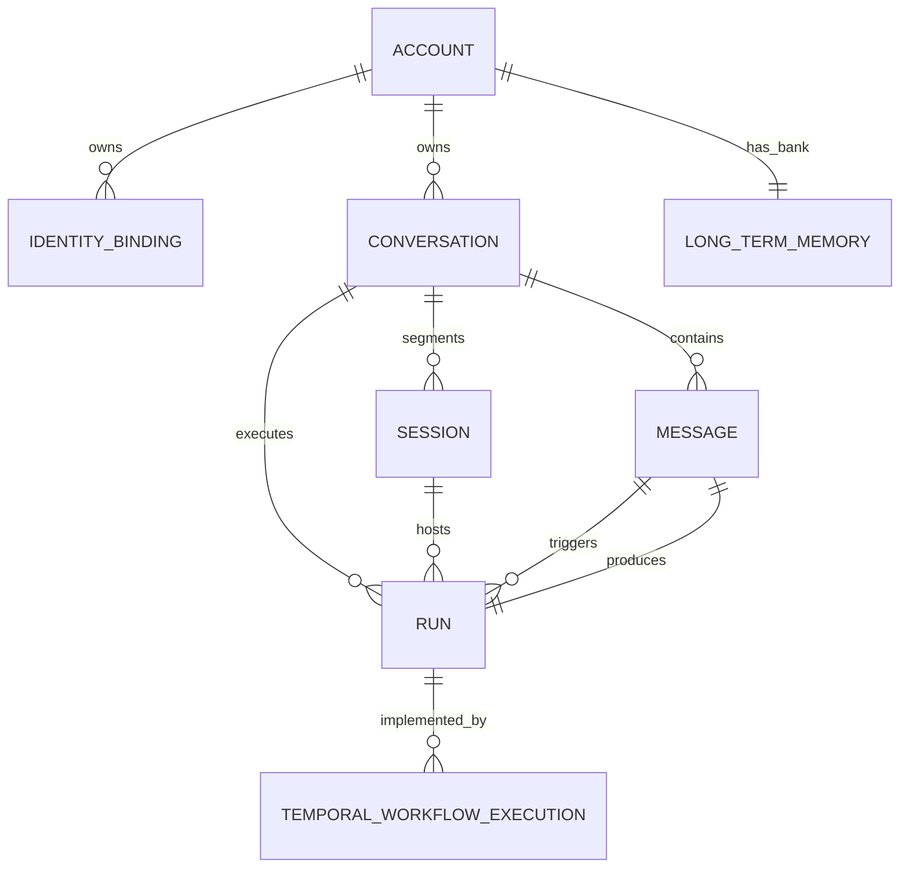
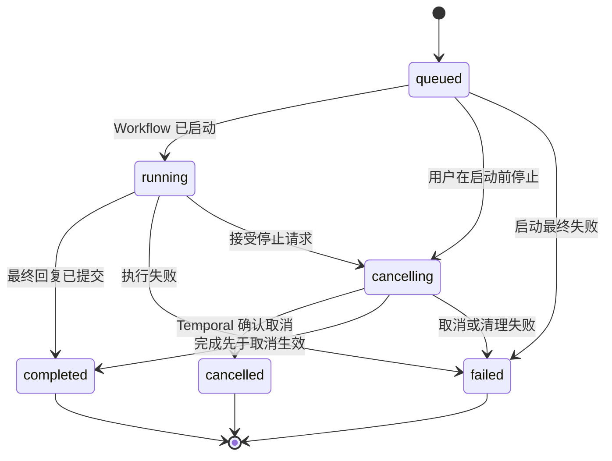
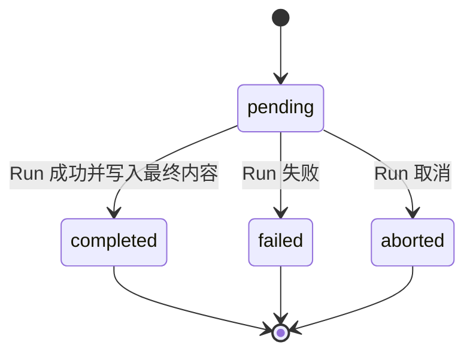
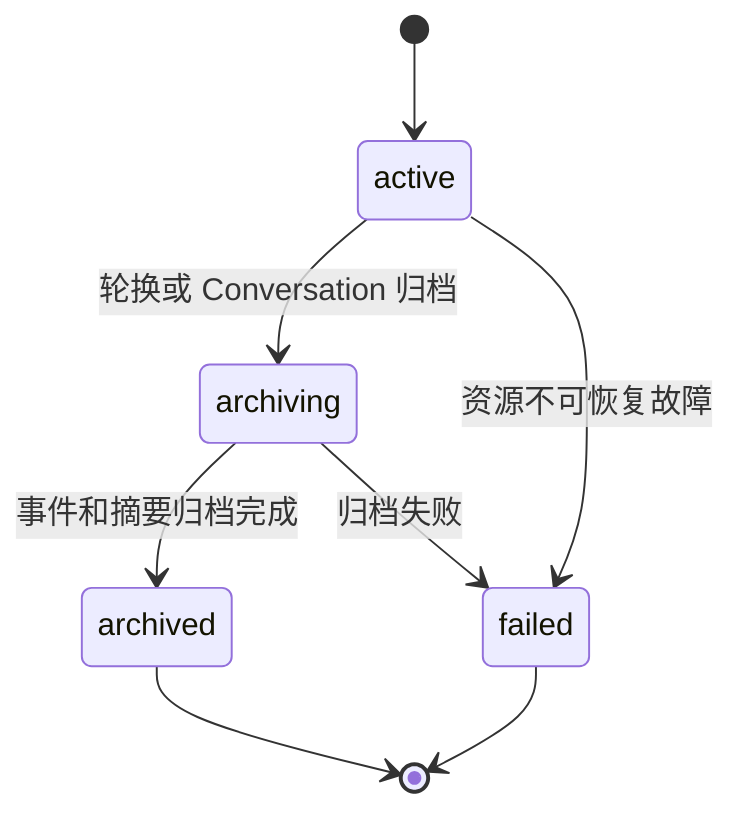
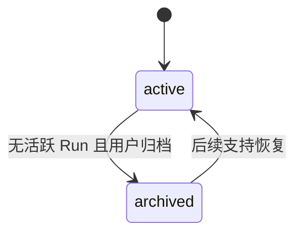

# HpAgent Web 领域模型与状态模型设计

## 1. 文档信息

| 项目 | 内容 |
|---|---|
| 文档版本 | 0.3 |
| 状态 | 已评审 |
| 文档类型 | 目标领域设计 |
| 日期 | 2026-08-04 |
| 上游基线 | [HpAgent Web MVP 需求规格说明书 0.4](hpagent-web-mvp-requirements.md) |

本文定义 HpAgent Web MVP 的核心领域实体、标识、关系、状态机和一致性约束。本文描述的是**目标设计**，不是对当前代码已经实现能力的声明。

本设计优先解决以下问题：

- 多个 Web Conversation 的短期上下文如何严格隔离。
- Message、Run、Session 与 Temporal Workflow Execution 如何建立稳定映射。
- 停止、失败、重试和并发请求如何保持状态一致。
- Hindsight 如何继续按 `account_id` 共享长期记忆，同时不把其他 Conversation 的短期消息带入当前上下文。

## 2. 设计结论摘要

| 问题 | 结论 |
|---|---|
| 一个 Account 有多少 Conversation？ | `Account 1:N Conversation`，数量受产品配额约束，不受领域模型限制。 |
| 一条用户 Message 是否一定对应一个 Run？ | Web 中一次被接受的普通用户发送会原子创建首个 Run；但重试复用原用户 Message 并创建新 Run，因此总体是 `User Message 1:N Run`。系统或导入消息可以没有 Run。 |
| Agent Message 何时创建？ | 与 Run 在同一事务中先创建 `pending` 占位消息，预先获得稳定 `message_id`；Run 完成后写入最终内容并改为 `completed`。MVP 不要求精确持久化每个流式片段。 |
| Conversation 与 Session 的关系？ | `Conversation 1:N Session`，但同一时刻最多一个 `active` Session。MVP 通常只使用一个，轮换或故障恢复时可创建后继 Session。 |
| Workflow 生命周期？ | 每个 Run 启动一个短生命周期 Temporal Workflow；不为 Conversation 维护一个长期 Workflow。 |
| 每个 Conversation 可有多少活跃 Run？ | 最多一个，使用数据库部分唯一索引和事务锁保证，前端状态不参与正确性判断。 |
| 长期记忆如何共享？ | Hindsight bank 继续由 `account_id` 决定；短期上下文只按当前 `conversation_id/session_id` 从消息存储加载，两条通路在 Context Builder 中显式分开。 |
| active Session 的真相源？ | 只以 Session 表中 `status = 'active'` 的记录及其部分唯一索引为准；Conversation 不保存 `active_session_id`。 |
| 流式 delta 是否持久化？ | MVP 不持久化 `message.delta`；只持久化最终 Message 和 Run 状态，断线后回源查询。 |

## 3. 设计原则

1. **领域数据库是真相源**：Account、IdentityBinding、Conversation、Message、Run 和 Session 的权威状态由 HpAgent 后端持久化。
2. **Temporal 负责执行，不负责产品历史**：Workflow Execution 是 Run 的执行机制，不是 Conversation 或消息历史数据库。
3. **Hindsight 负责长期记忆，不负责短期对话**：按 Account 共享长期记忆，不能用 Hindsight 代替 Conversation 消息查询。
4. **一个标识只表达一个概念**：业务 `run_id` 与 Temporal 的 `run_id` 必须使用不同字段名。
5. **状态转换由后端确认**：前端、assistant-ui 和流连接只能展示状态，不能自行决定完成、失败或取消。
6. **并发约束落到存储层**：进程内锁只能优化体验，数据库约束才是最终保护。
7. **终态不可回退**：`completed`、`failed`、`cancelled` 等终态不能被迟到事件改回运行态。
8. **重试创建新 Run**：历史失败不能被覆盖，重试关系必须可追溯。

## 4. 领域关系



关系基数说明：

- 一个 Account 可以有多个渠道身份绑定和多个 Conversation。
- 一个 IdentityBinding 只能属于一个 Account；同一个渠道主体也只能映射到一个 Account。
- 一个 Conversation 包含多条 Message、多个历史 Run 和一个或多个 Session。
- 一个用户 Message 可以触发多个 Run：一个初始 Run，加上零个或多个重试 Run。
- 每个 Run 只产生一个 Agent Message；每个 Agent Message 只属于一个 Run。
- 每个 Run 在 MVP 正常情况下对应一个 Temporal Workflow Execution；模型允许因 Temporal Reset 等运维操作保留多个执行记录。
- 一个 Account 对应一个 Hindsight bank。Long-term Memory 是外部能力的领域投影，不要求在业务数据库复制完整记忆内容。

## 5. 实体定义

### 5.1 Account

Account 表示一个自然人的统一 HpAgent 身份，是数据归属与长期记忆隔离的根实体。

建议字段：

| 字段 | 说明 |
|---|---|
| `account_id` | 主键，后端生成 |
| `status` | `active`、`disabled` |
| `created_at` | 创建时间 |
| `updated_at` | 更新时间 |

不变量：

- 所有 Conversation 最终都必须归属于一个 Account。
- 后端从登录态或 IdentityBinding 解析 Account；不得信任浏览器直接提交的 `account_id`。
- 不同 Account 的 Conversation、Message、Run、Session 和 Hindsight bank 必须隔离。

### 5.2 IdentityBinding

IdentityBinding 把 Web、QQ 等渠道身份映射到统一 Account。目标模型使用独立实体替代当前 `Account.bindings: Dict[str, str]`，便于唯一约束、审计和撤销。

建议字段：

| 字段 | 说明 |
|---|---|
| `identity_binding_id` | 主键，后端生成 |
| `account_id` | 所属 Account |
| `provider` | `web`、`qq` 等稳定枚举 |
| `external_subject_id` | 渠道侧稳定用户标识；QQ 场景为 QQ 身份标识 |
| `normalized_subject_id` | 按 provider 规则规范化后的匹配值，用于解析和唯一约束 |
| `status` | `active`、`revoked` |
| `verified_at` | 完成可信绑定的时间 |
| `created_at` | 创建时间 |

核心约束：

- 渠道标识进入数据库前必须按 provider 规则规范化为 `normalized_subject_id`，匹配和唯一约束不得使用未经规范化的用户输入。
- 部分唯一键：`(provider, normalized_subject_id) WHERE status = 'active'`，保证同一渠道身份同一时刻只能绑定一个 Account，同时允许保留历史 revoked 记录。
- 只有 `active` 且已验证的绑定可用于解析 Account。
- P0 可以通过迁移、配置或受控后台流程建立 Web/QQ 映射；P1 再提供用户自助绑定页面。
- 改绑必须是显式、可审计操作，不能由普通消息请求隐式完成。
- 绑定、撤销和改绑命令必须使用幂等键；改绑应先完成新归属验证，再在一个事务中撤销旧绑定并激活新绑定。

### 5.3 Conversation

Conversation 是 Web 产品中用户可见、可命名、可恢复的短期对话容器。

建议字段：

| 字段 | 说明 |
|---|---|
| `conversation_id` | 主键，后端生成 |
| `account_id` | 所属 Account |
| `title` | 用户标题或自动生成标题 |
| `status` | `active`、`archived` |
| `last_message_seq` | Conversation 内消息顺序分配器 |
| `metadata_version` | 标题、状态等 Conversation 元数据的乐观并发控制版本；Message sequence 分配不递增它 |
| `created_at` | 创建时间 |
| `updated_at` | 最近活动时间 |

不变量：

- 一个 Conversation 只属于一个 Account。
- Conversation 之间不得直接继承消息、事件或上一会话摘要。
- 归档 Conversation 前必须不存在活跃 Run。
- Conversation 标题、列表和生命周期不依赖 Temporal Workflow 是否仍存在。

### 5.4 Message

Message 是 Conversation 内用户可见消息的持久化记录。工具调用和内部执行事件不强制建模为用户可见 Message，可进入独立 Run Event 或审计存储。

建议字段：

| 字段 | 说明 |
|---|---|
| `message_id` | 主键，后端生成 |
| `conversation_id` | 所属 Conversation |
| `account_id` | 冗余归属字段，用于隔离校验和查询保护 |
| `role` | `user`、`assistant`、必要时 `system` |
| `status` | 用户消息通常为 `accepted`；Agent 消息为 `pending`、`completed`、`failed`、`aborted` |
| `content` | 消息正文；Agent Message 在 `pending` 时可为空 |
| `sequence` | Conversation 内单调递增顺序号 |
| `client_request_id` | 用户消息的客户端幂等键；Agent Message 为空 |
| `produced_by_run_id` | Agent Message 对应的 Run；用户 Message 为空 |
| `created_at` | 创建时间 |
| `completed_at` | Agent Message 完成时间 |

核心约束：

- 唯一键：`(conversation_id, sequence)`。
- 用户消息唯一键：`(account_id, client_request_id)`，防止多标签页或网络重放造成重复消息。
- Agent Message 唯一键：`produced_by_run_id`，保证一个 Run 最多产生一条 Agent Message。
- `completed` 内容不可被迟到流事件覆盖；若未来支持重新生成，使用新 Run 和新 Agent Message，不覆盖旧记录。

#### 用户 Message 与 Run 的关系

MVP 的普通发送接口采用以下规则：

- 一次成功接受的用户发送，在同一事务中创建用户 Message、首个 Run 和 `pending` Agent Message。
- 如果同一 Conversation 已有活跃 Run，请求返回冲突，不创建 Message 或 Run。
- 如果相同 `client_request_id` 被重放，返回第一次创建的 Message/Run，不重复插入。
- 失败或取消后的“重试”不复制用户 Message，而是以同一个 `trigger_message_id` 创建新 Run。

因此，普通用户 Message 至少有一个 Run，但不是严格一对一；系统通知、迁移或导入消息可以没有 Run。

#### Agent Message 的创建时机

Agent Message 在 Run 创建时以 `pending` 状态创建，而不是等 Run 完成后才创建，原因是：

- 流事件从一开始就能携带稳定 `message_id`。
- Message 顺序可以在事务中确定，避免完成顺序导致消息乱序。
- 停止或失败后仍能保留明确、可审计的输出槽位状态。

MVP 不要求把每个 token 或每个 delta 精确写入 Message。流式片段可以是临时投影；Run 完成时一次性写入最终正文。停止或失败时，未确认片段可以丢弃，Agent Message 分别进入 `aborted` 或 `failed`。

### 5.5 Run

Run 表示 Agent 对一次用户请求的业务执行，是停止、失败、重试、并发控制和状态展示的核心实体。

建议字段：

| 字段 | 说明 |
|---|---|
| `run_id` | 主键，HpAgent 后端生成 |
| `conversation_id` | 所属 Conversation |
| `account_id` | 冗余归属字段 |
| `session_id` | 本次执行使用的 Session |
| `trigger_message_id` | 触发执行的用户 Message |
| `retry_of_run_id` | 重试时指向上一 Run；初始 Run 为空 |
| `workflow_id` | 对应 Temporal Workflow ID，由编排服务确定性生成 |
| `context_message_seq` | Run 创建时冻结的短期上下文消息水位，等于触发用户 Message 的 sequence |
| `status` | `queued`、`running`、`cancelling`、`completed`、`failed`、`cancelled` |
| `failure_code` | 稳定、可分类的失败码 |
| `failure_message` | 安全的用户可见或运维摘要，不存敏感堆栈 |
| `created_at` | 创建时间 |
| `started_at` | 开始时间 |
| `finished_at` | 进入终态时间 |

不变量：

- Run、触发 Message、由该 Run 产生的 Agent Message、Session 和 Conversation 必须属于同一个 Account。
- `retry_of_run_id` 必须属于同一 Conversation，并最终追溯到相同 `trigger_message_id`。
- Run 进入终态后不可回到非终态。
- 同一 Conversation 同时最多存在一个 `queued`、`running` 或 `cancelling` Run。

### 5.6 Session

Session 是 Conversation 的运行资源与短期事件段，承载事件流、工作区、Sandbox、检查点和归档摘要。它不是 Web 左侧栏中的 Conversation。

建议字段：

| 字段 | 说明 |
|---|---|
| `session_id` | 主键，Session 服务生成 |
| `conversation_id` | 所属 Conversation |
| `account_id` | 所属 Account |
| `sequence` | 同一 Conversation 内第几个 Session |
| `status` | `active`、`archiving`、`archived`、`failed` |
| `predecessor_session_id` | 轮换时指向同 Conversation 的前一 Session |
| `summary` | 仅用于同一 Conversation 内跨 Session 续接的摘要 |
| `created_at` | 创建时间 |
| `archived_at` | 归档时间 |

为什么不是严格一对一：

- MVP 正常路径可以让一个 Conversation 始终使用一个 Session。
- 长 Conversation 的事件量、资源轮换、故障恢复或归档可能要求创建新 Session。
- 新 Session 只能继承**同一个 Conversation** 的前序 Session 摘要，不能按 `account_id` 继承其他 Conversation 的摘要。

存储层必须保证同一 Conversation 最多一个 `active` Session。

active Session 的**唯一真相源**是 Session 表中该 Conversation 下 `status = 'active'` 的记录。Conversation 不保存 `active_session_id`，缓存也只能保存可丢弃的查询结果；任何缓存命中都必须能够由 Session 表重建。

### 5.7 Temporal Workflow Execution

Temporal Workflow Execution 是 Run 的技术执行记录，不是领域 Run 本身。

建议记录字段：

| 字段 | 说明 |
|---|---|
| `workflow_execution_id` | HpAgent 侧执行记录主键 |
| `run_id` | 对应领域 Run |
| `workflow_id` | Temporal Workflow ID，如 `hpagent-web-run-{run_id}` |
| `temporal_run_id` | Temporal 服务生成的 Run ID，名称必须与领域 `run_id` 区分 |
| `status` | `scheduled`、`running`、`cancel_requested`、`completed`、`failed`、`cancelled`、`terminated`、`timed_out` |
| `started_at` | Temporal 执行开始时间 |
| `closed_at` | Temporal 执行结束时间 |

MVP 正常路径是一条领域 Run 对应一个 Workflow Execution。若发生 Temporal Reset、运维重启或未来引入 Continue-As-New，同一领域 Run 可以保留多个执行记录，但任一时刻只能有一个当前执行。

Temporal 内部的 Activity 重试不创建新的领域 Run。只有用户或业务层明确发起重试时，才创建新的领域 Run 和新的 `workflow_id`。

### 5.8 Long-term Memory

Long-term Memory 表示 Hindsight 中按 Account 隔离的长期记忆集合。

目标映射保持：

```text
bank_id = hpagent-u-{account_id}
```

业务数据库至少保存或能够推导以下信息：

- `account_id` 与 Hindsight bank 的稳定映射。
- 写入来源的 `channel_type`、`conversation_id`、`session_id` 和 `run_id` 元数据。
- 召回审计中的当前 `conversation_id`、查询、结果标识和时间。

Long-term Memory 不保存当前 Conversation 的消息顺序，也不决定 Conversation 的短期上下文。

## 6. ID 生成与归属

建议业务 ID 使用 UUIDv7 或同类可排序、全局唯一标识。具体格式可在数据库设计中确定，但生成责任不得改变。

| 标识 | 生成者 | 生成时机 | 规则 |
|---|---|---|---|
| `account_id` | Account Service | 首次创建统一账号时 | 后端生成；不使用 QQ 号、邮箱等外部身份作为主键 |
| `identity_binding_id` | Account Service | 创建绑定时 | 后端生成；渠道主体唯一性由数据库保证 |
| `conversation_id` | Conversation Service | 创建 Conversation 时 | 后端生成并校验归属 |
| `message_id` | Message/Run Service | 接受发送事务中 | 用户 Message 和 Agent Message 都由后端生成 |
| `run_id` | Run Service | 接受发送或重试事务中 | 领域业务 ID；不得使用 Temporal Run ID 代替 |
| `session_id` | Session Service | Conversation 首次执行或 Session 轮换时 | 后端生成，绑定 `conversation_id` |
| `workflow_id` | Orchestration Service | 创建 Run 时 | 根据 `run_id` 确定性生成并持久化，如 `hpagent-web-run-{run_id}` |
| `temporal_run_id` | Temporal Server | Workflow Execution 启动时 | 只用于 Temporal 执行定位，不暴露为业务 `run_id` |
| `client_request_id` | Web 客户端 | 每次用户点击发送前 | 幂等键，不是领域实体主键；重放时保持不变 |
| `cancel_request_id` | Web 客户端 | 每次用户发起停止意图前 | 停止命令幂等键；网络重试保持不变 |
| `retry_request_id` | Web 客户端 | 每次用户发起重试意图前 | 重试命令幂等键；网络重试保持不变 |

## 7. Workflow 生命周期决策

### 7.1 选择：每个 Run 一个 Workflow

每个 Run 启动一个短生命周期 Workflow，执行完成、失败或取消后关闭。Conversation 和 Session 的状态独立持久化，不依赖 Workflow 长期存活。

选择原因：

- Run 与 Workflow 的取消和终态可以直接对应。
- 同一 Conversation 的并发控制由数据库完成，不需要用 Workflow 信号队列隐式排队。
- 避免 Conversation 越长，Temporal History 越大。
- 重试天然创建新 Run 和新 Workflow，不覆盖旧失败历史。
- Workflow 故障、重置或归档不会影响 Conversation 列表和消息历史。
- 多个 Conversation 不会因为共享 account 级 Workflow 而串行或串上下文。

### 7.2 不选择：一个 Conversation 一个长期 Workflow

长期 Workflow 虽然便于通过 Signal 接收新消息，但会引入以下问题：

- Workflow History 随对话持续增长，需要 Continue-As-New 和信号迁移策略。
- Conversation、Run 和 Workflow 生命周期耦合，刷新恢复和归档更复杂。
- 取消一次 Run 容易误伤整个 Conversation Workflow。
- 并发消息、迟到 Signal 和重试的业务语义难以直接映射。

因此，MVP 不使用 Conversation 级长期 Workflow。

### 7.3 可靠启动

用户消息、Run、Agent Message 与启动命令应使用事务 Outbox：

1. 数据库事务锁定 Conversation。
2. 检查幂等键与活跃 Run 约束。
3. 必要时创建 active Session。
4. 创建用户 Message、`queued` Run、`pending` Agent Message 和 Workflow Outbox 事件。
5. 提交事务后，由 Dispatcher 使用确定性 `workflow_id` 启动 Temporal Workflow。
6. Dispatcher 重复投递时，Temporal Workflow ID 和 Outbox 消费都必须幂等。
7. Workflow 确认启动后，Run 从 `queued` 进入 `running`。

这样可以避免“数据库已保存消息但 Workflow 未启动”或“Workflow 已启动但数据库没有 Run”的双写裂缝。

## 8. 状态模型

### 8.1 Run 状态机



允许的终态为 `completed`、`failed` 和 `cancelled`。终态更新必须使用条件更新或版本号，防止迟到事件覆盖已经确认的结果。

### 8.2 Agent Message 状态机



MVP 不引入 `streaming` 持久状态。流式显示属于 UI 投影；是否收到 delta 不改变 Message 的权威状态。

### 8.3 Session 状态机



Session 进入 `failed` 或 `archived` 后，如 Conversation 仍为 `active`，可以创建新的 active Session。旧 Session 不回到 active。

### 8.4 Conversation 状态机



Conversation 不因单次 Run 失败或取消而进入失败状态。

### 8.5 流事件模型

流事件是持久化领域状态的实时投影，不是真相源。MVP 使用以下统一事件信封：

| 字段 | 说明 |
|---|---|
| `event_id` | 本次投递的事件标识，用于客户端短时去重 |
| `event_type` | 事件类型 |
| `conversation_id` | 所属 Conversation |
| `run_id` | 所属领域 Run |
| `message_id` | 涉及消息时填写，delta 指向预建 Agent Message |
| `stream_id` | 单次在线发布生命周期标识；Worker/Event Sink 重启时更换 |
| `event_seq` | 同一 `stream_id` 内单调递增的瞬时传输序号；不保证跨发布生命周期连续 |
| `payload` | delta、状态或安全错误摘要 |
| `occurred_at` | 服务端产生时间 |

MVP 事件类型：

| 事件 | 产生条件 | 持久化规则 |
|---|---|---|
| `run.started` | Run 已提交为 `running` | Run 状态已先持久化，事件可丢失 |
| `message.delta` | 模型产生增量文本 | **不持久化**到 Message、关系数据库或 WAL；只作为当前连接的瞬时投影 |
| `run.status` | Run 状态变化 | Run 状态已先持久化 |
| `run.completed` | Run 与完整 Agent Message 已提交完成终态 | 终态已持久化，payload 携带完整 Run/Message snapshot |
| `run.failed` | Run 与 Agent Message 已提交失败终态 | 终态已持久化 |
| `run.cancelled` | Run 与 Agent Message 已提交取消终态 | 终态已持久化 |

具体规则：

- Worker 可在内存中累积本次输出；只有正常完成时才把最终正文一次性写入 `pending` Agent Message，并原子更新 Message/Run 为 `completed`。
- 失败或取消时，MVP 丢弃未确认 delta，Agent Message 分别进入 `failed` 或 `aborted`，不保存精确部分回复。
- `event_seq` 只保证同一 `stream_id` 在线生命周期内的排序，不承诺 Worker 重启、stream 变化或断线后的连续性和持久重放；stream 变化或无法证明连续时客户端进入 degraded 并回源数据库。
- 终态事件使用稳定 `event_id` 和完整数据库 snapshot，不要求与此前 delta 的 event_seq 连续。
- 客户端发现断线、序号缺口或刷新页面时，必须查询 Message 和 Run；MVP 不保证重新接续原增量流。
- `run.completed`、`run.failed` 和 `run.cancelled` 必须在数据库事务提交后发布，禁止先向前端宣告终态再落库。
- 多实例广播可以使用 Redis Pub/Sub 等瞬时通道，但该通道不得成为消息或状态存储。

## 9. 停止、失败与重试的一致性规则

| 场景 | Conversation | Session | 用户 Message | Agent Message | Run | Workflow Execution |
|---|---|---|---|---|---|---|
| 正常完成 | 保持 `active` | 保持 `active` | 保持 `accepted` | `pending → completed`，写入最终内容 | `queued → running → completed` | `scheduled → running → completed` |
| 用户停止 | 保持 `active` | 保持 `active` | 保持 `accepted` | `pending → aborted` | `running → cancelling → cancelled` | `running → cancel_requested → cancelled` |
| 执行失败 | 保持 `active` | 通常保持 `active` | 保持 `accepted` | `pending → failed` | `running → failed` | `running → failed/timed_out` |
| 启动最终失败 | 保持 `active` | 保持 `active` | 保持 `accepted` | `pending → failed` | `queued → failed` | 没有成功执行记录，或 `scheduled → failed` |
| 失败后重试 | 保持 `active` | 复用 active Session；Session 故障时新建 | 复用原 Message | 新建 `pending` Agent Message | 新建 `queued` Run，`retry_of_run_id` 指向旧 Run | 新建 Workflow ID 和 Execution |
| 取消后重试 | 保持 `active` | 复用 active Session | 复用原 Message | 新建 `pending` Agent Message | 新建 `queued` Run，旧 Run 保持 `cancelled` | 新建 Workflow ID 和 Execution |

### 9.1 停止与完成竞态

用户发出停止请求时，Run 先通过条件更新从 `queued/running` 进入 `cancelling`，再请求 Temporal 取消。

若最终结果已在停止请求前完成提交，则 `completed` 胜出，停止接口返回“已完成，无法取消”。若 Run 已进入 `cancelling` 但 Workflow 在取消生效前产生最终结果，后端必须通过同一事务决定唯一终态；允许 `cancelling → completed`，但不得同时产生 `completed` Run 和 `aborted` Agent Message。

### 9.2 失败与重试

- 旧 Run、旧 Workflow Execution 和旧 Agent Message 保持原终态，不修改成成功。
- 新 Run 复用原 `trigger_message_id`，创建新的 Agent `message_id` 和 `workflow_id`。
- 重试链通过 `retry_of_run_id` 保留；MVP UI 可以只显示当前结果，但后端必须可审计。
- 重试也受“每个 Conversation 一个活跃 Run”约束。

### 9.3 停止与重试命令幂等

停止和重试都是领域命令，不能把 HTTP 重放直接转换为重复副作用。

#### 停止命令

- 客户端为一次停止意图生成稳定 `cancel_request_id`；网络重试沿用同一值。
- 后端保存或去重 `(account_id, cancel_request_id)`；重复请求关联同一命令记录和目标 Run，可返回 Run 的当前状态，但不得重复产生副作用。
- Run Service 使用条件更新：只有 `queued/running` 可以进入 `cancelling`；已经是 `cancelling` 时返回当前状态；已经终态时直接返回终态。
- Temporal 取消 Outbox 使用确定性唯一键 `cancel-run:{run_id}`。重复停止不得重复创建取消副作用。
- 即使客户端错误地使用新 `cancel_request_id`，同一个 Run 也最多存在一个未完成取消命令。

#### 重试命令

- 客户端为一次重试意图生成稳定 `retry_request_id`；网络重试沿用同一值。
- 后端在事务中锁定源 Run，只允许 `failed/cancelled` Run 被重试。
- 唯一键 `(account_id, retry_request_id)` 保证同一命令只创建一个新 Run。
- `retry_of_run_id` 使用唯一约束，保证一个失败或取消 Run 最多有一个直接重试子 Run；若子 Run 再失败，应重试该子 Run，形成可追溯链。
- 重复重试命中已存在的子 Run 时直接返回该 Run，不创建新 Agent Message、Workflow 或 Outbox 事件。
- 新 Run 的 Workflow 启动 Outbox 使用唯一键 `start-run:{new_run_id}`。

命令幂等记录的保留时间不得短于 Message、Run 和 Outbox 的可重试窗口。

### 9.4 状态对账

Run 是产品状态真相源，Temporal 状态是执行事实来源之一。两者通过幂等事件和定期 Reconciler 对账：

- Workflow 开始、完成、失败或取消时，以 `run_id` 上报状态事件。
- Run Service 使用期望前态和 `version` 做条件更新。
- 丢失回调或服务重启后，Reconciler 查询未终态 Run 对应的 Temporal Execution 并修正状态。
- 修正不得覆盖已经持久化的合法终态；异常分歧进入告警和人工审计。

## 10. 每个 Conversation 一个活跃 Run

### 10.1 数据库最终约束

以 PostgreSQL 为例，使用部分唯一索引：

```sql
CREATE UNIQUE INDEX uq_runs_one_active_per_conversation
ON runs (conversation_id)
WHERE status IN ('queued', 'running', 'cancelling');
```

该约束保证即使存在多个 Web 实例、多个标签页或消息重放，也不能为同一 Conversation 创建两个活跃 Run。

### 10.2 创建事务

发送消息时执行：

1. 从认证上下文解析 `account_id`。
2. `SELECT ... FOR UPDATE` 锁定 Conversation，并验证归属。
3. 按 `(account_id, client_request_id)` 查询幂等结果；命中则直接返回。
4. 检查活跃 Run；存在时返回明确冲突，不持久化新用户 Message。
5. 确保存在且仅存在一个 active Session。
6. 分配两个 `message_id`、一个 `run_id` 和两个连续 `sequence`。
7. 插入用户 Message、Run、Agent Message 和 Outbox 事件。
8. 提交事务。

部分唯一索引处理最后一道竞态；若索引冲突，事务回滚并返回统一的 `conversation_busy` 错误。

### 10.3 Session 唯一约束

Session 表是 active Session 的唯一真相源，并通过以下索引保证每个 Conversation 最多一个 active Session：

```sql
CREATE UNIQUE INDEX uq_sessions_one_active_per_conversation
ON sessions (conversation_id)
WHERE status = 'active';
```

读取 active Session 时直接查询该约束覆盖的记录。Conversation 表不设置 `active_session_id`，Redis 等缓存不保存第二份权威指针。创建或轮换 Session 时，在事务中锁定 Conversation，先归档或失败化旧 Session，再插入新 active Session；唯一索引处理最后一道竞态。

### 10.4 组合外键与同归属约束

仅有单列主键无法从数据库层阻止“Run 属于 Account A，却引用 Account B 的 Message/Session”。目标表应提供组合候选键和组合外键：

```text
conversations UNIQUE (account_id, conversation_id)
messages      UNIQUE (account_id, conversation_id, message_id)
sessions      UNIQUE (account_id, conversation_id, session_id)
runs          UNIQUE (account_id, conversation_id, run_id)
```

Run 至少建立：

- `(account_id, conversation_id)` → Conversation。
- `(account_id, conversation_id, session_id)` → Session。
- `(account_id, conversation_id, trigger_message_id)` → Message。
- `(account_id, conversation_id, retry_of_run_id)` → Run，允许为空。

Agent Message 使用 `(account_id, conversation_id, produced_by_run_id)` 组合外键指向 Run，并对 `produced_by_run_id` 建唯一约束。这样 `Message.produced_by_run_id` 是 Run 与输出 Message 关系的唯一真相源，避免在 Run 上再保存 `output_message_id` 形成双向外键和双写。

Workflow Execution 使用 `(account_id, conversation_id, run_id)` 组合外键指向 Run。应用层和数据库 CHECK/触发器还必须保证 `trigger_message_id` 指向 `role = 'user'`，`produced_by_run_id` 非空的 Message 为 `role = 'assistant'`；普通外键本身不能验证角色。

## 11. Conversation 短期上下文与 Hindsight 长期记忆

### 11.1 两条独立数据通路

每个 Run 构建上下文时，必须分开读取：

```text
短期上下文：Message Store
  WHERE account_id = authenticated_account_id
    AND conversation_id = current_conversation_id
    AND sequence <= current_run.context_message_seq
    AND (
      (role = 'user' AND status = 'accepted')
      OR
      (role = 'assistant' AND status = 'completed')
    )
  ORDER BY sequence

长期记忆：Hindsight
  bank_id = hpagent-u-{authenticated_account_id}
  recall(query, source metadata...)
```

Context Builder 最后把两部分放入不同的逻辑区段，再交给模型。不得先按 `account_id` 查询全部近期消息后再在内存中过滤 Conversation。

`context_message_seq` 在 Run 创建事务中冻结为触发用户 Message 的 `sequence`。它保证一次 Run 的输入不会因迟到写入或其他标签页刷新而漂移。预建的 `pending` Agent Message、`failed/aborted` Agent Message、工具事件和流式 delta 均不进入短期消息上下文。

重试 Run 继续使用同一个触发用户 Message，并重新计算或继承相同的 `context_message_seq`。由于失败或取消的 Agent Message 被状态过滤，同一用户 Message 在重试上下文中只出现一次，不会把失败占位或未确认片段喂给模型。

### 11.2 隔离规则

1. 短期消息查询必须同时带后端认证得到的 `account_id` 和当前 `conversation_id`。
2. `conversation_id` 必须先校验属于当前 Account。
3. Session 事件只能通过当前 Conversation 的 active `session_id` 读取。
4. 新 Session 只可继承同一 Conversation 的前序 Session 摘要。
5. 禁止使用 `account:{account_id}:active` 作为 Web 短期上下文入口。
6. 禁止默认注入“该账号上一 Session 摘要”；必须验证前序 Session 的 `conversation_id` 相同。
7. Hindsight 召回结果是跨 Conversation 的长期记忆，不得把来源 Session 的原始消息历史整体拼回当前上下文。
8. 写入 Hindsight 时继续使用 Account bank，并附带 `channel_type`、`conversation_id`、`session_id`、`run_id` 作为来源元数据。
9. Web 与 QQ IdentityBinding 映射到同一 `account_id` 后自然共享 bank；短期消息仍分别由 Web Conversation 和 QQ 会话存储管理。

### 11.3 Hindsight 的边界

Hindsight 可以返回从其他 Conversation 或 QQ 中提取的稳定事实，这是长期记忆共享的预期行为。它不应返回或被用来恢复以下内容：

- 另一 Conversation 的完整最近消息列表。
- 另一渠道的原始短期对话窗口。
- 当前 Conversation 的权威消息顺序。
- Run、Message 或 Conversation 的业务状态。

### 11.4 Hindsight 写入规则

Web Run 的长期记忆写入遵循以下规则：

1. 只对 `completed` Run 提交 retain；`failed`、`cancelled`、`pending` 或 `aborted` 内容不进入长期记忆。
2. 每次 retain 只提交该 Run 对应的一个 `accepted` 用户 Message 和一个 `completed` Agent Message，不提交整个 Conversation 或 Session 的累计历史。
3. Hindsight bank 继续使用 `hpagent-u-{account_id}`，`account_id` 只能从已验证的服务端归属链路取得。
4. 使用稳定 `document_id = web-run:{run_id}`，保证异步重试不会重复创建同一来源文档。
5. metadata 至少包含 `channel_type=web`、`account_id`、`conversation_id`、`session_id`、`run_id`、`user_message_id` 和 `assistant_message_id`。
6. retain 通过 Outbox 或同等级可靠任务触发，唯一键为 `retain-memory:{run_id}`；重复消费必须幂等。
7. Message/Run 的主事务不等待 Hindsight 成功。retain 失败进入重试与告警，但不能回滚已完成回复。
8. Hindsight 中的内容是派生长期记忆，不取代 Message、Run 或审计事件的持久化。
9. QQ 侧可以保留现有 Session 来源模型；只要 IdentityBinding 解析到相同 `account_id`，Web 与 QQ 就共享同一 bank。

## 12. 当前实现与目标设计的差距

| 领域 | 当前实现事实 | 目标设计 |
|---|---|---|
| Account | `Account.bindings` 为 JSON 字典，AccountService 使用本地 JSON 文件 | 独立 IdentityBinding 实体、数据库唯一约束和审计 |
| Conversation | `application.conversation.ConversationService` 实际负责账号级 Workflow/Session 启动，没有持久化 Web Conversation 实体 | 持久化 Conversation 聚合及列表、标题、归属和状态；不保存 active Session 指针 |
| Workflow | `workflow_id = hpagent-{account_id}`，同一账号的新消息通过 Signal 进入长期 Workflow | `workflow_id = hpagent-web-run-{run_id}`，每个 Run 一个短 Workflow |
| Session | Redis 使用 `account:{account_id}:active`，一个账号只有一个活跃 Session 指针 | 一个 Conversation 最多一个 active Session；一个 Account 可同时有多个 Conversation Session |
| 上下文继承 | 新 Session 默认按 Account 注入上一 Session 摘要 | 只允许同一 Conversation 内的 Session 继承 |
| Message | 事件流记录 user/model event，但缺少 Web 所需稳定 Message 实体、顺序和幂等键 | 独立 Message 实体与稳定 `message_id`、`sequence`、`client_request_id` |
| Run | 没有独立业务 Run 实体 | 独立 Run 状态机、重试链、取消和并发约束 |
| Temporal Execution | Workflow Query 返回 session/account/turns，没有与业务 Run 的稳定记录 | Run 到 Workflow Execution 的显式映射与对账 |
| Long-term Memory | Hindsight 已按 `hpagent-u-{account_id}` 建 bank，并以 Session 累计内容作为文档 | 保留 Account bank；Web 改为 completed Run 级幂等写入，补充 conversation/run 来源元数据并隔离短期消息加载 |

上述差距属于 architecture drift，后续实现必须通过代码与架构文档同步消除，不能仅修改 Web 前端适配。

## 13. 建议的实现顺序

1. 建立关系数据库中的 Account、IdentityBinding、Conversation、Message、Run、Session 和 Outbox 表及约束。
2. 迁移现有 Account/渠道绑定，验证 Web 与 QQ 可以解析到同一 `account_id`。
3. 实现 Conversation、发送消息、查询消息和 Run 状态的后端服务契约。
4. 将 Web 入口改为事务创建 Message/Run，并通过 Outbox 启动每 Run Workflow。
5. 改造 SessionStore，使 active Session 索引从 Account 维度变为 Conversation 维度。
6. 改造上下文构建，只读取当前 Conversation/Session 的短期消息和事件。
7. 保留 Hindsight Account bank，补充 Conversation/Run 来源元数据并完成 AC-009。
8. 实现取消、失败、重试命令幂等、状态对账和每 Conversation 单活跃 Run 约束。
9. 实现非持久化 delta 流事件适配和断线后的 Message/Run 回源。
10. 接入 assistant-ui 适配层，并完成多标签页并发、断线回源和真相源验收。

## 14. 评审检查清单

- [x] 接受 `Account 1:N Conversation`。
- [x] 接受 `Conversation 1:N Session`，Session 表和部分唯一索引是单 active Session 的唯一真相源。
- [x] 接受用户 Message 可对应多个重试 Run，而不是严格一对一。
- [x] 接受 Run 创建时预建 `pending` Agent Message。
- [x] 接受每个 Run 一个短生命周期 Temporal Workflow。
- [x] 接受领域 `run_id` 与 `temporal_run_id` 严格分名。
- [x] 接受用数据库部分唯一索引保证单活跃 Run 和 Session。
- [x] 接受重试复用用户 Message、创建新 Run 和新 Agent Message。
- [x] 接受 Hindsight 继续按 Account 共享，而短期消息严格按 Conversation 和 Message 状态查询。
- [x] 接受移除 Web 路径中的 account 级 active Session 与跨 Conversation 摘要继承。
- [x] 接受停止与重试命令幂等规则。
- [x] 接受 MVP 不持久化 delta，断线后回源 Message/Run。
- [x] 接受 `stream_id` 标识单次在线发布生命周期，event_seq 不保证跨 Worker 重启连续。
- [x] 接受完成路径使用携带完整 Run/Message snapshot 的 `run.completed`，不重复发布 `message.completed`。
- [x] 接受 Conversation `metadata_version` 与 Message sequence 分离。

本文 0.3 已通过领域模型评审，可作为后端数据模型、API、流事件协议和 Temporal Workflow 详细设计的输入基线。
