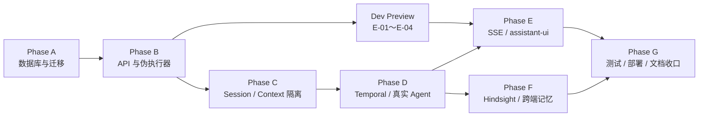

# HpAgent Web MVP 实施计划

## 1. 文档信息

| 项目 | 内容 |
|---|---|
| 文档版本 | 0.2 |
| 状态 | 已评审 |
| 文档类型 | MVP 实施拆解与 Issue 规划 |
| 日期 | 2026-08-04 |
| 需求基线 | [HpAgent Web MVP 需求规格说明书 0.4](hpagent-web-mvp-requirements.md) |
| 领域基线 | [HpAgent Web 领域模型与状态模型设计 0.3](hpagent-web-domain-and-state-model.md) |
| 架构基线 | [HpAgent Web 系统架构设计 0.4](hpagent-web-system-architecture.md) |
| 数据基线 | [HpAgent Web 数据库与持久化详细设计 0.3](hpagent-web-database-design.md) |
| API 基线 | [HpAgent Web API 与 SSE 契约 0.3](hpagent-web-api-contract.md) |
| Temporal 基线 | [HpAgent Web Temporal 与执行生命周期详细设计 0.2](hpagent-web-temporal-design.md) |
| 执行融合基线 | [HpAgent Agent 执行内核融合设计 0.2](hpagent-agent-execution-integration.md) |

本文不再论证架构，而是把已确定的设计拆成可实施、可测试、可验收并可直接转换为 GitHub Issues 的工作项。任务编号在转 Issue 后保持不变，用于提交、测试、PR 和发布记录关联。

## 2. 实施规则

### 2.1 优先级和规模

| 标记 | 含义 |
|---|---|
| P0 | Web MVP 上线硬依赖；未完成不得越过阶段门禁 |
| P1 | 应在 MVP 稳定期完成，但存在已评审的 P0 兼容方案 |
| S | 单一模块、边界明确的小任务 |
| M | 跨 2～3 个模块或需要集成测试 |
| L | 应在创建 Issue 后继续拆成多个子 Issue/PR |

规模只表达拆分需求，不承诺工期。任何 L 任务在进入开发前必须拆分到单个 PR 可安全评审的范围。

### 2.2 Definition of Ready

任务开始前必须满足：

- 上游设计版本和前置任务明确。
- DTO、表字段、状态或端口来自已列出的基线，不在代码中另起一套定义。
- 验收标准能被自动测试或明确的人工步骤验证。
- 涉及破坏性 migration、认证、外部副作用工具或工作区修复时已有回滚/失败关闭策略。
- 任务不会夹带文件上传、模式切换、重新生成等 P1/P2 范围。

### 2.3 Definition of Done

每个任务完成必须同时满足：

- 实现和必要配置已提交，未留下只能靠开发者记住的隐式约束。
- 单元、集成或 E2E 测试按任务要求通过。
- 新增错误码、事件、状态或 schema 已有契约测试。
- 日志和指标不泄露消息正文、凭证、提示词或工具敏感输出。
- 相关运行说明和配置样例已更新。
- PR 描述引用任务 ID、设计章节、测试证据和已知风险。

### 2.4 范围约束

- MVP 不迁移既有 JSON、Redis Session Event 或历史 QQ 数据到 Web 业务表。
- 新环境中的 Account/IdentityBinding 建立属于正常账号初始化与绑定流程，不属于历史数据迁移；不导入旧 `accounts.json`，也不保留旧 Account ID。
- 不修改既有 QQ Workflow type/signal 协议，除非任务明确要求兼容字段扩展。
- 不以 Redis、Temporal History、Workspace/WAL 或 assistant-ui state 替代 PostgreSQL 领域真相。
- 不自动修改现有 Excalidraw；Phase G 只更新 Markdown 并创建人工视觉文档提醒。
- `session_worktree` 是目标方案；MVP 可先使用经过启动硬校验的 `single_process_account_lock`。

## 3. 阶段总览与门禁



| 阶段 | 出口门禁 |
|---|---|
| Phase A | 基础 CI 可用；真实 PostgreSQL 上 DB-001～DB-025 全部通过，schema 可从空库重复创建 |
| Phase B | 不接真实 Agent 即可完成登录、Conversation、发送、查询、取消、重试和刷新恢复 |
| Phase C | Conversation 短期上下文、Session、Sandbox/Workspace 和多账号隔离测试全部通过 |
| Phase D | Temporal 0.2 已评审；真实 Run 可完成、失败、取消、重启恢复，QQ 回归通过 |
| Phase E | assistant-ui 完成长对话主流程；SSE 缺口、刷新、多标签页和进度事件契约通过 |
| Phase F | Web/QQ 共享 Account 长期记忆且短期上下文不串线；retain 可补偿 |
| Phase G | CI、故障注入、部署、回滚、安全、性能和架构事实文档全部收口 |

Phase C 是真实 Web Agent 接入的硬门槛；不得为了演示提前让 Web 调用旧 account 级 Session/Context 路径。Phase D 在 Temporal 文档仍为“待评审”时只能开发不依赖争议语义的基础模块，不能宣告阶段完成。

### 3.1 阶段性交付点

| 交付点 | 完成范围 | 可验证能力 |
|---|---|---|
| Milestone 1：Web Dev Preview | Phase A、Phase B、E-01～E-04 | 登录、Conversation、发送消息、Fake Executor、停止、重试、刷新恢复和基础 assistant-ui 页面；不接真实 Agent |
| Milestone 2：Real Agent Release Candidate | Phase C、Phase D、E-05～E-07 | Conversation Context 隔离、真实 Agent、Temporal、SSE、取消、Worker 重启与故障恢复 |
| Milestone 3：完整 MVP | Phase F、Phase G | QQ/Web 长期记忆共享、retain 补偿、安全、性能、部署、回滚和文档收口 |

交付点不改变任务依赖和优先级。Dev Preview 必须使用 Fake Executor；在 C-07 通过前不得通过配置绕过真实 Agent 门禁。

## 4. Phase A：数据库与迁移

### A-00 建立基础 CI 与统一开发命令

- **优先级/规模**：P0 / M。
- **目标**：在业务实现开始前建立统一的 lint、typecheck、单元测试、真实 PostgreSQL、migration smoke test 和测试报告入口，后续阶段只在同一流水线上增量扩展门禁。
- **涉及模块**：CI workflow、统一开发/测试命令、PostgreSQL service、测试报告与缓存配置。
- **前置依赖**：无。
- **验收标准**：本地和 CI 使用同一标准命令；CI 能启动临时 PostgreSQL、执行空库 migration smoke test 并上传测试报告；失败会阻止合并。
- **测试要求**：对成功、lint/typecheck 失败、测试失败、PostgreSQL 不可用和 migration 失败路径做流水线自测。
- **风险**：首版只建立可靠基础，不提前伪造尚不存在的阶段测试；缓存不得导致 migration 或测试被静默跳过。

### A-01 选定持久化技术并建立 app-postgres

- **优先级/规模**：P0 / M。
- **目标**：确定 PostgreSQL 支持版本、migration 工具、异步驱动/ORM 边界和 UUIDv7 库；在本地编排中加入独立 `app-postgres`。
- **涉及模块**：`docker-compose.yaml`、`src/requirements.txt`、新建数据库配置与 migration 目录、配置样例。
- **前置依赖**：数据库设计 0.3、A-00。
- **验收标准**：空环境可启动 app-postgres；API/Worker 使用独立最小权限账号连接；不会写入 Temporal/Hindsight 数据库；健康检查可用。
- **测试要求**：连接、权限、时区、transaction isolation 和 migration smoke test；CI 可创建临时真实 PostgreSQL。
- **风险**：工具选择影响后续所有任务；不得用 SQLite 代替 PostgreSQL 合约测试。

### A-02 创建核心表和基础约束

- **优先级/规模**：P0 / L。
- **目标**：按建库顺序创建 accounts、identity_bindings、web_auth_sessions、conversations、messages、sessions、runs、workflow_executions、idempotency_commands、outbox_events。
- **涉及模块**：migration SQL、schema metadata、数据库角色/grant。
- **前置依赖**：A-01。
- **验收标准**：字段类型、默认值、主键、组合外键、CHECK 与基础唯一约束和数据库设计一致；空库 migration 一次成功。
- **测试要求**：schema snapshot/inspection；非法状态、跨 Account/Conversation 外键和空值形状测试。
- **风险**：循环外键需要按设计分步创建；L 任务应按表组拆子 Issue，但保持同一 migration 序列。

### A-03 实现部分索引与 deferred constraint trigger

- **优先级/规模**：P0 / L。
- **目标**：实现单 active Run、单 active Session、current Workflow Execution、重试链、Agent Message 恰好一条及跨表终态不变量。
- **涉及模块**：migration SQL、PL/pgSQL constraint trigger、schema tests。
- **前置依赖**：A-02。
- **验收标准**：触发器为 `DEFERRABLE INITIALLY DEFERRED`；旁路 SQL 也无法提交非法 Run/Message/Session 组合。
- **测试要求**：DB-002、DB-003、DB-007～DB-010、DB-013、DB-016～DB-018、DB-023～DB-024；真实并发事务。
- **风险**：默认 immediate 会破坏多语句终态事务；普通 ORM 单元测试不能替代提交时验证。

### A-04 建立 Repository、Unit of Work 与归属查询

- **优先级/规模**：P0 / L。
- **目标**：为 Account、Conversation、Message、Run、Session、WorkflowExecution、Idempotency 和 Outbox 建立持久化端口及事务边界。
- **涉及模块**：建议 `src/web_domain/`、`src/persistence/`、连接池和事务辅助模块。
- **前置依赖**：A-02、A-03。
- **验收标准**：Repository 查询统一带 Account/Conversation 归属；外部调用不发生在数据库事务/行锁内；领域对象不泄露 ORM session。
- **测试要求**：Repository 集成测试、事务回滚、连接中断和跨账号返回零行测试。
- **风险**：过早建立通用 BaseRepository 容易隐藏组合外键和条件更新；优先使用明确用例方法。

### A-05 实现幂等命令和领域事务

- **优先级/规模**：P0 / L。
- **目标**：实现 create Conversation、send Message/Run、cancel、retry、complete、fail、cancelled 等事务协议以及 Outbox 写入。
- **涉及模块**：Conversation Service、Message/Run Service、Run Command/Lifecycle Service、Idempotency Service。
- **前置依赖**：A-04。
- **验收标准**：同 key 重放返回同一结果；不同请求体冲突；Message sequence 正确；成功/失败/取消终态与对应 Outbox 原子提交。
- **测试要求**：DB-003～DB-006、DB-008、DB-010～DB-013、DB-019～DB-025；故障点逐语句回滚测试。
- **风险**：不得在事务提交前调用 Temporal、Redis 或 Hindsight；完成与取消竞态必须由条件更新裁决。

### A-06 建立数据库合约测试套件

- **优先级/规模**：P0 / M。
- **目标**：把 DB-001～DB-025 变成可重复运行的自动化测试和 Phase A 门禁。
- **涉及模块**：现有 `test/` 或统一后的测试目录、PostgreSQL fixture、并发测试工具、CI 脚本。
- **前置依赖**：A-00、A-02～A-05。
- **验收标准**：从空库 migration 后一次命令运行完整套件；测试相互隔离；失败能定位具体不变量。
- **测试要求**：全部 DB 编号；至少包含多连接并发、deadlock/serialization retry 和 deferred trigger 提交测试。
- **风险**：事务 fixture 若每例永不 commit，会漏掉 deferred trigger；必须有真实提交路径。

## 5. Phase B：API 与伪执行器

### B-01 建立独立 Web API 进程骨架

- **优先级/规模**：P0 / M。
- **目标**：建立 `/api/v1`、统一 JSON/错误映射、request ID、配置、健康检查和依赖注入边界。
- **涉及模块**：建议 `src/web_api/`、独立入口、Dockerfile/启动命令、应用服务 Adapter。
- **前置依赖**：A-01、A-04。
- **验收标准**：API 不加载模型、Sandbox、Temporal Worker 或 ChannelRouter；错误体和内容类型符合 API 0.3。
- **测试要求**：启动 smoke test、错误映射、未知字段/枚举、请求大小和安全 header 测试。
- **风险**：不要复用当前 `src/main.py` 的 Worker 组合根导致 API 获得工具凭据和 Workspace 权限。

### B-02 实现个人用户登录会话与 CSRF

- **优先级/规模**：P0 / L。
- **目标**：实现可替换凭证校验 Adapter、服务端 web_auth_session、`GET /me`、退出、Cookie、CSRF、Origin/Referer 校验；在全新环境中按选定认证策略创建或解析 Account、Web IdentityBinding 和服务端登录会话。
- **涉及模块**：Auth Boundary、Account/IdentityBinding Service、web_auth_sessions Repository、API middleware。
- **前置依赖**：A-04、B-01；实现前锁定 MVP 凭证 Adapter。
- **验收标准**：MVP 采用“受控预创建 Account/IdentityBinding”策略：管理员或受控配置先创建 Account 和 Web IdentityBinding，首次合法登录解析既有 Account 并创建 web_auth_session，未知身份拒绝登录；若未来切换为首次登录建号，也必须在单一事务内创建 Account/Binding/Session。相同 `provider/external_subject` 后续始终解析到同一 Account，唯一约束与幂等流程保证不会重复创建 Account；支持多个相互隔离个人账号；客户端 account_id 不参与授权；token 轮换和旧标签页恢复符合 API 契约。
- **测试要求**：API-001、API-002、API-015、API-022；Cookie 属性、constant-time token 比较、登录枚举防护。
- **风险**：认证方案未锁定会阻塞前端；不得把 Agent Session 与 Web Auth Session 混用。

### B-03 实现 Conversation API

- **优先级/规模**：P0 / M。
- **目标**：实现创建、列表、详情和 P1 重命名的 Controller/DTO/分页/ETag。
- **涉及模块**：Conversation Controller/Service/Repository、cursor codec、DTO mapper。
- **前置依赖**：A-05、B-01、B-02。
- **验收标准**：创建使用 Idempotency-Key；列表归属隔离；ETag 只使用 metadata_version，不因消息 sequence 变化冲突。
- **测试要求**：API-002、API-016、API-018、API-019；cursor 篡改和重复空 Conversation 测试。
- **风险**：自动标题是 P1，不能覆盖用户手动标题或阻塞 MVP。

### B-04 实现 Message 与 Run HTTP API

- **优先级/规模**：P0 / L。
- **目标**：实现消息分页、发送、Run 查询、取消和重试，返回稳定 DTO/状态码/错误码。
- **涉及模块**：Message Controller、Run Controller、Run Query/Command Service、Idempotency middleware。
- **前置依赖**：A-05、B-01～B-03。
- **验收标准**：发送原子创建 user Message、queued Run、pending Agent Message；查询可从数据库完整恢复；取消/重试遵守状态机。
- **测试要求**：API-003～API-009、API-021；32,000 code point/128 KiB、分页顺序、资源隐藏和多标签页并发。
- **风险**：不得为获得 Run 状态直接查询 Temporal 后覆盖数据库；retry 不等于重新生成。

### B-05 实现确定性伪执行器

- **优先级/规模**：P0 / M。
- **目标**：在不接模型、工具和真实 Temporal 的情况下，把 queued Run 按测试脚本推进到 running/completed/failed/cancelled。
- **涉及模块**：测试专用 FakeRunExecutor、Run Lifecycle Service、测试配置开关。
- **前置依赖**：A-05、B-04。
- **验收标准**：可配置延迟、成功正文、稳定失败码和取消窗口；所有状态仍通过正式领域事务；生产配置无法误启用。
- **测试要求**：发送后刷新恢复、运行中取消、失败后重试、完成/取消竞态和终态 Outbox 测试。
- **风险**：伪执行器不能写旁路 SQL或形成第二套状态机；禁止把它部署到生产。

### B-06 建立 API 0.3 合约与安全测试

- **优先级/规模**：P0 / L。
- **目标**：覆盖 HTTP DTO、错误码、Idempotency-Key、cursor、ETag、认证和资源隔离，形成 Phase B 门禁。
- **涉及模块**：API integration tests、OpenAPI/contract snapshot（如采用）、安全测试 fixture。
- **前置依赖**：B-01～B-05。
- **验收标准**：不启动真实 Agent 即通过 API-001～API-009、API-016～API-019、API-021～API-023 的适用部分。
- **测试要求**：真实 PostgreSQL；并发请求；响应丢失重放；CSRF/Origin；跨账号 opaque 404。
- **风险**：Controller mock Repository 的测试只能补充，不能替代完整事务集成测试。

## 6. Phase C：Session 和 Context 隔离

### C-01 实现 Conversation 维度 Session Service

- **优先级/规模**：P0 / L。
- **目标**：实现查询/创建/轮换每 Conversation 唯一 active Session，移除 Web 对 account active Session 指针的依赖。
- **涉及模块**：`src/session/` 兼容边界、新 Web Session Repository/Service、发送/重试事务。
- **前置依赖**：A-05。
- **验收标准**：Run 创建前绑定确定 session_id；Web 不调用 `get_active_session_id(account_id)`；QQ legacy Session 行为不变。
- **测试要求**：DB-007、Session 轮换、两个 Conversation 同账号并行、失败 Session 后继创建。
- **风险**：不得直接全局改写旧 SessionStore 语义导致 QQ Workflow 回归。

### C-02 实现冻结水位的短期 Message 查询

- **优先级/规模**：P0 / M。
- **目标**：按 account_id、conversation_id、`context_message_seq` 和 Message 状态加载模型短期历史。
- **涉及模块**：Message Repository、`src/application/context_assembly.py`、DTO/Event 转换。
- **前置依赖**：A-04、C-01。
- **验收标准**：只包含 accepted user/completed assistant；排除 pending/failed/aborted、其他 Conversation 和高于水位消息。
- **测试要求**：DB-009、DB-015、AE-003～AE-005、重试同一 trigger Message 不重复输入。
- **风险**：禁止从 Session WAL、Redis Event 或同 Account 其他 Conversation 补齐 Web 历史。

### C-03 实现两阶段 ContextAssemblyService

- **优先级/规模**：P0 / L。
- **目标**：实现 `load_base -> HyDE rewrite -> recall_long_term -> compose`，复用 HarnessContextBuilder 的 prompt/token budget 能力。
- **涉及模块**：ContextProvider Port、HarnessContextBuilder Adapter、Hindsight recall Adapter、prompt profile。
- **前置依赖**：C-02；Brain rewrite 可先用 fake Adapter 测试。
- **验收标准**：Web 使用 `web_chat` profile；Hindsight 暂不可用时空记忆降级；隔离异常安全失败；conversation_id 默认不限制 Account bank recall。
- **测试要求**：AE-006、AE-007、AE-029；调用顺序、token budget、跨账号结果拒绝。
- **风险**：不得在 query rewrite 前提前 recall；profile 只控制交互风格，不承担路由/授权。

### C-04 实现 Workspace 隔离模式与启动硬校验

- **优先级/规模**：P0 / L。
- **目标**：实现必填 `workspace_isolation_mode`；MVP 首先支持 `single_process_account_lock`，并提供 AccountLockRegistry、OS 进程锁和拓扑校验。
- **涉及模块**：`src/workspace/isolation.py`、Worker composition root、健康检查、配置解析、GitRepoManager Adapter。
- **前置依赖**：执行融合设计 0.2；可与 C-02 并行。
- **验收标准**：缺配置、第二进程、错误副本数/prefork、QQ/Web 未共享 Lock Registry 时拒绝启动；等待 Account 锁可 heartbeat/取消。
- **测试要求**：AE-021、AE-025；多线程同 Account 串行、不同 Account 并行、进程锁竞争测试。
- **风险**：只打印 warning 不合格；如果 QQ/Web Agent Activity 分属不同进程，本地锁模式禁止启动。

### C-05 实现 WorkspaceRecoveryGuard 与 Session 资源恢复

- **优先级/规模**：P0 / L。
- **目标**：取得 Account 锁后安全检查 branch、dirty state、Git 操作、stale lock 和孤儿子进程，再恢复 Run 已绑定 Session 的 Sandbox/Workspace。
- **涉及模块**：WorkspaceRecoveryGuard、GitRepoManager、SandboxManager、子进程登记、Session workspace_ref。
- **前置依赖**：C-01、C-04。
- **验收标准**：安全可证时幂等恢复；来源不明的 dirty/merge 状态 fail closed 为 `workspace_recovery_required`；绝不自动 reset hard/丢文件。
- **测试要求**：AE-016、AE-026；进程崩溃、stale index.lock、孤儿 nsjail、错误 branch、未提交文件保留。
- **风险**：错误“清理”会破坏用户产物；恢复逻辑必须先保全现场。

### C-06 实现 Session 独立 git worktree（P1 目标）

- **优先级/规模**：P1 / L。
- **目标**：实现每 Session 独立 worktree，解除同 Account 执行串行限制，并保留可审计合并/归档流程。
- **涉及模块**：GitRepoManager、WorkspaceManager、Sandbox 挂载、Session lifecycle、磁盘回收。
- **前置依赖**：C-01、C-05。
- **验收标准**：`session_worktree` 模式通过启动校验；两个 Conversation 不共享 canonical 工作目录；Session 后续 Run 复用 worktree。
- **测试要求**：AE-022；并发写、归档、合并冲突、Worker 重启和磁盘回收测试。
- **风险**：不是 MVP 硬门槛，只要 P0 lock 模式可靠；不得半实现后绕过 Account 锁。

### C-07 建立真实 Agent 接入隔离门禁

- **优先级/规模**：P0 / M。
- **目标**：把 Session/Context/Workspace/多账号隔离测试组成一个 CI gate，失败时禁止启用 Web real-agent feature flag。
- **涉及模块**：integration tests、feature flag、CI job、测试数据构造器。
- **前置依赖**：C-01～C-05；C-06 可选。
- **验收标准**：多账号、多 Conversation、QQ/Web 同账号、重试和 Worker 恢复测试通过；真实 Web Agent flag 默认关闭直至 gate 通过。
- **测试要求**：AE-002～AE-007、AE-015～AE-016、AE-020～AE-021、AE-025～AE-026。
- **风险**：不可用人工 checklist 替代机器门禁。

## 7. Phase D：Temporal 和真实 Agent 执行

### D-00 完成 Temporal 0.2 评审冻结

- **优先级/规模**：P0 / S。
- **目标**：关闭 Temporal 文档剩余评审项，确认 task queue、timeout、取消和重试参数后标记已评审。
- **涉及模块**：`docs/web/hpagent-web-temporal-design.md`、实现配置清单。
- **前置依赖**：API 0.3、执行融合 0.2 已评审。
- **验收标准**：无未决语义会改变 Workflow History、终态所有者或取消裁决；配置项有默认值和边界。
- **测试要求**：把 TD-001～TD-024 映射到后续 D 任务/测试文件。
- **风险**：在 Workflow 上线后改变命令顺序会产生 nondeterminism；此任务是 Phase D 完成硬门槛。

### D-01 实现 lifecycle/agent Temporal Worker 骨架

- **优先级/规模**：P0 / L。
- **目标**：新增 `WebRunWorkflow`，分离 `hpagent-web-lifecycle` 与 `hpagent-web-agent` task queue，禁用 Workflow retry。
- **涉及模块**：`src/orchestration/`、Worker composition root、Activity DTO、Temporal 配置。
- **前置依赖**：D-00、A-05、C-07。
- **验收标准**：输入只有 schema_version/run_id；Workflow 确定性；Agent Activity maximum_attempts=1；QQ Workflow type/queue 不变。
- **测试要求**：History replay、Retry Policy 空、task queue 路由、旧 QQ Workflow smoke test。
- **风险**：不要在 Workflow 代码访问数据库/Redis/模型；发布后变更必须使用 patch/version API。

### D-02 实现生命周期事务服务与失败/取消收口 Activity

- **优先级/规模**：P0 / L。
- **目标**：实现 `prepare_run_activity`、`finalize_failed_activity`、`finalize_cancelled_activity`，以及由 `WebReplySink.complete` 调用的成功终态 Lifecycle Service 应用服务方法。
- **涉及模块**：Run Lifecycle Service Adapter、Temporal Activities、failure mapper。
- **前置依赖**：A-05、D-01。
- **验收标准**：`complete` 是 Lifecycle Service 方法，不是独立 Temporal Activity；成功终态只由 `execute_agent_activity` 内的 `WebReplySink.complete` 提交；所有失败统一由 `finalize_failed_activity` 收口；所有取消按合法/意外取消规则由 `finalize_cancelled_activity` 收口；不存在第二个成功或失败终态入口；迟到写不覆盖终态。
- **测试要求**：TD-006～TD-007、TD-010～TD-013、TD-019～TD-021、AE-010～AE-011、AE-024。
- **风险**：不得恢复 `WebReplySink.fail` 形成第二终态入口；安全错误码必须稳定。

### D-03 实现 Outbox Dispatcher 与 workflow_executions

- **优先级/规模**：P0 / L。
- **目标**：可靠消费 start_run/cancel_run，以确定性 Workflow ID 启动/取消并记录 Execution。
- **涉及模块**：background Dispatcher、Outbox lease、Temporal Client Adapter、WorkflowExecution Repository。
- **前置依赖**：A-05、D-01。
- **验收标准**：Start 前后都回查 Run；AlreadyStarted 幂等；所有崩溃窗口可恢复；不持锁调用 Temporal。
- **测试要求**：TD-001～TD-004、DB-019～DB-021；Start 结果未知、Cancel 先到和租约过期。
- **风险**：检查与 Start 的窄竞态不能消除，只能按设计补偿；禁止换随机 Workflow ID 重试。

### D-04 提取 AgentExecutionFacade 与端口

- **优先级/规模**：P0 / L。
- **目标**：从 TurnOrchestrator 提取渠道无关 Brain/Action loop、ExecutionRequest、ExecutionResult、ExecutionControl，以及 Context/Event/Audit ports；同时定义由 Host 调用的 ReplySink 边界。
- **涉及模块**：建议 `src/agent_execution/`、`src/harness/runner.py`、BrainEngine、ActionRuntime。
- **前置依赖**：C-03、C-05；可与 D-03 并行。
- **验收标准**：AgentExecutionFacade 不持有、不调用 ReplySink；ReplySink 不属于传入 Facade 的 ExecutionPorts；QQExecutionHost 和 WebExecutionHost 在 Facade 返回后调用各自 ReplySink；Facade 不知道结果将通过 QQ Channel 发送还是提交 Web 数据库；Facade 不 import ChannelRouter、Redis、Web Repository/HTTP；每 Run 状态局部化；memory_observations 非权威。
- **测试要求**：AE-001、AE-002、AE-019、AE-027～AE-028；fake ports 完整工具循环。
- **风险**：`_last_hyde_context` 和 ActionRuntime cache 是已知串线点；禁止真实模型/工具影子双执行。

### D-05 建立 QQExecutionHost 和兼容回归

- **优先级/规模**：P0 / L。
- **目标**：让新 Facade 可服务 QQ，同时保留旧 TurnOrchestrator feature flag 回退路径和 ChannelRouter 回复。
- **涉及模块**：QQExecutionHost、QQContext/Audit/Event/Reply Adapter、ConversationService payload。
- **前置依赖**：D-04。
- **验收标准**：归一化 message_id 持久化到 Start/Signal；QQ execution_id 确定性；最终回复仍经 ReplyService/ChannelRouter；旧 Activity DTO 不变。
- **测试要求**：AE-012～AE-014、AE-030；私聊、群聊、Console、工具进度、智能 @、模型 fallback、retain 回归。
- **风险**：feature flag 每轮只选择一次；新路径失败不能回退旧路径重跑工具。

### D-06 实现 WebExecutionHost 与 Web sinks

- **优先级/规模**：P0 / L。
- **目标**：按 run_id 加载执行请求，接入 Context、Session/Sandbox、WebRunEventSink、WebReplySink.complete 和 ExecutionControl。
- **涉及模块**：WebExecutionHost、execute_agent_activity、Redis Event Adapter、Lifecycle Adapter、Audit Adapter。
- **前置依赖**：C-07、D-02、D-04。
- **验收标准**：Web 不构造 UnifiedMessage/伪 Channel；Redis 失败可降级；Activity 仅在 completed 事务提交后成功返回。
- **测试要求**：AE-008～AE-011、AE-015～AE-016、AE-019、AE-023～AE-024。
- **风险**：RunEventSink 不能发终态；progress 必须严格符合 API 0.3。

### D-07 实现取消、heartbeat 和工具停止

- **优先级/规模**：P0 / L。
- **目标**：把 deadline/cancellation/heartbeat 传播到模型流、ActionRuntime、MCP、nsjail 和子进程。
- **涉及模块**：ExecutionControl、Model Client、ActionRuntime、Sandbox executor、Temporal Activity Adapter。
- **前置依赖**：D-06。
- **验收标准**：15 秒 heartbeat/45 秒 timeout 默认可配置；整体取消清理不超过 30 秒；合法与意外取消正确分流；迟到结果隔离。
- **测试要求**：TD-005、TD-008～TD-009、TD-022；模型无 token、工具忽略取消、SIGTERM/SIGKILL、线程迟到结果。
- **风险**：只停止 SSE 不等于取消；无法杀死的外部副作用必须审计。

### D-08 实现 Reconciler、Close Observer 和 dead-letter 收口

- **优先级/规模**：P0 / L。
- **目标**：对账 queued/running/cancelling Run 与 Temporal Execution，补齐关闭快照并处理各类 Outbox dead-letter。
- **涉及模块**：background Reconciler/Close Observer、Temporal Describe Adapter、Lifecycle Service、告警。
- **前置依赖**：D-02、D-03。
- **验收标准**：不持 DB 锁调用 Temporal；领域终态优先；Run 不永久占用 active 索引；retain/terminal dead-letter 不回滚 completed。
- **测试要求**：TD-012～TD-018、DB-011～DB-013、DB-021～DB-022。
- **风险**：Reconciler 必须复用同一 Lifecycle Service，不能形成第三套状态机。

### D-09 建立 Temporal 集成与故障注入门禁

- **优先级/规模**：P0 / L。
- **目标**：自动运行 TD-001～TD-024，并验证 Worker 重启、Temporal/DB 中断和取消竞态。
- **涉及模块**：Temporal test environment/容器、真实 PostgreSQL、故障注入 harness、CI job。
- **前置依赖**：D-01～D-08。
- **验收标准**：全部 TD 场景通过；Workflow 旧 History 可 replay；失败后没有自动第二 Execution。
- **测试要求**：Temporal Server 集成测试而非仅 mock Client；进程 kill、ack 丢失、heartbeat timeout、direct UI cancel 等价调用。
- **风险**：测试若只等待 happy-path result，会漏掉数据库/Temporal 双事实漂移。

## 8. Phase E：SSE 和 assistant-ui 前端

### E-01 建立 Web 前端工程和 assistant-ui 版本锁

- **优先级/规模**：P0 / M。
- **目标**：创建 React/TypeScript 前端，锁定 assistant-ui 版本、构建工具、lint/typecheck/test 和同源开发代理。
- **涉及模块**：建议 `web/`、package lock、前端 Dockerfile、静态资源/开发配置。
- **前置依赖**：API 0.3；可在 Phase B 后并行启动。
- **验收标准**：空页面可构建运行；assistant-ui 只在 Adapter 层出现；无账号/Conversation 真相存入组件内部。
- **测试要求**：CI install/build/typecheck、依赖锁重现、安全 audit 基线。
- **风险**：不得先写自制聊天组件替代 assistant-ui 的成熟交互；升级依赖必须经 Adapter 回归。

### E-02 实现 API Client、认证恢复和前端状态边界

- **优先级/规模**：P0 / L。
- **目标**：实现 same-origin Cookie、CSRF、Idempotency-Key、错误码、cursor、ETag 和当前账号状态。
- **涉及模块**：frontend API client、auth store、domain DTO、request helpers。
- **前置依赖**：B-02～B-04、E-01。
- **验收标准**：客户端不提交 account_id 选择范围；401/CSRF/版本冲突正确恢复；同一意图网络重试复用 key。
- **测试要求**：mock server contract tests、401/403/409/412/503、token 轮换和双击请求。
- **风险**：不得把失败请求自动换新幂等 key；草稿只作为本地 UI 状态。

### E-03 实现 Conversation 与 Message 工作台

- **优先级/规模**：P0 / L。
- **目标**：实现 Conversation 列表/创建/切换、历史分页、空状态和 assistant-ui Message 映射。
- **涉及模块**：页面布局、Conversation store、assistant-ui Adapter、Markdown/code renderer。
- **前置依赖**：B-03、B-04、E-02。
- **验收标准**：后端 ID 为稳定 key；刷新可完全重建；历史顺序/分页无重复；内容安全渲染。
- **测试要求**：API-006、API-017～API-019；长消息、代码块、链接/XSS、切换 Conversation 清理临时状态。
- **风险**：不要让 assistant-ui cache 成为历史真相；MVP 不实现高级滚动恢复。

### E-04 实现发送、停止、失败重试和运行状态

- **优先级/规模**：P0 / L。
- **目标**：完成 composer、pending Agent 槽位、停止生成、失败/取消后重试和 busy 状态。
- **涉及模块**：assistant-ui runtime Adapter、Run store、命令 hooks、错误/状态组件。
- **前置依赖**：B-04、E-03。
- **验收标准**：停止调用后端 cancel；重试创建新 Run；同 Conversation active Run 时禁止冲突发送但以后端 409 为最终裁决。
- **测试要求**：API-003～API-009；双击、响应丢失、多标签页并发和 retry chain。
- **风险**：不得启用 assistant-ui 自带重新生成语义；模式选择仍为 P2。

### E-05 实现 Redis 事件桥和 SSE Gateway

- **优先级/规模**：P0 / L。
- **目标**：实现 Run topic、鉴权建连、先订阅后 snapshot、有界握手缓冲、心跳、终态回查后发送。
- **涉及模块**：Redis Pub/Sub Adapter、SSE Gateway、Terminal Event Publisher、连接限额。
- **前置依赖**：D-06、D-08、B-02。
- **验收标准**：256 事件/1 MiB 初始缓冲可配置；终态只来自已提交数据库；Redis 不可用时 degraded/轮询。
- **测试要求**：API-010～API-015、API-020、API-023；握手竞态、缓冲溢出、Redis 断连、重复终态。
- **风险**：SSE Gateway 不得直接暴露 Redis/Temporal；终态 Publisher 失败不能修改 Run。

### E-06 实现 fetch/ReadableStream SSE Client 与 Adapter

- **优先级/规模**：P0 / L。
- **目标**：实现可控建连/关闭、stream_id/event_seq 去重排序、delta buffer、run.progress、安全回源和终态覆盖。
- **涉及模块**：frontend SSE client、assistant-ui Adapter、volatile run state。
- **前置依赖**：E-03～E-05。
- **验收标准**：不使用原生 EventSource 默认重连；缺口/stream 变化永久 degraded；progress 不进入 Message；终态 snapshot 覆盖 delta。
- **测试要求**：API-010～API-015、API-020、API-023～API-024；乱序、重复、未知 phase、summary 清理。
- **风险**：progress 限流必须在分配序号前完成；刷新后不拼接无法证明连续的 delta。

### E-07 完成浏览器 E2E 与可用性验收

- **优先级/规模**：P0 / L。
- **目标**：覆盖登录、长对话、刷新、多标签页、停止、重试、断线、Markdown/code 和基础可访问性。
- **涉及模块**：浏览器 E2E、测试账号/fixture、前后端测试编排。
- **前置依赖**：E-01～E-06。
- **验收标准**：需求 AC-001～AC-008、AC-010 的 Web 部分通过；不同账号浏览器上下文完全隔离。
- **测试要求**：真实 API/PostgreSQL/Redis；网络离线、慢网、双标签和页面刷新；键盘/焦点/ARIA 基础检查。
- **风险**：E2E 不能依赖测试顺序或共享浏览器 local state；不要把 QQ 长期记忆验收提前伪造。

## 9. Phase F：Hindsight 与跨端记忆验收

### F-01 扩展 Hindsight completed Run 接口

- **优先级/规模**：P0 / M。
- **目标**：新增显式 `retain_document`/Adapter，支持 `document_id=web-run:{run_id}` 和来源 metadata，同时保持 QQ retain 行为。
- **涉及模块**：`src/memory/hindsight_client.py`、Memory Port、兼容测试。
- **前置依赖**：执行融合 0.2、A-05。
- **验收标准**：Web 不把 run_id 冒充 session_id；QQ 继续使用 `session:{session_id}`；Account bank 映射不变。
- **测试要求**：document ID、metadata、重复调用、QQ 旧接口快照、跨账号 bank 拒绝。
- **风险**：修改现有 retain 默认值可能使 QQ 记忆重复或失联；必须新增接口而非静默改语义。

### F-02 实现 MemoryRetentionService 与 Outbox Worker

- **优先级/规模**：P0 / L。
- **目标**：消费 retain_memory，回查 completed Run/Message，组装最小内容并幂等写 Hindsight。
- **涉及模块**：`src/application/memory_retention.py`、Outbox consumer、Hindsight Adapter、告警。
- **前置依赖**：A-05、F-01、D-08。
- **验收标准**：Outbox 只存定位 ID；忽略 Facade memory_observations；failed/aborted 不 retain；Hindsight 失败不回滚 Run。
- **测试要求**：AE-017～AE-018、AE-027；重复消费、超时、dead-letter 和人工重放预检。
- **风险**：Hindsight 异步接受不一定等于最终索引可见；需要明确 processed 判定和最终一致等待。

### F-03 验证 QQ/Web 统一账号映射

- **优先级/规模**：P0 / M。
- **目标**：在无历史数据的新环境中，通过受控配置、管理员操作或未来认证绑定流程，让 Web 身份与 QQ 身份关联到同一 Account，并确保不同个人账号严格隔离。
- **涉及模块**：Account Service、IdentityBinding Repository、认证 Adapter、测试 fixtures。
- **前置依赖**：B-02、F-01。
- **验收标准**：创建 Account A，分别把 Web IdentityBinding 和 QQ IdentityBinding 绑定到 A；Web 登录与 QQ 收消息后解析出的 `account_id` 相同，并使用同一 Hindsight Account bank；相同 provider subject 不得重复绑定，不同账号即使同名也无法访问对方 Conversation/记忆；不导入旧 `accounts.json` 或旧 Account ID；P1 自助绑定页面不作为前置。
- **测试要求**：需求 AC-007、AC-008、AC-009；重复 provider subject、revoked binding 和跨账号 recall。
- **风险**：不得以客户端提交 account_id 或 QQ sender_id 直接选择 bank。

### F-04 完成跨端长期记忆与短期隔离验收

- **优先级/规模**：P0 / L。
- **目标**：证明 QQ/Web 共享长期偏好，同时 Web Conversation 和 QQ 短期对话不自动混合。
- **涉及模块**：ContextAssemblyService、QQ legacy recall、Hindsight、E2E/acceptance harness。
- **前置依赖**：C-03、D-05～D-06、F-02～F-03。
- **验收标准**：Web 新 Conversation 可召回 QQ/旧 Conversation 长期偏好；短期逐字消息仅来自当前 Conversation；conversation metadata 不作为默认 recall 强过滤。
- **测试要求**：AE-020、AE-029、需求 AC-002、AC-009；相关/无关记忆、多账号、Hindsight degraded。
- **风险**：测试需要区分“长期事实被召回”和“原短期消息被错误注入”，不能只检查回答看似正确。

### F-05 建立记忆补偿与可观测性

- **优先级/规模**：P0 / M。
- **目标**：实现 retain 延迟、失败、dead-letter、幂等命中指标和受审计重放流程。
- **涉及模块**：MemoryRetention Worker、metrics/logging、运维命令/Runbook。
- **前置依赖**：F-02。
- **验收标准**：dead-letter 可定位 run_id、原因和尝试次数；重放前回查领域状态；无消息正文进入指标标签。
- **测试要求**：Hindsight 5xx/timeout、重复重放、Run 非 completed、跨账号 payload 篡改。
- **风险**：人工重放不能接受任意正文或 bank ID；必须以数据库定位为准。

## 10. Phase G：测试、部署和架构文档收口

### G-01 拆分部署单元与生产配置

- **优先级/规模**：P0 / L。
- **目标**：在 compose/部署配置中加入 app-postgres、Web API、Web 前端/Gateway、lifecycle Worker、单副本 Agent Worker、background workers，并集中定义 Feature Flag、环境默认值和启动约束。
- **涉及模块**：`docker-compose.yaml`、Dockerfile/entrypoint、配置/secret、健康检查和启动顺序。
- **前置依赖**：A～F 的可部署组件。
- **验收标准**：API 不挂载 Workspace/工具凭证；Agent Worker 单副本；workspace mode 与 Feature Flag 启动硬校验有效；migration 在服务接流量前完成；所有启用/回退开关有唯一配置来源和可观察的启动日志。
- **测试要求**：全新部署、滚动重启、错误配置拒绝启动、依赖健康失败和 secret 缺失。
- **风险**：MVP 可同容器部署逻辑组件，但入口和生命周期必须独立；不要误开多个 Agent 进程。

统一配置基线：

| 配置 | 开发默认 | 生产默认 | 启动约束 |
|---|---|---|---|
| `web_enabled` | `true` | `true` | Web 总开关；关闭时不暴露 Web 业务路由和消费者 |
| `web_real_agent_enabled` | `false` | C-07 通过后才可设为 `true` | 未记录隔离门禁版本或未满足 Workspace 约束时拒绝启动 |
| `fake_executor_enabled` | `true` | `false` | 生产环境为 `true` 时拒绝启动 |
| `qq_new_execution_host_enabled` | `false` | QQ 回归通过后显式开启 | 支持按轮次选择新旧 Host 和快速回退，不得在同一轮双执行 |
| `workspace_isolation_mode` | 必填 | 必填 | 仅允许 `session_worktree` 或 `single_process_account_lock`；后者要求 QQ/Web 同进程、单 Agent Worker 副本和共享 Account Lock Registry |
| `multi_agent_enabled` | 沿用现有配置 | 默认保守关闭 | 开启前必须证明取消传播、工具副作用审计、Workspace 隔离和执行关联满足已评审边界 |

### G-02 整合和优化完整分层 CI，建立候选发布门禁

- **优先级/规模**：P0 / L。
- **目标**：在 A-00 基础 CI 上整合 A-06 数据库合约、B-06 API 合约、C-07 隔离、D-09 Temporal/故障注入和 E-07 浏览器 E2E，优化为候选发布的完整分层门禁。
- **涉及模块**：CI workflow、test markers、缓存、测试报告、覆盖率策略。
- **前置依赖**：A-00 与各阶段测试套件。
- **验收标准**：PR 快速门禁与主分支完整门禁分开；任何 P0 契约测试失败不能合并；报告按任务 ID/测试编号定位。
- **测试要求**：流水线自测、失败传播、并行隔离、flaky 重跑只用于诊断而非掩盖失败。
- **风险**：当前测试目录为 `test/`；统一目录/发现规则时不能静默漏跑既有 QQ、workspace、nsjail、模型配置测试。

### G-03 完成安全、故障注入与性能基线

- **优先级/规模**：P0 / L。
- **目标**：执行账号隔离、CSRF、XSS、事件注入、Worker/Redis/Temporal/Hindsight/PostgreSQL 故障和性能测试。
- **涉及模块**：安全测试、fault harness、load test、metrics dashboard。
- **前置依赖**：D-09、E-07、F-04。
- **验收标准**：无跨账号数据；终态不丢；Run 不永久 active；Conversation 首屏和流延迟按需求测试基线记录结果。
- **测试要求**：API/DB/TD/AE/AC 全矩阵；至少包含多标签页、并发 Conversation、慢消费者和长工具。
- **风险**：性能指标必须记录环境、历史消息规模、内容长度和网络条件，不能只报告单次本机数字。

### G-04 编写 migration、备份、回滚和故障 Runbook

- **优先级/规模**：P0 / M。
- **目标**：记录建库、升级、回滚、数据库备份恢复、Outbox/Run 对账、Workspace recovery 和记忆重放流程。
- **涉及模块**：`docs/operations/` 或项目约定目录、运维脚本、发布 checklist。
- **前置依赖**：G-01、A-06、D-08、F-05。
- **验收标准**：新环境和故障环境按文档可重复操作；危险动作有明确目标验证和数据保全步骤。
- **测试要求**：演练 schema rollback/forward、PostgreSQL restore、stuck Run、dead-letter、workspace_recovery_required。
- **风险**：不得提供会清空整个 workspace/数据库的模糊脚本；恢复默认保全用户产物。

### G-05 收口架构事实文档

- **优先级/规模**：P0 / M。
- **目标**：实现完成后更新 `docs/architecture/single_agent/` 及架构 README，使其描述实际容器、组件、时序和仍保留的 QQ legacy drift。
- **涉及模块**：现有架构 Markdown、部署图说明、ADR/变更记录。
- **前置依赖**：G-01、真实部署和验收结果。
- **验收标准**：文档不再把目标设计写成已实现事实；链接到最终 schema/API/Temporal/执行融合版本；列出后续 P1/P2。
- **测试要求**：链接/Markdown 检查；由实现负责人核对运行进程、端口、队列和数据存储。
- **风险**：不得自动修改现有 Excalidraw；创建人工更新提醒并列出应同步的视觉文件。

### G-06 执行 MVP 发布验收

- **优先级/规模**：P0 / L。
- **目标**：完成需求、领域、数据库、API、Temporal、执行融合和运维的统一验收并形成发布记录。
- **涉及模块**：验收 checklist、测试报告、release notes、已知问题和回滚决策。
- **前置依赖**：G-01～G-05，Phase A～F 全部门禁。
- **验收标准**：所有 P0 AC/API/DB/TD/AE 测试通过；Temporal 0.2 已评审；无未解释 dead-letter/stuck Run；QQ 主路径无回归。
- **测试要求**：在候选发布构建上运行完整套件，不用开发环境零散结果拼接。
- **风险**：不得因发布日期跳过隔离、终态、取消或 Workspace 安全门禁；未完成 P1 必须明确记录而不是伪装完成。

## 11. 跨阶段依赖与可并行工作

| 工作流 | 可并行范围 | 合并/启用条件 |
|---|---|---|
| 前端 E-01～E-04 | Phase B API 契约稳定后可与 C/D 并行，形成 Dev Preview | 只能使用 fake executor；真实 SSE 依赖 D/E-05 |
| Hindsight F-01 | A-05 后可与 D 并行 | F-02 必须等正式 completed Run/Outbox |
| Agent Facade D-04 | C-03/C-05 接口确定后可与 Dispatcher D-03 并行 | Web Host 启用依赖 C-07 |
| QQ Adapter D-05 | 可与 Web Host D-06 并行 | 两者共享 Facade contract，不共享 surface state |
| session_worktree C-06 | P1，可与 D/E 并行 | 未完成时必须保持 P0 process-lock 模式和启动硬校验 |
| Runbook/架构文档 | 可从早期维护草稿 | 只能在真实部署验证后标记完成 |

## 12. 需求与测试追踪摘要

| 需求/风险 | 主要任务 | 主要测试 |
|---|---|---|
| 多账号数据隔离 | A-03～A-05、B-02～B-04、F-03 | DB-001/002/014/015、API-001/002、AC-007/008 |
| Conversation/Message/Run 真相源 | A-02～A-05、B-03～B-05 | DB-003～DB-010、API-003～API-009 |
| 短期 Context 隔离 | C-01～C-03、C-07 | DB-009/015/016、AE-003～AE-007 |
| 单 active Run/Session | A-03、C-01、D-03 | DB-003/007/019/020 |
| Temporal 生命周期 | D-01～D-03、D-07～D-09 | TD-001～TD-024 |
| Agent/QQ 融合 | D-04～D-06 | AE-001/002/012～016/030 |
| Workspace 安全 | C-04～C-06 | AE-021/022/025/026 |
| SSE/assistant-ui | E-01～E-07 | API-010～015/020/023/024、AC-001～006/010 |
| Account 长期记忆共享 | F-01～F-05 | AE-017/018/020/027/029、AC-009 |
| 失败/取消/Outbox | A-05、D-02/D-07/D-08 | DB-010～013/019～022、TD-006～022、AE-024 |

## 13. 转换为 GitHub Issues 的规则

实施计划评审通过后按以下方式创建 Issues：

1. 首轮为本文全部 48 个任务创建父 Issue；只细拆 Phase A、Phase B 和早期 Phase C，其他 Phase 待其前置设计与门禁接近完成时再拆子 Issue。标记为 L 的任务最终都必须按单一可交付 PR 拆分。
2. Issue 标题格式：`[Web][A-01] 建立 app-postgres 与 migration 基础`。
3. Milestone 使用 Phase A～G；标签至少包含 `web-mvp`、`phase:X`、`priority:P0/P1` 和领域标签。
4. Issue body 原样包含：目标、涉及模块、前置依赖、验收标准、测试要求、风险。
5. 前置依赖使用 Issue link 和 `Blocked by`，不能只写自然语言任务名。
6. 验收标准和测试要求转换为 checklist；设计基线使用永久链接或仓库相对链接。
7. PR 标题/描述引用任务 ID；一个 PR 不跨多个 Phase，除非只是共享无行为变更基础设施。
8. 关闭 Issue 前附测试命令、结果摘要、migration/回滚说明和必要截图；不能只以“代码已合并”关闭。

建议标签：

```text
web-mvp
phase:A ... phase:G
area:database
area:api
area:auth
area:session-context
area:temporal
area:agent-runtime
area:frontend
area:memory
area:operations
priority:P0 | priority:P1
size:S | size:M | size:L
```

## 14. 实施计划评审清单

- [x] A-00 是否在业务实现前提供基础 CI 和统一开发命令？
- [x] Phase A 是否先证明数据库不变量，再允许 API 开发依赖？
- [x] Phase B 是否能用伪执行器完成 HTTP 主流程而不接真实 Agent？
- [x] 新环境 Account/Web IdentityBinding 初始化和 QQ/Web 受控绑定是否明确且不依赖旧数据？
- [x] Phase C 是否作为真实 Web Agent 接入的机器门禁？
- [x] Temporal 0.2 是否在 Phase D 完成前升级为已评审？
- [x] `complete` 是否明确为应用服务方法而非 Temporal Activity，且终态所有权唯一？
- [x] ReplySink 是否位于 Host 边界且不传入 AgentExecutionFacade？
- [x] QQ legacy Workflow、Session 和 ChannelRouter 是否有明确回归与回退？
- [x] workspace_isolation_mode 是否在错误部署拓扑下拒绝启动？
- [x] Feature Flag 的开发/生产默认值和启动约束是否统一？
- [x] SSE 是否只使用 API 0.3 事件并在缺口后回源？
- [x] Web retain 是否只读取已提交数据库 Message？
- [x] Phase F 是否同时证明长期共享和短期隔离？
- [x] 每个 P0 任务是否有自动测试和可验证验收标准？
- [x] L 任务是否要求开发前拆分？
- [x] 三个阶段性交付点是否不绕过原有门禁？
- [x] Phase G 是否包含部署、回滚、故障注入和架构事实收口？
- [x] GitHub Issue 转换规则是否保留任务 ID、依赖和测试证据？

本文已通过评审。下一步是按 Phase 创建 Milestones/labels，再将本文 48 个任务按各自编号逐项转为 GitHub 父 Issues；首轮只细拆 Phase A、Phase B 和早期 Phase C。创建子 Issue/实现 PR 时不得删除阶段门禁、前置依赖或验收条件。
