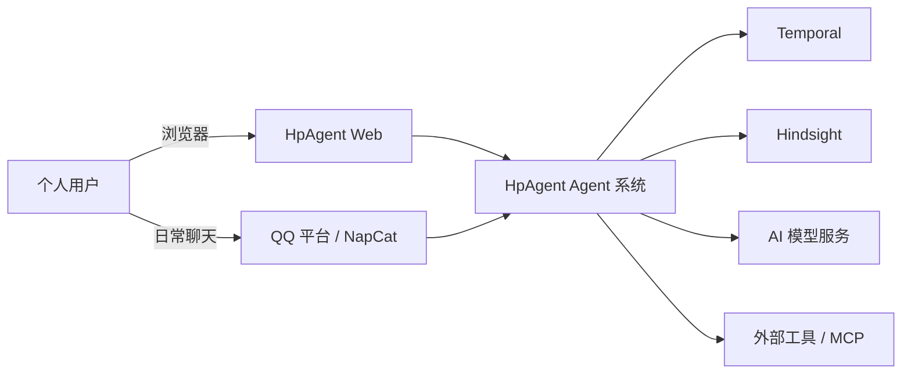
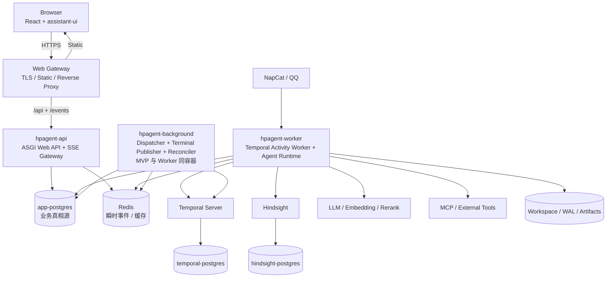
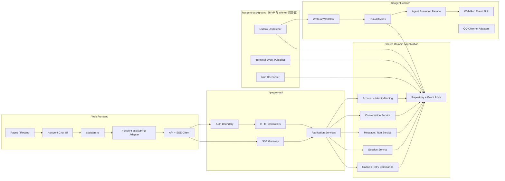
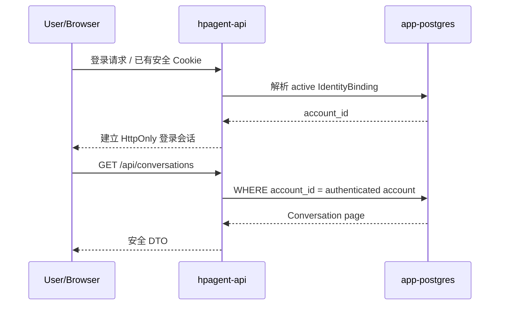
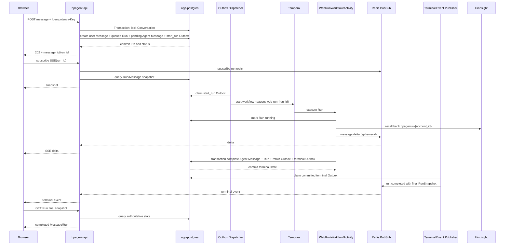
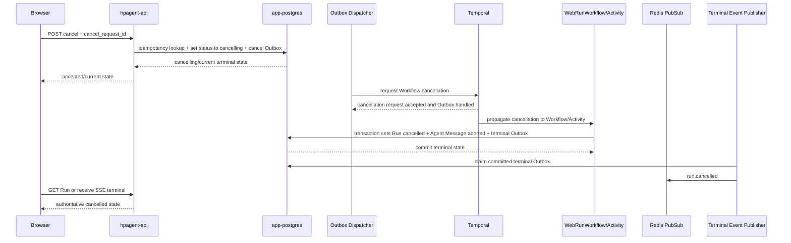
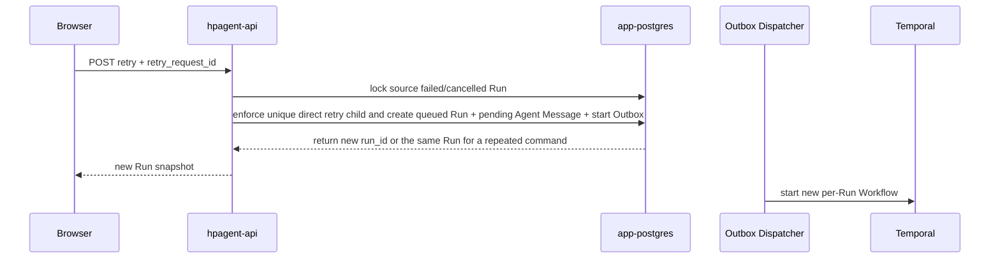
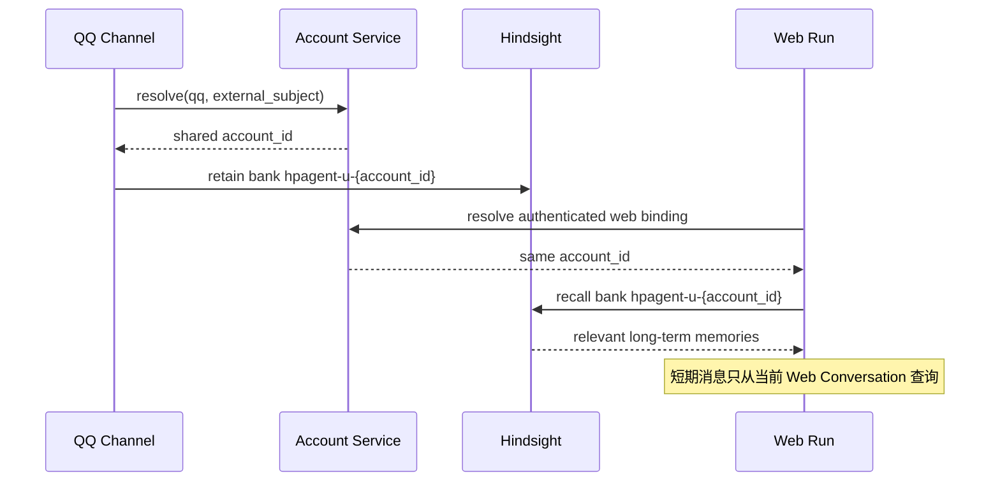

# HpAgent Web 系统架构设计

> Web Artifact 是 completed Assistant Message 上的 durable、可版本化 Web 派生资源，不是第二种 Chat Run。组件、部署和 iframe 安全边界见 [Web Artifact 实现](hpagent-web-artifact-implementation.md)。

## 1. 文档信息

| 项目 | 内容 |
|---|---|
| 文档版本 | 0.4 |
| 状态 | 已评审 |
| 文档类型 | Web 目标系统架构 |
| 日期 | 2026-08-04 |
| 需求基线 | [HpAgent Web MVP 需求规格说明书 0.4](hpagent-web-mvp-requirements.md) |
| 领域基线 | [HpAgent Web 领域模型与状态模型设计 0.3](hpagent-web-domain-and-state-model.md) |
| 当前架构事实 | [HpAgent 单 Agent 架构文档](../architecture/README.md) |

本文定义 HpAgent Web 新增部分如何组织，以及如何与当前 QQ、Temporal、Hindsight、Agent 执行内核、工具和 Sandbox 融合。本文描述的是**目标架构**，不是对当前代码已实现能力的声明。

## 2. 文档定位与架构事实管理

### 2.1 为什么单独放在 `docs/web/`

当前 `docs/architecture/single_agent/` 描述现有单 Agent QQ 主链路，是当前运行事实的架构入口。Web 尚未实现，如果现在直接改写该目录，会把目标设计误写成现状。

因此采用以下文档分工：

| 文档位置 | 职责 |
|---|---|
| `docs/architecture/single_agent/` | 当前已经运行的系统上下文、容器、组件和时序事实 |
| `docs/web/` | Web 产品基线、领域模型和目标增量架构 |
| 本文“当前差距与迁移”章节 | 明确当前事实与目标设计之间的 architecture drift |

Web 实现完成并成为正式运行路径后，必须把已落地事实同步回 `docs/architecture/single_agent/` 的四份 Markdown。现有 Excalidraw 文件继续遵守人工维护红线，本文不创建或修改 Excalidraw。

### 2.2 融合原则

1. **新增入口，不复制 Agent 内核**：Web 增加浏览器和 API 边界，但复用现有模型、工具、记忆、Sandbox 和 Turn 执行能力。
2. **领域状态前置**：Web API 先把 Conversation、Message、Run、Session 写入业务数据库，再异步启动 Temporal。
3. **渠道适配与执行内核分离**：QQ 回复继续走 ChannelRouter；Web 输出写 Message/Run 并通过事件网关投影到浏览器。
4. **长期记忆统一，短期上下文分开**：Web 与 QQ 使用同一 Account/Hindsight bank，各自从自己的 Conversation/Session 加载短期上下文。
5. **渐进迁移**：MVP 不要求一次性把 QQ 改造成 Web Conversation 模型，但不能继续让 Web 复用 account 级 active Session 或长期 Workflow。
6. **先模块化单体，暂不微服务化**：共享一个代码库和领域模型，通过不同进程承担 API 与 Worker 职责，避免过早引入分布式服务边界。

## 3. 架构目标与非目标

### 3.1 目标

- 提供安全的个人账号登录、Conversation 和消息历史 API。
- 支持多个个人账号、多个独立 Conversation 和多标签页并发。
- 让每次用户发送原子创建 Message、Run、Agent Message 和 Outbox。
- 让每个 Run 对应一个短生命周期 Temporal Workflow。
- 提供流式 delta、停止、失败、重试和断线回源能力。
- 复用当前 Agent 推理、工具选择、工具执行、Sandbox、模型降级链和 Hindsight。
- 维持 QQ 日常聊天能力，并共享同一 Account 的长期记忆。
- 让 PostgreSQL、Temporal、Redis、Hindsight 各自只承担清晰职责。

### 3.2 非目标

- 不在 MVP 中拆分 Account、Conversation、Run、Memory 等独立微服务。
- 不让浏览器直接连接 Temporal、Redis、Hindsight、模型或工具服务。
- 不用 assistant-ui 的本地状态保存权威消息或 Run 状态。
- 不复用 Temporal PostgreSQL 或 Hindsight PostgreSQL 存放 HpAgent 业务表。
- 不支持 Worker 水平扩容下的分布式 Sandbox 所有权；MVP Worker 保持单副本。
- 不在本阶段统一改造所有 QQ 短期会话语义。
- 不实现重新生成、自动续流、部分回复精确恢复和模式切换。

## 4. 关键架构决策

| 编号 | 决策 | 理由 |
|---|---|---|
| AD-001 | 采用 React + assistant-ui 构建聊天前端 | 复用成熟消息列表、输入、Markdown、代码块、流式展示和滚动交互 |
| AD-002 | assistant-ui 只位于 UI 适配层 | 后端继续掌握 Account、Conversation、Message、Run、Session 和记忆真相 |
| AD-003 | 新增 Web API 进程，与 Temporal Worker 分离部署 | API 面向短请求和流连接；Worker 面向长执行、工具和 Sandbox，故障与扩缩容特征不同 |
| AD-004 | 保持模块化单体代码库 | 领域事务、组合外键和迭代速度优先，不引入跨服务事务 |
| AD-005 | 新增独立 `app-postgres` | HpAgent 业务数据不能写入 Temporal/Hindsight 私有数据库 |
| AD-006 | Redis 只承载瞬时 delta Pub/Sub、缓存和限流 | Redis 不是 Message、Run 或 Session 真相源 |
| AD-007 | 使用事务 Outbox 启动 Workflow 和触发 Hindsight retain | 消除业务数据库与外部系统之间的双写裂缝 |
| AD-008 | 每个 Run 一个 Temporal Workflow | Run 状态、取消、失败和重试与 Workflow 生命周期直接映射 |
| AD-009 | MVP 使用 SSE 向浏览器投影事件 | 主要是服务端到客户端单向流，认证和代理部署较简单；命令继续使用 HTTP |
| AD-010 | `message.delta` 不持久化 | 符合 MVP 范围；最终 Message/Run 持久化，断线后回源查询 |
| AD-011 | Session 表是 active Session 唯一真相源 | 避免 Conversation 指针、Redis 指针和 Session 状态三方双写 |
| AD-012 | MVP Agent Execution Worker 单副本 | 当前 Workspace、SandboxManager 和本地文件具有进程/主机所有权，尚不支持安全分布式调度 |
| AD-013 | 认证采用同源、服务端有状态浏览器会话 | 使用 HttpOnly Cookie 承载不透明 session id；不把 Bearer/JWT 存入 localStorage，SSE 自然复用同源会话 |
| AD-014 | 所有终态事件通过事务 Outbox 在提交后发布 | 禁止先发布 `completed/failed/cancelled` 再落库；发布失败可重试，浏览器始终可回源数据库 |
| AD-015 | Dispatcher、Terminal Event Publisher、Reconciler 是独立逻辑组件 | MVP 可与单副本 Worker 同容器部署，但它们不依赖 Sandbox 所有权，后续可独立部署和多副本运行 |

## 5. 系统上下文



在用户认知中，Web 和 QQ 是同一个 HpAgent 的两个入口：

- Web 承接正式长对话、历史查看和任务状态。
- QQ 承接轻量聊天、进度查询和提醒。
- 两端通过 IdentityBinding 解析到同一 Account。
- 两端共享 Hindsight Account bank，但不自动共享短期消息列表。

## 6. 容器架构

### 6.1 目标部署拓扑



### 6.2 新增与复用容器

| 容器 | 类型 | 职责 |
|---|---|---|
| `web-gateway` | 新增 | 提供前端静态资源、TLS 终止、同源反向代理和基础安全头 |
| `hpagent-api` | 新增 | 登录会话、资源归属校验、Conversation/Message/Run API、停止/重试命令、SSE 网关 |
| `app-postgres` | 新增 | Account、IdentityBinding、Conversation、Message、Run、Session、Workflow Execution、幂等命令和 Outbox 真相源 |
| `hpagent-worker` | 改造现有 `hpagent` | 保留 Temporal Activity Worker、Agent Runtime、Sandbox、QQ Channel；新增 WebRunWorkflow 与 Activities |
| `hpagent-background` | 新增逻辑运行单元；MVP 与 Worker 同容器 | Outbox Dispatcher、Terminal Event Publisher 和 Reconciler；不持有 Sandbox 或 Workspace 进程内状态 |
| `redis` | 复用并收敛职责 | Web delta Pub/Sub、可丢弃缓存、限流；不保存权威 Message/Run/active Session |
| `temporal` + `temporal-postgres` | 复用 | 执行每 Run Workflow；数据库仅供 Temporal 自身使用 |
| `hindsight` + `hindsight-postgres` | 复用 | Account 级长期记忆；数据库仅供 Hindsight 自身使用 |
| NapCat 相关容器 | 复用 | QQ 消息接入和回复 |

### 6.3 为什么 API 与 Worker 分开

`hpagent-api` 与 `hpagent-worker` 使用同一代码库和领域模型，但运行成两个进程：

- API 需要快速启动、短事务、长 SSE 连接和严格的请求限流。
- Worker 需要模型调用、工具执行、nsjail、Workspace 挂载和 Temporal Activity。
- API 重启不应取消 Agent Run；Worker 重启不应让登录和历史查询不可用。
- API 不需要获得 nsjail、工具凭据或 Workspace 写权限，安全边界更小。

MVP 可以用同一镜像的不同启动命令构建两个容器，避免维护两套 Python 依赖和领域代码。

### 6.4 Agent Execution Worker 单副本约束

当前 SandboxManager、Workspace、本地 WAL 和部分运行资源按进程或宿主机管理。MVP 明确：

- 持有 Agent Runtime、SandboxManager 和本地 Workspace 所有权的 `hpagent-worker` 副本数固定为 1。
- API 和 Web Gateway 可以独立重启；是否水平扩容在压测后决定。
- Session 资源可在 Worker 重启后由 `session_id` 和 Workspace 重建。
- 在实现共享对象存储、分布式 Session 租约和 Sandbox 路由前，不允许简单增加 Worker 副本。

单 Worker 是**部署约束，不是逻辑耦合**：

- Dispatcher、Terminal Event Publisher 和 Reconciler 只依赖 app-postgres、Temporal/Redis 端口及数据库租约，不依赖 SandboxManager、模型客户端或本地 Workspace。
- MVP 为减少容器数量，可以把三个后台组件作为独立任务或进程与 `hpagent-worker` 同容器运行。
- 它们的接口、配置和生命周期必须独立，停止 Agent Activity Worker 不应要求重写 Dispatcher/Reconciler 逻辑。
- 后续可把 `hpagent-background` 独立部署，并通过 `FOR UPDATE SKIP LOCKED`、租约或 leader election 安全运行多个副本；这不代表 Agent Execution Worker 已可水平扩容。

## 7. 组件架构

### 7.1 总体组件关系



### 7.2 Web 前端

| 组件 | 职责 |
|---|---|
| Pages/Router | 登录页、Conversation 路由、未找到和登录失效处理 |
| HpAgent Chat UI | 产品布局、Conversation 列表、标题、状态文案和错误交互 |
| assistant-ui | 通用消息列表、输入、Markdown、代码块、停止按钮和基础滚动 |
| assistant-ui Adapter | 把后端 Message/Run/SSE 事件映射成 UI 状态，把发送/停止/重试转成 API 命令 |
| API Client | Cookie/CSRF、幂等键、分页、错误码映射 |
| SSE Client | 订阅 Run 事件、短时去重、断线检测；断线后回源 Message/Run，不承诺续接 delta |

前端不得：

- 生成权威 Account、Conversation、Message、Run、Session 或 Workflow ID。
- 直接访问 Redis、Temporal 或 Hindsight。
- 把 assistant-ui 本地消息当作刷新后的恢复来源。
- 仅在本地隐藏停止按钮就宣告 Run 已取消。

### 7.3 Web API 接口层

| 组件 | 职责 |
|---|---|
| Auth Boundary | 建立安全登录会话，从服务端会话解析 IdentityBinding 与 Account |
| Authorization Guard | 对每个 Conversation、Message、Run 查询执行 Account 归属校验 |
| Conversation Controller | 创建、列表、详情和重命名 |
| Message Controller | 分页历史查询、发送消息和幂等响应 |
| Run Controller | 查询状态、停止和失败后重试 |
| SSE Gateway | 校验 Run 归属、返回数据库快照、订阅 Redis 瞬时事件、处理心跳和断线 |
| Error Mapper | 把领域错误映射为稳定 HTTP 状态和安全错误体 |

API 层不得包含模型调用、工具执行、Temporal Workflow 业务逻辑或 Hindsight 访问。

### 7.4 应用与领域层

| 组件 | 职责 |
|---|---|
| Account Service | 解析 IdentityBinding、读取 Account、执行受控绑定命令 |
| Conversation Service | Conversation 生命周期、标题、列表和归属 |
| Message/Run Service | 原子发送、消息序号、单活跃 Run、最终回复事务 |
| Session Service | 查询/创建/轮换每 Conversation 的唯一 active Session |
| Run Command Service | 停止与重试命令幂等、状态条件转换、Outbox 写入 |
| Run Query Service | 聚合 Run、Agent Message 和 Workflow Execution 快照 |
| Context Assembly Service | 按 Message 状态与 `context_message_seq` 加载短期上下文，并合并长期记忆 |
| Memory Retention Service | completed Run 级 Hindsight retain Outbox 消费 |

所有跨 Account、Conversation、Message、Session 和 Run 的引用都由组合外键与应用层归属校验共同保证。

### 7.5 Worker 与执行层

| 组件 | 新增/复用 | 职责 |
|---|---|---|
| Outbox Dispatcher | 新增后台逻辑组件 | 锁定并领取命令 Outbox，幂等启动 Workflow、请求取消和触发 retain；不依赖 Agent Runtime/Sandbox |
| Terminal Event Publisher | 新增后台逻辑组件 | 只领取已经提交的终态事件 Outbox，并向 Redis 发布终态通知；发布失败不改变数据库终态 |
| WebRunWorkflow | 新增 | 每 Run 一个 Workflow，只编排状态 Activity 和 Agent 执行 Activity |
| Run Lifecycle Activities | 新增 | `mark_running`、`complete_run`、`fail_run`、`cancel_run`，通过领域服务更新数据库 |
| Agent Execution Facade | 从 TurnOrchestrator 提取/适配 | 复用模型、工具、Sandbox 和 Agentic Loop，但不直接决定 Web 回复渠道 |
| Web Run Event Sink | 新增 | 把可丢失 delta 发布到 Redis，把最终结果交给 Run Lifecycle Service；不得直接发布终态事件 |
| Run Reconciler | 新增后台逻辑组件 | 查询未终态 Run 与 Temporal Execution，修复丢失回调造成的状态漂移；不依赖 Agent Runtime/Sandbox |
| TurnOrchestrator/Harness | 复用并解耦 | 继续负责上下文、模型、工具循环；输出改经 Reply/Event Port |
| ResourcePool/ModelClient | 复用 | 模型选择、调用和降级链 |
| SandboxManager/ToolRegistry | 复用 | Session 级 Sandbox 和工具执行 |
| HindsightClient | 复用并调整写入粒度 | Account bank recall，completed Web Run 级 retain |
| ChannelRouter/QQ Channels | 复用 | QQ 入站与出站，不承担 Web SSE |

Outbox Dispatcher、Terminal Event Publisher 和 Run Reconciler 与 Agent Execution Worker 的同容器运行仅是 MVP 部署绑定。三者必须具有独立入口、独立生命周期和可单独测试的端口；业务逻辑不得通过进程内对象直接调用 SandboxManager、Workspace 或 Agent Execution Facade。

### 7.6 Reply/Event Port 解耦

当前回复链路会通过 ChannelRouter 直接发送。为了复用 Agent 执行内核，需要引入窄接口：

```text
RunEventSink
  on_delta(run_id, message_id, delta)
  on_progress(run_id, phase, safe_summary)

ReplySink
  complete(run_id, final_content)

QQFailureNotifier
  notify_failure(execution_id, error_code, safe_message)
```

- Web 实现把 delta/符合 API 契约的 `run.progress` 发往 Redis；ReplySink 只提交成功 Message/Run 事务。
- Web 已知失败、超时和 Worker 崩溃统一由 Workflow `finalize_failed_activity` 收口，取消走独立取消收口；不允许第二个 Web fail 提交入口。
- QQ 实现继续调用 ChannelRouter 发送最终文本和进度摘要，并可通过 QQFailureNotifier 发送兼容安全失败文案。
- Agent Execution Facade 只依赖接口，不知道浏览器、SSE、OneBot 或 assistant-ui。

这样复用的是 Agent 执行能力，而不是把 Web 强行伪装成 QQ Channel。

## 8. 与现有模块的融合方式

| 当前模块 | 融合策略 | 禁止做法 |
|---|---|---|
| `account/` | 演进为 Account + IdentityBinding Repository，迁移 JSON 数据 | Web 再建立一套独立用户主键 |
| `application/conversation.py` | 保留 QQ 兼容路径；新增真正持久化的 Web Conversation 应用服务，后续再统一命名 | 继续把 account 级 Workflow 称作 Web Conversation |
| `session/` | 增加 `conversation_id`、组合外键和 Session Repository；Web 禁用 account 级 active 指针 | Web 调用 `get_active_session_id(account_id)` |
| `orchestration/workflow.py` | 保留 QQ legacy Workflow；新增 `WebRunWorkflow` | 在同一个 Workflow 同时混合 QQ 长会话和 Web Run |
| `harness/` / `brain/` | 提取 Agent Execution Facade 和输出端口，复用推理/工具循环 | 在执行内核中直接写 SSE Response |
| `application/memory.py` | 短期消息改读 Conversation Message；长期记忆继续调用 Hindsight | 按 Account 读取全部近期消息作为 Web 上下文 |
| `sandbox/` | 继续按 Session 管理资源；Run 引用 active Session | 按浏览器连接创建 Sandbox |
| `channels/` | 继续服务 QQ/Console | 把 Web 持久历史交给 Channel 实例保存 |
| `storage/redis.py` | 增加 Web Run 瞬时 topic | 用 Redis active 指针替代 Session 表 |
| Workspace/WAL | 继续保存 Session 资源和内部执行审计 | 用 Workspace 文件替代 Web Message/Run 数据库 |

## 9. 数据架构

### 9.1 存储职责

| 存储 | 权威数据 | 非权威/禁止数据 |
|---|---|---|
| `app-postgres` | Account、IdentityBinding、Web Auth Session、Conversation、Message、Run、Session、Workflow Execution、Idempotency Command、Outbox | 不保存 Temporal 内部 History 或 Hindsight 向量 |
| Temporal PostgreSQL | Temporal Workflow History 和执行元数据 | 不作为 Run/Conversation 查询数据库 |
| Hindsight PostgreSQL | 长期记忆和向量索引 | 不作为 Message 历史或权限数据库 |
| Redis | delta Pub/Sub、可丢弃缓存、限流计数 | 不作为 Message、Run、active Session 真相源 |
| Workspace/WAL | Session 工作区、工具产物、内部事件审计和恢复材料 | 不作为 Web Conversation 列表和消息查询主存储 |

### 9.2 业务数据库逻辑表

- `accounts`
- `identity_bindings`
- `web_auth_sessions`（浏览器登录会话；与 Agent `sessions` 明确分表）
- `conversations`
- `messages`
- `runs`
- `sessions`
- `workflow_executions`
- `idempotency_commands`
- `outbox_events`

关键数据库约束继承领域设计：

- `(provider, normalized_subject_id) WHERE binding.status = active` 唯一。
- `(conversation_id) WHERE run.status IN (queued, running, cancelling)` 唯一。
- `(conversation_id) WHERE session.status = active` 唯一。
- `(account_id, client_request_id)` 唯一。
- `produced_by_run_id` 唯一。
- `UNIQUE (retry_of_run_id) WHERE retry_of_run_id IS NOT NULL`：MVP 中一个 failed/cancelled Run 最多有一个直接重试子 Run，形成线性重试链；若子 Run 再失败，则重试该子 Run。
- Account/Conversation/Message/Run/Session 使用组合外键保证同归属。

`retry_of_run_id` 的唯一约束是 MVP 的明确产品语义，而不是通用执行历史假设。P2 的“重新生成”或未来分支执行必须使用独立的 `regenerate_of_run_id`、attempt group 等关系建模，不得通过删除该约束或复用 retry 关系偷偷引入分叉。

### 9.3 Outbox 类型

| 类型 | 唯一业务键 | 消费者 |
|---|---|---|
| `start_run` | `start-run:{run_id}` | Workflow Dispatcher |
| `cancel_run` | `cancel-run:{run_id}` | Workflow Dispatcher |
| `retain_memory` | `retain-memory:{run_id}` | Memory Retention Worker |
| `publish_terminal_event` | `terminal:{run_id}:{terminal_status}` | Terminal Event Publisher |

Outbox 消费采用 `FOR UPDATE SKIP LOCKED` 或同等级领取机制，记录尝试次数、下次重试时间、最后错误和处理时间。消费者必须按业务键幂等。

Run 进入 `completed`、`failed` 或 `cancelled` 时，Lifecycle Activity 必须在**同一个数据库事务**中更新 Run、Agent Message，并插入 `publish_terminal_event` Outbox；事务提交后，Terminal Event Publisher 才能领取并发布事件。任何执行路径都不得在数据库提交前发布终态，也不得由 Worker 绕过 Outbox 直接向 Redis 发布终态。终态通知延迟或发布失败时，数据库状态仍然权威，客户端通过查询恢复。

## 10. Web API 与事件协议

### 10.1 逻辑 API

最终 URL 可在接口设计中调整，但能力边界如下：

| 能力 | 建议接口 | 说明 |
|---|---|---|
| 当前账号 | `GET /api/me` | 返回当前 Account 的安全视图，不接受前端 account_id |
| Conversation 列表 | `GET /api/conversations?cursor=` | 游标分页、按更新时间倒序 |
| 创建 Conversation | `POST /api/conversations` | 携带 `Idempotency-Key`，后端生成 conversation_id |
| Conversation 详情 | `GET /api/conversations/{id}` | 校验 Account 归属 |
| 重命名 | `PATCH /api/conversations/{id}` | 使用版本号或 ETag 防止覆盖 |
| 消息历史 | `GET /api/conversations/{id}/messages?before=` | 按 sequence 游标分页 |
| 发送消息 | `POST /api/conversations/{id}/messages` | 携带 `Idempotency-Key`，返回 user message、pending agent message 和 queued Run |
| Run 状态 | `GET /api/runs/{run_id}` | 返回 Run、Agent Message 和安全错误摘要 |
| Run 事件 | `GET /api/runs/{run_id}/events` | SSE；先校验归属，delta 非持久化 |
| 停止 Run | `POST /api/runs/{run_id}/cancel` | 携带 `Idempotency-Key`，后端确认状态 |
| 重试 Run | `POST /api/runs/{run_id}/retry` | 仅 failed/cancelled，携带 `Idempotency-Key` |

### 10.2 错误契约

至少定义以下稳定错误码：

| 错误码 | HTTP | 含义 |
|---|---:|---|
| `unauthenticated` | 401 | 未登录或登录态失效 |
| `resource_not_found` | 404 | 资源不存在或无权访问，不区分以避免泄露 |
| `conversation_busy` | 409 | Conversation 已有活跃 Run |
| `idempotency_conflict` | 409 | 同一幂等键被用于不同请求内容 |
| `run_not_cancellable` | 409 | Run 已进入不能取消的终态 |
| `run_not_retryable` | 409 | Run 状态不允许重试或已有直接重试子 Run |
| `validation_error` | 422 | 输入校验失败 |
| `service_unavailable` | 503 | 关键依赖暂时不可用 |

错误响应只返回稳定 code、用户可见 message、request_id 和必要安全 details，不返回堆栈、SQL、模型密钥或其他账号信息。

### 10.3 SSE 事件

事件信封继承领域模型：`event_id`、`event_type`、`conversation_id`、`run_id`、`message_id`、`stream_id`、`event_seq`、`payload`、`occurred_at`。

SSE Gateway 行为：

1. 从登录态解析 Account，校验 Run 归属。
2. 先订阅 Redis `run:{run_id}` topic；订阅成功后立即启用当前连接专属的有界握手缓冲区。
3. 在缓冲新事件的同时查询 Run/Message 权威快照，先向客户端发送快照，再按同一 `stream_id` 的 `event_seq` 顺序排空缓冲事件。
4. 若快照已经是终态，则丢弃缓冲中的 delta，发送权威终态快照并关闭连接。
5. 握手完成后直接转发当前连接收到的 delta；定期发送心跳，客户端断开后取消订阅，但不取消 Run。
6. 缓冲区溢出、`stream_id` 改变、发现序号缺口或 Redis 连接中断时，停止继续拼接不可信 delta，发送 `stream.degraded`，客户端改为轮询 Run/Message。
7. 收到终态通知后查询一次数据库；只有观察到已提交终态，才向客户端发送终态快照并关闭流。

握手缓冲必须有事件数和字节数双重上限；建议初始值为每连接 256 个事件或 1 MiB，任一达到即降级，最终值在详细设计和压测中确定。`event_seq` 只在单次 `stream_id` 在线发布生命周期内递增，不保存数据库/Redis 计数器，不保证跨 Worker 重启连续，也不提供持久化重放游标。终态事件使用稳定 event_id 和完整数据库 snapshot，不参与 delta 序号连号。

允许丢失规则如下：Redis 订阅真正建立前、连接断开期间以及进入 degraded 状态后的 delta 允许丢失；握手缓冲正常工作期间收到的 delta 不应因“先查快照”而丢失。终态 Message/Run 及终态事件 Outbox 不允许丢失。UI 收到最终快照时必须用后端完整内容替换临时拼接内容。

## 11. 关键时序

### 11.1 登录并加载 Conversation



### 11.2 发送消息并流式回复



### 11.3 停止 Run



### 11.4 失败后重试



### 11.5 QQ 与 Web 长期记忆共享



## 12. Temporal 执行设计

### 12.1 WebRunWorkflow 职责

Workflow 只编排，不持有 Conversation 消息真相：

1. 接收 `run_id`，不接收浏览器提供的 account_id 作为可信值。
2. 调用 Activity 从数据库加载并校验 Run 快照。
3. 标记 Run 为 running。
4. 调用 Agent Execution Activity。
5. 成功时调用 complete Activity；失败时调用 fail Activity。
6. 收到取消时请求 Activity 取消，并执行 cancel/compensation Activity。

Workflow 输入只保存定位信息，Message 内容和权限归属由 Activity 从 app-postgres 读取。

### 12.2 Activity 取消要求

要让“停止生成”真实生效，Agent Execution Activity 必须：

- 在模型调用、工具循环和长操作之间发送 heartbeat。
- 使用可取消的异步调用，传播取消信号。
- 工具执行支持超时；无法安全中止的外部副作用必须记录并暴露为取消后的补偿/审计信息。
- 在取消处理中停止发布 delta。
- 不直接把本地取消异常当作数据库已取消；必须调用 Run Lifecycle Activity 提交终态。

### 12.3 Workflow ID 与重试

- Workflow ID：`hpagent-web-run-{run_id}`。
- Temporal Run ID 存入 `workflow_executions.temporal_run_id`，不覆盖领域 `run_id`。
- Activity 技术重试属于同一领域 Run。
- 用户重试创建新领域 Run 和新 Workflow ID。
- Outbox 重放启动命令时，Workflow ID 冲突视为幂等成功并回查执行记录。

## 13. 安全架构

### 13.1 信任边界

| 边界 | 规则 |
|---|---|
| Browser → Gateway/API | TLS、请求大小限制、速率限制、安全 Cookie、CSRF 防护 |
| API → app-postgres | 最小权限数据库账号，所有资源查询带认证 Account |
| API → Redis | 只允许事件订阅/发布与缓存命名空间，不允许据此授权 |
| Worker → 外部服务 | 密钥只注入 Worker，不下发浏览器或 API 响应 |
| Agent → Sandbox/Tools | 继续使用 nsjail、工具白名单、超时和输出限制 |

### 13.2 认证与授权

- 认证类别固定为**同源、服务端有状态浏览器会话**；Web Gateway 与 API 对浏览器保持同源。
- 登录成功后生成高熵、不透明的 session id，通过 `Secure`、`HttpOnly`、`SameSite=Lax`（或部署允许时更严格）的 Cookie 承载；服务端会话记录关联 active、verified Web IdentityBinding，并解析到 Account。
- 不在 `localStorage` 或 `sessionStorage` 保存 access token、refresh token、JWT 或其他 Bearer 凭证。
- SSE 使用同一 HttpOnly Cookie 鉴权，并在建连时执行 Run 归属校验；Redis topic 名称和 run_id 本身不构成授权。
- 所有修改状态的 HTTP 请求必须使用 CSRF token，并校验 `Origin`/`Referer`；Cookie 的 SameSite 属性不是唯一 CSRF 防线。
- 登录后和身份安全属性变化时轮换 session id；登出时服务端撤销会话，并配置绝对过期时间和合理的空闲过期时间。
- API 从服务端会话获得 account_id，忽略或拒绝浏览器提交的 account_id。
- Conversation、Message、Run 和 SSE 订阅都执行资源归属校验。
- “不存在”和“无权限”对外统一为 `resource_not_found`，避免枚举其他账号资源。

用户名密码、OIDC、Passkey 等上游凭证校验方式属于可替换认证适配器的详细设计选择，不改变上述浏览器会话类别和授权边界。

### 13.3 内容安全

- Markdown 禁止不受控原始 HTML和脚本执行。
- 代码块只展示和复制，不在浏览器执行。
- 外链使用安全协议白名单和 `rel` 限制。
- 错误体、SSE 和日志不得暴露 Prompt、令牌、SQL、堆栈或其他账号数据。

## 14. 可靠性与降级

| 故障 | 预期行为 |
|---|---|
| `app-postgres` 不可用 | 登录资源解析、发送和状态更新失败；拒绝创建无法持久化的 Run，不能退化为本地内存真相源 |
| Temporal 暂时不可用 | Message/queued Run 已在数据库；Outbox 保留并重试，UI 显示 queued |
| Agent Execution Worker 不可用 | API 和历史查询可用；Workflow/Activity 等待 Worker 恢复；MVP 同容器部署时后台组件也会同时不可用，但这是部署故障域，不是逻辑依赖 |
| Terminal Event Publisher 不可用 | 已提交的终态和终态 Outbox 保留；SSE 终态通知延迟，客户端查询可立即看到权威状态；恢复后继续发布 |
| Redis 不可用 | Run 继续执行并持久化最终结果；SSE 降级为状态轮询，不保证 delta |
| Hindsight recall 不可用 | Run 无长期记忆降级执行，并记录指标；不能混入其他 Conversation 消息补偿 |
| Hindsight retain 不可用 | completed Run 不回滚；retain Outbox 重试并告警 |
| 浏览器/SSE 断开 | 不自动取消 Run；重新进入后查询 Message/Run |
| LLM/工具失败 | 模型降级链或安全错误；最终提交 failed Run 和 failed Agent Message |
| Worker 重启 | Reconciler 对账未终态 Run；按 Session/Workspace 重建 Sandbox |

### 14.1 超时与回收

- API 请求超时不等于取消 Run。
- SSE 空闲使用心跳维持代理连接；连接生命周期不决定 Workflow 生命周期。
- queued Run 超过启动阈值进入告警，由 Dispatcher/Reconciler 判断继续启动或失败。
- active Session 不按 Web 页面关闭立即归档；由明确轮换、Conversation 归档或资源策略触发。
- Sandbox 空闲回收后，下个 Run 可按 active Session 与 Workspace 重建。

## 15. 可观测性

### 15.1 关联标识

所有日志、指标和错误至少按需要携带：

- `request_id`
- `account_id` 的不可逆或受控表示
- `conversation_id`
- `message_id`
- `run_id`
- `session_id`
- `workflow_id`
- `temporal_run_id`

不得把完整消息正文默认写入结构化日志。

### 15.2 关键指标

- API 请求成功率、延迟、401/404/409/5xx 分布。
- Conversation 创建、发送消息和幂等命中率。
- queued 到 running 延迟、Run 完成/失败/取消率。
- Outbox backlog、重试次数和最老事件年龄，按命令、记忆和终态事件分类。
- SSE 连接数、中断率、握手缓冲区峰值/溢出次数、stream 变化、序号缺口和 `stream.degraded` 次数。
- Redis delta 发布/订阅失败。
- Temporal Workflow/Activity 失败与取消延迟。
- Hindsight recall/retain 成功率与降级次数。
- Sandbox 创建、重建、回收和工具失败。
- Reconciler 修正状态次数；任何修正都应产生告警或审计记录。

## 16. 代码与目录组织

在不一次性搬迁整个现有代码的前提下，建议新增和演进：

```text
HpAgent/
├── web/                              # React + assistant-ui 前端
│   ├── src/app/                      # 页面与路由
│   ├── src/components/               # HpAgent 产品组件
│   ├── src/chat/assistant-adapter/   # assistant-ui 边界适配
│   └── src/api/                      # HTTP/SSE client
├── src/
│   ├── interfaces/web/               # ASGI app、controllers、auth、SSE gateway
│   ├── account/                      # Account + IdentityBinding
│   ├── conversation/                 # Conversation/Message/Run 领域与 repository ports
│   ├── session/                      # Session 领域，增加 conversation 归属
│   ├── application/web/              # Web application services / commands / queries
│   ├── infrastructure/postgres/      # repositories、migrations、outbox
│   ├── infrastructure/events/        # Redis run event publisher/subscriber
│   ├── orchestration/web_run.py      # 每 Run Workflow
│   ├── orchestration/web_activities.py
│   └── execution/                    # 从现有 TurnOrchestrator 提取的渠道无关执行门面
└── docs/web/
```

目录命名是建议，不是要求立即大规模重构。重要的是依赖方向：

```text
interfaces/web
    → application/web
        → account / conversation / session domain
            → repository and event ports

infrastructure/postgres / infrastructure/events
    → implements ports

orchestration / execution
    → application services and ports
```

领域层不得反向依赖 ASGI、assistant-ui、Redis、Temporal SDK 或具体 PostgreSQL 驱动。

## 17. 渐进实施与融合计划

### Phase A：业务持久化基础

- 新增 app-postgres 和 migration 工具。
- 建立 Account、IdentityBinding、Conversation、Message、Run、Session、Workflow Execution、Idempotency、Outbox 表。
- 迁移现有 `accounts.json`，验证 QQ/Web identity 映射和多账号隔离。

### Phase B：Web 查询与命令 API

- 建立 hpagent-api、认证边界和资源归属 Guard。
- 实现 Conversation CRUD、消息分页、发送事务、Run 查询、停止/重试命令。
- 此阶段可使用伪执行器完成 API/数据库集成测试。

### Phase C：Session、Context 与记忆隔离基础（真实 Run 接入硬门槛）

- Session active 维度从 Account 改为 Conversation，Session 表成为唯一 active 真相源。
- Context Builder 严格按当前 `conversation_id`、Message 状态和 `context_message_seq` 水位加载短期消息。
- 移除 Web 路径对 account 级 active Session、Redis active 指针和其他 Conversation 短期消息的依赖。
- 建立 Account bank recall 与 completed Run 级 retain 的适配边界。
- 通过多 Conversation、QQ/Web 和多账号隔离集成测试后，才允许真实 WebRunWorkflow 调用 Agent Execution Facade。

### Phase D：每 Run Temporal 执行

- 新增 WebRunWorkflow、Lifecycle Activities、Outbox Dispatcher、Terminal Event Publisher 和 Reconciler。
- 从 TurnOrchestrator 提取渠道无关 Agent Execution Facade 与 Reply/Event Ports。
- Web 使用 per-Run Workflow；QQ legacy Workflow 暂时保持。
- 终态事务与终态事件 Outbox 的提交后发布必须通过故障注入测试。

### Phase E：流式事件与前端

- 新增 Redis 瞬时 run topic 和 SSE Gateway。
- 构建 React/assistant-ui 前端及 adapter。
- 完成 SSE 握手缓冲、允许丢失/降级、发送、停止、失败重试、刷新回源和多标签页验收。

### Phase F：架构事实收口

- 运行 Web MVP 集成和故障测试。
- 更新 `docs/architecture/single_agent/` 四份 Markdown，使其反映已落地容器、组件和时序。
- 记录仍保留的 QQ legacy Workflow drift 和后续统一计划。
- 提醒人工更新 Excalidraw；自动化不得修改视觉文件。

## 18. 当前 architecture drift

| 当前事实 | Web 目标 | 迁移位置 |
|---|---|---|
| 只有 QQ/Console 入站，无浏览器 API | React 前端 + hpagent-api | Phase B/E |
| HpAgent 不直接使用业务 PostgreSQL | 新增 app-postgres 作为领域真相源 | Phase A |
| AccountBinding 存在 JSON 字典 | 关系型 IdentityBinding 与唯一约束 | Phase A |
| account 级 active Session | conversation 级单 active Session | Phase C |
| account 级长期 Workflow + Signal | Web 每 Run 一个 Workflow | Phase D |
| user/model event，无稳定 Web Message/Run | 持久化 Message、Run 与状态机 | Phase A/B |
| TurnOrchestrator 直接路由回复 | Reply/Event Ports 区分 QQ 与 Web | Phase D |
| Hindsight 以 Session 累计内容 retain | Web completed Run 级幂等 retain | Phase C |
| Redis 持有 account active 指针 | Redis 仅作瞬时事件/缓存 | Phase C |
| Sandbox/Workspace 适合单 Worker | MVP 固定单 Worker；扩容待分布式所有权设计 | 本文约束 |

## 19. 架构验收清单

- [ ] Web API 无法绕过 Account 归属访问其他账号资源。
- [ ] app-postgres 是 Conversation、Message、Run、Session 唯一真相源。
- [ ] Temporal/Hindsight 私有数据库未被业务代码直接写入。
- [ ] 发送消息使用单事务和 Outbox，不存在业务记录与 Workflow 启动双写窗口。
- [ ] 每个 Web Run 使用独立 Workflow ID。
- [ ] 同一 Conversation 的单 active Run 和 Session 由数据库约束保证。
- [ ] Session/Context 隔离测试在真实 WebRunWorkflow 接入 Agent Execution Facade 前通过。
- [ ] `retry_of_run_id` 的部分唯一约束实现线性重试链，重复重试命令返回同一直接子 Run。
- [ ] assistant-ui 仅通过 Adapter 使用后端 DTO 和命令。
- [ ] delta 丢失不会导致最终 Message 丢失或 Run 状态失真。
- [ ] SSE 建连握手缓冲、溢出降级、序号缺口和允许丢失窗口均有测试。
- [ ] Worker/Event Sink 重启产生新 stream_id 时客户端立即 degraded，终态仍可通过数据库恢复。
- [ ] completed/failed/cancelled 终态只在数据库事务提交并写入终态 Outbox 后发布。
- [ ] Redis 不可用时可降级为查询最终状态。
- [ ] 浏览器断开不会隐式取消 Run。
- [ ] 停止与重试命令可安全重放。
- [ ] Web/QQ 映射到同一 Account/Hindsight bank。
- [ ] Web 短期上下文只包含当前 Conversation 的 accepted/completed Message。
- [ ] Agent Execution Facade 不直接依赖 Web、SSE 或 OneBot。
- [ ] Dispatcher、Terminal Event Publisher、Reconciler 可独立启动和测试，不依赖 Sandbox/Workspace 进程内对象。
- [ ] 认证采用同源服务端有状态会话，Cookie、CSRF、会话轮换和撤销策略已验证。
- [ ] MVP Agent Execution Worker 单副本约束已体现在部署配置和运维文档中。
- [ ] 实现完成后更新当前架构 Markdown，并由人工处理 Excalidraw drift。

## 20. 详细设计待决事项

以下实现细节在详细设计中确认，不改变本文已评审的架构类别与不变量：

1. Web API 的 ASGI 框架和数据库访问/迁移工具。
2. React 构建与部署方式，以及 assistant-ui 的兼容版本。
3. 服务端会话认证背后的凭证校验器、首次 Web 身份创建及 P0 QQ 映射操作流程。
4. SSE Gateway 与 Redis Pub/Sub 的 topic 命名、握手缓冲精确上限、连接数和代理超时配置。
5. Outbox Dispatcher 的轮询间隔、退避和死信处理策略。
6. WebRunWorkflow 的 Activity 拆分、heartbeat 周期和取消补偿边界。
7. Workspace/Sandbox 在 Worker 重启后的重建时限和失败处理。
8. app-postgres 的备份、恢复、连接池和生产凭据管理。

这些事项不得改变已经评审通过的领域模型：Account/Conversation/Session/Run 基数、单活跃约束、每 Run Workflow、后端真相源、Hindsight Account bank 和 Conversation 短期隔离。

## 21. 生产部署现状（Phase G as-built）

> G-07（`docs/web/phase-g.md` §28-30）：把“设计上准备这样做”改成“当前系统实际上就是这样运行”。
> 部署 / 备份 / 回滚 / 运维手册见 `docs/operations/web-release.md`。

以下为 Phase G 结束时系统**实际运行**的事实：

| 事实类别 | 现状 |
|---|---|
| Canonical state | **PostgreSQL**（Conversation / Message / Run / Session / IdentityBinding / Outbox 唯一真相源） |
| Realtime projection | **Redis + SSE**（transient，允许丢失；Redis 挂 → SSE degrade / GET polling） |
| Durable orchestration | **Temporal**（WebRunWorkflow 冻结，replay 门禁 c-07-v1） |
| Long-term memory | **Hindsight**，`bank = hpagent-u-{account_id}`（跨端召回） |
| Identity | **Account** ← IdentityBinding（Web + QQ），`WEB_UNIFIED_ACCOUNT_ENABLED=true` 时 QQ 绝不回退 `accounts.json` |
| Workspace isolation | **single_process_account_lock**（`session_worktree` 未实现，见 P1-02） |
| Agent topology | **1 个主 Agent 进程**：QQ + Web 共享同一 `AccountLockRegistry`（第二个独立 Web Agent Worker 为无效拓扑） |
| Web memory | `web-run:{run_id}` |
| QQ memory | `qq-execution:{execution_id}` |
| Web retain consistency | Transactional Outbox + eventual consistency（`retain_memory` → `MemoryRetentionWorker` → Hindsight） |
| Browser entrypoint | **web-gateway**（React 静态 + SPA fallback + `/api`、`/auth` 代理 + SSE `proxy_buffering off`）；`hpagent-api`/DB/Redis/Temporal/Hindsight 均不面向公网 |

生产配置基线（`HPAGENT_ENV=production`）：

```text
WEB_REAL_AGENT_ENABLED=true        WEB_REAL_AGENT_GATE_VERSION=c-07-v1
WEB_UNIFIED_ACCOUNT_ENABLED=true   WEB_FAKE_EXECUTOR_ENABLED=false
WORKSPACE_ISOLATION_MODE=single_process_account_lock
WEB_PUBLIC_ORIGIN=https://<真实公网 origin>
```

生产 fail-closed：fake executor、非 HTTPS/缺省 `WEB_PUBLIC_ORIGIN`、real-Agent gate 版本不匹配、
unified account 缺 `WORKER_DATABASE_URL`、`single_process_account_lock` 下多 Worker —— 全部拒绝启动。

### 21.1 §20 “待决事项”的 Phase G 处置

| §20 项 | 处置 |
|---|---|
| #2 React 构建与部署 | **已解决**：`web/Dockerfile`（Node build → Nginx runtime）+ `web/nginx.conf` |
| #3 服务端会话认证 / P0 QQ 映射 | **已解决**：Cookie+CSRF 已实现；QQ 映射由 `scripts/bootstrap_identity.py` 运维执行 |
| #5 Outbox Dispatcher 退避/死信 | **已解决**：`dead_letter` + 重放 SQL（见 runbook §6） |
| #8 app-postgres 备份/恢复/凭据 | **已解决**：`scripts/backup.sh` + runbook §3/§4 |

### 21.2 保留的 Legacy / P1 技术债

| ID | 技术债 |
|---|---|
| P1-01 | QQ retention 仍是 best effort，不是 Web 那样的 durable Outbox |
| P1-02 | 只实现 `single_process_account_lock`，`session_worktree` 尚未实现 |
| P1-03 | 没有 Web 自助 QQ identity binding，当前由管理员 bootstrap |
| P1-04 | 没有 `accounts.json → PostgreSQL` 历史自动迁移 |
| P1-05 | 没有旧 Hindsight bank 自动 merge |
| P1-06 | Memory 没有管理 UI |
