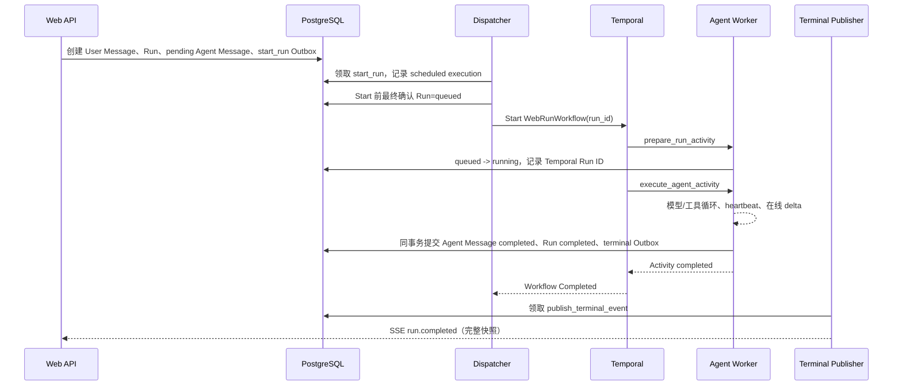
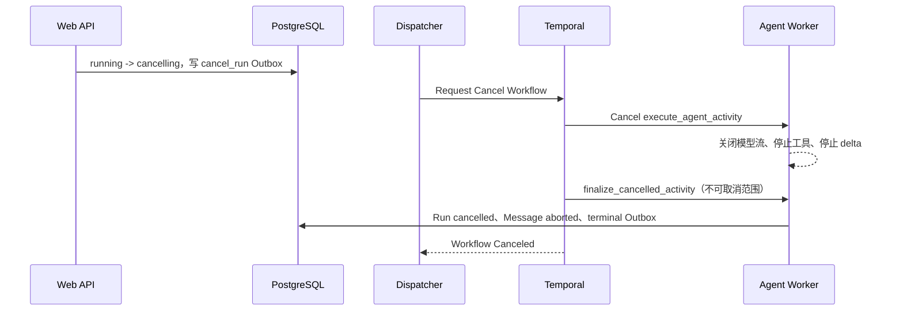

# HpAgent Web Temporal 与执行生命周期详细设计

> Artifact 使用独立 `ArtifactBuildWorkflow`，但与生命周期 Activity 一样统一由 `hpagent-web-lifecycle` queue 承载；HTML 在 Activity 内提交 PostgreSQL，不进入 Workflow History。详见 [Web Artifact 实现](hpagent-web-artifact-implementation.md)。

## 1. 文档信息

| 项目 | 内容 |
|---|---|
| 文档版本 | 0.2 |
| 状态 | 待评审 |
| 文档类型 | Temporal 与执行生命周期详细设计 |
| 日期 | 2026-08-04 |
| 需求基线 | [HpAgent Web MVP 需求规格说明书 0.4](hpagent-web-mvp-requirements.md) |
| 领域基线 | [HpAgent Web 领域模型与状态模型设计 0.3](hpagent-web-domain-and-state-model.md) |
| 架构基线 | [HpAgent Web 系统架构设计 0.4](hpagent-web-system-architecture.md) |
| 数据基线 | [HpAgent Web 数据库与持久化详细设计 0.3](hpagent-web-database-design.md) |
| API 基线 | [HpAgent Web API 与 SSE 契约 0.3](hpagent-web-api-contract.md) |

本文把领域 `Run`、Temporal Workflow Execution、Agent 执行和数据库终态提交连接成可实现的协议。数据库仍是领域状态的唯一真相源；Temporal 负责可靠调度、超时、取消和执行事实，不以 Workflow History 代替 Message、Run 或长期记忆存储。

## 2. 范围与非目标

### 2.1 本文范围

- `WebRunWorkflow` 的标识、输入、输出和确定性边界。
- Activity 划分、超时、重试、heartbeat 与错误分类。
- 模型流、工具和 Sandbox 的停止协议。
- `start_run`、`cancel_run` Outbox 到 Temporal 的投递协议。
- `workflow_executions` 的记录和修复。
- Dispatcher、Reconciler 与 Agent Worker 的逻辑职责。
- Worker 重启、崩溃和 Temporal 不可用时的收口规则。
- Temporal 状态与领域 Run 状态之间的映射。

### 2.2 非目标

- 不定义 HTTP/SSE 字段；以 API 契约为准。
- 不重新定义表字段、索引和终态约束；以数据库设计为准。
- 不把每个 token 或 `message.delta` 写入 Temporal History。
- 不实现刷新后续接原模型增量流。
- 不实现暂停、人工审批、长期计划或跨 Run 的持久 Workflow。
- 不保证对已经发生的外部工具副作用进行事务回滚。

### 2.3 与现有 QQ 执行链的关系

现有 `OrchestrationWorkflow` 是面向 QQ/既有 Session 的长期 Workflow，并通过 signal 接收后续消息。Web MVP 不复用该 Workflow 作为 Conversation 的执行容器，而是新增“一次 Run 一次 Workflow”的 `WebRunWorkflow`。

- QQ 现有链路在迁移前继续运行。
- Web 与 QQ 可共享 Account 级 Hindsight 长期记忆。
- Web 短期上下文只按 `conversation_id` 查询 Message，不从 QQ Workflow History 或 QQ Session 拼接。
- 两类 Workflow 使用不同的 Workflow type 和 task queue，避免部署及兼容性相互阻塞。

## 3. 核心决策

| 主题 | 决策 |
|---|---|
| Workflow 粒度 | 一个领域 Run 启动一个 `WebRunWorkflow` |
| Workflow ID | `hpagent-web-run-{run_id}`，由 Dispatcher 从领域 `run_id` 确定性生成 |
| Temporal Run ID | 由 Temporal 生成，单独写入 `workflow_executions.temporal_run_id` |
| Workflow 输入 | 只传 `schema_version` 和 `run_id`；业务数据从数据库加载 |
| Workflow 输出 | 成功时只返回小型结果引用，不返回完整消息内容 |
| 领域真相源 | PostgreSQL 中的 Run、Message、Session 和 WorkflowExecution |
| 执行真相 | Temporal 记录调度与执行事实，但不直接决定领域终态 |
| Agent Message | 创建领域 Run 的同一事务中预建为 `pending` |
| Agent Activity 重试 | 默认 `maximum_attempts = 1`，避免重复模型调用和工具副作用 |
| Workflow 自动重试 | 禁用；`WebRunWorkflow` 不配置 Retry Policy，失败后不得自动创建新 Execution |
| 终态提交 | Agent Activity 成功时先提交数据库，再返回 Activity 成功 |
| delta | 通过在线 Event Sink 发布，不写数据库和 Temporal History |
| 取消裁决 | 数据库条件更新裁决完成与取消竞态；已提交领域终态不可覆盖 |
| Worker 重启 | Workflow 可重放；中断的 Agent Activity 不恢复 token 流，收口失败或取消 |
| Continue-As-New | 单 Run MVP 不使用 |

### 3.1 必须保持的不变量

1. 同一 Conversation 最多一个活跃 Run，由数据库部分唯一索引保证。
2. 每个 Run 恰好一条由其产生的 Agent Message，由数据库约束触发器保证。
3. 一个 Run 正常情况下只有一个 current Workflow Execution。
4. 领域终态和 Agent Message 终态必须在同一数据库事务提交。
5. 终态 SSE Outbox 只能在上述事务提交后对消费者可见。
6. Temporal 的 `Completed` 不自动等于领域 `completed`；必须读取数据库。
7. 数据库已经是终态时，Dispatcher、Workflow 和 Reconciler 均不得将其改回活跃态或另一个终态。

## 4. 标识与所有权

| 标识 | 生成方 | 用途 |
|---|---|---|
| `run_id` | Web API/领域服务 | 领域 Run 主键，也是 Workflow ID 的稳定来源 |
| `workflow_execution_id` | 持久化层 | `workflow_executions` 记录主键 |
| `workflow_id` | Dispatcher | `hpagent-web-run-{run_id}` |
| `temporal_run_id` | Temporal Server | 某次具体 Workflow Execution 标识 |
| `session_id` | 领域服务 | Run 使用的 Conversation Session |
| `stream_id` | 在线 Event Sink | 一次 Worker 在线发布生命周期；不写 Temporal History |
| `event_id` | 事件生产方/终态事务 | SSE 去重；终态 ID 在数据库事务内稳定生成 |

`workflow_id` 与 `run_id` 一一对应，但不得把 Temporal Run ID 复用为领域 `run_id`。MVP 不主动 Reset 同一 Workflow；若运维修复确实产生新 Temporal Run ID，则为同一 `workflow_id` 新增 `execution_sequence` 更大的 `workflow_executions` 记录，并原子切换 `is_current`。

## 5. `WebRunWorkflow`

### 5.1 类型和 task queue

- Workflow type：`WebRunWorkflow`。
- Workflow task 和生命周期 Activity 默认 task queue：`hpagent-web-lifecycle`。
- `execute_agent_activity` 默认 task queue：`hpagent-web-agent`。
- QQ 既有 Workflow 保留自己的 task queue。
- Dispatcher 使用配置项选择 Web Workflow task queue，不把队列名写进领域表。

MVP 可以在同一进程中启动两个 Temporal SDK Worker，分别注册 lifecycle 和 agent task queue；也可把二者拆成独立进程。这里不改变架构基线的“单 Agent Execution Worker 副本”约束：只有 `hpagent-web-agent` 持有模型、Sandbox 和 Workspace，MVP 仍固定单副本；lifecycle Worker 不持有这些资源。`prepare/finalize` 只依赖数据库，不能因 Agent queue 拥堵或 Agent Worker 故障而失去收口能力。Dispatcher 与 Reconciler 不得依赖 Agent Worker 的进程内对象；同进程仅是部署绑定，不是逻辑绑定。

### 5.2 输入

```json
{
  "schema_version": 1,
  "run_id": "019..."
}
```

规则：

- 不传 `account_id`、`conversation_id`、用户 Message 内容、提示词或认证信息。
- Activity 必须通过 `run_id` 加载并验证完整归属链。
- 输入字段只做向后兼容扩展；Workflow 代码必须能重放旧版本 History。
- Workflow 输入不是授权依据。

### 5.3 输出

Workflow 只有在领域 Run 已提交 `completed` 后正常完成：

```json
{
  "schema_version": 1,
  "run_id": "019...",
  "outcome": "completed"
}
```

完整 Agent Message 由 API 查询数据库获得，不放入 Workflow result。失败和取消分别让 Temporal Execution 进入 `Failed` 或 `Canceled`；在进入 Temporal 终态前，Workflow 应先尽力通过不可取消的收口 Activity 提交领域终态。

### 5.4 确定性边界

Workflow 代码只允许：

- 调度 Activity；
- 使用 Temporal timer、取消范围和确定性分支；
- 根据 Activity 的小型结构化结果推进状态；
- 记录不含敏感内容的结构化日志。

Workflow 代码不得直接：

- 访问 PostgreSQL、Redis、Hindsight、模型、MCP 或文件系统；
- 生成非 Temporal 提供的随机数和当前时间；
- 发布 SSE；
- 执行 Agent、工具或 Sandbox；
- 把完整提示词、回复、记忆或工具结果写入 History。

### 5.5 逻辑流程

```text
WebRunWorkflow(run_id)
  1. prepare_run_activity(run_id)
     - 绑定/确认 workflow_execution
     - queued -> running
     - 返回数据库当前权威状态

  2. 若已 completed：正常返回 completed
     若已 failed：抛出领域失败
     若 cancelling/cancelled：进入取消收口

  3. execute_agent_activity(run_id)
     - 加载短期上下文和长期记忆
     - 执行模型/工具循环并发布在线 delta
     - 成功时提交 Message + Run + terminal Outbox
     - 只返回权威终态摘要

  4. 若结果为 completed：正常返回 completed

  5. 若 Activity 失败/超时：
     finalize_failed_activity(run_id, failure)
     - 若数据库已 completed，则按 completed 返回
     - 否则提交 failed 后让 Workflow Failed

  6. 若捕获 Temporal/Activity 取消异常：
     停止并等待 Agent Activity 清理
     finalize_cancelled_activity(run_id, reason)
     - 若数据库已 completed，则按 completed 返回
     - 若有合法取消意图，则提交/保持 cancelled 后让 Workflow Canceled
     - 若无合法取消意图，则提交 failed 后让 Workflow Failed
```

收口 Activity 必须运行在与原取消范围分离的不可取消范围中，并设置自身超时。若数据库暂时不可用导致收口最终失败，Reconciler 负责后续修复。

异常分流顺序是契约的一部分：实现必须先捕获取消异常，再处理 Activity timeout/Activity failure，最后才处理未分类应用异常。禁止用宽泛的 `except Exception` 抢先捕获取消并调用 `finalize_failed_activity`。Workflow Termination 不会给 Workflow 执行清理代码的机会，只能由 Reconciler 收口。

```python
try:
    result = await execute_agent_activity(...)
except TemporalCancellationError:
    authoritative = await finalize_cancelled_activity_in_detached_scope(...)
    # completed -> 正常完成；cancelled -> 维持 Temporal Canceled；
    # failed -> 抛出 non-retryable ApplicationError，使 Temporal Failed
except ActivityError as exc:
    authoritative = await finalize_failed_activity(...)
```

伪代码中的异常类名表达分类意图，实际实现使用当前 Temporal Python SDK 对应类型，且须用测试锁定捕获顺序。

若 `prepare_run_activity` 已看到 `cancelling/cancelled`，Workflow 不得调度 Agent Activity；它等待由 `cancel_run` Outbox/Dispatcher 发出的 Temporal Cancel，并在收到取消异常后按同一收口路径处理。若取消投递异常，Reconciler 负责重发。不得把“数据库已取消但 Temporal 暂未收到 Cancel”错误解释为可以继续执行 Agent。

### 5.6 Workflow 版本升级

- 不直接删除、插入或重新排序已经进入 History 的 Workflow command。
- 非兼容分支使用 Temporal patch/version API，并保留旧分支的可重放代码。
- 已上线 Workflow type 的旧 Worker 代码至少保留到对应旧 Execution 全部关闭。
- Activity 输入输出使用 `schema_version` 做兼容扩展；未知高版本安全失败。
- 每次 Workflow 变更都必须用历史重放测试验证旧 History。

## 6. Activity 设计

### 6.1 Activity 清单

| Activity | 职责 | 幂等性 | 默认重试 |
|---|---|---|---|
| `prepare_run_activity` | 校验 Run 归属链、确认执行记录、条件转换 `queued -> running` | 强幂等 | 可重试 |
| `execute_agent_activity` | 构建上下文、执行模型/工具、发布 delta、成功终态提交 | 仅终态提交幂等；执行过程不可安全重放 | 不重试 |
| `finalize_failed_activity` | 条件提交 Run `failed`、Agent Message `failed` 和终态 Outbox | 强幂等 | 可重试 |
| `finalize_cancelled_activity` | 条件提交 Run `cancelled`、Agent Message `aborted` 和终态 Outbox | 强幂等 | 可重试 |

`retain_memory` 和 `publish_terminal_event` 继续由数据库 Outbox 消费者执行，不作为 `WebRunWorkflow` Activity。记忆写入永久失败不应回滚已完成 Run；终态事件发布永久失败由客户端查询回源。

### 6.2 `prepare_run_activity`

输入只含 `run_id` 和 schema version。Activity 在短事务中：

1. 由 Temporal Activity info 读取 `workflow_id`、`temporal_run_id` 和 attempt。
2. 锁定当前 Run 及 current `workflow_executions`。
3. 校验 Run、Conversation、用户 Message、Agent Message 和 Session 的组合归属。
4. 补写或确认 `temporal_run_id`、执行状态和 `started_at`。
5. 仅在 Run 为 `queued` 时转为 `running`。
6. 返回当前权威状态、`session_id` 和不含内容的版本信息。

若 Run 已是终态，Activity 返回终态而不是覆盖它。若 Run 是 `cancelling`，不得转为 `running`。

### 6.3 `execute_agent_activity`

该 Activity 是 Agent 执行的唯一拥有者，包含：

- 按 `conversation_id` 和 Message 状态规则加载短期上下文；
- 按 `account_id` 调用 Hindsight recall；
- 加载并验证 Run 已绑定的 Session，恢复或创建该 Session 对应的 Workspace/Sandbox 运行资源；
- 调用模型，处理 tool call，执行工具并继续模型循环；
- 通过 Event Sink 发布 `run.started`、`message.delta` 和符合 API 0.3 白名单的 `run.progress` 在线事件；
- 周期性 heartbeat 和取消检查；
- 最终成功事务。

成功事务必须原子完成：

1. 锁定 Run 和预建 Agent Message。
2. 确认 Run 仍为可完成的 `running` 或处理允许的竞态状态。
3. Agent Message 写入完整 content，置为 `completed`。
4. Run 置为 `completed`。
5. Session 保持 `active`；仅 Session 自身故障或独立归档流程改变其状态。
6. 插入 `retain_memory` Outbox（若满足保留规则）。
7. 插入携带稳定 `terminal_event_id` 的 `publish_terminal_event` Outbox。
8. 提交事务。
9. Activity 只返回 `{run_id, status: "completed"}`。

不得在数据库提交前发布 `run.completed`。在线 delta 可以在提交前发布，但它不构成持久结果。

领域 Session 已由发送事务选择并写入 `runs.session_id`。Agent Activity 不得自行创建或替换数据库 Session；只有持有 Conversation 锁的独立 Session 轮换事务可以创建新 Session，并在创建 Run 前确定绑定关系。

上下文与长期记忆的失败语义：

| 数据源场景 | 处理 |
|---|---|
| Message Store 短期上下文加载失败或状态不一致 | 安全失败，Run 收口为 `failed/context_build_failed` |
| Hindsight recall 暂时不可用或超时 | 记录 degraded 指标，使用空长期记忆继续执行；不得改用其他 Conversation 消息补偿 |
| Hindsight 返回非法结构、Account bank 不匹配或疑似跨账号数据 | 安全失败并告警，不得把结果注入上下文；使用 `memory_isolation_violation` 等稳定安全错误码 |
| Hindsight 正常返回空结果 | 正常执行，不视为降级或失败 |

### 6.4 失败收口 Activity

`finalize_failed_activity` 接收经白名单归一化的失败信息：

```json
{
  "schema_version": 1,
  "run_id": "019...",
  "error_code": "tool_timeout",
  "error_message": "工具执行超时"
}
```

- `error_code` 必须是稳定枚举。
- `error_message` 是用户可展示的安全文本，不能包含提示词、密钥、栈或工具原始输出。
- 完整异常只进入受控日志/追踪，且须脱敏。
- Run 已 `completed` 时返回 `completed`，不覆盖为失败。
- Run 已 `cancelled` 时返回 `cancelled`，不覆盖为失败。
- 其余允许状态按数据库状态机提交 `failed`，同时将 Agent Message 置 `failed` 并插入终态 Outbox。

### 6.5 取消收口 Activity

Temporal Cancel 只表示执行层收到取消，不自动等于用户合法取消。`finalize_cancelled_activity` 必须锁定并读取数据库状态及可审计取消证据后裁决：

| 数据库 Run 状态 | 可审计合法取消意图 | 收口结果 |
|---|---|---|
| `cancelling` | 状态本身即证明 | 提交 `cancelled`、Agent Message `aborted`，Session 保持 `active` |
| `cancelled` | 不再需要 | 幂等返回 `cancelled` |
| `completed` | 任意 | 完成获胜，返回 `completed` |
| `failed` | 任意 | 保持 `failed` |
| `running` | 无 | 提交 `failed/workflow_cancelled_unexpectedly`，Agent Message `failed` |
| `queued` | 有 | 提交 `cancelled/aborted`；兼容 Start 与 Cancel 窄竞态 |
| `queued` | 无 | 提交 `failed/workflow_cancelled_unexpectedly` |

可审计合法取消意图必须来自服务端已提交的取消命令，例如 Run 已为 `cancelling`，或同一 Run 存在由权威取消事务写入的 completed `cancel_run` Idempotency Command/对应 Outbox。Temporal UI、CLI、运维脚本或未知调用方直接发出的 Cancel 不构成合法用户取消证据。

Activity 返回权威状态后，Workflow 必须对应结束：`completed` 正常返回；合法 `cancelled` 维持 Temporal Canceled；unexpected `failed` 抛出不可重试应用错误，使 Temporal Failed。Reconciler 使用同一裁决函数，禁止维护第二套映射。

## 7. 超时策略

以下为 MVP 默认值，部署可在不改变语义的前提下配置；正式压测后再基线化。

| 对象 | Schedule-to-close | Start-to-close | Heartbeat timeout | 最大尝试 |
|---|---:|---:|---:|---:|
| `prepare_run_activity` | 2 分钟 | 15 秒 | 不适用 | 5 |
| `execute_agent_activity` | 35 分钟 | 30 分钟 | 45 秒 | 1 |
| `finalize_failed_activity` | 5 分钟 | 20 秒 | 不适用 | 10 |
| `finalize_cancelled_activity` | 5 分钟 | 20 秒 | 不适用 | 10 |

Workflow Execution timeout 默认 50 分钟，预算公式为：prepare schedule-to-close 2 分钟 + execute schedule-to-close 35 分钟 + 最多一个 finalize schedule-to-close 5 分钟 + 取消清理 30 秒 + 调度/网络余量 5 分钟。Reconciler 仍是最后保护，但正常路径不能因静态预算不足而依赖 Reconciler。Schedule-to-start 延迟用于监控和告警，不设置过短的失败阈值，以免正常队列积压直接制造失败。

执行内部还必须设置更细粒度上限：

- 单次模型调用默认 120 秒，可按模型配置但不得超过 Run 总时限。
- 单个普通工具默认 120 秒。
- 明确声明的长工具可提高到 10 分钟，但必须支持 heartbeat 与取消。
- Agent 工具循环设有限次数，例如最多 20 轮。
- 所有内部重试、fallback 和等待共同受 Activity 30 分钟硬上限约束。

## 8. 重试策略与错误分类

### 8.1 生命周期 Activity

`prepare` 和两个 `finalize` Activity 只执行条件数据库事务，可使用指数退避：初始 1 秒、系数 2、最大 10 秒。以下错误可重试：

- 数据库连接中断；
- 可序列化事务冲突或死锁；
- 短暂连接池耗尽；
- 明确标记的基础设施暂时错误。

以下错误不可重试：

- 领域不变量破坏；
- 找不到 Run 或组合归属不一致；
- schema/version 不支持；
- 非法状态转换；
- 数据损坏或配置缺失。

### 8.2 Agent Activity

`execute_agent_activity` 的 Temporal Retry Policy 固定 `maximum_attempts = 1`。原因是模型和工具可能产生不可检测或不可逆的外部副作用，Temporal 自动重放整个 Activity 会重复执行。

允许在 Activity 内部做有界重试：

- 模型客户端按已有 ResourcePool 策略做无副作用的连接重试或 provider fallback；
- 工具只有在工具元数据明确声明幂等，且携带稳定 tool invocation key 时才可自动重试；
- 不得对“是否成功未知”的写外部系统工具进行盲重试。

用户点击“重试”不是 Temporal Activity retry，而是创建新的领域 Run、Agent Message 和 `WebRunWorkflow`，优先复用该 Conversation 的 active Session（Session 故障时才新建），并通过 `retry_of_run_id` 保留来源关系。

### 8.3 Workflow 重试

`WebRunWorkflow` 不配置 Workflow Retry Policy，等价于禁止自动重试：

- Workflow Failed 后，Temporal 不得自动创建新的 Temporal Run ID 并重新执行 prepare/Agent Activity。
- Workflow Timed Out、Terminated 或意外 Canceled 也不得通过 Retry Policy 自动重启。
- `workflow_executions.execution_sequence` 不能被自动 retry 隐式增加。
- 业务重试只能由用户/API 创建新领域 Run、新 Agent Message 和新 Workflow ID。
- 运维 Reset 是受控修复，不是业务重试，必须审计并遵守 current execution 切换协议。

部署配置和 Start 调用封装必须显式断言 Workflow Retry Policy 为空；集成测试检查失败后没有第二个 Temporal Execution。

### 8.4 稳定失败码

| 场景 | 领域错误码 |
|---|---|
| 上下文构建失败 | `context_build_failed` |
| 模型不可用 | `model_unavailable` |
| 模型调用超时 | `model_timeout` |
| 工具执行失败 | `tool_failed` |
| 工具执行超时 | `tool_timeout` |
| Run 总超时 | `run_timeout` |
| Worker 丢失/heartbeat 超时 | `worker_lost` |
| Workflow 启动重试耗尽 | `workflow_start_exhausted` |
| Workflow 被意外取消 | `workflow_cancelled_unexpectedly` |
| Workflow 被强制终止 | `workflow_terminated` |
| 长期记忆隔离校验失败 | `memory_isolation_violation` |
| 共享工作树无法安全恢复 | `workspace_recovery_required` |
| 终态提交缺失 | `terminal_commit_missing` |
| 内部未分类错误 | `internal_execution_error` |

## 9. Heartbeat 与进度

### 9.1 频率

Agent Activity 在运行期间至少每 15 秒 heartbeat 一次，并在下列边界额外 heartbeat：

- 模型调用前、首个 token 后和模型调用结束后；
- 每个工具调用前后；
- Sandbox 创建/恢复前后；
- 上下文和记忆加载阶段切换时；
- 等待长工具期间。

模型流读取循环必须带独立周期计时器，不能只依靠 token 到达触发 heartbeat；否则模型长时间无 token 会被误判为 Worker 丢失。

### 9.2 Heartbeat 内容

```json
{
  "schema_version": 1,
  "phase": "executing_tool",
  "turn_index": 3,
  "tool_call_id": "safe-local-id",
  "last_progress_at": "2026-08-04T08:30:00Z"
}
```

禁止包含：用户消息、模型输出、提示词、长期记忆、工具参数、工具结果、凭证和文件内容。Heartbeat 只用于运维诊断和取消检测，不是前端进度真相源，也不支持 Activity 恢复到 token 级断点。

### 9.3 阻塞代码要求

同步阻塞的模型或工具调用必须放入可取消的异步包装、子进程或受控线程，并由外层协程持续 heartbeat。无法可靠停止的调用必须有硬超时；超时后隔离其结果，不得在 Run 已终态后继续写数据库或发布 delta。

## 10. 取消传播与停止执行

### 10.1 取消链路

```text
Browser POST cancel
  -> 数据库 Run running -> cancelling
  -> 写 cancel_run Outbox
  -> Dispatcher 请求 Temporal cancel
  -> WebRunWorkflow 取消 Agent Activity
  -> Agent Activity 停止模型/工具/Sandbox，停止 delta
  -> Workflow 在不可取消范围执行 finalize_cancelled_activity
  -> 数据库 Run cancelled + Agent Message aborted + terminal Outbox
  -> Terminal Publisher 发布 run.cancelled
```

API 对 `queued` 且尚未存在有效 Temporal Execution 的 Run 可直接提交 `cancelled/aborted`。即使如此，`start_run` 消费者在调用 Temporal 前仍必须最终回查 Run，只允许 `queued` 启动。

调度 `execute_agent_activity` 时使用等价于 `WAIT_CANCELLATION_COMPLETED` 的 Activity cancellation policy：Workflow 收到取消后，先传播取消并等待 Activity 完成有界清理，再进入独立、不可取消的终态收口范围。Activity 必须依靠 heartbeat timeout 和内部硬超时保证该等待有上界；不得让失控工具无限阻塞 Workflow。

### 10.2 模型停止

- 取消流式 HTTP 请求并关闭响应体。
- 取消模型读取任务和 ResourcePool 当前调用。
- 停止向 Event Sink 发布新 delta。
- 若 SDK 不支持立即取消，则等待不超过模型子超时；迟到结果必须丢弃。
- 已发布的 delta 不做撤回，最终以数据库中 aborted/failed Message 为准。

### 10.3 工具停止

| 工具类型 | 停止策略 |
|---|---|
| 本地异步工具 | 传播取消 token，取消任务并等待短暂清理 |
| nsjail/子进程 | 发送 SIGTERM，默认 3 秒宽限后 SIGKILL，回收子进程 |
| MCP 工具 | 协议支持时发送取消；否则取消客户端等待并施加硬超时 |
| 线程内阻塞工具 | 隔离迟到结果；未来优先迁移到可杀子进程 |
| 外部写操作 | 停止后续步骤；已经提交的外部副作用不承诺回滚，记录审计信息 |

工具执行接口应统一接收 cancellation token/deadline。工具代码不得仅靠检查数据库 Run 状态来实现取消，因为轮询延迟无法替代 Temporal cancellation。

### 10.4 取消清理预算

取消清理使用独立于 Agent 正常执行 timeout 的短预算，不能退化为等待 30 分钟 Start-to-close：

| 清理对象 | 默认上限 |
|---|---:|
| 模型流关闭和读取任务退出 | 10 秒 |
| 普通本地/MCP 工具清理 | 15 秒 |
| 子进程 SIGTERM 宽限 | 3 秒，随后 SIGKILL |
| Agent Activity 整体取消清理 | 30 秒 |

整体 30 秒是包含关系而非各项相加。超过预算后：

- 关闭该 Run 的 Event Sink，隔离所有迟到 delta 和结果；
- 停止 heartbeat，使 Activity 以取消/超时结束，Workflow 进入收口；
- 后续数据库写入必须重新检查 Run 状态和 current Workflow Execution，终态后拒绝迟到结果；
- 无法杀死的线程或外部调用进入审计和资源泄漏告警，不能阻止领域取消收口；
- 已发生的外部副作用不伪装成已回滚。

`WAIT_CANCELLATION_COMPLETED` 等待的是上述有界清理，不是等待原任务自然跑完。实现必须用故障注入测试证明忽略取消的工具不会把 Workflow 挂到正常 Start-to-close 上限。

### 10.5 取消与完成竞态

最终裁决由数据库锁和条件更新完成：

- 完成事务先提交：Run 保持 `completed`，取消收口不得覆盖。
- 取消事务先提交：Run 保持 `cancelled`，成功结果不得再写入 Agent Message。
- API 已写 `cancelling`、Agent 正在准备完成：完成事务按数据库设计约定处理。MVP 建议允许已获得最终结果的完成事务在锁内提交 `completed`，并令取消命令幂等返回当前终态。
- 任一终态提交后，所有迟到 delta、Activity 结果和 Reconciler 写入都必须被拒绝或忽略。

## 11. Outbox 启动与取消协议

### 11.1 Dispatcher 职责

Dispatcher 是 Outbox 到 Temporal 的可靠适配器，负责：

- 领取 `start_run` 和 `cancel_run`；
- 状态最终校验；
- 确定性 Workflow ID；
- 调用 Temporal Start/Cancel/Describe；
- 更新 `workflow_executions`；
- 仅在外部动作已确认或领域终态已知时把 Outbox 标记 processed。

Dispatcher 不执行 Agent，不发布 SSE，不决定 Message 内容，也不持有浏览器认证上下文。

### 11.2 `start_run` 处理步骤

1. 用 `FOR UPDATE SKIP LOCKED` 和租约领取 Outbox。
2. 在短事务中锁定 Run 并检查状态：
   - `queued`：允许进入启动准备；
   - `cancelling/cancelled/failed/completed`：不得启动，幂等完成 Outbox 或转取消收口；
   - `running`：转 Describe/Reconcile，不重复启动。
3. 以 `workflow_id = hpagent-web-run-{run_id}` 创建或确认 `workflow_executions(status=scheduled, is_current=true)`。
4. 提交数据库事务。
5. **紧邻 Temporal Start 前再次读取 Run 状态**；只有仍为 `queued` 才调用 Start。
6. 使用拒绝重复的 Workflow ID reuse/conflict policy 启动 `WebRunWorkflow`。
7. Start 成功后写入 Temporal Run ID 和执行状态。
8. 再次读取 Run；若窄竞态中已经变为 `cancelling/cancelled`，立即确保 `cancel_run` Outbox 存在并请求幂等取消，不得让刚启动的 Workflow 继续执行。
9. 在持有正确 Outbox lease 的条件下标记 processed。

不得使用允许同一 Workflow ID 并行重复执行的策略。收到 Already Started 时，Dispatcher 应 Describe 现有 Execution、核对 Workflow type 和 Run 归属，然后作为幂等成功处理；不创建第二个领域 Run。

第二次数据库检查和 Temporal Start 无法组成原子事务：检查为 queued 后，取消仍可能先提交，随后 Start 成功。步骤 8 是该窄竞态的正式补偿；确定性 Workflow ID 防止重复，`prepare_run_activity` 也必须在看到 `cancelling/cancelled` 时早退，形成双重保护。

### 11.3 启动崩溃窗口

| 崩溃点 | 恢复规则 |
|---|---|
| 创建 execution 记录前 | Outbox 租约到期后重新领取 |
| execution 记录已提交、Temporal Start 前 | 重领后状态回查并以同一 Workflow ID Start |
| Temporal 已 Start、Run ID 未落库 | 重领后 Start 得到 Already Started，再 Describe 并补写 |
| Run ID 已落库、Outbox 未 processed | 重领后 Describe，确认后标记 processed |
| Temporal Start 结果未知 | 禁止换 Workflow ID；只用同一 ID 重试/Describe |

### 11.4 `cancel_run` 处理步骤

1. 领取 Outbox 并读取 Run 当前状态。
2. Run 已终态时幂等完成 Outbox。
3. 查找 current Workflow Execution：
   - Temporal 正在运行：按 Workflow ID/Temporal Run ID 请求 Cancel；
   - scheduled 但 Temporal Not Found：短暂重试并交给 Reconciler；
   - 确认从未启动：执行数据库直接取消收口；
   - Temporal 已终态：按映射进行领域收口。
4. Cancel 请求被 Temporal 接受或执行已终态后，才标记 Outbox processed。

Temporal Cancel 本身是幂等动作。Dispatcher 不等待完整 Agent 清理后才释放消费者线程；最终 `cancelled` 由 Workflow 收口或 Reconciler 确认。

### 11.5 Dead-letter 后的领域处理

| Outbox 类型 | Dead-letter 后处理 |
|---|---|
| `start_run` | Reconciler 将仍活跃的 Run/Agent Message 收口为 `failed/failed`，错误码 `workflow_start_exhausted`，释放 Conversation 单活跃约束 |
| `cancel_run` | Reconciler Describe Temporal 并重复取消或按最终事实收口；Run 不得永久停在 `cancelling` |
| `retain_memory` | Run 保持 completed，告警并进入记忆补偿/人工重放 |
| `publish_terminal_event` | Run 不变，告警；客户端依靠 API 查询恢复 |

## 12. `workflow_executions` 记录协议

### 12.1 创建和更新

| 时点 | 记录变化 |
|---|---|
| Dispatcher 准备启动 | 插入 `execution_sequence=1, status=scheduled, is_current=true` |
| Start 成功/Already Started | 写 `temporal_run_id`、`started_at` 或可观测状态 |
| `prepare_run_activity` | 确认 Temporal 标识并更新为 running |
| Workflow 关闭 | Reconciler/Close Observer 根据 Temporal Close Event 或 Describe 写入 completed/failed/cancelled/timed_out/terminated 及 `closed_at` |

更新必须带组合归属校验，不能只凭客户端提供的 ID。`workflow_executions` 是执行事实表，不替代 `runs.status`。

### 12.2 current execution

- 每个 Run 最多一条 `is_current=true`，由数据库部分唯一索引保证。
- 普通重试创建新领域 Run，因此不会为原 Run 增加 Execution sequence。
- 只有 Temporal Reset 或经批准的运维修复可为同一 Run 创建 `sequence + 1`。
- 切换 current 必须在一个事务中先验证旧记录和新记录，再更新，避免短暂双 current。

### 12.3 写入来源

- Dispatcher 写 scheduled、Start 结果，并在接受取消请求后条件写 `cancel_requested`。
- Workflow Activity 写其亲历的 running 和领域提交相关事实，但不得预先声称 Temporal Execution 已关闭。
- MVP 由 Reconciler 兼任 Close Observer，写 Temporal 关闭快照和最终修复结果；未来可接入独立的 Temporal Close Event 消费者降低延迟。
- 多方更新必须使用条件更新，并以 Temporal Run ID、current 标记和状态版本防止迟到写覆盖。

## 13. Reconciler

### 13.1 职责与运行方式

Reconciler 是独立逻辑后台组件，周期扫描异常停留的 Run、Outbox 和 current Workflow Execution。它可与 Dispatcher/Worker 同部署，但不能调用 Worker 进程内状态。

建议扫描：

- `queued` 超过启动阈值；
- `running` 长时间无领域更新时间或 heartbeat 侧观测；
- `cancelling` 超过取消阈值；
- current Workflow Execution 记录缺 Temporal Run ID；
- 数据库终态但 Temporal 仍 Open；
- Outbox dead-letter 或租约反复过期。

### 13.2 安全查询模式

1. 从数据库选出候选并记录版本，不持有长事务。
2. 在事务外调用 Temporal Describe/History API。
3. 开新短事务锁定 Run 和 current execution。
4. 重新检查状态与版本。
5. 仅在事实仍成立时条件修复。

不得在持有数据库行锁时进行 Temporal 网络调用。

### 13.3 对账矩阵

| 数据库 Run | Temporal 事实 | Reconciler 动作 |
|---|---|---|
| queued | 无 Execution，start Outbox 可用 | 交给 Dispatcher，不直接执行 Agent |
| queued | Workflow Open | 补写 execution，调用/等待 prepare 将 Run 置 running |
| queued | 确认 Not Found 且 start dead-letter | 收口 failed，释放单活跃约束 |
| running | Workflow Open | 无状态修改；必要时检查 Worker/heartbeat 告警 |
| running | Completed，数据库已 completed | 补齐 execution closed 信息 |
| running | Completed，但数据库非终态 | 收口 failed：`terminal_commit_missing`；不得从 Workflow result 猜测内容 |
| running | Failed/TimedOut | 收口 failed，并映射稳定错误码 |
| running | Canceled | 若 Run 曾 cancelling 则 cancelled，否则 failed：`workflow_cancelled_unexpectedly` |
| running | Terminated | 收口 failed：`workflow_terminated` |
| cancelling | Workflow Open | 幂等重发 Cancel |
| cancelling | Canceled | 收口 cancelled/aborted |
| cancelling | Completed 且数据库 completed | 完成获胜，保留 completed |
| cancelling | Not Found 且确认未启动 | 收口 cancelled/aborted |
| 任意领域终态 | Workflow Open | 请求取消；超出宽限仍运行时由运维策略 Terminate 孤儿执行 |
| completed | Temporal Failed/TimedOut | 保留 completed，视为提交后确认丢失，不降级领域状态 |

Reconciler 的任何终态修复都必须复用数据库设计中的跨表终态事务和终态 Outbox 协议。

## 14. Worker 重启与恢复

### 14.1 Workflow 恢复

Temporal Server 保存 Workflow History。Worker 重启后，新 Worker 可以重放 `WebRunWorkflow` 并继续调度；因此 Workflow 代码必须保持确定性，并使用版本化变更方式演进。

### 14.2 Activity 中断

- 生命周期 Activity 可由 Temporal 安全重投。
- Agent Activity `maximum_attempts=1`，Worker 在执行中崩溃后不会从 token、工具步骤或内存 Agent 状态续跑。
- Temporal 在 heartbeat/start-to-close 超时后令 Workflow 进入失败收口。
- 如果 Agent Activity 已提交 completed 但响应确认丢失，失败收口读到数据库 completed 后必须保留完成结果。
- 如果 Worker 崩溃时工具子进程也消失，Run 失败；用户通过新 Run 重试。

### 14.3 Session、Workspace 与 Sandbox

每次 Agent Activity 开始时都从数据库加载 `session_id`、Conversation 和 Message 上下文，并通过现有 Session/Workspace/Sandbox Manager 恢复可持久部分。进程内缓存只是加速层，不能是恢复必需条件。

MVP 不承诺恢复：

- 尚未提交的模型 token；
- 内存中的工具调用栈；
- 未持久化的临时文件状态；
- 原 SSE `stream_id`。

Worker 重启后在线事件使用新 `stream_id`。客户端发现 stream 变化、序号缺口或连接中断后进入 degraded，并查询 Run/Message，不拼接无法证明连续的 delta。

## 15. Temporal 状态到领域状态映射

### 15.1 原则

1. Temporal 状态是执行证据，不是单独的领域写入指令。
2. 领域数据库终态优先于迟到的 Temporal 状态。
3. `prepare_run_activity` 成功后才把领域 Run 从 queued 转 running。
4. 领域 completed 只来自包含完整 Agent Message 的数据库完成事务。
5. 所有映射都通过条件事务实施。

### 15.2 映射表

| Temporal Execution 状态 | 领域 Run 建议映射 | 条件 |
|---|---|---|
| Scheduled/Start 请求中 | queued | Workflow 尚未执行 prepare |
| Running | running | prepare 已提交；若数据库仍 queued，由 Activity/Reconciler补齐 |
| Completed | completed | 数据库完成事务已经提交；否则视为 `terminal_commit_missing` |
| Failed | failed | 数据库尚无终态；使用归一化失败码收口 |
| Timed Out | failed | `run_timeout`，除非数据库已 completed/cancelled |
| Canceled | cancelled | Run 已 cancelling 或有合法取消命令 |
| Canceled | failed | 无合法取消意图时为 `workflow_cancelled_unexpectedly` |
| Terminated | failed | `workflow_terminated`；领域终态已存在时不覆盖 |
| Continued As New | 不适用 | MVP 禁止；出现时告警并由 Reconciler 识别新 Run ID |

Workflow 因 Agent 错误先提交领域 failed 后再抛错，Temporal 最终为 Failed；因合法取消先提交 cancelled 后结束取消，Temporal 最终为 Canceled。

## 16. 在线事件与终态发布边界

### 16.1 在线事件

`execute_agent_activity` 通过 Event Sink 发布当前 Worker 生命周期中的 `run.started`、`message.delta` 和安全 `run.progress`。`event_seq` 仅在同一 `stream_id` 内单调递增，不要求跨 Worker 重启连续，也不写 Temporal History。progress 的 phase、summary 和 Adapter 行为严格使用 API 0.3，不允许 Activity 自定义事件字段。

Event Sink 必须在发布前检查 Run 未处于终态，并在 Activity 取消后关闭。该检查是迟到事件防护，不代替数据库终态约束。

### 16.2 终态事件

- `run.completed`、`run.failed`、`run.cancelled` 由 `publish_terminal_event` Outbox 消费者发布。
- Outbox 行与领域终态在同一事务插入。
- 终态事件使用稳定 `event_id` 和完整 RunSnapshot。
- 终态事件不要求与 delta 的 `event_seq` 连续。
- 发布重复由稳定 `event_id` 去重。
- Publisher 永久失败不改变领域终态；SSE 客户端通过 API 回源。

## 17. 安全与数据最小化

- Dispatcher、Worker、Reconciler 使用独立服务身份和最小数据库权限。
- Workflow 输入、输出、memo、search attributes、heartbeat、异常和日志中不写消息正文、提示词、长期记忆或凭证。
- 可选 Search Attributes 只放 `RunId`、`ConversationId` 和非敏感状态；它们只用于运维检索，不用于授权。
- Activity 每次数据库访问都从 Run 解析 Account/Conversation 归属，不信任客户端 account_id。
- 工具凭证由 Worker 运行时注入，不进入 Temporal payload。
- Temporal payload codec/encryption 可作为部署加固，但不能替代数据最小化。
- 用户可见错误使用稳定安全文案；栈、Provider 错误和工具原始输出只进入受控日志。

## 18. 可观测性

### 18.1 关联字段

日志和 trace 至少包含：

- `request_id`（若来自创建命令）；
- `account_id` 的不可逆诊断标识或受控 ID；
- `conversation_id`；
- `run_id`；
- `workflow_id`；
- `temporal_run_id`；
- `workflow_execution_id`；
- `activity_type` 和 `activity_attempt`；
- `outbox_event_id`。

不得记录消息正文作为默认标签或指标维度。

### 18.2 指标

- start Outbox 到 Workflow Start 的延迟。
- Workflow queue schedule-to-start 延迟。
- Run queued/running/cancelling 各状态时长。
- Agent Activity 成功、失败、超时、取消数量。
- heartbeat timeout 和 Worker lost 数量。
- 取消请求到领域 cancelled 的延迟。
- Reconciler 修复数量及原因。
- Workflow 已终态但数据库未终态的不变量告警。
- 数据库已终态但 Temporal 仍 Open 的孤儿执行告警。
- Outbox dead-letter 数量和按类型积压。

## 19. 关键时序

### 19.1 正常完成



### 19.2 运行中取消



## 20. 验收与故障注入场景

| 编号 | 场景 | 预期结果 |
|---|---|---|
| TD-001 | 同一 start Outbox 被重复消费 | 只存在一个 Workflow ID/一个 current execution，不重复 Agent 执行 |
| TD-002 | Temporal Start 成功但 Dispatcher 落库前崩溃 | 以同一 Workflow ID Describe 并补写，不创建第二个 Workflow |
| TD-003 | queued Run 在 Start 前被取消 | Dispatcher 最终回查后不启动，Run cancelled/Message aborted |
| TD-004 | Dispatcher 已领取 start，API 同时取消 | 最终状态检查和确定性 ID 防止漏取消；若已启动则立即传播 Cancel |
| TD-005 | Agent Activity 中 Worker 崩溃 | heartbeat/start-to-close 后收口 failed；不自动重跑工具 |
| TD-006 | 完成事务已提交但 Activity ack 丢失 | 失败收口读到 completed，保留完整回复和 completed |
| TD-007 | Cancel 与完成同时提交 | 数据库锁裁决一个终态，另一方幂等读取，不出现双终态 |
| TD-008 | 模型流取消 | 连接被关闭，不再发布 delta，最终 Run cancelled |
| TD-009 | nsjail 工具不响应取消 | SIGTERM 后 SIGKILL，最终取消在上限时间内收口 |
| TD-010 | 生命周期 Activity 短暂数据库失败 | 按策略重试且不重复终态 Outbox |
| TD-011 | Agent Activity 模型或工具失败 | 不由 Temporal 自动重跑，领域 failed，用户可创建新 Run 重试 |
| TD-012 | Workflow Completed 但数据库仍 running | Reconciler 标记 `terminal_commit_missing` 并告警 |
| TD-013 | 数据库 completed 但 Temporal 显示 Failed | 领域保持 completed，补齐执行事实 |
| TD-014 | cancelling 长时间不结束 | Reconciler 重发 Cancel 或按 Temporal 事实收口，不永久阻塞 Conversation |
| TD-015 | start_run dead-letter | Run/Message 收口 failed，释放单活跃 Run 索引 |
| TD-016 | Worker 重启产生新 SSE stream_id | 客户端 degraded 并查询回源，不拼接旧 delta |
| TD-017 | 非法 Workflow 输入含其他账号 ID | Workflow 不采用该字段；Activity 仅按 run_id/服务端归属加载 |
| TD-018 | 终态 Outbox 发布失败 | 数据库终态不变，客户端查询得到完整终态 |
| TD-019 | Agent Activity 失败导致 Workflow Failed | Workflow Retry Policy 为空，不产生第二个 Execution；用户重试创建新领域 Run/Workflow ID |
| TD-020 | 运维从 Temporal UI 直接 Cancel running Workflow | 无数据库合法取消证据，Run/Message 收口 failed，错误码 `workflow_cancelled_unexpectedly` |
| TD-021 | 合法用户取消与 Temporal UI 取消分别到达 | 两条路径按数据库取消证据分流，不因异常类型相同而混淆 |
| TD-022 | 工具持续 heartbeat 但忽略取消 | 最多使用 30 秒取消清理预算，隔离迟到结果并进入终态收口 |
| TD-023 | Hindsight recall 暂时不可用 | 使用空长期记忆降级执行，不混入其他 Conversation 上下文 |
| TD-024 | Hindsight 返回跨账号结果 | 安全失败并告警，非法记忆不进入模型上下文 |

## 21. 实施顺序

1. 在现有 QQ `OrchestrationWorkflow` 旁新增 `WebRunWorkflow`，不修改 QQ 信号协议。
2. 实现 Web Run Repository 和三个终态/准备事务，先通过数据库约束测试。
3. 把现有 `TurnOrchestrator` 包装为 cancellation-aware 的 `execute_agent_activity`。
4. 为模型流、工具、Sandbox 补统一 cancellation token、deadline 和 heartbeat hook。
5. 实现 start/cancel Dispatcher 和确定性 Workflow ID。
6. 实现 `workflow_executions` 条件更新和崩溃窗口恢复。
7. 实现 Reconciler 和异常停留扫描。
8. 接入 Event Sink、终态 Outbox Publisher 与 API 查询回源。
9. 完成 TD-001～TD-024 的集成及故障注入测试。

## 22. 评审清单

- [ ] 一次领域 Run 是否只对应一个确定性 Web Workflow ID？
- [ ] Workflow 输入和 History 是否避免保存消息正文与凭证？
- [ ] Agent Activity 是否明确禁止 Temporal 自动重试？
- [ ] WebRunWorkflow 是否明确不配置 Workflow Retry Policy？
- [ ] 成功回复是否在 Activity 返回前完成数据库终态事务？
- [ ] Worker 崩溃在提交前和提交后是否都有确定收口？
- [ ] 模型、工具和 Sandbox 是否都接受取消和 deadline？
- [ ] 合法用户取消是否只能由数据库 `cancelling` 或可审计取消命令证明？
- [ ] 意外 Temporal Cancel 是否收口为 failed，而不是伪装成用户 cancelled？
- [ ] 取消异常是否先于普通 ActivityError/Exception 捕获并分流？
- [ ] Agent Activity 取消清理是否有独立的 30 秒整体上限？
- [ ] queued 直接取消与 Dispatcher Start 竞态是否通过最终状态检查解决？
- [ ] 完成与取消竞态是否只由数据库条件事务裁决？
- [ ] Dispatcher、Reconciler 和 Worker 是否仅部署绑定、逻辑解耦？
- [ ] 是否禁止持锁调用 Temporal？
- [ ] Temporal 状态是否不会直接覆盖已有领域终态？
- [ ] Reconciler 是否能释放永久 queued/running/cancelling 的 Run？
- [ ] delta 是否不进入数据库和 Temporal History，终态是否只在提交后发布？
- [ ] Workflow 重放和代码升级是否保持确定性？
- [ ] 非兼容 Workflow 修改是否使用 patch/version API 并通过旧 History 重放测试？
- [ ] Hindsight recall 暂时失败是否降级为空记忆，隔离异常是否安全失败？
- [ ] QQ 旧 Workflow 与 WebRunWorkflow 是否隔离且可并行迁移？

## 23. 参数冻结核验

以下参数在 D-01～D-09 实现后已冻结为 Web Workflow 契约常量（`src/orchestration/web_workflow.py`），
并由 `validate_web_worker_startup` 在 Web Worker 启动时强校验；标“仍待确认”的项不在冻结契约内。

| 参数 | 冻结值 | 代码常量/配置 |
|---|---|---|
| Workflow Execution timeout | 3000 秒（50 分钟） | `WEB_WORKFLOW_EXECUTION_TIMEOUT_SECONDS` |
| `prepare_run_activity` | schedule-to-close 2 分钟 / start-to-close 15 秒 / 最大尝试 5 | `WEB_PREPARE_SCHEDULE_TO_CLOSE_SECONDS`、`WEB_PREPARE_START_TO_CLOSE_SECONDS`、`_LIFECYCLE_RETRY` |
| `execute_agent_activity` | schedule-to-close 35 分钟 / start-to-close 30 分钟 / heartbeat 15 秒、超时 45 秒 / 最大尝试 1 | `WEB_AGENT_SCHEDULE_TO_CLOSE_SECONDS`、`WEB_AGENT_START_TO_CLOSE_SECONDS`、`WEB_AGENT_HEARTBEAT_INTERVAL_SECONDS`、`WEB_AGENT_HEARTBEAT_TIMEOUT_SECONDS`、`_AGENT_NO_RETRY` |
| `finalize_failed/cancelled_activity` | schedule-to-close 5 分钟 / start-to-close 20 秒 / 最大尝试 10 | `WEB_FINALIZE_SCHEDULE_TO_CLOSE_SECONDS`、`WEB_FINALIZE_START_TO_CLOSE_SECONDS`、`_FINALIZE_RETRY` |
| Agent 取消清理预算 | 30 秒 | `WEB_CANCEL_CLEANUP_TIMEOUT_SECONDS` |
| lifecycle/agent task queue | `hpagent-web-lifecycle` / `hpagent-web-agent` | `WEB_LIFECYCLE_TASK_QUEUE`、`WEB_AGENT_TASK_QUEUE` |
| Web Worker 启动门禁 | gate `c-07-v1`，要求 `WORKER_DATABASE_URL` 且 `web_real_agent_enabled` | `WEB_REAL_AGENT_GATE_VERSION` |
| Reconciler 扫描间隔 / 批量 | 5 秒 / 100 | `worker.py::_run_web_reconciler_loop` 默认参数、`WebRunReconciler.run_once(limit=100)`（代码默认，未入启动校验） |
| Outbox 租约超时 / 恢复间隔 | 60 秒 / 15 秒（间隔 < 超时，启动校验） | `web_outbox_lease_timeout_seconds`、`web_outbox_recovery_interval_seconds`（Phase D 收口新增） |

以下项仍待确认，不改变本文语义，可在压测/部署阶段确定：

- 模型、普通工具和长工具的最终单次超时数值（设计 §7 默认 120 秒 / 120 秒 / 10 分钟，未冻结）。
- Sandbox SIGTERM 到 SIGKILL 的宽限时间（当前实现为 3 秒，未入启动校验）。
- Temporal namespace、Worker 并发度。
- Search Attributes 是否启用及其保留策略。
- 拓扑：lifecycle 与 agent Worker 当前同进程启动（`build_web_temporal_workers`），也可拆分独立进程，不改变本文语义。

以上参数必须配置化、可观测，并保证 Agent Activity 不自动重放、领域终态优先、取消最终收口和账号/Conversation 隔离等核心语义不变。
